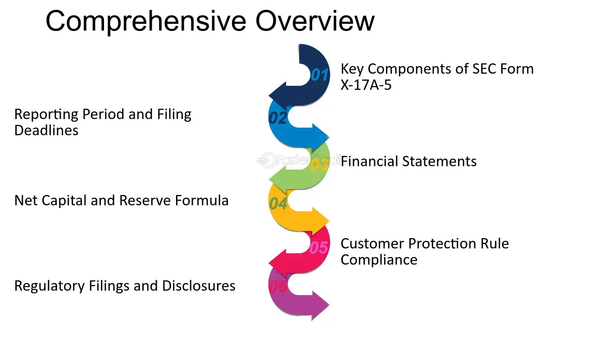

## Table of Contents

## What is SEC Form X-17A-5?

SEC Form X-17A-5 is a document that broker-dealers need to file with the Securities and Exchange Commission (SEC). It's like a yearly report card that shows how well the broker-dealer is doing financially. This form helps the SEC make sure that broker-dealers are following the rules and are financially stable.

The form has different parts, and which parts a broker-dealer needs to fill out depends on the size and type of their business. Some broker-dealers have to file this form every year, while others might need to file it more often. It's important because it helps keep the financial markets safe and fair for everyone.

## Who is required to file SEC Form X-17A-5?

SEC Form X-17A-5 must be filed by broker-dealers. These are companies or individuals that help people buy and sell stocks, bonds, and other investments. The SEC wants to make sure these broker-dealers are doing well financially and following the rules. That's why they have to fill out this form.

The form is required from all broker-dealers, but how often they need to file it can be different. Some broker-dealers have to file it every year, while others might need to file it more often. It depends on the size and type of their business. This helps the SEC keep an eye on the financial health of these companies and make sure the investment market stays safe and fair for everyone.

## How often must SEC Form X-17A-5 be filed?

SEC Form X-17A-5 must be filed by broker-dealers, but how often they need to file it can be different. Some broker-dealers need to file this form every year. This is usually for smaller broker-dealers or those that don't handle a lot of money.

Other broker-dealers might need to file the form more often, like every quarter or even every month. This is usually for larger broker-dealers or those that handle a lot of money. The SEC decides how often a broker-dealer needs to file based on the size and type of their business.

## What is the purpose of SEC Form X-17A-5?

SEC Form X-17A-5 is a document that broker-dealers need to fill out to show the Securities and Exchange Commission (SEC) how they are doing financially. It's like a report card that helps the SEC make sure that these companies are following the rules and are financially stable. This is important because it helps keep the investment market safe and fair for everyone.

The form has different parts, and which parts a broker-dealer needs to fill out depends on the size and type of their business. Some broker-dealers have to file this form every year, while others might need to file it more often, like every quarter or even every month. By looking at these forms, the SEC can keep an eye on the financial health of broker-dealers and make sure they are doing what they're supposed to do.

## What information is required on SEC Form X-17A-5?

SEC Form X-17A-5 asks for a lot of information about a broker-dealer's financial health. It includes things like how much money the broker-dealer has, how much they owe, and what their income and expenses look like. The form also wants to know about any money the broker-dealer is holding for their customers and how they are keeping it safe. This helps the SEC see if the broker-dealer is doing well financially and if they are following the rules.

The form has different parts, and which parts a broker-dealer needs to fill out depends on the size and type of their business. For example, a big broker-dealer might need to give more detailed information than a smaller one. The form also asks for information about the broker-dealer's business activities, like how much they are trading and what kinds of investments they are dealing with. This helps the SEC understand the broker-dealer's operations and make sure they are not taking too many risks.

## How can one access and submit SEC Form X-17A-5?

You can access SEC Form X-17A-5 on the Securities and Exchange Commission's (SEC) website. Just go to the SEC's homepage, look for the section about forms, and find Form X-17A-5. You can download it from there. The form might be in a PDF format, so you'll need a PDF reader to open and fill it out.

Once you've filled out the form, you can submit it through the SEC's Electronic Data Gathering, Analysis, and Retrieval (EDGAR) system. To use EDGAR, you'll need to set up an account if you don't already have one. After logging in, you can upload your completed Form X-17A-5 and submit it electronically. This makes it easy for the SEC to receive and review your information.

## What are the common errors to avoid when filing SEC Form X-17A-5?

When filling out SEC Form X-17A-5, it's important to be careful and avoid common mistakes. One big mistake is not filling out all the required parts of the form. The SEC needs all the information to understand your financial situation, so make sure you don't leave anything blank. Another mistake is making math errors. This can happen when you're adding up your income, expenses, or how much money you're holding for customers. Double-check your numbers to make sure they're right.

Another common error is not submitting the form on time. The SEC has deadlines for when you need to file, and missing them can cause problems. Also, make sure you're using the right version of the form. The SEC sometimes updates forms, so using an old version can lead to errors. Lastly, if you're filing electronically through the EDGAR system, make sure you follow all the steps correctly. A small mistake in the filing process can delay your submission or cause it to be rejected.

## What are the consequences of not filing SEC Form X-17A-5 on time?

If you don't file SEC Form X-17A-5 on time, you could face some serious consequences. The SEC might fine you, which means you have to pay money as a penalty. The amount of the fine can be different depending on how late you are and how many times you've been late before. The SEC might also look more closely at your business to make sure you're following all the rules. This can be a lot of extra work and stress.

Not filing on time can also hurt your reputation. Other people in the business world might think you're not good at managing your finances or following rules. This can make it harder for you to get new customers or work with other companies. In the worst cases, if you keep missing deadlines, the SEC might even take away your license to be a broker-dealer. That would mean you can't do business anymore.

## How has SEC Form X-17A-5 evolved over time?

SEC Form X-17A-5 has changed a lot since it first came out. It started as a simple form to check on broker-dealers' financial health. Over the years, the SEC added more parts to the form to get more detailed information. They did this to keep up with changes in the financial world and to make sure broker-dealers are still following the rules.

Now, the form has different parts that broker-dealers need to fill out, depending on how big their business is and what they do. The SEC also made it easier to file the form by letting broker-dealers submit it electronically through the EDGAR system. These changes help the SEC keep a closer eye on broker-dealers and make sure the investment market stays safe and fair for everyone.

## Can SEC Form X-17A-5 be amended, and if so, how?

Yes, SEC Form X-17A-5 can be amended if you find a mistake or need to update information after you've already filed it. If you need to make changes, you can file an amended form through the SEC's EDGAR system. Just like when you file the original form, you'll need to log into your EDGAR account, upload the updated form, and submit it. Make sure to clearly mark it as an amendment so the SEC knows it's an updated version.

It's important to fix any errors as soon as you find them. Not amending the form when you need to can lead to problems, like fines or the SEC looking more closely at your business. So, if you notice something wrong or something changes, update the form right away to keep everything in order and avoid any trouble.

## What are the best practices for managing the filing process of SEC Form X-17A-5?

To manage the filing process of SEC Form X-17A-5 well, start by keeping good records all year. This means writing down all your income, expenses, and how much money you're holding for customers. If you keep track of everything as it happens, it will be easier to fill out the form when it's time. Also, make sure you know the deadlines for filing. The SEC has different deadlines for different broker-dealers, so check which one applies to you and mark it on your calendar. This way, you won't miss the deadline and get into trouble.

Another good practice is to double-check your work before you submit the form. Look over all the numbers and make sure they add up right. If you find any mistakes, fix them before you send it in. It's also a good idea to use the latest version of the form from the SEC's website. They sometimes update the form, so using an old one can cause problems. Finally, if you're filing electronically through the EDGAR system, make sure you follow all the steps correctly. A small mistake in the filing process can delay your submission or cause it to be rejected.

## How does SEC Form X-17A-5 integrate with other regulatory filings?

SEC Form X-17A-5 is an important part of the bigger picture of financial reporting for broker-dealers. It works together with other forms like the Financial and Operational Combined Uniform Single (FOCUS) report. The FOCUS report gives a detailed look at a broker-dealer's finances, while Form X-17A-5 is more of a yearly checkup to make sure everything is still okay. By looking at both forms, the SEC can get a complete picture of a broker-dealer's financial health and make sure they are following the rules.

These forms also connect with other regulatory filings like the Customer Protection Reserve Formula and the Net Capital Rule. The Customer Protection Reserve Formula helps make sure that a broker-dealer is keeping their customers' money safe, and the Net Capital Rule makes sure they have enough money to keep doing business. All these forms together help the SEC keep an eye on broker-dealers and make sure the investment market stays safe and fair for everyone.

## References & Further Reading

[1]: Gitman, L. J., & Zutter, C. J. (2014). "Principles of Managerial Finance". Pearson Education.

[2]: ["Algorithmic Trading: Winning Strategies and Their Rationale"](https://www.wiley.com/en-us/Algorithmic+Trading%3A+Winning+Strategies+and+Their+Rationale-p-9781118746912) by Ernest P. Chan

[3]: Office of Compliance Inspections and Examinations. (2013). ["SEC Division of Market Regulation"](https://www.sec.gov/about/offices/ocie/ocie_highlights.shtml). 

[4]: Koller, T., Goedhart, M., & Wessels, D. (2015). ["Valuation: Measuring and Managing the Value of Companies"](https://www.mckinsey.com/capabilities/strategy-and-corporate-finance/our-insights/valuation-measuring-and-managing-the-value-of-companies) 6th Edition, John Wiley & Sons.

[5]: Securities Exchange Act of 1934, Form X-17A-5. Available at: [Securities Lawyer's Deskbook](https://www.ecfr.gov/current/title-17/chapter-II/part-249)

[6]: ["Algorithmic Trading and DMA: An introduction to direct access trading strategies"](https://www.amazon.com/Algorithmic-Trading-DMA-introduction-strategies/dp/0956399207) by Barry Johnson