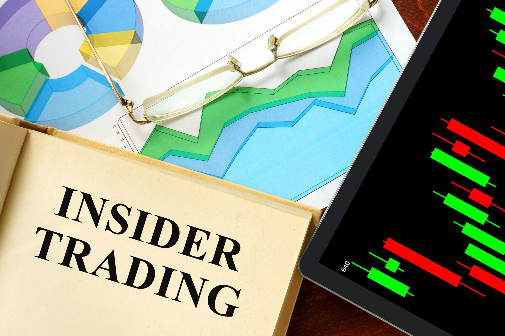

Insider trading remains one of the most controversial topics in the financial markets. It refers to the buying or selling of a security by individuals who have access to material, nonpublic information about the security, which raises questions about fairness and transparency in financial exchanges. The U.S. Securities and Exchange Commission (SEC) is at the forefront of monitoring and regulating insider trading, deploying an array of tools and strategies to ensure compliance with securities laws. The SEC's enforcement of these laws is critical to maintaining investor trust and the overall integrity of the stock markets.

In recent years, technological advancements, particularly in algorithms and data analytics, have revolutionized the way suspicious trading activities are detected. These technological tools enable the SEC to quickly process large volumes of trading data, providing real-time surveillance and alerting regulators to unusual patterns that may indicate illicit activity. Algorithms have become instrumental in distinguishing between normal trading practices and activities that warrant closer scrutiny.



Understanding how the SEC employs these mechanisms of surveillance and enforcement is crucial for maintaining market integrity and protecting investors. As financial markets continue to evolve, so must the technologies and strategies employed by regulatory bodies to keep pace with new challenges and ensure that markets operate fairly and transparently.

## Table of Contents

## Understanding Insider Trading

Insider trading refers to the trading of a public company's stock or other securities based on material, nonpublic information about the company. This practice can be legal or illegal depending on when the insider makes the trade; it is illegal when the material information is still nonpublic. The critical distinction between legal and illegal insider trading revolves around the violation of a fiduciary duty or the act of manipulation.

Legal insider trading occurs when company insiders—such as executives, directors, and employees—buy or sell stock in their own companies, adhering to transparent disclosure requirements set by the regulatory framework. These transactions must be reported to the U.S. Securities and Exchange Commission (SEC), typically through forms such as Form 4, which discloses the insider's identity, the transaction date, and the number of shares traded.

Conversely, illegal insider trading involves trading on material, nonpublic information, which gives the trader an unfair advantage and violates principles of market integrity. This breach often occurs when an insider trades based on confidential information that could influence the company's stock price, thus violating their duty to shareholders and the broader investing public. The SEC closely monitors for such activities to maintain fair trading conditions. In some cases, tippees who receive inside information without a fiduciary duty can also be liable if they knew, or should have known, that the information was obtained from someone who has breached a duty.

Regulatory frameworks in the United States, such as the Securities Exchange Act of 1934 and subsequent legal precedents, provide stringent guidelines and penalties for illegal insider trading. These frameworks are designed to deter insiders from profiting at the expense of ordinary investors and to preserve investor trust in the market's integrity. Consequently, companies also implement internal policies that restrict trading around specific triggering events, such as financial disclosures or mergers, to prevent even the appearance of unfair trading practices.

## Role of the SEC in Monitoring Insider Trading

The U.S. Securities and Exchange Commission (SEC) serves as the primary regulator responsible for overseeing and enforcing securities laws in the United States. Central to its mission is the rigorous monitoring of insider trading to maintain transparency and integrity in the financial markets. The SEC operates primarily through its Division of Enforcement, which has developed a range of methods aimed at identifying and prosecuting illegal insider trading activities.

The SEC's surveillance framework encompasses extensive market monitoring activities, designed to capture and analyze trading patterns that might indicate insider trading. This surveillance relies on sophisticated analytical tools to identify anomalies or irregular activities suggestive of insider trading. These tools evaluate variances in trading volumes, price fluctuations, and other transactional anomalies that could signify illicit trading based on nonpublic information.

A critical aspect of the SEC's approach is its use of sophisticated data analytics and surveillance technologies. These technologies facilitate the processing and examination of vast sets of trading data, thereby allowing the SEC to spot unusual patterns or trading behaviors. By cross-referencing these patterns with corporate events, such as mergers or earnings announcements, the SEC can pinpoint potential insider trading incidents more effectively.

Furthermore, the SEC collaborates with various entities, including self-regulatory organizations, to enhance its monitoring efforts. This collaboration enables the integration of additional data sources and insights, further strengthening the SEC's surveillance capabilities. The effectiveness of these cooperative arrangements underscores the SEC's commitment to leveraging a diverse array of resources to combat insider trading.

Overall, the SEC's proactive stance and implementation of advanced surveillance technologies play a pivotal role in detecting and deterring insider trading. Through diligent enforcement and innovative monitoring strategies, the SEC aims to uphold the principles of fairness and transparency that are fundamental to the integrity of the U.S. financial markets.

## Technological Advancements in Tracking Insider Trading

The U.S. Securities and Exchange Commission (SEC) has significantly improved its ability to monitor trading activities through technological advancements. A key component in this enhancement is [algorithmic trading](/wiki/algorithmic-trading) surveillance, which assists in identifying unusual trading patterns that may indicate insider trading.

Algorithmic trading surveillance employs sophisticated algorithms capable of rapidly processing vast quantities of trading data. These algorithms utilize a range of statistical and [machine learning](/wiki/machine-learning) models to compare real-time data against historical trading patterns. This capacity to analyze extensive datasets enables the identification of anomalies that could signify illicit activities. For example, a sudden surge in trades before the announcement of a major corporate event may trigger a real-time alert, prompting further investigation by the SEC.

Incorporating algorithms allows for near-instantaneous processing and evaluation of trading activity, facilitating swift responses to suspicious behavior. This contrasts with more traditional methods that relied heavily on manual analysis of transactions, which could be time-consuming and less effective in dealing with the immense [volume](/wiki/volume-trading-strategy) of trading data generated daily.

Moreover, the integration of [artificial intelligence](/wiki/ai-artificial-intelligence) (AI) and machine learning technologies further enhances these systems. Machine learning models can adapt to new information, improving detection accuracy over time. These systems can sieve through intricate trading networks and recognize indirect relationships and patterns that might not be immediately apparent to human analysts. The capability to distinguish between legitimate trading patterns and those that warrant further scrutiny is essential for maintaining market integrity and protecting investors from fraudulent activities.

In summary, the SEC's adoption of advanced algorithmic surveillance technology marks a significant stride in their ability to efficiently monitor and manage trading activities. By leveraging these technological tools, the SEC strengthens its efforts to ensure compliance with securities laws and uphold the fairness of financial markets.

## How Algo Trading Impacts Market Surveillance

Algorithmic trading has significantly altered the structure and dynamics of securities markets by introducing automated, high-speed trading strategies that can execute orders in fractions of a second. While this development offers substantial benefits in terms of [liquidity](/wiki/liquidity-risk-premium), price discovery, and market efficiency, it also presents unique challenges for market surveillance efforts.

The principal advantage of algorithmic trading lies in its speed and efficiency, which enable trading strategies that can react to market conditions more rapidly than human traders. This speed, however, can also mask suspicious trading activities, making them harder to detect through traditional surveillance methods. Algorithmic trades can be executed in vast quantities across multiple venues simultaneously, creating complex patterns that are not immediately discernible.

To address these challenges, the U.S. Securities and Exchange Commission (SEC) has integrated advanced technological solutions into its surveillance arsenal. The SEC leverages sophisticated algorithms and analytical tools designed to monitor trading activities in real-time. By examining patterns of trades and correlating them with news releases, earnings reports, and other market-moving events, the SEC can identify anomalies that may indicate potential insider trading or market manipulation.

The following pseudocode illustrates a simplified example of how an algorithm might be used to identify unusual trading patterns that warrant further investigation:

```python
def detect_unusual_activity(trades, threshold):
    unusual_activities = []
    for trade in trades:
        # Calculate volume-weighted average price (VWAP)
        vwap = sum(t['price'] * t['volume'] for t in trade) / sum(t['volume'] for t in trade)

        # Check for deviation from recent historical average
        deviation = abs(trade['price'] - vwap) / vwap
        if deviation > threshold:
            unusual_activities.append(trade)

    return unusual_activities

# Example usage with a list of trade dictionaries
trades = [
    {'price': 100, 'volume': 200},
    {'price': 110, 'volume': 150},
    # More trades
]

unusual_trades = detect_unusual_activity(trades, 0.05)
```

This algorithm calculates the volume-weighted average price (VWAP) and identifies trades with prices deviating significantly from this average. Such deviations could suggest an anomaly requiring further scrutiny by regulators.

Beyond identifying specific trades, the SEC’s technological strategy includes deploying machine learning models that continuously improve as they learn from historical data. These models are adept at recognizing intricate patterns and correlations that human analysts might overlook.

The rapid pace of technological advancements in algorithmic trading necessitates that regulatory bodies like the SEC continuously update and refine their surveillance methodologies. By embracing technologies capable of tracking intricate algorithmic trading activities, the SEC enhances its ability to fulfill its mission of maintaining market integrity and protecting investors.

## Challenges in Monitoring and Regulation

Insider trading presents significant challenges for regulatory bodies like the U.S. Securities and Exchange Commission (SEC), primarily due to the difficulty in proving such cases with definitive evidence. The nature of insider trading often involves circumstantial evidence, making it hard to demonstrate the illicit use of nonpublic information beyond reasonable doubt. This challenge underscores the need for meticulous investigative work and often involves a combination of analytical tools and witness testimonies to build a compelling case.

The rapid pace of technological change further complicates the monitoring and regulation of insider trading. Advancements in algorithmic trading and the introduction of complex financial instruments demand that regulatory bodies continually update their surveillance techniques. The development of new financial products can outpace regulatory measures, posing a risk to market integrity. Consequently, regulatory frameworks must evolve to address these innovations, requiring ongoing research and the adoption of advanced monitoring tools such as artificial intelligence and machine learning to identify suspicious trading activities.

Additionally, the global nature of modern financial markets necessitates collaboration with international regulators. As companies and investors operate in multiple countries, insider trading investigations often extend beyond national borders. This global dimension means that the SEC and other regulatory bodies must work together, sharing information and coordinating enforcement actions to effectively regulate and prevent insider trading across jurisdictions. International cooperation becomes especially crucial when addressing cases that involve cross-border transactions, requiring harmonized regulatory standards and practices to ensure comprehensive market surveillance and enforcement.

## Notable Cases and Their Impact

High-profile insider trading cases, such as those involving Martha Stewart and Rajat Gupta, underscore the U.S. Securities and Exchange Commission's (SEC) vigorous enforcement efforts against illegal trading practices. Martha Stewart, a prominent businesswoman, was embroiled in an insider trading scandal in 2001 linked to her sale of ImClone Systems stocks. Stewart's case highlighted how insider trading can involve individuals outside traditional financial sectors and underscored the rigorous application of securities laws. Stewart was convicted of obstruction of justice, among other charges, and served a five-month prison sentence, a significant punishment that served as a deterrent to potential violators by illustrating the severe consequences of such illegal activities.

Rajat Gupta, a former Goldman Sachs director, was convicted in 2012 for leaking confidential information to [hedge fund](/wiki/hedge-fund-trading-strategies) manager Raj Rajaratnam. His case was pivotal because it brought attention to insider trading within the corporate boardroom. The SEC's case against Gupta included compelling evidence, such as recorded phone calls, demonstrating the sophistication of SEC's investigative methods. This high-profile prosecution showcased the SEC's commitment to holding corporate insiders accountable, regardless of their status, thus reinforcing market integrity and fairness.

Publicity surrounding these cases plays a crucial role in maintaining market confidence by ensuring that corporate insiders and influential individuals are not immune from prosecution. The deterrent effect is not only due to the penalties imposed but also because these cases raise awareness about the seriousness of insider trading violations and the SEC's relentless pursuit to uphold securities laws. Such enforcement actions highlight the SEC's dual function: deterrence and upholding public confidence in the fairness of financial markets.

Overall, these cases highlight the necessity of vigilant regulatory oversight and robust enforcement measures to preserve market integrity. The SEC's ability to adapt its strategies and embrace technological advancements in surveillance ensures that insider trading activities are detected and prosecuted, providing a transparent and fair trading environment. As these cases illustrate, the impact of insider trading investigations reverberates beyond the immediate legal sphere, influencing public trust and shaping corporate governance standards.

## The Future of Insider Trading Monitoring

Ongoing technological innovation will significantly influence how the U.S. Securities and Exchange Commission (SEC) approaches insider trading surveillance. The rapid advancements in artificial intelligence (AI) and machine learning present promising opportunities for developing more sophisticated and effective monitoring tools. These technologies are particularly adept at analyzing large datasets, identifying patterns, and making predictive analyses that can be crucial for detecting and preventing illegal trading activities. 

AI and machine learning algorithms can continuously learn from incoming data, improving their ability to identify suspicious trading behavior over time. This capability is particularly crucial given the complexity and dynamic nature of financial markets, where patterns and anomalies can evolve rapidly. For instance, machine learning models can be employed to detect anomalous trading volumes or unusual price movements associated with specific securities that might suggest insider trading.

Python provides a robust framework for implementing these technologies. For example, libraries such as TensorFlow and scikit-learn are widely used to build AI models capable of handling the intricate task of parsing vast volumes of market data:

```python
import pandas as pd
from sklearn.ensemble import RandomForestClassifier

# Load historical trading data
data = pd.read_csv('trading_data.csv')

# Features and target variable
X = data.drop('is_insider_trade', axis=1)
y = data['is_insider_trade']

# Initialize the model
model = RandomForestClassifier()

# Train the model
model.fit(X, y)

# Predictions
predictions = model.predict(new_trading_data)
```

As markets continue to evolve, regulatory bodies like the SEC must remain agile to ensure fairness and integrity. The integration of AI-driven tools into the SEC's monitoring strategies will enhance their capabilities in real-time analysis and predictive monitoring, mitigating the risks of insider trading before they can impact market stability. Furthermore, these tools will allow the SEC to allocate resources more efficiently, concentrating expert investigation efforts on the most significant and complex cases.

In addition to technological advancements, collaboration between regulatory bodies and financial institutions will be crucial. As financial markets are globally interconnected, sharing insights and developing standardized approaches to AI and machine learning in financial surveillance can lead to more effective global oversight. This collaboration will ensure that while technology improves surveillance capabilities, the regulatory framework keeps pace with these advancements to address new forms of market manipulation effectively.

Overall, the future of insider trading monitoring is set to be characterized by an agile regulatory environment that leverages cutting-edge technology. This approach promises to enhance market transparency and integrity, safeguarding investors and maintaining trust in financial systems.

## Conclusion

The U.S. Securities and Exchange Commission (SEC) is pivotal in maintaining the fairness and transparency of capital markets. Ensuring that these markets operate without the distortion of insider trading requires a comprehensive approach that integrates legal, regulatory, and technological measures. The legal framework established by the SEC provides a robust structure for the identification and prosecution of illegal insider trading activities. This framework is continually adapted to address the evolving complexities of the financial markets, ensuring it remains effective against new and sophisticated trading strategies.

Regulatory measures are reinforced by the SEC’s proactive enforcement strategies, which include market surveillance and data analysis. Such strategies are essential for identifying suspicious trading patterns that may indicate unlawful activities. By maintaining a strong enforcement presence, the SEC deters potential violators and upholds the integrity of the markets.

Advancements in technology significantly aid the SEC in its mission. Sophisticated algorithms and machine learning tools are implemented to monitor vast amounts of trading data, allowing for real-time detection of anomalies. These technologies enable more precise identification of potential insider trading, thus enhancing the SEC’s capability to protect market participants.

Staying informed about the enforcement strategies employed by the SEC, as well as ongoing developments in monitoring technology, is crucial for participants in the financial markets. This knowledge not only helps ensure compliance with regulations but also aids in fostering an environment of trust and integrity within the market. As markets continue to evolve, the agility and adaptation of both regulatory frameworks and technological tools will be essential in supporting a fair and transparent trading ecosystem.

## References & Further Reading

[1]: Lewis, M. (2014). ["Flash Boys: A Wall Street Revolt"](https://en.wikipedia.org/wiki/Flash_Boys). W. W. Norton & Company.

[2]: Mehta, N. R. & Neupane, S. (2020). ["Patterns in Insider Trading While Firms Are Subject to a Merger or Acquisition"](http://www.ijhsr.org/IJHSR_Vol.9_Issue.6_June2019/IJHSR_Abstract.027.html). Journal of Financial and Quantitative Analysis.

[3]: Friederich, S., Gregory-Allen, R. B., & Maller, R. A. (2002). ["An Econometric Model of Insider Trading"](https://www.semanticscholar.org/paper/Short-Run-Returns-Around-the-Trades-of-Corporate-on-Friederich-Gregory/713c7c96d98a432a37b8cc8ed9a4cf48f8364a5a). Journal of Financial Markets.

[4]: Sarkar, A., & Sokolov, K. (2015). ["Algorithmic Trading: Its Impact on Capital Markets and Policy Implications"](https://www.sciencedirect.com/science/article/pii/S0957417422006479). Federal Reserve Bank of New York.

[5]: Budish, E., Cramton, P., & Shim, J. (2015). ["The High-Frequency Trading Arms Race: Frequent Batch Auctions as a Market Design Response"](https://academic.oup.com/qje/article/130/4/1547/1916146). The Quarterly Journal of Economics.

[6]: Horn, J. (2011). ["Artificial Intelligence and Insider Trading"](https://scholar.harvard.edu/files/rachelhorn/files/commentary.pdf). Journal of Financial Regulation and Compliance.

[7]: Ready, M. J. (2014). ["High-frequency trading: fact and fiction"](https://datascienceassn.org/sites/default/files/Benefits%20of%20High%20Frequency%20Trading%20%28HFT%29.pdf). Review of Financial Economics.