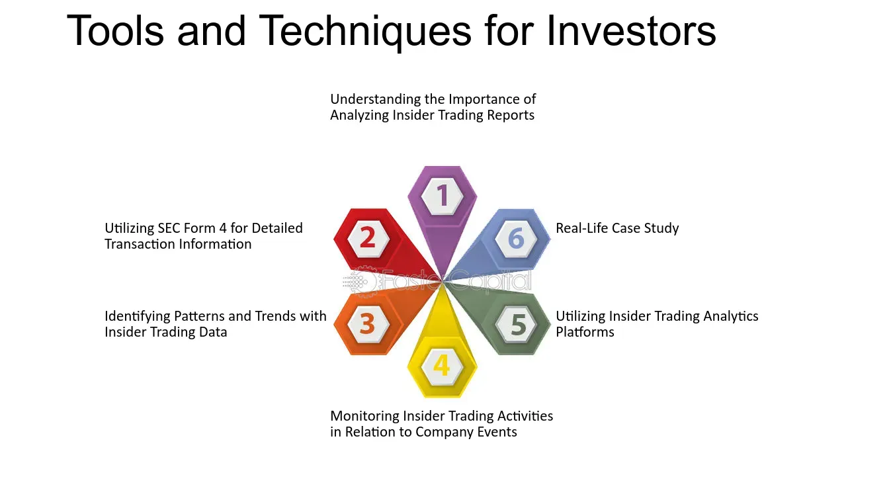

## Table of Contents

## What is insider trading?

Insider trading is when someone uses secret information about a company to buy or sell its stocks. This information is not available to the public, and using it to make money is against the law. For example, if an employee knows their company will announce good news soon, and they buy stocks before the news is public, that's insider trading.

Insider trading is unfair because it gives some people an advantage over others who don't have the secret information. It can also harm the trust people have in the stock market. That's why there are strict rules and punishments for people caught doing it. These can include big fines and even jail time.

## Why is insider trading illegal?

Insider trading is illegal because it's not fair. When someone uses secret information to buy or sell stocks, they have an advantage over everyone else. This goes against the idea that everyone should have the same chance to make money in the stock market. If some people can use secret information, it makes the market unfair and can stop people from trusting it.

Also, insider trading can hurt the company and its shareholders. If people inside the company are using secret information to make money, it can make the company look bad. This can lower the value of the company's stocks and hurt the people who own them. That's why there are strict laws against insider trading, to protect everyone who invests in the stock market and to keep it fair for all.

## What is the role of the SEC in regulating insider trading?

The SEC, which stands for the Securities and Exchange Commission, is the main group in the United States that watches over the stock market to make sure it's fair. One of their big jobs is to stop insider trading. They do this by making rules that say people can't use secret information to buy or sell stocks. The SEC also looks into cases where they think insider trading might be happening, and they can take people to court if they find proof.

When the SEC finds someone guilty of insider trading, they can punish them in different ways. They might make the person pay a big fine, or they could even send them to jail. By doing this, the SEC tries to stop people from breaking the rules and to keep the stock market a place where everyone has a fair chance. This helps keep trust in the market and protects all the people who invest in it.

## What are the basic methods the SEC uses to detect insider trading?

The SEC uses different ways to find insider trading. One way is by looking at trading data. They check if there are any strange patterns in how stocks are being bought or sold. For example, if a lot of people start buying a stock right before some big news comes out, the SEC might think that insider trading is happening. They also use computer programs to help them spot these patterns faster.

Another method is looking at tips and complaints. People can tell the SEC if they think someone is using secret information to trade stocks. The SEC takes these tips seriously and will investigate if they think there might be a problem. They might talk to the people involved and look at their phone records or emails to find out more.

Sometimes, the SEC also works with other groups, like the FBI, to catch people who are doing insider trading. By working together, they can use more resources and information to find and stop this illegal activity. This teamwork helps make sure that the stock market stays fair for everyone.

## How does the SEC use data analysis to monitor insider trading?

The SEC uses data analysis to look for strange patterns in how stocks are being bought and sold. They have special computer programs that can go through a lot of trading data quickly. These programs help the SEC find times when a lot of people start buying or selling a stock right before big news comes out. If this happens, it might mean someone is using secret information to trade stocks, which is against the law.

When the SEC finds these strange patterns, they look into it more. They might check who is doing the trading and see if those people have any connections to the company. The SEC also looks at other information, like how much the stock price changes after the news comes out. By using data analysis, the SEC can spot insider trading faster and make sure the stock market stays fair for everyone.

## What is the role of technology in the SEC's surveillance of insider trading?

Technology plays a big role in how the SEC watches for insider trading. They use special computer programs to look at a lot of trading data very quickly. These programs help the SEC find strange patterns, like when a lot of people start buying or selling a stock right before big news comes out. If this happens, it might mean someone is using secret information to trade stocks, which is against the law. By using technology, the SEC can spot these patterns faster and investigate them more easily.

The SEC also uses technology to look at other kinds of information. For example, they can check phone records and emails to see if people involved in the trading have any connections to the company. This helps them figure out if insider trading is really happening. Technology makes it easier for the SEC to keep an eye on the stock market and make sure it stays fair for everyone who invests in it.

## How does the SEC collaborate with other agencies to combat insider trading?

The SEC works with other groups, like the FBI, to stop insider trading. When the SEC thinks someone might be using secret information to trade stocks, they can ask the FBI for help. The FBI has special tools and people who can do things like checking phone records and emails to find out more. By working together, the SEC and the FBI can use more resources and information to catch people who are breaking the law.

This teamwork is important because it makes it harder for people to get away with insider trading. The SEC and other agencies share what they know and help each other investigate. This way, they can stop insider trading faster and make sure the stock market stays fair for everyone. By working together, these groups can protect the people who invest in the stock market and keep trust in it strong.

## What are some advanced techniques the SEC employs to identify suspicious trading patterns?

The SEC uses advanced computer programs to look at a lot of trading data quickly. These programs help the SEC find strange patterns that might mean someone is using secret information to trade stocks. For example, they can see if a lot of people start buying a stock right before some big news comes out. This kind of pattern can be a sign of insider trading. The SEC also uses these programs to check how much the stock price changes after the news comes out, which can help them figure out if something fishy is going on.

Another advanced technique the SEC uses is something called network analysis. This means they look at who is connected to who. If someone is trading a lot of a company's stock and they are also connected to people inside the company, it might be a sign of insider trading. The SEC can use this information to see if the people trading the stock have any special information that other people don't have. By using these advanced techniques, the SEC can spot insider trading faster and keep the stock market fair for everyone.

## How does the SEC use insider trading surveillance to protect investors?

The SEC uses special computer programs to watch the stock market and find strange trading patterns. They look for times when a lot of people start buying or selling a stock right before big news comes out. This can be a sign that someone is using secret information to trade stocks, which is not fair. By finding these patterns quickly, the SEC can stop people from using insider information and make sure everyone has the same chance to make money in the stock market.

When the SEC finds something suspicious, they look into it more. They might check who is doing the trading and see if those people have any connections to the company. The SEC also works with other groups, like the FBI, to gather more information and catch people who are breaking the law. By doing all of this, the SEC helps keep the stock market fair and protects the people who invest in it. This way, everyone can trust that the market is a safe place to put their money.

## What challenges does the SEC face in monitoring insider trading?

The SEC faces many challenges when trying to watch for insider trading. One big problem is the huge amount of data they have to look at. Every day, there are millions of trades happening in the stock market. It's hard for the SEC to go through all this information to find the few trades that might be illegal. They use special computer programs to help, but even these can miss things sometimes.

Another challenge is that people who do insider trading are often good at hiding what they're doing. They might use different accounts or work with other people to make it harder to find out what's going on. The SEC has to be very smart and use a lot of different tools to catch these people. They also need to work with other groups, like the FBI, to get all the information they need. It's a tough job, but the SEC keeps trying to make the stock market fair for everyone.

## Can you explain the SEC's use of machine learning and AI in detecting insider trading?

The SEC uses [machine learning](/wiki/machine-learning) and AI to help them find insider trading. These smart computer programs can look at a lot of trading data very quickly. They help the SEC spot strange patterns, like when a lot of people start buying a stock right before big news comes out. This can be a sign that someone is using secret information to trade stocks, which is not fair. By using machine learning and AI, the SEC can find these patterns faster than they could before.

Machine learning and AI also help the SEC learn from past cases of insider trading. These programs can get better over time by looking at old data and figuring out what kinds of patterns are most likely to mean insider trading. This makes it easier for the SEC to catch people who are breaking the law. By using these smart tools, the SEC can keep the stock market fair and protect the people who invest in it.

## What future developments are expected in the SEC's methods for monitoring insider trading?

In the future, the SEC is expected to use even smarter computer programs to watch for insider trading. These programs will use new kinds of machine learning and AI that can look at more data and find strange patterns even faster. They will also be better at figuring out which patterns are most likely to mean insider trading. This will help the SEC catch people who are breaking the law more quickly and keep the stock market fair for everyone.

Another thing that might happen is that the SEC will work more closely with other groups, like the FBI, to share information and catch people who are doing insider trading. They might use new tools and ways to talk to each other that make it easier to work together. By doing this, the SEC can use more resources and information to stop insider trading and protect the people who invest in the stock market.

## References & Further Reading

[1]: Lewis, M. (2014). ["Flash Boys: A Wall Street Revolt"](https://en.wikipedia.org/wiki/Flash_Boys). W. W. Norton & Company.

[2]: Mehta, N. R. & Neupane, S. (2020). ["Patterns in Insider Trading While Firms Are Subject to a Merger or Acquisition"](http://www.ijhsr.org/IJHSR_Vol.9_Issue.6_June2019/IJHSR_Abstract.027.html). Journal of Financial and Quantitative Analysis.

[3]: Friederich, S., Gregory-Allen, R. B., & Maller, R. A. (2002). ["An Econometric Model of Insider Trading"](https://www.semanticscholar.org/paper/Short-Run-Returns-Around-the-Trades-of-Corporate-on-Friederich-Gregory/713c7c96d98a432a37b8cc8ed9a4cf48f8364a5a). Journal of Financial Markets.

[4]: Sarkar, A., & Sokolov, K. (2015). ["Algorithmic Trading: Its Impact on Capital Markets and Policy Implications"](https://www.sciencedirect.com/science/article/pii/S0957417422006479). Federal Reserve Bank of New York.

[5]: Budish, E., Cramton, P., & Shim, J. (2015). ["The High-Frequency Trading Arms Race: Frequent Batch Auctions as a Market Design Response"](https://academic.oup.com/qje/article/130/4/1547/1916146). The Quarterly Journal of Economics.

[6]: Horn, J. (2011). ["Artificial Intelligence and Insider Trading"](https://scholar.harvard.edu/files/rachelhorn/files/commentary.pdf). Journal of Financial Regulation and Compliance.

[7]: Ready, M. J. (2014). ["High-frequency trading: fact and fiction"](https://datascienceassn.org/sites/default/files/Benefits%20of%20High%20Frequency%20Trading%20%28HFT%29.pdf). Review of Financial Economics.