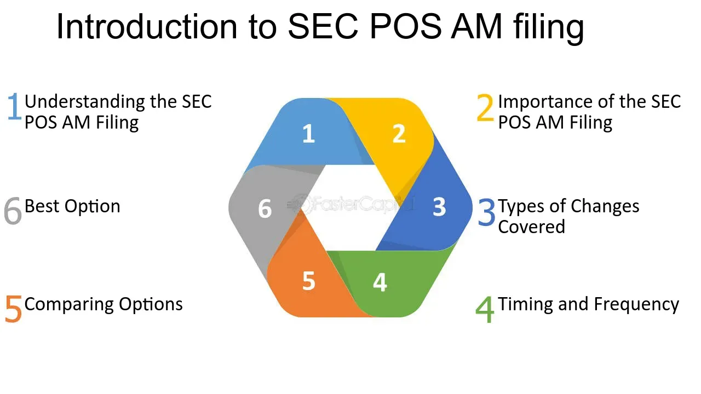

## Table of Contents

## What is a SEC POS AM filing?

A SEC POS AM filing, or Post-Effective Amendment, is a document that companies file with the U.S. Securities and Exchange Commission (SEC). This filing is used to update or change information in a previously filed registration statement. Companies might need to make these changes if there are new details about their business, financial situation, or other important updates that investors should know about.

The main purpose of a POS AM filing is to keep the information that investors see accurate and up-to-date. This helps investors make informed decisions about buying or selling the company's securities. By filing a POS AM, the company ensures that any changes or new developments are properly communicated and reflected in their official records with the SEC.

## Why is a POS AM filing important for companies?

A POS AM filing is important for companies because it helps them keep their information up-to-date with the SEC. When a company makes changes or has new information that investors should know about, they need to file a POS AM. This filing makes sure that the information in their registration statement is accurate and reflects the current state of the company. This is important because it helps the company follow the rules set by the SEC and avoid any legal problems.

Keeping the information up-to-date also helps build trust with investors. When investors see that a company is open about changes and new developments, they feel more confident in the company. This can make investors more likely to buy the company's securities. By filing a POS AM, the company shows that it cares about being honest and clear with its investors, which can be good for its reputation and future business.

## Who needs to file a POS AM with the SEC?

Any company that has already filed a registration statement with the SEC needs to file a POS AM if there are changes or new information that investors should know about. This includes updates about the company's business, finances, or other important details. By filing a POS AM, the company makes sure that the information in its registration statement stays accurate and up-to-date.

Filing a POS AM is important because it helps the company follow the rules set by the SEC. If a company doesn't keep its information current, it could face legal problems. Also, keeping investors informed through a POS AM helps build trust. When investors see that a company is open about changes, they are more likely to feel confident in the company and its securities.

## What is the difference between a POS AM and other SEC filings?

A POS AM, or Post-Effective Amendment, is a type of SEC filing that companies use to update or change information in a registration statement they've already filed. This filing is important because it keeps the information investors see accurate and up-to-date. For example, if a company has new details about its business or financial situation, it will file a POS AM to let investors know about these changes.

Other SEC filings serve different purposes. For instance, a Form 10-K is an annual report that gives a detailed overview of a company's financial performance over the past year. A Form 8-K is used to report significant events like mergers or changes in leadership as soon as they happen. Unlike a POS AM, these filings don't update a registration statement but provide new information or report specific events. Each type of filing has its own role in keeping investors informed and ensuring companies follow SEC rules.

## How does the process of filing a POS AM work?

When a company needs to update the information in its registration statement, it starts the process of filing a POS AM with the SEC. First, the company gathers all the new or changed information that needs to be included. This might involve working with lawyers and accountants to make sure everything is correct and complete. Once the company has all the updated information, it prepares the POS AM document. This document will explain what has changed since the last filing and why these changes are important for investors to know.

After the POS AM is ready, the company submits it to the SEC through their electronic filing system called EDGAR. The SEC then reviews the filing to make sure it meets all their rules and requirements. If everything is in order, the SEC will accept the filing, and the updated information becomes part of the company's official records. This process helps keep investors informed about any important changes in the company, making sure they have the most current information to make their investment decisions.

## What information is typically included in a POS AM filing?

A POS AM filing usually includes information about the changes or updates to a company's registration statement. This can be details about the company's business, like new products or services they are offering. It can also include financial updates, such as changes in the company's financial situation or how it makes money. If there are any changes to the people who run the company, like new leaders or board members, that information would also be in the POS AM. The filing explains why these changes are important for investors to know about.

The POS AM also includes any new risks that the company might face because of these changes. For example, if the company is starting a new type of business, it might face new challenges or competition. The filing makes sure to point out these risks so investors can understand them. By including all this information, the POS AM helps keep the company's registration statement up-to-date and accurate, which is important for investors who are thinking about buying or selling the company's securities.

## How often should a POS AM be filed?

A POS AM should be filed whenever there are important changes or new information that investors need to know about. This could be changes in the company's business, finances, or leadership. The company needs to file a POS AM to keep its registration statement accurate and up-to-date. There isn't a set schedule for filing a POS AM because it depends on when these changes happen.

If a company waits too long to file a POS AM after a change, it could get in trouble with the SEC. So, it's important for the company to file a POS AM as soon as it knows about the new information. This helps the company follow the rules and keep investors informed.

## What are the common challenges companies face when preparing a POS AM filing?

One of the main challenges companies face when preparing a POS AM filing is making sure all the information is accurate and complete. They need to gather all the new or changed details about their business, finances, or leadership. This can take a lot of time and effort, especially if they need to work with lawyers and accountants to make sure everything is correct. If they miss something important or make a mistake, it could cause problems with the SEC or confuse investors.

Another challenge is explaining the changes in a way that investors can understand. The company needs to be clear about why the changes are important and how they might affect the business. This can be hard because they have to balance being detailed enough to be accurate, but not so complicated that investors get lost. If the company doesn't explain things well, investors might not trust the information or make the wrong decisions about buying or selling the company's securities.

## How can a company ensure compliance with SEC regulations when filing a POS AM?

To make sure they follow SEC rules when filing a POS AM, a company should work closely with lawyers and accountants. These experts can help gather all the right information and make sure it's correct. The company should also double-check everything before they file to avoid mistakes. If they're not sure about something, they can ask the SEC for help or look at the SEC's rules to make sure they're doing things right. Following the rules carefully helps the company avoid getting in trouble and keeps their information accurate for investors.

Another important thing is to be clear and honest when explaining the changes in the POS AM. The company should explain why the changes matter and how they might affect the business in a way that's easy for investors to understand. This helps build trust with investors. If the company is open about what's going on, investors are more likely to feel confident in the company. By keeping everything accurate and clear, the company can make sure they're following SEC rules and helping investors make good decisions.

## What are the potential consequences of failing to file a POS AM correctly?

If a company doesn't file a POS AM correctly, it could get in trouble with the SEC. The SEC might fine the company or even take them to court. This can be bad for the company because it can cost a lot of money and hurt their reputation. Investors might lose trust in the company if they think it's not following the rules or being honest about changes.

Failing to file a POS AM correctly can also confuse investors. If the information in the registration statement is not accurate or up-to-date, investors might make bad decisions about buying or selling the company's securities. This can hurt the company's stock price and make it harder for them to raise money in the future. Keeping the information accurate and clear is important for building trust with investors and following SEC rules.

## How has the SEC's approach to POS AM filings evolved in recent years?

In recent years, the SEC has been working to make the process of filing a POS AM easier and more clear for companies. They've updated their rules and given more guidance to help companies know what they need to do. The SEC wants to make sure that the information companies share with investors is accurate and up-to-date. They've also been using technology more to make filing easier and faster. This helps companies follow the rules and keeps investors informed about important changes.

The SEC has also been paying more attention to how companies explain the changes in their POS AM filings. They want companies to be clear and honest so investors can understand what's going on. If a company doesn't do this well, the SEC might ask them to fix it or even take action against them. By focusing on these things, the SEC is trying to make sure that investors have the right information to make good decisions about buying or selling securities.

## What advanced strategies can companies use to optimize their POS AM filings for better investor relations?

Companies can optimize their POS AM filings by being very clear and open about the changes they are reporting. They should explain why these changes matter and how they might affect the business in a way that is easy for everyone to understand. Using simple language and avoiding complicated terms can help investors feel more connected to the company. Companies can also use visuals like charts or graphs to show the changes, which can make the information easier to understand and more interesting.

Another strategy is to use technology to make the filing process smoother and faster. Companies can use tools that help them gather and organize all the new information they need to include in the POS AM. This can save time and make sure they don't miss anything important. They can also use social media or their company website to talk about the filing and answer any questions investors might have. By doing this, companies can build trust with investors and show that they care about keeping them informed.

## References & Further Reading

[1]: ["The U.S. Securities and Exchange Commission: A Guide for Investors"](https://www.sec.gov/investor/pubs/sec-guide-to-mutual-funds.pdf) by the U.S. Securities and Exchange Commission

[2]: ["The Investor's Guide to the SEC: How to Understand the SEC and the Way It Regulates the Stock Market"](https://www.investopedia.com/articles/investing/112914/understanding-sec.asp) by Judith Knepper

[3]: ["Regulation of Securities, Markets, and Transactions"](https://www.amazon.com/Regulation-Securities-Markets-Transactions-Environment/dp/0470601965) by Patrick S. Collins

[4]: ["Securities Regulation: Cases and Materials"](https://aspenpublishing.com/products/cox-secreg10) by James D. Cox, Robert W. Hillman, and Donald C. Langevoort

[5]: ["Algorithmic Trading and DMA: An introduction to direct access trading strategies"](https://www.amazon.com/Algorithmic-Trading-DMA-introduction-strategies/dp/0956399207) by Barry Johnson

[6]: ["Regulating Financial Derivatives: Clearing and Central Counterparty"](https://www.amazon.com/Regulating-Financial-Derivatives-Clearing-Counterparties/dp/1788111915) by A.C. Padoa-Schioppa

[7]: Hendershott, T., Jones, C. M., & Menkveld, A. J. (2011). ["Does Algorithmic Trading Improve Liquidity?"](https://onlinelibrary.wiley.com/doi/full/10.1111/j.1540-6261.2010.01624.x) The Review of Financial Studies, 24(3), 717-753.

[8]: Hasbrouck, J., & Saar, G. (2013). ["Low-Latency Trading."](https://www.sciencedirect.com/science/article/abs/pii/S1386418113000165) Journal of Financial Markets, 16(4), 646-679.