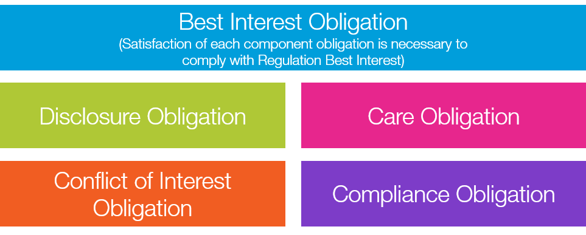

## Table of Contents

## What is the SEC Regulation Best Interest?

The SEC Regulation Best Interest, often called Reg BI, is a rule set by the U.S. Securities and Exchange Commission (SEC). It aims to make sure that financial professionals act in the best interest of their clients when giving investment advice or making investment recommendations. Before Reg BI, some advisors only had to suggest investments that were "suitable" for their clients, which was a lower standard. Now, under Reg BI, advisors must put their clients' interests ahead of their own, which is a higher standard of care.

Reg BI has four main parts that advisors must follow. First, they need to give advice that is in the client's best interest, considering the client's financial situation and goals. Second, they must clearly tell clients about any conflicts of interest that could affect their advice. Third, advisors need to have a good understanding of the investments they recommend. Lastly, they must keep records to show they are following these rules. This regulation helps make sure that clients get advice that truly benefits them.

## When was the SEC Regulation Best Interest implemented?

The SEC Regulation Best Interest, or Reg BI, was implemented on June 30, 2020. This rule was created to make sure that financial advisors put their clients' interests first when giving investment advice. Before this rule, advisors only needed to suggest investments that were "suitable" for their clients, but Reg BI set a higher standard.

Reg BI requires advisors to give advice that is in their clients' best interest, considering the client's financial situation and goals. They also have to tell clients about any conflicts of interest that could affect their advice. This helps make sure that clients get advice that truly benefits them.

## Who does the SEC Regulation Best Interest apply to?

The SEC Regulation Best Interest, or Reg BI, applies to broker-dealers and their associated persons, like financial advisors, when they make recommendations to retail customers about securities, investment strategies, or account types. A retail customer is any person who uses a broker-dealer's services mainly for their own personal, family, or household purposes.

This rule makes sure that these professionals put their clients' interests ahead of their own. They have to give advice that is in the client's best interest, considering the client's financial situation and goals. They also need to clearly tell clients about any conflicts of interest that could affect their advice. This helps make sure that clients get advice that truly benefits them.

## What are the key components of the SEC Regulation Best Interest?

The SEC Regulation Best Interest, or Reg BI, has four main parts that financial advisors need to follow. The first part is about giving advice that is in the client's best interest. This means advisors must think about what the client wants and needs financially when they suggest investments or strategies. The second part is about being open about conflicts of interest. Advisors have to tell clients about any situation where their advice might be influenced by something other than the client's best interest, like getting paid more for selling certain products.

The third part of Reg BI is about understanding the investments they recommend. Advisors need to know a lot about the investments they suggest so they can be sure they are good for their clients. The last part is about keeping records. Advisors must keep good records to show that they are following all these rules. This helps make sure that clients get advice that truly benefits them and that advisors are doing what they are supposed to do.

## How does the SEC Regulation Best Interest differ from the fiduciary standard?

The SEC Regulation Best Interest, or Reg BI, and the fiduciary standard are both rules that make sure financial advisors help their clients in the best way possible. But they are a bit different. Reg BI is a rule that applies to broker-dealers and their advisors when they give advice to regular people about things like buying stocks or choosing investment strategies. It says that advisors must put their clients' interests first, but it's a bit more flexible than the fiduciary standard. For example, under Reg BI, advisors can still get paid differently for selling different products, as long as they tell their clients about it.

On the other hand, the fiduciary standard is a stricter rule that applies to people like investment advisors who are registered with the SEC. This rule says that advisors must always put their clients' interests ahead of their own, no matter what. They can't get paid more for selling one thing over another if it's not in the client's best interest. So, the fiduciary standard is a higher level of care compared to Reg BI, because it doesn't allow for the same kind of flexibility in how advisors get paid or handle conflicts of interest.

## What are the disclosure requirements under the SEC Regulation Best Interest?

The SEC Regulation Best Interest, or Reg BI, has specific rules about what advisors need to tell their clients. When advisors recommend investments, they must clearly explain any conflicts of interest that might affect their advice. This means they need to tell clients if they get paid more for selling certain products. This helps clients understand if the advice they're getting might be influenced by something other than their own best interest.

Advisors also have to give clients a short, easy-to-understand summary about their relationship. This summary should include information about the services they offer, how they get paid, any conflicts of interest, and how clients can get more details if they want. This helps clients make better decisions about their investments and trust that their advisor is looking out for them.

## How does the SEC Regulation Best Interest affect broker-dealers?

The SEC Regulation Best Interest, or Reg BI, makes a big difference for broker-dealers. It means they have to put their clients' interests first when they give advice about investments. Before Reg BI, broker-dealers only needed to suggest investments that were "suitable" for their clients. Now, they have to make sure their advice is the best possible choice for the client, considering their financial goals and situation. This change helps make sure that clients get advice that really helps them.

Broker-dealers also have to be more open about any conflicts of interest. They need to tell their clients if they get paid more for selling certain products. This helps clients understand if the advice they're getting might be influenced by something other than their own best interest. Additionally, broker-dealers need to keep good records to show they are following all these new rules. This makes sure they are doing what they're supposed to do and helps build trust with their clients.

## What are the potential penalties for non-compliance with the SEC Regulation Best Interest?

If broker-dealers or their advisors don't follow the SEC Regulation Best Interest, they can face serious penalties. The SEC can take them to court and make them pay fines. These fines can be a lot of money, depending on how bad the problem is. The SEC might also stop them from working in the industry for a while, which can be really bad for their business.

Besides fines and being banned, the SEC can also make them give back any money they made by not following the rules. This is called disgorgement. If clients lose money because of bad advice, they might be able to sue the broker-dealer or advisor too. All these penalties are there to make sure everyone follows the rules and puts their clients' interests first.

## How can firms ensure compliance with the SEC Regulation Best Interest?

To make sure they follow the SEC Regulation Best Interest, firms need to set up strong rules and checks inside their company. This means making clear policies that tell their advisors how to give advice that's best for clients. They should also train their advisors well, so everyone knows what they need to do. It's important to keep good records too, so they can show they're following the rules. Firms might want to have someone in charge of making sure everyone follows Reg BI, like a compliance officer.

Another way firms can stay compliant is by always being open with their clients. They should tell clients about any conflicts of interest, like if they get paid more for selling certain products. Firms should also give clients a short, easy-to-understand summary about their relationship, which includes how they get paid and any conflicts. By being clear and honest, firms can build trust with their clients and make sure they're following the rules.

## What impact has the SEC Regulation Best Interest had on the financial industry?

The SEC Regulation Best Interest, or Reg BI, has changed how financial advisors work with their clients. Before Reg BI, advisors only needed to suggest investments that were "suitable" for their clients. Now, they must put their clients' interests first, which is a higher standard. This change means advisors have to think more carefully about what's best for their clients when giving advice. It has made the financial industry more focused on helping clients reach their financial goals in the best way possible.

Reg BI has also made the industry more open and honest. Advisors now have to tell their clients about any conflicts of interest, like if they get paid more for selling certain products. This helps clients trust that the advice they're getting is really in their best interest. Firms have had to set up new rules and train their advisors to follow Reg BI, which has made the whole industry work harder to do what's right for their clients.

## What are the ongoing debates or criticisms surrounding the SEC Regulation Best Interest?

Some people think the SEC Regulation Best Interest, or Reg BI, doesn't go far enough. They say it's not as strict as the fiduciary standard, which makes advisors always put their clients first. Critics argue that Reg BI still lets advisors get paid differently for selling different products, which can lead to conflicts of interest. They worry that this might make advisors suggest investments that are better for them, not the client. Some also think the rule is too complicated and hard to enforce, which could mean it doesn't really help clients as much as it should.

On the other hand, supporters of Reg BI say it's a big step forward. They believe it makes the financial industry more open and honest by making advisors tell clients about any conflicts of interest. They argue that Reg BI is easier for smaller firms to follow than the stricter fiduciary standard. Supporters also say that the rule helps protect clients by making sure advisors think carefully about what's best for them. But, they admit that making sure everyone follows the rule can be challenging and needs good checks and rules inside firms.

## How might the SEC Regulation Best Interest evolve in the future?

In the future, the SEC Regulation Best Interest, or Reg BI, might change to be even stricter. Some people think it should be more like the fiduciary standard, which makes advisors always put their clients first, no matter what. If this happens, advisors might not be able to get paid differently for selling different products. This would make sure their advice is always in the client's best interest, without any conflicts. The SEC might also make the rules easier to understand and follow, so everyone knows what they need to do.

Another way Reg BI could change is by making it easier to check if advisors are following the rules. Right now, some people think it's hard to make sure everyone is doing what they're supposed to. In the future, the SEC might set up better ways to watch over advisors and make sure they're being honest with their clients. This could mean more training for advisors and clearer rules about what they need to tell their clients. By making these changes, the SEC could help make sure that clients always get advice that's best for them.

## References & Further Reading

[1]: Moore, S. K., & Burch, A. (2020). ["Regulation Best Interest: The SEC's New Fiduciary Rule and What It Means for Financial Advisors."](https://link.aps.org/doi/10.1103/PhysRevPhysEducRes.20.020154) The National Law Review.

[2]: Securities and Exchange Commission. (2019). ["Regulation Best Interest: The Broker-Dealer Standard of Conduct."](https://www.federalregister.gov/documents/2019/07/12/2019-12164/regulation-best-interest-the-broker-dealer-standard-of-conduct) 

[3]: Santoro, J. & Shattuck, K. (2020). ["Understanding Regulation Best Interest and Form CRS."](https://www.finra.org/sites/default/files/2020-02/2020_NRMF_RegBI_Form_CRS.pdf) Morgan Lewis & Bockius LLP.

[4]: Egan, M., & Matthews, S. B. (2020). ["Conflicted advice without a complete picture: Reg BI's predictive analytics problem."](https://link.springer.com/content/pdf/10.1007/978-3-030-87413-1_3.pdf) SSRN Electronic Journal.

[5]: Mulligan, D. (2020). ["Understanding the Implications of the SEC's Regulation Best Interest (Reg BI)."](https://www.sec.gov/resources-small-businesses/small-business-compliance-guides/regulation-best-interest) JD Supra.