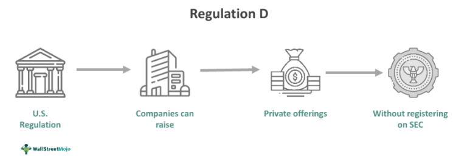

SEC Regulation D is a set of rules promulgated by the U.S. Securities and Exchange Commission (SEC), governing private placements of securities. Introduced to facilitate capital formation while ensuring investor protection, Regulation D is vital in financial markets as it provides a framework for businesses to raise capital without undergoing the onerous process of registering securities with the SEC. This regulation allows companies, especially small businesses and startups, to access a significant pool of investment resources by easing the regulatory burdens typically associated with public offerings.

Regulation D encompasses specific requirements that issuers must comply with to qualify for the exemptions it provides. These requirements, including limits on the amount of capital raised and investor qualifications, are designed to protect investors while fostering a conducive environment for capital raising activities. The main provisions of Regulation D include Rules 504, 505, and 506, each catering to different types of offerings and investor profiles. Notably, Rule 506 is among the most utilized due to its flexibility in terms of fundraising and the number of investors that can participate, subject to certain conditions.



The popularity of Regulation D has surged in investment circles mainly because it enables companies to quickly and cost-effectively access capital markets. By sidestepping the prolonged and costly process of public offerings, firms can focus resources on growth and development. Moreover, Regulation D offers an appealing route for private equity and venture capital, providing opportunities for high-net-worth individuals and institutional investors to engage in private investments with potentially lucrative returns. Consequently, Regulation D has become a cornerstone for private capital raising in the United States, significantly impacting how investments are structured and executed across various sectors.

## Table of Contents

## Understanding SEC Regulation D

SEC Regulation D is a set of rules promulgated by the U.S. Securities and Exchange Commission (SEC), designed to provide exemptions allowing companies to raise capital without the necessity of registering the securities with the SEC. Regulation D primarily serves as a tool for companies to engage in private placement offerings, thus enabling them to attract investors while adhering to federal securities laws.

### Definition of SEC Regulation D

Regulation D consists of an array of rules aimed at simplifying the capital-raising process for small and medium-sized enterprises by exempting them from certain registration requirements under the Securities Act of 1933. The regulation is composed of three distinct rules—Rule 504, Rule 505, and Rule 506—that cater to various fundraising needs and investor eligibility criteria. Although Rule 505 was repealed in 2017, Rules 504 and 506 remain integral to Regulation D, especially in facilitating the sale of securities without extensive public disclosure.

### Historical Background and Evolution of Regulation D

The inception of Regulation D can be traced back to 1982 when the SEC introduced it to streamline the process of capital formation. Initially, Regulation D focused primarily on eliminating some of the administrative and financial burdens associated with the registration of securities. Over the years, the regulation has undergone several amendments to improve accessibility for issuers and protections for investors. The Jumpstart Our Business Startups (JOBS) Act of 2012 further revolutionized Regulation D by permitting general solicitation and advertising under certain conditions associated with Rule 506(c), thereby enhancing its applicability for modern fundraising.

### Importance of Regulation D in Private Placement Offerings

Regulation D holds significant importance in the financial markets as it facilitates private placement offerings, a pivotal component of [capital raising](/wiki/hedge-fund-capital-raising) for emerging companies and startups. These offerings allow firms to access capital from private investors, which is particularly beneficial for entities that may not have the resources to pursue a public offering. By structuring offerings under Regulation D, companies can tailor their fundraising strategies to meet specific capital needs while maintaining compliance with federal regulations. This flexibility is instrumental in fostering innovation and growth within the business sector by providing a viable avenue for securing necessary funding. 

Overall, SEC Regulation D is a critical regulatory framework that supports the efficient bridging of capital needs with investor opportunities, thus playing a crucial role in the economy’s broader financial ecosystem.

## Regulation D Requirements

SEC Regulation D provides a framework to allow companies to raise capital through private placements by exempting them from certain formal registration requirements typically imposed on public offerings. The regulation includes three main rules, namely Rule 504, Rule 505, and Rule 506, each with distinct requirements and conditions.

Rule 504 permits offerings of up to $10 million annually, allowing companies to raise money without making significant disclosures to investors. These offerings generally do not require registration with the SEC if they meet certain state securities laws or "blue sky" regulations. While there is generally a prohibition on general solicitation, Rule 504 provides some flexibility, particularly if state registration is involved or if the offering is limited to accredited investors.

Rule 505, which is no longer in effect since it was rescinded in 2016, previously allowed companies to raise up to $5 million in any 12-month period. It allowed sales to an unlimited number of accredited investors but set a limit of 35 non-accredited investors. Like Rule 504, Rule 505 had restrictions on solicitation and required disclosure of specific information to non-accredited investors.

Rule 506 is arguably the most significant facet of Regulation D, offering two distinct pathways: Rule 506(b) and Rule 506(c). Under Rule 506(b), companies can raise an unlimited amount of money from accredited investors and up to 35 non-accredited investors, provided there is no advertising or public solicitation. Disclosures must be provided to non-accredited investors. Rule 506(c), introduced in 2013, expanded opportunities by allowing issuers to broadly solicit and advertise their offering, granted that all investors are accredited and the issuer takes reasonable steps to verify their status.

Investors in these offerings are subject to specific criteria and exemptions. Accredited investors, as defined by the SEC, typically include individuals with a net worth exceeding $1 million (excluding their primary residence) or an annual income of $200,000 ($300,000 if married) for the last two years, with the expectation to maintain such an income level. Certain organizations, financial institutions, and trusts also qualify as accredited investors. Non-accredited investors, permitted under specific rules, typically require more significant disclosures and protections due to their potentially limited financial sophistication and investment experience.

In summary, Regulation D offers various pathways for companies to raise funds through private capital offerings while imposing different levels of investor protection and disclosure requirements. Its flexible framework accommodates diverse funding needs and circumstances, particularly for smaller firms and startups looking for an alternative to public markets.

## Rule 506 of Regulation D

Rule 506 of Regulation D offers companies a streamlined path to raising capital through private placements without registering the securities with the U.S. Securities and Exchange Commission (SEC). Rule 506 is divided into two distinct exemptions: 506(b) and 506(c), each offering unique features and requirements tailored to different investor and issuer needs.

### Explanation of Rule 506(b) and 506(c)

**Rule 506(b)** is the more traditional exemption under Regulation D, allowing issuers to raise an unlimited amount of capital. One of its key characteristics is that issuers can sell securities to an unlimited number of accredited investors and up to 35 non-accredited sophisticated investors. However, issuers are prohibited from engaging in general solicitation or advertising when offering these securities. This requirement necessitates a pre-existing relationship between the issuer and potential investors before making the offer.

**Rule 506(c)** was introduced under the JOBS Act in 2013, allowing issuers to engage in general solicitation and advertising to market their offerings broadly, provided all purchasers in the offering are accredited investors. An accredited investor is defined under SEC rules as an individual or entity that meets specific financial criteria, such as having a net worth exceeding $1 million (excluding the value of their primary residence) or an income exceeding $200,000 ($300,000 with a spouse) in each of the last two years.

### Conditions and Exclusions Specific to Rule 506

Both Rule 506(b) and 506(c) share certain common conditions:
- Issuers must file a Form D with the SEC within 15 days after the first sale of securities.
- Issuers must adhere to anti-fraud provisions under federal securities law.

However, each rule also has specific exclusions and requirements:
- Rule 506(b) excludes general solicitation, requiring issuers to rely on existing contacts or networks.
- Rule 506(c) necessitates issuers to take reasonable steps to verify that all purchasers are accredited investors, which could include reviewing tax returns, bank statements, or credit reports.

### Benefits and Challenges Associated with Rule 506 Offerings

**Benefits:**
1. **Unlimited Capital Raising**: Both exemptions allow issuers to raise an unlimited amount of capital from investors, providing significant flexibility in financing opportunities.
2. **Cost-Effective**: Compared to public offerings, Regulation D offerings often involve lower costs, as they do not require extensive SEC registration processes.
3. **Operational Efficiency**: Issuers can target sophisticated investors who understand complex financial products, making the regulation a practical choice for startups and smaller firms seeking investment without extensive public scrutiny.

**Challenges:**
1. **Verification Requirements**: Under Rule 506(c), the onus is on issuers to validate investors' accredited status, which can be resource-intensive and complicated, especially when handling a diverse investor base.
2. **Limited Non-Accredited Participation**: Rule 506(b)'s allowance for only up to 35 non-accredited investors can limit potential investment sources and necessitate sophisticated investor assessments.
3. **Compliance and Reporting**: Despite the lack of registration, issuers must still comply with various SEC requirements, including timely filing of Form D and adhering to disclosure and anti-fraud regulations.

In conclusion, Rule 506 provides a versatile framework for private placements, with 506(b) focusing on private networks and 506(c) enabling broader public solicitations. While these rules offer substantial benefits for capital-raising activities, they also pose specific compliance and operational challenges that issuers must navigate carefully.

## Advantages of Regulation D

SEC Regulation D offers a strategic advantage for companies seeking to raise capital through private placements, presenting several key benefits over traditional public offerings.

Firstly, Regulation D provides significant flexibility in raising capital. It allows issuers to access funding without the stringent regulatory requirements typically associated with public offerings. This flexibility is particularly advantageous for firms looking to swiftly capitalize on market opportunities or those with unique investment propositions that may not fit the mold of standard public offerings.

One of the primary advantages of Regulation D is the reduction in costs and time compared to public offerings. Public offerings involve extensive legal, accounting, and underwriting processes, often accompanied by substantial costs and time commitments. In contrast, private placements under Regulation D enable issuers to circumvent many of these expenses. By eliminating the need for a full-fledged prospectus and Securities and Exchange Commission (SEC) registration, companies can minimize costs linked to compliance and administrative procedures. This cost-efficiency is critical for small to medium-sized enterprises (SMEs) and startups, allowing them to allocate resources more effectively toward growth and development rather than regulatory compliance.

The opportunity for smaller firms and startups to access funding is another significant advantage of Regulation D. These entities often face challenges in attracting venture capital or accessing traditional financing routes due to perceived risks or lack of established revenue streams. Regulation D levels the playing field by enabling smaller firms to reach accredited investors who are more inclined to invest in innovative or high-risk ventures. Additionally, by targeting a specific investor demographic, companies can more effectively tailor their pitches and offerings, enhancing the probability of securing investment.

In summary, SEC Regulation D facilitates a more streamlined, cost-effective, and flexible approach to raising capital, making it an instrumental tool for companies, especially smaller firms and startups, seeking to grow and innovate without the burdens of public offering compliance.

## Impact of Regulation D on Algorithmic Trading

SEC Regulation D, established by the Securities and Exchange Commission (SEC), has notably influenced the landscape of [algorithmic trading](/wiki/algorithmic-trading) in financial markets. While Regulation D primarily provides exemptions that facilitate private placement of securities, its implications extend to algorithmic trading, affecting strategies, risks, and opportunities in capital markets.

Regulation D has facilitated the growth of private placements, thereby influencing the development of sophisticated trading algorithms. Private placements offer an alternative route to raising capital without the extensive disclosure requirements of public offerings, appealing to numerous firms, including those focused on algorithmic trading. These companies often utilize private placements to secure funding for developing and enhancing trading algorithms. Consequently, this has led to a diversification in the types of securities available for algorithmic trading, enriching the dataset that algorithms analyze to generate trading strategies.

In algorithmic trading, the availability and diversity of financial instruments are crucial. Regulation D has increased access to a varied spectrum of privately placed securities. Traders and developers of algorithms can exploit these opportunities by integrating these securities into models, enhancing strategy formulation. For instance, by utilizing [machine learning](/wiki/machine-learning) and statistical models to predict movements in the value of privately placed securities, traders can achieve a competitive edge in the market. A simple example in Python might involve extracting data from private placement markets and using a machine learning library like scikit-learn to build predictive models:

```python
from sklearn.ensemble import RandomForestRegressor
import numpy as np

# Simulated data representing extracted features from private placement markets
features = np.array([[10, 20, 15], [15, 18, 25], [18, 24, 20]])
prices = np.array([100, 150, 200])

# Initialize and train a RandomForest model
model = RandomForestRegressor(n_estimators=100, random_state=42)
model.fit(features, prices)

# Predict future prices based on new data
new_data = np.array([[12, 22, 18]])
predicted_price = model.predict(new_data)
print("Predicted Price:", predicted_price)
```

The current trends in algorithmic trading associated with Regulation D emphasize the integration of advanced analytics and [artificial intelligence](/wiki/ai-artificial-intelligence) to process and interpret data from private placements. With regulatory exemptions, firms find it easier to issue securities, leading to a wealth of data that algorithms can scrutinize. This has given rise to strategies that are not merely reactive but predictive, enhancing profitability through anticipatory market positioning. Furthermore, as technology evolves, there is an increasing trend towards the democratization of algorithmic trading tools, allowing smaller entities and individual traders to participate in markets traditionally dominated by large financial institutions.

Despite its advantages, this focus on Regulation D can also pose challenges. The less stringent disclosure requirements associated with private placements may lead to information asymmetry, which can affect algorithmic trading accuracy. Traders must account for this by developing algorithms robust enough to handle potential [volatility](/wiki/volatility-trading-strategies) and uncertainty associated with less-transparent securities.

Overall, Regulation D has profoundly impacted algorithmic trading by enhancing the complexity and accessibility of financial instruments used in trading strategies. As both Regulation D provisions and algorithmic technology continue to evolve, their intersection is likely to foster further innovation in financial markets, providing opportunities and challenges for investors and traders.

## Compliance and Challenges

SEC Regulation D provides a framework for private placements, enabling companies to raise capital while bypassing the extensive regulatory requirements of public offerings. However, compliance with Regulation D can present challenges and risks which companies must consider to avoid violations and potential penalties. This section outlines common compliance issues, potential risks, and best practices for effective adherence to Regulation D provisions.

### Common Compliance Issues

1. **Accredited Investor Verification**: One frequent challenge is the proper verification of accredited investors, particularly under Rule 506(c), which allows general solicitation and advertising. Companies often struggle with appropriately verifying investor status, which can lead to non-compliance.

2. **Disclosure Obligations**: Unlike public offerings, Regulation D does not mandate extensive disclosure requirements. However, for offerings involving non-accredited investors under Rule 506(b), issuers must provide detailed disclosures similar to public offerings, presenting a potential compliance hurdle.

3. **Filing of Form D**: Companies must file Form D with the SEC within 15 days after the first sale of securities in a Regulation D offering. Timely filing is critical, and failure to do so can result in disqualification from leveraging Regulation D exemptions.

4. **State Securities Compliance**: While Regulation D offers federal exemption, issuers must still adhere to state-level securities laws, known as "blue sky" laws, which vary widely and add complexity to compliance efforts.

### Potential Risks and Challenges

- **Misinterpretation of Rules**: Companies may misinterpret the nuances of Regulation D, such as distinctions between Rules 504, 505, and 506, leading to inadvertent non-compliance.

- **Fraud Concerns**: The reduced disclosure requirements may inadvertently increase the risk of fraudulent activities. Companies must ensure ethical practices to protect their reputation and investor interests.

- **SEC Scrutiny and Litigation**: Non-compliance can result in SEC enforcement actions and private litigation, which can be costly and time-consuming.

### Best Practices for Maintaining Compliance

1. **Investor Verification Process**: Implement a robust investor verification process by requiring potential investors to provide documentation such as tax returns, W-2 forms, or third-party verification from a registered broker or investment advisor.

2. **Comprehensive Disclosure Practices**: Develop comprehensive disclosure documents, especially when non-accredited investors are involved, even if not strictly required, to build trust and reduce risk of disputes.

3. **Timely Filing**: Ensure that Form D filings are timely and complete. This involves setting internal reminders and deadlines for filing to avoid administrative oversights.

4. **Legal and Compliance Advisory**: Engage legal and securities compliance advisors who are well-versed in both federal and state securities laws to navigate complex regulatory environments effectively.

5. **Regular Compliance Training**: Conduct regular training sessions for the company's legal and compliance teams to keep them updated on the latest regulatory changes and best practices in compliance.

By addressing these compliance issues and implementing these best practices, companies can mitigate risks and effectively navigate the regulatory landscape of SEC Regulation D. This strategic approach can lead to successful capital raising while maintaining regulatory integrity.

## Conclusion

SEC Regulation D has established itself as an essential framework within the financial markets, facilitating private capital formation while maintaining investor protection. Its significance lies in offering companies, particularly smaller firms and startups, a viable alternative to public offerings through private placements. The regulatory structure balances the need for raising capital with the imperative of safeguarding investors, thereby playing a crucial role in the economic ecosystem. The different rules within Regulation D, such as Rule 506(b) and Rule 506(c), provide diverse mechanisms for issuers to engage investors, enhancing flexibility and accessibility to funding.

Despite its advantages, compliance with Regulation D poses challenges that issuers must navigate. Ensuring adherence to the specific criteria and exemptions necessitates a thorough understanding of the rules. The costs associated with non-compliance, both financial and reputational, underscore the importance of robust compliance strategies. Yet, the benefits, including reduced time and cost relative to public offerings, often outweigh these challenges, offering an attractive proposition for issuers seeking capital.

Looking ahead, Regulation D is expected to continue shaping the landscape of financial markets and trading strategies. With technological advancements and the growth of algorithmic trading, private placements under Regulation D are likely to adapt, integrating innovation in their execution. As financial markets evolve, Regulation D’s role will be pivotal, potentially influencing how trading algorithms are developed and employed. The continued refinement and adaptation of Regulation D will ensure its relevance, fostering an environment where innovation and regulation coexist to promote market health and integrity.

## References & Further Reading

[1]: Griffin, J. (2020). ["Legal Guide to Private Placements."](https://www.counseling.org/publications/aca-books/view/the-counselor-and-the-law--a-guide-to-legal-and-ethical-practice--8th-edition) Wilmer Hale.

[2]: Hazen, T. (2021). ["Treatise on the Law of Securities Regulation."](https://store.legal.thomsonreuters.com/law-products/Law-School-Publications/Hazens-Treatise-on-the-Law-of-Securities-Regulation-8th-Practitioner-Treatise-Series/p/106918949) Thomson Reuters.

[3]: Lopez de Prado, M. (2018). ["Advances in Financial Machine Learning."](https://www.amazon.com/Advances-Financial-Machine-Learning-Marcos/dp/1119482089) Wiley.

[4]: Sjostrom, W. K. (2016). ["The Regulation A+ Offering Circular: A Viable Alternative to IPOs."](https://kb.osu.edu/server/api/core/bitstreams/154f1884-9094-56e6-bdca-251073a64ae3/content) Journal of Corporation Law.

[5]: U.S. Securities and Exchange Commission. ["Registration Under the Securities Act of 1933."](https://www.sec.gov/rules-regulations/statutes-regulations)