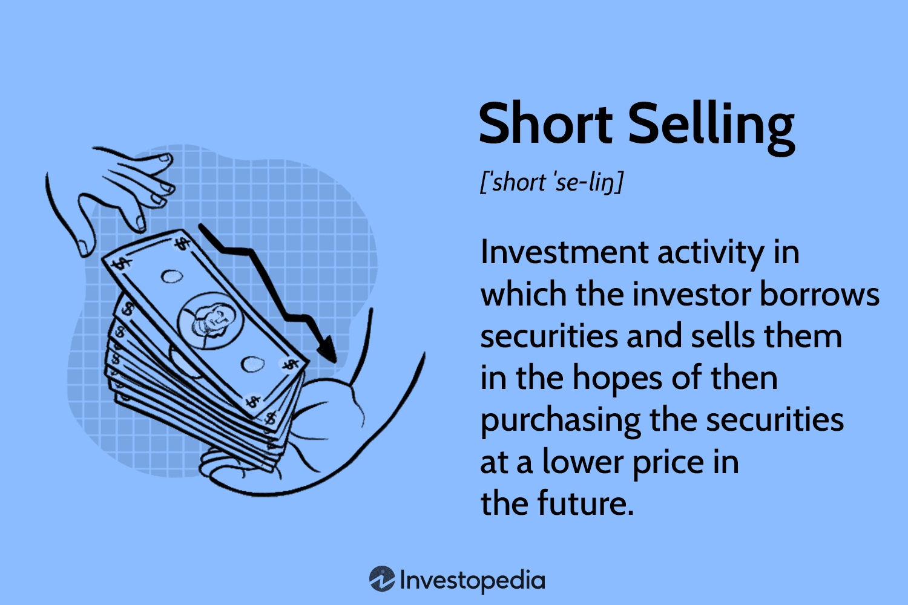

In the world of financial markets, short selling and algorithmic trading play pivotal roles in shaping market dynamics. Short selling allows investors to profit from declining stock prices by borrowing shares and selling them, with the intention of buying them back at a lower price. On the other hand, algorithmic trading uses computer algorithms to execute trades with speed and precision based on predefined criteria. Both strategies have a profound influence on market behavior and liquidity.

Regulatory oversight is essential to maintain the integrity and stability of financial markets, and the Securities and Exchange Commission (SEC) is at the helm of ensuring that these activities are conducted within a framework of fairness and transparency. The SEC establishes regulations to mitigate risks, prevent market manipulation, and safeguard investor interests.

Understanding SEC regulations is imperative for investors and traders participating in financial markets. These regulations not only protect market participants from unethical practices but also help in maintaining an orderly financial ecosystem. By examining the SEC’s regulatory framework concerning short selling and algorithmic trading, investors can better align their strategies, ensuring compliance while optimizing their market participation. 

The impact of these regulations extends beyond individual traders and firms, influencing the broader financial ecosystem by promoting confidence and stability. In this article, we will explore how SEC regulations shape the landscape of short selling and algorithmic trading, and their implications for market participants and the overall financial market structure.

## Table of Contents

## What is Short Selling?

Short selling is a trading strategy that allows investors to speculate on the decline in a stock's price. The mechanism involves borrowing shares from a broker and selling them on the open market, intending to repurchase them later at a lower price. The profit is made from the difference between the selling price and the repurchase price. Here is a simplified example:

1. An investor borrows 100 shares of Company XYZ trading at $50 per share.
2. The investor sells these shares for a total of $5,000.
3. If the stock price falls to $40, the investor can repurchase 100 shares for $4,000.
4. After returning the borrowed shares, the investor nets a profit of $1,000 ($5,000 - $4,000).

Short selling can be particularly profitable during a bear market, or when specific stocks are expected to decline due to poor performance, negative news, or unfavorable market conditions. This strategy allows investors to potentially earn returns even in down markets.

However, short selling is inherently risky. If the market moves against the investor's expectations and the stock price rises instead of falls, the potential for losses is unlimited, as there is no cap on how high a stock's price can go. For instance, if Company XYZ's stock price rises to $60 instead of falling to $40, the investor would have to repurchase at a higher price, resulting in a loss of $1,000.

Due to these risks, the Securities and Exchange Commission (SEC) has implemented specific rules and regulations to curb excessive risk-taking and potential market manipulations associated with short selling. One such key regulation is the "uptick rule," which restricts short selling unless the previous price movement was upward, thereby preventing excessive downward pressure on a stock's price.

The controls set by the SEC are designed to ensure transparency and accountability in short selling. By regulating this activity, the SEC aims to mitigate the risks of market manipulation and protect the interests of investors.

## What is Algorithmic Trading?

Algorithmic trading uses computer algorithms to automate trading strategies based on predefined criteria. This type of trading allows for the rapid and precise execution of orders far beyond human capabilities. By leveraging powerful computing technology, [algorithmic trading](/wiki/algorithmic-trading) processes large volumes of data at high speed, enabling swift order execution in milliseconds or even microseconds. 

Algorithmic trading covers a wide range of activities, from high-frequency trading ([HFT](/wiki/high-frequency-trading-strategies)), which involves executing a large number of orders rapidly, to more strategic, long-term models that may not execute trades as frequently. High-frequency trading seeks to profit from very short-term market inefficiencies and often involves aspects like [order book](/wiki/order-book-trading-strategies) dynamics and real-time data processing. Longer-term models, however, might use algorithms to identify trends, optimize portfolios, or manage risk over a more extended period.

The core strength of algorithmic trading lies in its ability to exploit market inefficiencies. For instance, algorithms can identify [arbitrage](/wiki/arbitrage) opportunities—slight price discrepancies in different markets for the same asset—and exploit them instantly for profit. Precision and the ability to execute trades at the optimal moment provide significant advantages compared to traditional human trading.

The Securities and Exchange Commission (SEC) plays an essential role in monitoring and regulating algorithmic trading to ensure market fairness and prevent manipulation. The SEC's oversight is crucial in maintaining market integrity, as algorithmic trading can amplify systemic risks due to its speed and complexity. The regulatory framework established by the SEC aims to detect and prevent practices that may destabilize markets.

## SEC Regulations on Short Selling

The Securities and Exchange Commission (SEC) has established a comprehensive set of regulations to govern short selling, aimed at maintaining market stability and preventing practices that could lead to an irrational drain on stock prices. 

One of the foundational rules in this regulatory framework is the "uptick rule," initially implemented in 1938 as Rule 10a-1 under the Securities Exchange Act of 1934. This rule prohibits short selling of a stock unless the previous sale caused an increase in the stock's price. Specifically, it requires that each short sale transaction is executed at a price higher than the last different price (an "uptick") or equal to the last price if it was higher than the previous last price (a "zero-plus tick"). The rule aims to prevent short sellers from adding selling pressure to a stock that is already declining, thus avoiding a downward spiral in stock prices.

The relevance of robust short selling regulations was underscored during the 2008 financial crisis. During this period, extreme price [volatility](/wiki/volatility-trading-strategies) and concerns over systemic risk prompted the SEC to scrutinize and enhance the existing regulations surrounding short selling. As a result, the SEC introduced measures to increase transparency and reduce the potential for abusive short selling. One critical enhancement was the introduction of stricter reporting requirements for short positions, including the obligation to report large short positions to the SEC, enhancing the Commission's ability to monitor and address potential market abuses.

Another vital component in the SEC's regulatory arsenal is Rule 201, known formally as the alternative uptick rule. Adopted in response to the turmoil of the financial crisis, Rule 201 targets aggressive short selling during periods of significant stock price declines. It restricts short selling when the stock's price has fallen by 10% or more in a single trading day. This rule acts as a circuit breaker, triggering restrictions that prevent short selling for the remainder of the day and the subsequent trading day, unless the transaction is executed at a price above the national best bid. This ensures a level of control over short selling activities during times of extreme market stress, providing an added layer of protection against volatility and potential market distortions.

Moreover, the SEC imposes rigorous settlement requirements to uphold market integrity and accountability. These regulations mandate timely settlement of short sales to decrease the occurrence of "naked" short selling, where shares are sold short without actually borrowing the underlying security first. By enforcing these stringent settlement rules, the SEC aims to curtail potential risks associated with delayed deliveries and enhance the transparency of short sale transactions.

Overall, the SEC's regulations on short selling are strategically crafted to foster fairness and stability in the stock market, mitigating risks associated with potential market abuses and ensuring transparent short sale practices.

## SEC Regulations on Algorithmic Trading

The Securities and Exchange Commission (SEC) has established a set of regulations to oversee algorithmic trading, aiming to prevent market instability and ensure fairness. These regulations require that all trading algorithms undergo thorough testing prior to their deployment in live market environments. The goal of this requirement is to minimize the risk of malfunctioning algorithms, which could lead to unintended market disruptions or manipulative trading practices.

In addition to pre-deployment testing, the regulations stipulate comprehensive record-keeping and reporting protocols. Market participants engaged in algorithmic trading must maintain detailed logs of their trading activities and the algorithms used. This precise documentation allows the SEC to conduct effective oversight and ensures compliance with existing legal frameworks. It facilitates the identification of irregular trading patterns and assists in tracing any problematic transactions that might arise.

Real-time monitoring is another cornerstone of the SEC's regulatory approach. Algorithmic traders are required to implement systems that allow for the continuous observation of trading activities, with the capacity to quickly detect and correct any unethical practices or system anomalies. This real-time scrutiny helps in managing risks and ensures that any potential breaches of market integrity are addressed promptly.

The SEC's regulations underscore the importance of transparency in algorithmic trading. By mandating clear and open practices, these rules aim to foster trust and confidence among market participants. Robust risk management strategies are also emphasized, encouraging traders to adopt safeguards that prevent potential threats to financial stability. Overall, the regulatory framework is designed to uphold the integrity of the financial markets, ensuring they function smoothly and fairly even as technological advances continue to evolve.

In summary, the SEC's regulation of algorithmic trading focuses on rigorous testing, thorough record-keeping, real-time monitoring, and a stress on transparency and risk management. These measures collectively create a structured environment where innovation can thrive without undermining market stability.

## Impact of SEC Regulations on Market Participants

SEC regulations provide a framework of stability that boosts confidence among investors and promotes market participation. These regulatory measures are essential in minimizing the risks of fraud and manipulation, thereby creating a level playing field for all traders. By ensuring transparency and accountability, the SEC fosters an environment where investor trust is reinforced, which is crucial for the efficient functioning of financial markets.

Traders and firms must stay informed and adapt their strategies to comply with evolving regulations. This adaptability ensures that they operate within the legal framework while optimizing their trading practices. The ever-changing landscape of financial regulation necessitates that market participants remain vigilant and proactive in understanding the implications of these rules on their trading activities. This diligence not only aids compliance but also drives strategic innovation.

Strict regulatory oversight, while imposing certain constraints, ultimately contributes to healthier, more robust financial markets. These regulations mitigate systemic risks and prevent the possibility of market disruptions caused by unethical trading practices. For example, policies such as the uptick rule in short selling prevent excessive downward pressure on stock prices, protecting the market from potential abuses.

Furthermore, these regulations encourage innovation within a structured and secure environment, balancing progress with prudence. By setting clear guidelines and boundaries, the SEC allows market participants to explore new trading techniques and technologies confidently. This structured innovation fuels the development of advanced trading systems and strategies, enhancing market efficiency and [liquidity](/wiki/liquidity-risk-premium).

Overall, the impact of SEC regulations on market participants is multifaceted. As the financial ecosystem continues to evolve, maintaining a dynamic and effective regulatory framework is paramount in ensuring that markets remain fair, transparent, and resilient.

## Future of SEC Regulations in Short Selling and Algorithmic Trading

The financial markets' dynamic nature necessitates that regulatory bodies like the Securities and Exchange Commission (SEC) remain vigilant and adaptable to emerging trends and technologies. As both short selling and algorithmic trading tactics evolve, the SEC's regulatory framework is expected to adjust accordingly to maintain stability and integrity in the markets.

The rise of [artificial intelligence](/wiki/ai-artificial-intelligence) (AI) and [machine learning](/wiki/machine-learning) in trading practices is a significant trend that the SEC is likely to address. These advanced technologies have the potential to transform trading strategies by improving predictive accuracy and executing complex tasks efficiently. However, their complexity could also introduce new risks, including market manipulation and systemic disruptions. To mitigate these risks, future regulations may require more rigorous testing and validation of AI-driven trading models before their deployment. Additionally, there could be increased emphasis on transparency and accountability, ensuring that AI algorithms do not operate as opaque "black boxes" but are understandable and auditable.

Globally, financial regulators are recognizing the impact of technological advancements on trading activities. This international perspective can offer valuable insights for the future direction of SEC regulations. For example, the European Union's Markets in Financial Instruments Directive II (MiFID II) has set a precedent in demanding higher transparency and comprehensive reporting standards for algorithmic trading. By examining such global regulatory trends, the SEC might identify best practices and potential pitfalls that could inform its frameworks.

Proactive and anticipatory regulation is crucial. By forecasting technological and market developments, the SEC can enact measures that prevent issues before they arise rather than reacting to crises after their occurrence. For instance, maintaining an ongoing dialogue with industry stakeholders, including techno-financial experts and market participants, could aid in crafting regulations that strike a balance between market innovation and stability.

In conclusion, the future of SEC regulations concerning short selling and algorithmic trading will likely be characterized by evolving measures that accommodate technological progress while safeguarding market integrity. As these financial practices advance, regulatory frameworks must adapt to ensure they continue to protect the interests of market participants and uphold the overall health of the financial ecosystem.

## Conclusion

The SEC’s regulations on short selling and algorithmic trading are indispensable for ensuring markets operate fairly and efficiently. As the complexity and technology of financial markets progress, the SEC faces the challenge of striking a balance between fostering innovation and ensuring robust investor protection. This dual mandate is critical as it allows markets to benefit from technological advances while minimizing risks such as fraud and market manipulation.

For market participants, staying informed about these regulations is crucial for engaging in compliance and leveraging strategic market opportunities. An understanding of regulatory frameworks not only aids in meeting legal requirements but also enhances strategic decision-making, which can lead to more refined trading strategies and better risk management.

Safeguarding the interests of all market stakeholders, including individual investors, institutional traders, and other participants, is fundamental to promoting long-term growth and stability in the financial system. Such protections ensure that the market remains a level playing field where all participants can partake fairly and efficiently.

The SEC’s role in overseeing these aspects is ever-evolving, adapting to new challenges posed by technological advancements such as artificial intelligence and machine learning. As these technologies become integral to trading strategies, the SEC’s proactive approach to regulation seeks to preemptively address potential disruptive issues while promoting a secure and innovative trading environment. This ongoing regulatory evolution will be essential in maintaining the integrity and sustainability of the financial markets as they continue to transform.

## References & Further Reading

[1]: Brunnermeier, M. K., & Pedersen, L. H. (2005). ["Predatory Trading."](https://onlinelibrary.wiley.com/doi/abs/10.1111/j.1540-6261.2005.00781.x) National Bureau of Economic Research.

[2]: Securities and Exchange Commission. (2010). ["Concept Release on Equity Market Structure."](https://www.sec.gov/rules-regulations/2010/01/concept-release-equity-market-structure) Release No. 34-61358.

[3]: MacKenzie, D. (2011). ["The Credit Crisis as a Problem in the Sociology of Knowledge."](https://www.sps.ed.ac.uk/sites/default/files/assets/pdf/CrisisRevised.pdf) Sociology, 45(5), 718-735.

[4]: U.S. Securities and Exchange Commission. ["Short Sales"](https://www.sec.gov/investor/pubs/regsho.htm).

[5]: Kirilenko, A., Kyle, A., Samadi, M., & Tuzun, T. (2017). ["The Flash Crash: High-Frequency Trading in an Electronic Market."](https://www.jstor.org/stable/26652722) The Journal of Finance, 72(3), 967-998. 

[6]: Mercado, T. (2018). ["Algorithmic Trading and Regulation: A Decade after the 2008 Financial Crisis."](https://www.semanticscholar.org/paper/ALGORITHMIC-TRADING%3A-A-COMPREHENSIVE-REVIEW-OF-AND-Garg/94ead853e1835e7caae78d080e8b0e2f5f504607) Emory Bankruptcy Developments Journal, 34(1), 287-318.