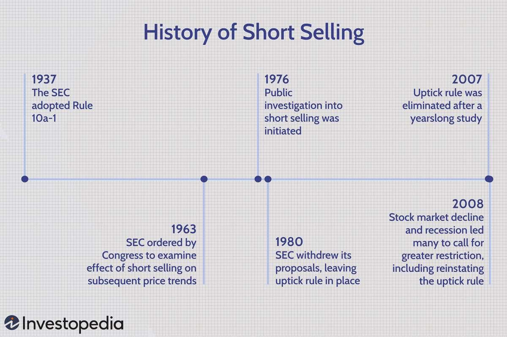

## Table of Contents

## What is short selling?

Short selling is a way to make money when you think the price of a stock will go down. Instead of buying a stock and hoping it goes up, you borrow shares of a stock from someone else and sell them right away. You hope that the price will drop so you can buy the shares back later at a lower price, return them to the person you borrowed from, and keep the difference as profit.

However, short selling can be risky. If the stock price goes up instead of down, you will lose money. You have to buy back the shares at the higher price to return them, which means you'll have to pay more than you got when you sold them. This can lead to big losses, so it's important to be careful and understand the risks before trying short selling.

## What is the role of the SEC in regulating short selling?

The SEC, or the Securities and Exchange Commission, is a group in the United States that makes sure the stock market is fair and safe. They have rules about short selling to stop people from doing it in a way that could hurt the market or other investors. The SEC watches to make sure that when people short sell, they follow the rules and don't do anything sneaky or harmful.

One big rule the SEC has is called the "uptick rule." This rule says that if a stock's price is going down a lot, you can't short sell it unless the price goes up a little bit first. This helps stop the price from falling too fast. The SEC also makes sure that people who short sell can actually get the shares they need to borrow, so they can return them later. This helps keep the market stable and fair for everyone.

## What are the basic SEC rules that apply to short selling?

The SEC has rules to make sure short selling is done fairly and doesn't hurt the market. One important rule is the "uptick rule." This rule says that if a stock's price is dropping a lot, you can't short sell it unless the price goes up a tiny bit first. This helps stop the stock price from falling too fast and keeps the market stable.

Another rule the SEC has is about making sure people who short sell can actually borrow the shares they need. When someone short sells, they have to return the shares later, so they need to be able to get them. The SEC checks to make sure this happens, which helps keep everything fair and prevents problems in the market.

These rules are important because they help protect investors and keep the stock market working smoothly. By watching short selling closely, the SEC makes sure that everyone plays by the same rules and that no one can take advantage of the system in a way that could cause big problems.

## How does the SEC define 'short sale' and 'short position'?

The SEC defines a 'short sale' as when someone sells a stock they don't own. They borrow the stock from someone else, sell it, and hope the price will go down. If it does, they can buy it back cheaper later, return the borrowed stock, and keep the difference as profit. It's like betting that a stock's price will drop.

A 'short position' is what someone has after they do a short sale. It means they owe the stock they sold to the person they borrowed it from. Until they buy the stock back and return it, they have a short position. It's a way to keep track of how much stock they need to buy back to close their short sale.

## What are the reporting requirements for short sales under SEC regulations?

The SEC has rules about telling them about short sales to keep the market fair and open. If you're a big investor, like a [hedge fund](/wiki/hedge-fund-trading-strategies) or a firm that manages money for others, you need to report your short positions. You have to tell the SEC how many shares you've sold short and which stocks they are. This helps the SEC keep an eye on the market and make sure no one is doing anything that could hurt other investors.

The reports need to be sent to the SEC by the end of the month after you did the short sale. For example, if you sold short in January, you need to report it by the end of February. The SEC uses this information to watch for any big changes or problems in the market. By knowing who is short selling and how much, they can act quickly if they see something that might cause trouble.

## How does Regulation SHO affect short selling practices?

Regulation SHO is a set of rules from the SEC that helps make short selling fair and safe. One big part of it is called the "locate" rule. This rule says that before you can short sell a stock, you need to find and arrange to borrow the shares you're going to sell. This stops people from short selling stocks they can't actually get their hands on, which could cause big problems in the market.

Another important part of Regulation SHO is the "close-out" rule. This rule says that if you short sell a stock and it keeps failing to deliver (meaning you can't get the shares to return), you have to buy them back and close your short position. This helps stop a situation where too many people are short selling the same stock without being able to return the shares, which could make the stock's price drop too much and cause chaos in the market. By making sure people can actually borrow and return the shares they short sell, Regulation SHO helps keep the market stable and fair for everyone.

## What is the 'uptick rule' and how does it impact short selling?

The 'uptick rule' is a rule made by the SEC to help control short selling. It says that if a stock's price is going down a lot, you can't short sell it unless the price goes up a little bit first. This small increase in price is called an "uptick." The idea behind the rule is to stop the stock price from falling too fast and to give the market a chance to calm down.

When the uptick rule is in place, it can make short selling a bit harder. If you want to short sell a stock that's dropping quickly, you have to wait for the price to go up a tiny bit before you can do it. This can help protect the market from big, sudden drops in stock prices caused by a lot of short selling all at once. By making people wait for an uptick, the rule helps keep the market stable and fair for everyone.

## Can you explain the concept of 'naked short selling' and its regulation by the SEC?

Naked short selling is when someone sells a stock short without first borrowing the shares they need. Normally, when you short sell, you borrow the stock from someone else and then sell it, hoping to buy it back later at a lower price. But with naked short selling, you skip the borrowing part and just sell the stock. This can cause big problems because if a lot of people do it, there might not be enough shares to go around, which can make the stock's price drop a lot and cause chaos in the market.

The SEC has rules to stop naked short selling and keep the market fair. One of these rules is part of Regulation SHO, which says that before you can short sell a stock, you need to find and arrange to borrow the shares. This is called the "locate" rule. If you can't find the shares to borrow, you're not allowed to short sell. The SEC also has a "close-out" rule that says if you short sell and can't deliver the shares, you have to buy them back and close your short position. These rules help make sure that short selling is done in a way that doesn't hurt the market or other investors.

## What are the penalties for non-compliance with SEC short selling regulations?

If someone doesn't follow the SEC's rules about short selling, they can get into big trouble. The SEC can fine them a lot of money. The fines can be different depending on how bad the rule-breaking was and how much it hurt the market or other people. Sometimes, the fines can be in the millions of dollars. The SEC can also stop the person or company from doing any more short selling or even from working in the stock market at all.

Besides fines and bans, the SEC can also take people to court. If someone breaks the rules on purpose, they might have to go to jail. The SEC works hard to make sure that everyone follows the rules so the stock market stays fair and safe for everyone. By punishing those who don't follow the rules, the SEC helps keep the market stable and protects investors from getting hurt by bad behavior.

## How have SEC regulations on short selling evolved over the last decade?

Over the last decade, the SEC has made changes to its rules about short selling to keep the stock market fair and safe. One big change happened in 2010 when the SEC brought back the "uptick rule." This rule says that if a stock's price is dropping a lot, you can't short sell it unless the price goes up a little bit first. The SEC did this to stop the stock price from falling too fast and to give the market a chance to calm down. They also made the "locate" rule stricter, which says you need to find and arrange to borrow the shares before you can short sell them. This helps stop "naked short selling," where people sell stocks they don't have.

The SEC has also been working on making sure that short selling is more open and easy to see. They started asking big investors to report their short positions more often. This helps the SEC keep an eye on the market and act quickly if they see something that might cause trouble. In 2023, the SEC proposed new rules to make short selling even more transparent. They want to make sure that everyone can see who is short selling and how much, which helps keep the market fair for everyone. These changes show that the SEC is always trying to make the rules better to protect investors and keep the stock market working smoothly.

## What are the current debates or proposed changes regarding SEC short selling regulations?

There are ongoing debates about how the SEC should handle short selling. One big topic is about making short selling more open and easy to see. Some people think that if everyone can see who is short selling and how much, it will help keep the market fair. The SEC has been talking about new rules that would make big investors report their short positions more often and in more detail. This would help the SEC watch the market more closely and act quickly if they see something that might cause trouble.

Another debate is about how strict the rules should be. Some people want the SEC to make the rules even tougher to stop bad behavior like naked short selling. They think that stricter rules would protect the market from big, sudden drops in stock prices. On the other hand, some people worry that too many rules might make it harder for investors to do short selling, which can be a useful way to balance the market. The SEC is trying to find a good balance that keeps the market safe but still lets investors use short selling when it's needed.

## How do SEC regulations on short selling impact market stability and investor protection?

SEC regulations on short selling help keep the market stable by making sure that short selling is done in a fair way. Rules like the "uptick rule" stop the stock price from falling too fast. This rule says that if a stock's price is dropping a lot, you can't short sell it unless the price goes up a little bit first. This gives the market a chance to calm down and helps prevent big, sudden drops in stock prices. The "locate" rule also helps by making sure that people can actually borrow the shares they need before they short sell them. This stops problems like naked short selling, where people sell stocks they don't have, which can cause chaos in the market.

These rules also protect investors by making short selling more open and easy to see. The SEC asks big investors to report their short positions, which helps everyone know who is short selling and how much. This transparency helps the SEC watch the market closely and act quickly if they see something that might cause trouble. By making sure that short selling is done fairly and openly, the SEC helps keep the market safe for everyone. This way, investors can feel more confident that the market is being watched and that bad behavior is being stopped.

## References & Further Reading

[1]: Brunnermeier, M. K., & Pedersen, L. H. (2005). ["Predatory Trading."](https://onlinelibrary.wiley.com/doi/abs/10.1111/j.1540-6261.2005.00781.x) National Bureau of Economic Research.

[2]: Securities and Exchange Commission. (2010). ["Concept Release on Equity Market Structure."](https://www.sec.gov/rules-regulations/2010/01/concept-release-equity-market-structure) Release No. 34-61358.

[3]: MacKenzie, D. (2011). ["The Credit Crisis as a Problem in the Sociology of Knowledge."](https://www.sps.ed.ac.uk/sites/default/files/assets/pdf/CrisisRevised.pdf) Sociology, 45(5), 718-735.

[4]: U.S. Securities and Exchange Commission. ["Short Sales"](https://www.sec.gov/investor/pubs/regsho.htm).

[5]: Kirilenko, A., Kyle, A., Samadi, M., & Tuzun, T. (2017). ["The Flash Crash: High-Frequency Trading in an Electronic Market."](https://www.jstor.org/stable/26652722) The Journal of Finance, 72(3), 967-998. 

[6]: Mercado, T. (2018). ["Algorithmic Trading and Regulation: A Decade after the 2008 Financial Crisis."](https://www.semanticscholar.org/paper/ALGORITHMIC-TRADING%3A-A-COMPREHENSIVE-REVIEW-OF-AND-Garg/94ead853e1835e7caae78d080e8b0e2f5f504607) Emory Bankruptcy Developments Journal, 34(1), 287-318.