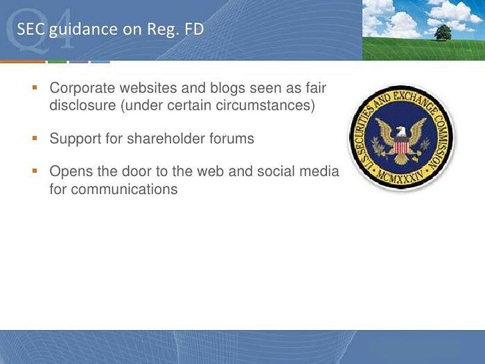

Social media platforms have transformed into indispensable tools for public companies, enabling the dynamic engagement with stakeholders. This new era of communication, however, brings with it a necessity for strict regulation to ensure adherence to securities laws. The U.S. Securities and Exchange Commission (SEC) is instrumental in supervising how companies utilize social media platforms to safeguard investor interests and sustain fair market practices.

The SEC's regulatory framework delineates the appropriate use of social media by public companies, aiming to prevent the misuse of information and to maintain transparency. As these platforms become increasingly integrated into corporate communication strategies, companies face the challenge of ensuring that information disseminated via social media complies with existing securities regulations.

Furthermore, the emergence of social media as a tool in algorithmic trading highlights additional complexities in this regulative landscape. Algorithms, often informed by social media data, play a significant role in trading activities and pose potential conflicts of interest that the SEC must address. The intersection of social media regulation with securities compliance thus involves an intricate balance between innovative communication practices and the stringent requirements set forth by the SEC.

This article intends to explore the multifaceted relationship between social media regulation, securities compliance, SEC guidelines, and the intricacies brought forth by algorithmic trading, offering an in-depth analysis of the challenges and opportunities faced by companies in today's digital age.

## Table of Contents

## Understanding Social Media Regulation in Securities

The SEC's regulations governing the use of social media by public companies are designed to ensure the equitable dissemination of material information, adhering to securities laws vital for maintaining transparency and fairness in financial markets. Fundamental to these regulations is Regulation Fair Disclosure (Reg FD), which was implemented to prevent the unfair advantage that could arise from selective disclosure of material non-public information.

Reg FD mandates that public companies must disclose any material information broadly to the public rather than to a select group of individuals or market professionals. This rule was introduced to level the playing field for all investors, preventing scenarios where a select few could gain from inside information before it became publicly available. This is especially crucial in the modern age of social media, where information can be rapidly disseminated but also selectively targeted.

The SEC has clarified that the concept of "public disclosure" under Reg FD can encompass various communication channels, including social media platforms, provided these are well-publicized as official disclosure outlets. This requires companies to notify investors which methods and platforms they will use to publish information. The core objective is to ensure that all potential investors have concurrent access to information that might influence investment decisions.

For instance, if a company decides to release its earnings report through its official Twitter account, it must first specify that Twitter is a recognized platform for such disclosures. This approach prevents any unintentional breaches of Reg FD, ensuring compliance with the guidance on how material information should be communicated.

The SEC's guidelines for the use of social media emphasize the necessity for companies to strike a balance between the timeliness of information release and the thorough public availability of that information. As social media can instantly reach thousands of users, it is a powerful tool for communication. However, the challenge lies in ensuring that the distribution of information through these platforms does not inadvertently favor certain groups over others, maintaining fidelity to the principles of transparency and fairness.

## Regulation Fair Disclosure (Reg FD) and Its Impact

Regulation Fair Disclosure (Reg FD) is a vital component of U.S. securities law, established by the Securities and Exchange Commission (SEC) to promote transparency and fairness in the financial markets. Implemented in October 2000, Reg FD aims to curb the practice of selective disclosure, where public companies selectively share material nonpublic information with specific individuals such as analysts or institutional investors, potentially giving them an unfair advantage in the market.

The cornerstone of Reg FD is its requirement that public companies must ensure that all investors have simultaneous access to material information that could influence their investment decisions. This regulation mandates that when material nonpublic information is disclosed to certain parties, companies must simultaneously make the same information publicly available. In practice, this means using recognized channels for dissemination, such as press releases, SEC filings, and conference calls accessible to the public.

The digital age, characterized by the ubiquitous presence of social media, has expanded the platforms through which companies can communicate. Recognizing this, the SEC has acknowledged that social media platforms can serve as recognized channels for disclosure under Reg FD, provided they are expressly identified as such by the company. This was notably clarified in the SEC's 2013 report on the Netflix investigation, where the agency stated that social media platforms can be used for disclosure—similar to websites—if investors have been appropriately alerted about which social media will be used to distribute material information.

To comply with Reg FD via social media, companies are required to clearly designate these platforms as official channels for material information dissemination. This involves integrating disclosures with appropriate cautionary statements to mitigate the risks of misinterpretation, especially given the character limitations on platforms such as Twitter. Failure to do so can lead to allegations of selective disclosure, holding companies accountable for potential breaches of Reg FD.

In essence, Reg FD plays an essential role in fostering fairness and equality in financial markets by preventing privileged access to critical company information. Its application to modern communication platforms underscores the evolving nature of securities regulation in keeping pace with technological advancements. As companies increasingly rely on digital means for stakeholder engagement, adherence to Reg FD's principles ensures that market practices remain equitable and transparent.

## Navigating SEC Guidelines for Social Media

The U.S. Securities and Exchange Commission (SEC) has recognized the growing importance of social media platforms as vital communication channels for public companies. Recognizing this, the SEC guidelines require companies to rigorously ensure that information disseminated via social media is both accurate and treated as a recognized medium for public disclosure. This stems from the need to align modern communication practices with existing securities laws, primarily to protect investors from misinformation that could influence market behaviors.

One of the key requirements outlined by the SEC is for companies to make sure that any social media platform used to disclose material information is specifically listed as a recognized channel of communication. This means that before utilizing social media to release important business information, a company must publicly announce its chosen social media venues as an official method of disclosure. This process democratizes access to information, maintaining the spirit of Regulation Fair Disclosure (Reg FD) which seeks to prevent selective disclosure.

Additionally, when publishing posts on social media, companies are under obligation to ensure these posts are accurate and include all essential disclosures or cautionary statements. This requirement poses a unique challenge given the character limits inherent on many platforms, such as Twitter. For example, a tweet intended to disclose financial results may require supplemental postings or links to ensure the completeness of the information. The challenge escalates as these tweets must remain clear and informative, providing all relevant data, which might necessitate creativity within these constraints.

To assist companies in complying with these rules, the SEC encourages the inclusion of hyperlinks to more detailed information when character space is limited. This practice allows for the continuation of full transparency without sacrificing the brevity imposed by social media character limits. Additionally, companies must consistently monitor these channels to ensure ongoing compliance, correcting any misstatements that arise swiftly to avoid misleading investors.

The dynamic nature of social media means that companies must remain vigilant in monitoring regulatory updates from the SEC. As digital communication tools evolve, so too will the guidelines overseeing their use in the context of securities trading, necessitating ongoing adaptation and compliance efforts from public companies.

## The Role of Social Media in Algorithmic Trading

The integration of social media data into [algorithmic trading](/wiki/algorithmic-trading) has transformed the landscape of financial markets. Social media platforms generate massive amounts of data, providing real-time insight into market sentiment, news, and trends that can significantly influence trading decisions. This data, when processed through sophisticated algorithms, enables trading platforms to make predictions about market movements and execute trades with increased speed and accuracy.

The U.S. Securities and Exchange Commission (SEC) has recognized both the potential and the challenges posed by the use of social media data in trading algorithms. In response, the SEC has enhanced regulations to ensure that trading platforms utilizing predictive analytics maintain transparency and integrity in their operations. These enhanced rules mandate that any material information derived from social media must be considered fairly and be reflective of authentic market sentiments, not engineered biases.

However, the reliance on algorithmic trading using social media data introduces potential conflicts of interest. Since algorithmic trading strategies can significantly influence market behavior, there is a risk that trading platforms could develop models that prioritize their proprietary benefits over those of their clients. For instance, a platform might design algorithms that trigger trades benefiting its own positions before executing client orders, exploiting the time advantage derived from privileged access to data. To address these concerns, the SEC has stressed the importance of disclosing potential conflicts and ensuring that trading platforms are structured to act in their clients' best interests.

Algorithmic trading using social media data also raises ethical questions regarding the accuracy and source of the data being analyzed. The inherent [volatility](/wiki/volatility-trading-strategies) and potential misinformation circulating on social media platforms necessitate robust verification methods to ensure the data's reliability before it influences trading strategies. Moreover, algorithms must be periodically reviewed and adjusted to align with the evolving nature of social media interactions and to remain compliant with regulatory standards.

In summary, while social media offers rich data sources for algorithmic trading, it simultaneously presents significant regulatory and ethical challenges. Ensuring fair practice and transparency remains critical as the financial sector increasingly embraces these data-driven trading methodologies.

## Addressing Compliance and Ethical Issues

In the context of securities trading and compliance, it is essential for companies to exercise caution regarding what they endorse or share on social media. Companies must ensure that social media activities do not inadvertently communicate endorsements or disclose material information without proper disclosures. This is crucial as failure to provide necessary disclosures can lead to securities law violations, which might result in legal consequences and damage to the company's reputation.

The challenge arises from the nature of social media, which encourages quick sharing and engagement but often lacks the space for detailed disclosures. For instance, Twitter’s character limit constrains the ability to fully explain the implications of shared information or to include comprehensive disclaimers. Companies must develop strategies that comply with existing regulations while effectively utilizing social media as a communication tool.

One way companies can address these challenges is through clear internal policies and training programs that emphasize compliance with regulatory standards. By establishing guidelines on how material information should be shared, companies can reduce the risk of unintended disclosures. Furthermore, companies are advised to use social media channels recognized in their communication strategy for disseminating information, ensuring that these align with the U.S. Securities and Exchange Commission's (SEC) guidelines.

Employee actions on social media present another layer of compliance risk. An employee's personal social media post could inadvertently disclose sensitive company information, potentially violating SEC regulations. To mitigate these risks, companies should implement comprehensive social media policies and training programs to instruct employees on the boundaries of permissible disclosures about the company. Monitoring activities and implementing controls, such as automated alerts for posts containing specific keywords, can also help ensure early detection of non-compliant communications.

In conclusion, maintaining compliance and adhering to ethical standards on social media require a multifaceted approach, incorporating policy development, employee training, and technological solutions. Companies should prioritize vigilance and establish robust frameworks for monitoring online activities to protect both corporate and investor interests.

## The Future of Social Media in Securities Trading and Compliance

The integration of social media in financial markets is continuously advancing, largely due to the rapid pace of technological development. These innovations present both opportunities and challenges for public companies aiming to leverage social media while adhering to U.S. Securities and Exchange Commission (SEC) regulations.

As technology evolves, social media platforms become more sophisticated in their ability to disseminate information rapidly and widely. Companies can use these platforms to engage with a broad audience, including investors, analysts, and the general public. The real-time nature of social media enables immediate dissemination of material information, potentially increasing market efficiency by ensuring that information is available to all market participants simultaneously. However, this capability also introduces significant challenges.

Firstly, the sheer [volume](/wiki/volume-trading-strategy) and speed of information shared on social media can complicate compliance with SEC requirements, particularly Regulation Fair Disclosure (Reg FD). Companies must ensure that their social media strategies do not inadvertently lead to selective disclosure of material information, which could give an unfair advantage to certain investors and breach Reg FD. Ensuring that disseminated information is both complete and accurate necessitates a strategic approach that is tightly integrated with a company's overall communication and compliance policies.

Moreover, the SEC has indicated an ongoing commitment to updating its guidelines in response to technological changes. This suggests that public companies must maintain a dynamic approach to compliance, regularly updating their social media policies to align with the latest regulatory guidance. For instance, advances in analytics and algorithms in predicting trading behaviors can facilitate targeted strategies but also impose ethical dilemmas and necessitate rigorous compliance checks.

In this evolving environment, the interplay between algorithmic trading and social media is particularly significant. Algorithms analyzing social media sentiment can exert a sizable impact on trading decisions and outcomes. Therefore, companies must be vigilant in monitoring how their social media content is interpreted by [artificial intelligence](/wiki/ai-artificial-intelligence) models, ensuring that such models do not misrepresent or misuse the information, leading to unfair trading practices.

In summary, the future of social media in securities trading is one of continual adaptation. Companies must balance the opportunities provided by social media for business enhancement with the imperative to remain compliant with SEC regulations. As the landscape evolves, the integrative approach to technology, compliance, and corporate communication will be crucial in navigating the complexities of this dynamic environment.

## Conclusion

Social media serves as a critical conduit for communication between public companies and their stakeholders. However, its dual role is apparent as it also presents a host of compliance challenges. The dynamic nature of social media communications necessitates continuous oversight to ensure alignment with securities laws intended to protect investors and maintain market integrity. The U.S. Securities and Exchange Commission (SEC) has been proactive in evolving its regulations and guidelines to keep pace with the rapid changes in how information is disseminated through these platforms. These regulatory frameworks are designed to uphold transparency and avoid selective disclosure, thereby preserving the principles of fair market access.

For companies leveraging social media, maintaining securities compliance involves rigorous vigilance and strict adherence to established guidelines. This includes ensuring that any information shared is not only accurate but also publicly available to all investors concurrently, as stipulated under regulations like Regulation Fair Disclosure (Reg FD). Companies must also navigate the technical constraints of social media platforms, such as character limits, to provide necessary disclosures and cautionary statements adequately.

The challenge for public entities is to balance the innovative use of social media as a strategic communication tool while rigorously adhering to the regulations set forth by the SEC. By doing so, they protect both the interests of their businesses and those of the investors, ensuring that the benefits of social media can be realized without compromising regulatory compliance and ethical standards. As social media continues to evolve, so too must the vigilance and strategies employed by companies to navigate this complex landscape effectively.

## References & Further Reading

[1]: U.S. Securities and Exchange Commission. (2013). ["SEC Says Social Media OK for Company Announcements if Investors Are Alerted."](https://www.sec.gov/newsroom/press-releases/2013-2013-51htm)

[2]: Bettis, J. C., Bizjak, J. M., & Coles, J. L. (2000). ["Corporate policies restricting trading by insiders."](https://www.sciencedirect.com/science/article/abs/pii/S0165410118300338) Journal of Financial Economics.

[3]: Securities and Exchange Commission. (2000). ["Final Rule: Selective Disclosure and Insider Trading."](https://www.sec.gov/rules-regulations/2000/08/selective-disclosure-insider-trading)

[4]: Lynksey, R. & Chambers, C. (2019). ["Social Media and Regulation Fair Disclosure"](https://www.sciencedirect.com/science/article/pii/S2352250X19301423) Bureau van Dijk Blog.

[5]: Das, S. R., & Chen, M. Y. (2007). ["Yahoo! for Amazon: Sentiment Parsing from Small Talk on the Web."](https://www.semanticscholar.org/paper/Yahoo!-For-Amazon%3A-Sentiment-Parsing-from-Small-on-Das-Chen/7e7d692f9f50281ad8600be1fa8f158157cf4be2) Advances in Web Mining and Web Usage Analysis.

[6]: Fulkerson, J., Jordan, B., & Travis, D. (2019). ["The SEC’s Expanded Use of Technology for Investor Protection and Market Efficiency"](https://articles.sk/author/Fulkerson%2C%20Jon) Research Foundation Brief.