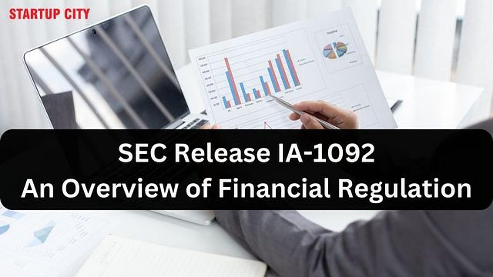

In the evolving landscape of financial services, regulatory frameworks are essential for ensuring the integrity and transparency of market operations. They provide a structured approach to safeguarding investor interests, maintaining fair market conditions, and mitigating the risks associated with financial misconduct. Within this intricate framework, SEC Release IA-1092 holds a significant place in understanding how the U.S. Securities and Exchange Commission (SEC) governs investment advisors and financial planners.

Issued in 1987, SEC Release IA-1092 expands on the Investment Advisers Act of 1940, providing clarity and guidance on the regulatory reach over various professionals offering investment advice. This document is pivotal in recognizing and defining the roles of diverse financial professionals who engage in advisory activities, ensuring that they fall within the regulatory scope of the SEC. The release broadens the understanding of who must register as an investment advisor, encompassing a wider range of roles and business models.

The historical context of SEC Release IA-1092 is rooted in the need to address emerging complexities and nuances in financial advisory practices. As the financial services landscape has transitioned into the age of algorithmic trading and digital financial solutions, the implications of this regulatory document have grown. The framework outlined by IA-1092 is crucial for maintaining ethical standards and legal compliance, particularly for those employing advanced technologies like algorithmic trading strategies.

SEC Release IA-1092 continues to influence the application of securities law, highlighting the interaction between state and federal regulations. Its significance lies not just in historical context but also in ongoing relevance, as the financial industry adapts to rapid technological advancements. Understanding this release is vital for legal professionals and financial practitioners aiming to navigate the complexities of compliance and ensure the trustworthiness and stability of modern financial markets.

## Table of Contents

## Understanding SEC Release IA-1092

SEC Release IA-1092, issued in 1987, serves as a pivotal guidance document, offering crucial clarifications on the applicability of both federal and state laws to investment advisors. The release builds upon the foundational framework established by the Investment Advisers Act of 1940, significantly expanding its regulatory scope to encompass a wider array of professionals. This expansion aims to address the evolving nature of the financial advisory industry and ensure comprehensive oversight.

A key aspect of IA-1092 is its inclusion of various professional roles that were not previously under stringent regulatory scrutiny. Notably, it outlines roles for pension consultants, advisors to athletes and entertainers, and firms endorsing or recommending other investment advisors. By bringing these professionals and entities under the purview of the Investment Advisers Act, the SEC seeks to provide a consistent regulatory environment that ensures accountability and transparency across diverse advisory services.

Examining the definitions and obligations articulated in IA-1092 reveals the nuanced compliance expectations necessary for modern investment advisors. The document delineates criteria for determining who qualifies as an investment advisor, emphasizing activities that constitute providing advice about securities as a regular part of one's business and receiving compensation for such advice. These criteria were broadened to encompass a wider range of advisory activities, thereby closing gaps that might have been exploited previously due to the narrower definitions within the original 1940 Act.

Investment advisors are required to adhere to several key obligations to align with IA-1092's provisions. These include the necessity for registration with the SEC or relevant state authorities, adherence to fiduciary duty obligations—requiring advisors to act in the best interests of their clients—and maintaining high standards of disclosure and transparency with respect to any potential conflicts of interest.

By meticulously defining the roles and compliance obligations of investment advisors, SEC Release IA-1092 establishes a comprehensive framework that modernizes the regulatory approach to financial advising. It ensures a broader, more inclusive application of regulations designed to protect investors and maintain the integrity of the financial advisory industry. Through these clarifications, IA-1092 provides a solid foundation for understanding current regulatory expectations and assists professionals in navigating compliance challenges effectively.

## Implications for Investment Advisors and Financial Planners

SEC Release IA-1092 establishes a comprehensive framework that clarifies the criteria for whether professionals must register as investment advisors under SEC regulations. The release expands the scope of the Investment Advisers Act of 1940 by broadening the range of activities and roles that are subject to regulatory oversight. This includes a variety of professionals who, although they might not identify primarily as investment advisors, offer financial planning and investment advice as a significant component of their service offerings.

One of the pivotal aspects of IA-1092 is its definition of what constitutes an investment advisor. This definition extends beyond traditional roles to include pension consultants, advisors to athletes and entertainers, and those who provide advice on securities as part of financial planning services. This encompasses a wider array of professionals, underscoring the necessity for these individuals to comply with federal regulations when their activities align with advising on investments.

Compensation models also play a crucial role in determining the requirement for registration. IA-1092 specifies that individuals receiving compensation for providing advice on securities are categorized as investment advisors. Here, compensation is broadly construed to include any economic benefit, direct or indirect, that results from the adviser relationship. This includes, but is not limited to, explicit fees, commissions, or other forms of remuneration tied to the advisory services rendered.

Moreover, individuals who integrate investment advice within their regular business operations, even if this is not their primary function, fall under the SEC’s regulatory jurisdiction. This stipulation means that professionals who might engage partially or incidentally in providing investment guidance are still required to adhere to the registration and compliance protocols as outlined by the SEC. The overarching goal is to ensure accountability and protect clients by uniformly applying regulations across various service providers who influence investment decisions.

The implications of IA-1092 emphasize the SEC’s commitment to maintaining a fair and transparent market environment. By requiring a broader spectrum of professionals to register as investment advisors, IA-1092 not only reinforces regulatory compliance but also enhances consumer protection by ensuring that individuals providing investment advice are subject to oversight that promotes ethical practices and accountability.

## Impact on Algorithmic Trading and Modern Financial Solutions

As technology evolves, [algorithmic trading](/wiki/algorithmic-trading) has become a significant part of the securities industry. It involves the use of complex algorithms to execute trading strategies at speeds and frequencies that are impossible for human traders. Investment advisors increasingly rely on algorithmic solutions to optimize their trading operations, provide faster execution, and minimize human errors.

However, the integration of algorithmic trading into investment strategies introduces new regulatory challenges. SEC Release IA-1092 requires investment advisors employing algorithmic trading strategies to adhere to established regulatory standards to ensure ethical and compliant operations. This adherence ensures that the rapid transaction capabilities provided by these algorithms do not compromise the integrity and transparency of the market.

One of the critical aspects of IA-1092 is its emphasis on transparency and accountability. Advisors must maintain robust recordkeeping and reporting practices to comply with these principles. This requirement helps mitigate risks associated with high-frequency trading and potential conflicts of interest. It also reassures clients and regulators that algorithmic methodologies do not lead to manipulative practices or unfair market advantages.

Furthermore, the SEC's focus on algorithmic trading highlights the importance of implementing effective risk management strategies. Advisors must evaluate the robustness of their trading algorithms regularly, ensuring they operate within the bounds of regulatory standards and market norms. They must also maintain controls to prevent unauthorized trading activities and ensure the accuracy of the algorithm's outputs.

In the era of digital transformation, maintaining transparency and accountability becomes even more crucial. By setting expectations for ethical trading set by IA-1092, the SEC aims to safeguard market stability, protecting investors from the potentially adverse effects of uncontrolled algorithmic activities. This regulatory oversight fosters an environment where innovation in financial technology can thrive without compromising the fundamental principles of fair market operations.

## Relevance to Securities Law

SEC Release IA-1092 serves as a critical document in shaping the landscape of securities law by elucidating the interplay between state and federal oversight over investment advisors. The guidance clarifies which entities fall under the SEC's purview and which remain subject to state regulation, thereby demarcating the boundaries of regulatory authority. This precise delimitation ensures that investment advisors comply with both federal and state laws when offering financial advisory services, significantly affecting how these services are administered across the United States.

The release sets a precedent by expanding the definition of “investment advisor” to include a wide range of professionals who might not traditionally be classified under this category. This expansion ensures that individuals or entities providing investment advice in various capacities—even if their primary business is outside the traditional scope of financial services—are brought within the regulatory framework of the SEC. Consequently, advisors must be acutely aware of the specific requirements they must meet at both state and federal levels, ranging from registration obligations to disclosure requirements.

Legal professionals and financial entities are offered a clearer framework for compliance, as SEC Release IA-1092 provides insights into the applicable legal standards across different jurisdictions. This direction is vital for understanding how advice given by investment professionals is monitored and for ensuring that these advisors operate within the legal confines set by both state and federal authorities. As a result, the release aids in maintaining consistency in regulatory practices across states, supporting a comprehensive and cohesive securities law framework that enhances market integrity and investor protection.

In summary, SEC Release IA-1092 not only clarifies the distribution of regulatory responsibilities between state and federal entities but also establishes a fundamental basis for the governance of modern investment advisory practices, ensuring that advisors nationwide adhere to a uniform set of legal and ethical guidelines.

## Conclusion

SEC Release IA-1092 remains a fundamental component of the regulatory landscape for investment advisors and financial planners. Its detailed provisions continue to serve as a critical guide for ensuring that professionals in the financial services industry align with both federal and state regulatory expectations. By clearly defining the scope of individuals and entities that qualify as investment advisors, IA-1092 has significantly broadened the reach of regulatory oversight, thereby fostering an environment of greater transparency and accountability.

In an age where technology is deeply integrated into the fabric of financial transactions and investment strategies, the foundational principles outlined in IA-1092 are more relevant than ever. The document's emphasis on compliance helps safeguard market integrity, which, in turn, bolsters investor trust. As we witness rapid advancements such as algorithmic trading and digital financial solutions, the guidelines established by IA-1092 provide a robust framework for adapting to these changes while maintaining the regulatory standards and ethical considerations that are paramount to the health of the financial ecosystem.

Understanding IA-1092's provisions not only helps professionals avoid legal pitfalls but also supports the broader goals of financial regulation—namely, protecting investors and ensuring the smooth operation of markets. As the financial services industry continues to evolve, IA-1092 stands as a testament to the enduring need for regulatory clarity and consistency, offering guidance that secures both the present and future of financial market integrity.

## References & Further Reading

[1]: Schoenfeld, H. (1988). ["Regulation of Investment Advisers—The SEC Broadens Its Interpretation of the Investment Advisers Act of 1940 (SEC Release IA-1092)"](https://www.ijonmes.net/index.php/ijonmes/article/view/379/0). St. John's Law Review, 61(2), Article 2.

[2]: ["Algorithmic Trading: Winning Strategies and Their Rationale"](https://www.wiley.com/en-us/Algorithmic+Trading%3A+Winning+Strategies+and+Their+Rationale-p-9781118746912) by Ernie Chan

[3]: SEC. "The Investment Advisers Act of 1940." Retrieved from the [SEC Official Website](https://www.sec.gov/rules-regulations/statutes-regulations).

[4]: ["Securities Law and Regulation of Financial Services"](https://papers.ssrn.com/sol3/papers.cfm?abstract_id=4765546) by David G. Glickman

[5]: Lo, A. W., & Hasanhodzic, J. (2010). ["The Evolution of Technical Analysis: Financial Prediction from Babylonian Tablets to Bloomberg Terminals"](https://archive.org/details/evolutionoftechn0000loan).