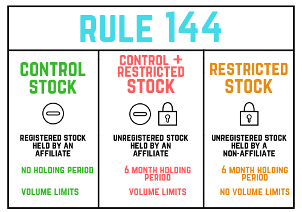

The world of securities trading is underpinned by a complex matrix of regulations designed to uphold market integrity and transparency. Within this framework, SEC Rule 144 is crucial in overseeing the sale of restricted and control securities. These categories of securities are generally linked to significant shareholdings, where potential for market manipulation and insider trading is particularly pronounced. Rule 144 provides specific conditions under which these securities can be sold, aiming to protect investors and maintain orderly markets.

In the modern financial landscape, characterized by the rapid rise of algorithmic trading and digital finance mechanisms, comprehension of such regulatory measures is more vital than ever. Algorithmic trading, which involves the use of pre-programmed instructions for executing trades at frequencies and speeds far beyond human capability, necessitates strict adherence to Rule 144. The rule’s requirements regarding holding periods and volume limitations must be integrated into trading algorithms to ensure compliance and to optimize trading strategies.



Moreover, the advent and burgeoning popularity of cryptocurrencies and digital securities introduce new dimensions to these regulations. While cryptocurrencies are not currently categorized as securities under Rule 144, any digital assets offering dividends or interest could potentially fall within its purview, depending on regulatory developments. This evolving digital asset landscape further underscores the importance of maintaining robust regulatory knowledge and preparedness.

This article will provide an in-depth examination of SEC Rule 144, focusing on its implications for holding periods and the conditions necessary for compliance. It will also explore the intersection of these regulations with the technology-driven advances in trading practices and digital asset management. By the conclusion, readers will gain a comprehensive understanding of how to navigate the intricate regulatory environment governing modern securities trading, ensuring both legal compliance and strategic advantage.

## Table of Contents

## Understanding SEC Rule 144

SEC Rule 144 is essential in the regulation and sale of restricted and control securities in the U.S. financial markets. It was established by the Securities and Exchange Commission (SEC) to facilitate market transparency and fairness by delineating the conditions under which these securities can be sold. At its core, Rule 144 provides a "safe harbor" for the sale of securities that might otherwise be restricted due to their association with insiders or significant shareholdings, often referred to as control securities.

Originally, Rule 144 was crafted to curb insider trading by outlining explicit criteria for public sales of restricted stocks, which are typically acquired through private placements and other non-public offerings, without needing to submit a full registration statement. This regulatory oversight ensures that insider information is not unfairly leveraged, upholding market integrity.

Key to the rule is the requirement of compliance with specific holding periods. The imposed holding period is essential as it ensures a buffer time before restricted securities can enter the public market, helping stabilize share prices and allowing the market to absorb the potential effects of releasing substantial shares. For securities issued by publicly reporting companies, the holding period is generally six months. Conversely, securities from non-reporting entities demand a longer holding period of one year.

Transparency is another cornerstone of Rule 144. It mandates sufficient public information about the issuer, enabling potential buyers to make informed investment decisions. This requirement serves to maintain a level playing field, where all market participants have access to essential data about securities' financial health and operational context.

Additionally, Rule 144 serves as an exemption to the typically lengthy registration process required for the sale of securities. When specific criteria are met, sellers can bypass this process, facilitating more fluid market transactions. This exemption is contingent on compliance with the rule's conditions, such as the holding periods, [volume](/wiki/volume-trading-strategy) limitations, and standard trading practices.

Understanding SEC Rule 144 is crucial for market participants, as it directly impacts the strategy and timing of securities sales. By adhering to these regulations, traders can optimize their market activities while ensuring compliance with legal and ethical standards.

## Detailed Look at Holding Periods Under Rule 144

Holding periods under SEC Rule 144 are essential for determining the legal timeframe for selling restricted and control securities. These periods are designed to balance corporate insider interests and protect public investors by ensuring that significant shareholdings do not suddenly disrupt market stability. The distinction between reporting and non-reporting companies is fundamental in determining the applicable holding period.

For securities issued by companies that are subject to reporting requirements under the Securities Exchange Act of 1934, Rule 144 mandates a minimum holding period of six months. These companies are typically considered to provide sufficient ongoing disclosure, thereby warranting a shorter holding period. The condition aims to provide investors in these securities adequate time to access critical material information, ensuring informed decision-making.

In contrast, for non-reporting companies—those not obligated to file reports with the SEC—the required holding period extends to one year. This longer holding period reflects the reduced availability of information about a company that does not regularly report its financial and operational position, thus necessitating a more cautious approach to the resale of its securities. The extended period aims to safeguard investors and the market against potential [volatility](/wiki/volatility-trading-strategies) arising from less transparent market conditions.

The enforcement of these holding periods is vital in promoting long-term investment stability. By mandating that investors maintain their holdings for a set duration before sale, Rule 144 aims to mitigate the risks associated with abrupt inflows of shares into the market, which can lead to price distortion and uncertainty.

For traders, understanding and effectively planning around these holding periods is crucial for regulatory compliance and strategic financial management. Such knowledge allows them to time their transactions effectively, maximize profit while minimizing legal risks, and align trading strategies with market conditions. By ensuring adherence to Rule 144’s holding period requirements, traders can optimize their trading outcomes and contribute to market integrity.

## Conditions that Define Rule 144 Compliance

SEC Rule 144 establishes five principal conditions that must be satisfied for the sale of restricted or control securities, ensuring both legal compliance and market transparency.

1. **Compliance with the Holding Period**: The first condition mandates adherence to specific holding periods. For securities issued by reporting companies, the minimum holding period is six months. Non-reporting companies require a holding period of at least one year. These stipulated durations ensure market stability by allowing time for investor information dissemination before significant shareholder transactions.

2. **Availability of Sufficient Public Information**: The issuing company must provide detailed public information to oversee securities accurately. This requirement means that the company must be current in its reporting obligations under the Securities Exchange Act of 1934. The provision of adequate information helps investors make informed decisions and maintains transparency within the market.

3. **Volume Restrictions**: Rule 144 restricts the number of securities an affiliate can sell within any three-month period. For equity securities, this limit is the greater of 1% of the outstanding shares of the same class being sold or the average weekly trading volume of the said securities during the four weeks preceding the sale. Such volume restrictions mitigate potential market disruptions from large-scale disposals by major shareholders.

4. **Standard Trading Conditions**: All sales must occur through broker transactions or directly with a market maker. This condition ensures the orderly execution of trades and reduces the potential for manipulative practices. By maintaining standard trading conditions, Rule 144 upholds fair and transparent trading environments.

5. **Notice of Proposed Sale**: Affiliates must file a Form 144 with the SEC at the time of the sale if the securities value exceeds $50,000 or 5,000 shares over three months. This filing requirement offers an additional layer of oversight by alerting regulatory bodies of significant trading activity from affiliates, ensuring market integrity.

By fully understanding these conditions, traders can effectively strategize the sale of restricted and control securities. Aligning with Rule 144 not only safeguards against legal infringements but also streamlines profitable trading aligned with regulatory frameworks.

## Impact of Rule 144 on Algorithmic Trading

Algorithmic trading has significantly reshaped securities transactions by leveraging computational power to execute orders at high speed and frequency. This transformation necessitates a thorough understanding of SEC Rule 144's implications on such trading strategies. Rule 144 establishes stringent conditions for selling restricted or control securities, which must be considered when developing algorithms to ensure compliance.

Firstly, the conditions related to volume and timing play critical roles. The rule enforces volume limitations, commonly known as the "Dribble Out" rule, which constrains the number of securities that can be sold within a three-month period. For [algorithmic trading](/wiki/algorithmic-trading) systems, integrating these limitations is essential to prevent breaching compliance thresholds. The formula for calculating the maximum allowable sale volume $(M)$ is:

$$
M = \min\left(\text{Value}_\text{Last 4 Weeks}, \frac{\text{Outstanding Shares}}{100}\right)
$$

where $\text{Value}_\text{Last 4 Weeks}$ refers to the total transaction volume of the security over the previous four weeks.

Time-related conditions also require that algorithms accommodate holding periods before securities can be legally sold. For instance, securities from reporting companies require a minimum holding period of six months, whereas those from non-reporting companies require one year.

Furthermore, transparency norms mandated by Rule 144 demand that sufficient public information about the issuer is available before the sale of securities. This requires programmers to include checkpoints within trading algorithms to verify the availability of pertinent data, thus ensuring informed decision-making and regulatory compliance.

For programmers and traders focused on algorithmic strategies, integrating these rule-based tactics is vital. This process involves coding algorithms capable of dynamically assessing market conditions and available [liquidity](/wiki/liquidity-risk-premium), while adhering to Rule 144's limitations. The following Python pseudo-code illustrates a basic setup for a compliance check within an algorithm:

```python
def check_rule_144_compliance(security, last_4_week_volume, outstanding_shares):
    max_sale_volume = min(last_4_week_volume, outstanding_shares / 100)

    if security.holding_period_eligible() and security.public_information_available():
        if security.intended_sale_volume <= max_sale_volume:
            return "Compliant"
        else:
            return "Exceeds Permissible Volume"
    return "Non-Compliant: Holding period or Info Deficit"

# Example usage
security = Security(...)
compliance_status = check_rule_144_compliance(security, 10000, 5000000)
print(compliance_status)
```

Algorithmic systems must be adaptive enough to process these rule-based criteria continuously, avoiding penalties and ensuring seamless regulatory adherence. Successful traders understand that compliance with Rule 144 is not only a legal obligation but also a strategic necessity, enabling them to optimize operations and enhance profitability. By integrating these considerations into algorithmic designs, traders can navigate the complexities of securities regulations effectively and efficiently.

## Rule 144 in the Era of Cryptocurrencies

SEC Rule 144, a regulation primarily concerned with the sale of restricted and control securities, traditionally did not encompass cryptocurrencies. However, the regulatory environment is evolving rapidly as the line between traditional securities and digital tokens blurs. Currently, cryptocurrencies like Bitcoin and Ethereum, which operate as decentralized assets without an issuer promising returns or profits, are not classified as securities under Rule 144. Nonetheless, the situation changes when tokens are asset-backed or offer dividends or interests; these tokens could potentially be viewed as securities, subjecting them to compliance requirements under SEC Rule 144.

The Securities and Exchange Commission (SEC), recognizing the growing influence of digital tokens and blockchain technology, has intensified its scrutiny of crypto projects. This heightened oversight is particularly significant for tokens initially issued via Initial Coin Offerings (ICOs) or Security Token Offerings (STOs), where the promise of profit derived from the efforts of others could classify these tokens as securities. Once deemed a security, such tokens must comply with pertinent regulations, including Rule 144, which dictates the holding period and conditions for their resale without registration. These conditions may involve sufficient public information about the issuer, adherence to volume limitations, and standard trading conditions.

Token issuers and investors must be proactive in their understanding of how these securities laws might apply to digital assets. For instance, if an asset-backed token entitles its holder to fractional ownership of a tangible asset, similar to a stock or bond offering dividends, it likely falls under securities considerations. The regulatory landscape is fluid, and the SEC continues to adapt its framework to accommodate the unique characteristics of digital tokens.

Prospective investors and issuers should remain vigilant, staying informed about potential regulatory amendments that could have significant implications for crypto assets. By doing so, they can anticipate compliance needs and strategically plan the issuance and trading of digital tokens, aligning with both current and forthcoming regulations. As the digital finance sphere evolves, understanding these dynamics will be crucial for market participants aiming to navigate the complexities of securities law effectively.

## Exceptions and Exemptions Under Rule 144

Rule 144 provides specific exceptions and exemptions that are vital for non-affiliated sellers, allowing them to exercise significant flexibility in selling their securities. The primary exemption under Rule 144 applies to sellers who have held restricted securities for over one year. For these traders, sales can proceed without the customary restrictions that apply to control persons or affiliates, meaning they are not bound by Rule 144's conditions concerning volume limitations, filing requirements, and other stipulated conditions.

This one-year holding period stipulation empowers non-affiliated holders by enabling them to liquidate their securities freely in the market, provided their identity as non-affiliates remains unchanged for a minimum of three months preceding the sale. In regulatory terms, a non-affiliate is someone who does not have control over the issuing company, typically defined as having no significant decision-making impact or stake capable of influencing the organization's operations.

For traders, understanding these exemptions provides an opportunity to leverage strategic sales without the intricate constraints posed by Rule 144. When a seller falls within this exemption, they bypass numerous compliance provisions otherwise obligatory under the regulation. Strategic planning around these exemptions can result in optimized trading decisions, maximizing profitability by timing the sale of securities when market conditions are most favorable.

Additional precision is required when considering the potential application of these exemptions. Non-affiliated sellers must remain vigilant to avoid inadvertently regaining affiliate status, which could re-impose the full spectrum of Rule 144 restrictions. Furthermore, familiarity with the nuances of this rule also aids traders in navigating other regulatory landscapes within securities law, underscoring the importance of informed trading strategies.

For example, a Python function could be used to calculate whether a security can be sold following the exemption regulations:

```python
from datetime import datetime, timedelta

def can_sell_unrestricted_sale(purchase_date, is_affiliate=False):
    current_date = datetime.now()
    one_year_threshold = purchase_date + timedelta(days=365)

    if is_affiliate:
        return False  # Affiliates must comply with additional Rule 144 conditions.

    return current_date >= one_year_threshold

# Test the function
purchase_date = datetime(2022, 8, 15)
is_affiliate = False

print("Can sell unrestricted:", can_sell_unrestricted_sale(purchase_date, is_affiliate))
```

This illustrative Python snippet checks whether a user can sell securities without restriction by assessing the holding period and affiliate status. By integrating computational tools like this, traders can make decisions swiftly and in compliance with prevailing legal requirements.

The awareness of such regulatory exemptions is indispensable for informed trading, ensuring that sellers can capitalize on opportunities without contravening established securities laws. These exemptions not only elucidate the flexibility within Rule 144 but also highlight the necessity of a comprehensive understanding of securities regulations for optimal trading practices.

## Conclusion

Navigating SEC Rule 144 requires a comprehensive understanding of securities law, market dynamics, and regulatory compliance. Traders must remain vigilant and well-informed, especially those who employ algorithmic systems, as adhering to these regulations is crucial for avoiding legal pitfalls while optimizing trading outcomes. The rapidly evolving digital finance landscape further underscores the need for continuous awareness of regulatory changes, which may also have implications for cryptocurrencies.

Algorithmic trading strategies must be carefully calibrated to ensure compliance with Rule 144, integrating key requirements such as holding periods, volume restrictions, and public information availability into their operational frameworks. Moreover, in the context of digital assets, staying informed about potential regulatory shifts remains crucial, as the SEC continues to expand its scrutiny over tokenized securities and digital financial instruments.

A strategic approach that incorporates regulatory compliance not only enhances market success but also promotes sustainable trading practices. By understanding and planning within the regulatory framework set forth by Rule 144, traders and investment professionals can better navigate the complex securities landscape, positioning themselves advantageously in the market. As the financial environment continues to evolve, maintaining a proactive stance on regulatory changes will be vital for sustaining trading efficacy and legal conformity.

## References & Further Reading

[1]: Schneider, J. (2012). ["Fundamentals of Algorithmic Trading"](https://assets.cambridge.org/97811070/91146/frontmatter/9781107091146_frontmatter.pdf). Pearson Education.

[2]: Womack, K. L., Thompson, G. (2008). [“SEC Rule 144: Selling Restricted and Control Securities.”](https://www.sec.gov/about/reports-publications/investorpubsrule144) U.S. Securities and Exchange Commission.

[3]: Malkiel, B. G. (2015). ["A Random Walk Down Wall Street"](https://www.academia.edu/10850809/A_Random_Walk_Down_Wall_Street_The_Time_Tested_Strategy_for_Successful_Investing). W. W. Norton & Company.

[4]: Shapiro, S. (2017). ["Digital Finance: How FinTech Companies Are Transforming the Financial Services Industry."](https://tential.com/insights/the-rise-of-digital-banking-how-technology-is-transforming-financial-services) CFA Institute.

[5]: Lhabitant, F.-S. (2004). ["Hedge Funds: Quantitative Insights"](https://www.wiley.com/en-us/Hedge+Funds%3A+Quantitative+Insights-p-9780470687772). John Wiley & Sons.