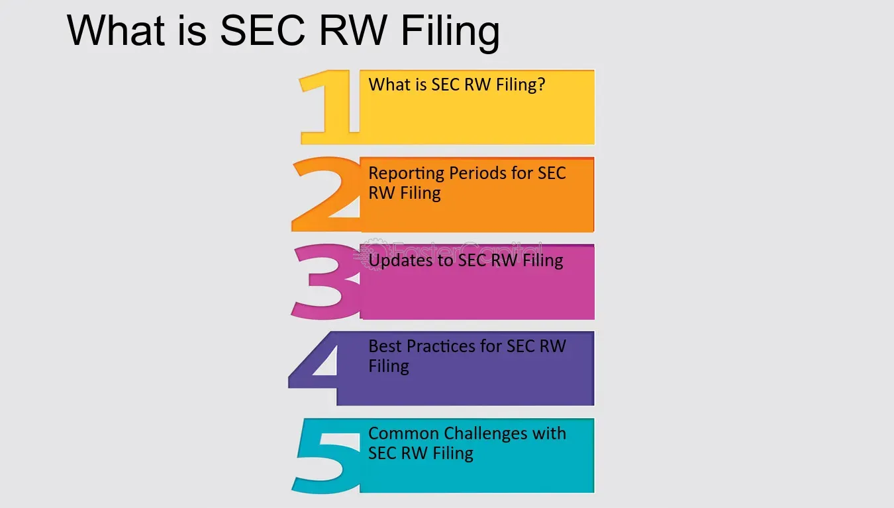

## Table of Contents

## What is an SEC RW Filing?

An SEC RW Filing is a document that companies need to file with the U.S. Securities and Exchange Commission (SEC) when they want to withdraw a registration statement. A registration statement is like a big report that companies fill out when they want to sell stocks or bonds to the public. If a company decides not to go through with selling these securities, they have to tell the SEC by filing an RW form.

The RW filing is important because it lets the SEC and investors know that the company is no longer planning to sell the securities mentioned in the original registration statement. This helps keep everyone informed and makes sure the information about the company's plans is up to date. Once the RW filing is submitted, the company's registration statement is considered withdrawn, and they can't use it anymore to sell securities.

## Why is an RW Filing important for investors?

An RW Filing is important for investors because it tells them that a company has changed its mind about selling new stocks or bonds. When a company decides not to go ahead with a sale, it files an RW with the SEC. This filing lets investors know that they should not expect new securities from that company anytime soon. It helps investors stay informed about what the company is doing, so they can make better decisions about their investments.

If investors don't know about the RW Filing, they might keep waiting for new stocks or bonds that will never come. This could lead to confusion and bad investment choices. By having the RW Filing, investors can adjust their plans and look for other investment opportunities instead. Keeping up with these filings helps investors stay on top of changes in the market and manage their money wisely.

## How does an RW Filing differ from other SEC filings?

An RW Filing is different from other SEC filings because it specifically tells the SEC that a company no longer wants to go ahead with selling new stocks or bonds. When a company first wants to sell securities, it files a registration statement. If it changes its mind, it uses an RW Filing to withdraw that statement. This is different from other filings, like a 10-K or 10-Q, which are annual or quarterly reports about a company's financial health, or an 8-K, which reports important events that shareholders should know about.

Other SEC filings provide ongoing information about a company's operations, financial performance, or significant changes. For example, a 10-K gives a detailed yearly summary, while a 10-Q provides updates every three months. An 8-K might tell investors about things like mergers, acquisitions, or leadership changes. In contrast, an RW Filing is a one-time notice that a specific plan to sell securities has been canceled. It doesn't give new information about the company's performance or future plans, just that one particular action won't happen.

## What information is typically included in an RW Filing?

An RW Filing is a short document that tells the SEC that a company is not going ahead with selling new stocks or bonds. It includes the company's name and the date of the filing. It also has the file number of the original registration statement that the company is withdrawing. This helps the SEC keep track of which plans have been canceled.

The RW Filing also explains why the company is withdrawing the registration statement. This might be because the company changed its mind about selling securities, or because it found a different way to raise money. The filing is important because it keeps the SEC and investors informed about what the company is doing. It makes sure everyone knows that the company won't be selling those securities anymore.

## Who is required to file an RW Filing with the SEC?

Any company that has filed a registration statement with the SEC to sell stocks or bonds must file an RW Filing if they decide not to go ahead with the sale. This rule applies to all kinds of companies, whether they are big or small, new or established. The company has to let the SEC know by filing the RW form that they are withdrawing their plans to sell securities.

The RW Filing is important because it keeps the SEC and investors up to date. If a company decides not to sell securities, investors need to know so they can adjust their investment plans. The SEC needs to know so they can keep their records straight. By filing the RW, the company makes sure everyone is informed about their decision to not go forward with selling stocks or bonds.

## What are the deadlines for submitting an RW Filing?

A company doesn't have a strict deadline for submitting an RW Filing to the SEC. They can file it whenever they decide not to go ahead with selling stocks or bonds. It's important for the company to file the RW as soon as they know they won't be selling the securities, so the SEC and investors can stay informed.

The main thing is that the company should file the RW before the SEC officially declares the registration statement effective. If the registration statement becomes effective, it means the company can start selling the securities. So, if the company still wants to withdraw, they need to file the RW before that happens. This helps keep everything clear and up to date for everyone involved.

## How can one access RW Filings submitted to the SEC?

You can access RW Filings submitted to the SEC by using the SEC's online database called EDGAR. Just go to the SEC's website and look for the EDGAR search tool. Once you're there, you can search for the company you're interested in by typing its name into the search bar. After you find the company, you can look through its filings and find the RW Filing. It will be listed with other documents the company has filed with the SEC.

RW Filings are important because they tell you that a company decided not to sell new stocks or bonds. If you're an investor, it's good to know about these filings so you can stay up to date on what the company is doing. By checking EDGAR regularly, you can keep track of any changes in a company's plans and make better decisions about your investments.

## What are the common mistakes to avoid when preparing an RW Filing?

When preparing an RW Filing, it's important to make sure you include all the right information. A common mistake is forgetting to include the file number of the original registration statement that you're withdrawing. This number helps the SEC keep track of which plans have been canceled. Another mistake is not explaining clearly why you're withdrawing the registration statement. The SEC and investors need to know the reason, so it's important to be clear and honest about it.

Another thing to watch out for is filing the RW too late. You should file it as soon as you know you won't be selling the securities. If you wait too long, it can cause confusion for investors and the SEC. Also, make sure you file the RW before the SEC declares your registration statement effective. If you miss this, you might not be able to withdraw your plans to sell securities. By avoiding these mistakes, you can make sure your RW Filing is done correctly and keeps everyone informed.

## How has the requirement for RW Filings evolved over time?

The requirement for RW Filings has stayed pretty much the same over time. The SEC has always wanted companies to tell them if they change their mind about selling stocks or bonds. When a company decides not to go ahead with a sale, they have to file an RW to let the SEC know. This helps keep things clear and makes sure investors know what's going on. The main rules about RW Filings have been in place for a long time, and they haven't changed a lot.

But the way companies file RW Filings has gotten easier with technology. In the past, companies had to send paper documents to the SEC. Now, they can file everything online using the EDGAR system. This makes it quicker and easier for companies to tell the SEC they're not going to sell securities. Even though the basic rules haven't changed much, the process of filing has become simpler and more efficient over time.

## What are the potential penalties for non-compliance with RW Filing requirements?

If a company doesn't file an RW Filing when they need to, they could get in trouble with the SEC. The SEC might make them pay a fine. The fine could be a lot of money, depending on how bad the mistake was and if the company did it on purpose. The SEC wants to make sure companies follow the rules, so they take it seriously when a company doesn't file an RW when they should.

Not filing an RW can also cause problems for investors. If investors don't know that a company isn't going to sell new stocks or bonds, they might make bad investment choices. This can hurt their money and trust in the company. So, it's important for companies to file the RW on time to keep everyone informed and avoid these problems.

## How do RW Filings impact a company's financial transparency?

RW Filings help keep a company's financial plans clear and open. When a company decides not to sell new stocks or bonds, they file an RW to let everyone know. This means investors and the SEC can see what the company is doing and can trust that the company is being honest about its plans. If a company didn't file an RW, people might think the company is still going to sell securities, which could cause confusion and make it hard for investors to trust the company.

By filing an RW, a company shows that it cares about being transparent. It tells everyone that the company is not going ahead with a sale, which helps investors make better choices about their money. This kind of openness is important for keeping a good relationship with investors and the SEC. It shows that the company wants to be clear about its financial decisions and keep everyone in the loop.

## What advanced analytics can be applied to RW Filings to gain deeper insights?

Advanced analytics can help us learn more about RW Filings by looking at patterns and trends over time. For example, we can use data analysis to see how often companies in certain industries are withdrawing their plans to sell stocks or bonds. This can show us if there are any big changes happening in the market or if certain types of companies are having a harder time raising money. By using [machine learning](/wiki/machine-learning), we can even predict when a company might file an RW based on their past behavior and the current market conditions. This helps investors and analysts stay one step ahead and make smarter decisions.

Another way to use advanced analytics is to compare RW Filings with other financial reports from the same company. By looking at the company's 10-K or 10-Q reports, we can see if there were any financial problems or changes that might have led to the decision to withdraw the securities sale. Text analysis can also be used to look at the reasons given in the RW Filings and see if there are common themes or words that companies use when they decide not to go ahead with a sale. This can give us a better understanding of why companies make these decisions and help us spot any red flags early on.

## References & Further Reading

[1]: Hendershott, T., Jones, C. M., & Menkveld, A. J. (2011). ["Does Algorithmic Trading Improve Liquidity?"](https://onlinelibrary.wiley.com/doi/full/10.1111/j.1540-6261.2010.01624.x) The Review of Financial Studies, 24(5), 1595-1624.

[2]: Securities and Exchange Commission. ["Fast Answers: IPO Registration"](https://www.sec.gov/search-filings).

[3]: MacKinnon, D. P., Krull, J. L., & Lockwood, C. M. (2000). ["Equity Market Quality: A Review of Recent Trends."](https://pubmed.ncbi.nlm.nih.gov/11523746/) Finance and Economics Discussion Series Divisions of Research & Statistics and Monetary Affairs, Federal Reserve Board, Washington, D.C.

[4]: Securities and Exchange Commission. ["Regulation Algorithmic Trading"](https://www.sec.gov/files/Algo_Trading_Report_2020.pdf).

[5]: De Prado, M. L. (2018). ["Advances in Financial Machine Learning"](https://www.amazon.com/Advances-Financial-Machine-Learning-Marcos/dp/1119482089) Wiley.