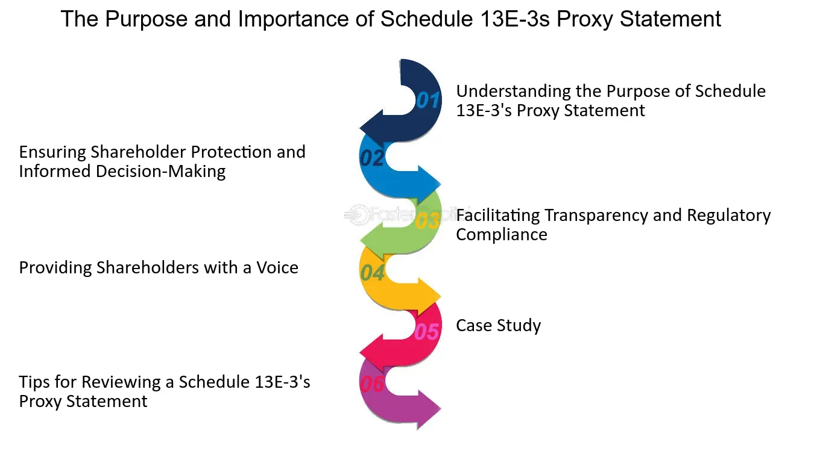

## Table of Contents

## What is SEC Schedule 13E-3?

SEC Schedule 13E-3 is a form that companies must file with the U.S. Securities and Exchange Commission (SEC) when they are planning a "going private" transaction. This type of transaction happens when a publicly traded company wants to become a private company, which means its shares will no longer be traded on a public stock exchange. The form is important because it helps protect the interests of the company's shareholders by making sure they have all the information they need to decide whether to sell their shares or not.

The form includes details about the transaction, like who is involved, how it will happen, and what it means for shareholders. It also explains the reasons behind the decision to go private and any potential conflicts of interest. By requiring this form, the SEC makes sure that the process is fair and transparent, giving shareholders a clear picture of the situation so they can make informed choices about their investments.

## Why was SEC Schedule 13E-3 created?

SEC Schedule 13E-3 was created to protect shareholders when a company decides to go private. Going private means a company that used to sell its shares on the stock market will stop doing that. This can be a big change for people who own the company's shares. The SEC wanted to make sure that shareholders know exactly what is happening and why, so they can decide what to do with their shares.

The form makes sure that the company gives all the important information about the going private plan. This includes who is involved, how the plan will work, and what it means for the shareholders. By having this rule, the SEC helps make sure that the process is fair and open. Shareholders can then make smart choices about whether to keep their shares or sell them.

## Who needs to file SEC Schedule 13E-3?

Any company that is planning to go private needs to file SEC Schedule 13E-3. Going private means the company will no longer sell its shares on the stock market. The company has to tell the SEC about their plan so that the people who own shares can know what is happening.

The form is important because it makes sure the company shares all the details about the going private plan. This includes who is involved, how it will happen, and what it means for the shareholders. By filing this form, the company helps make sure that the process is fair and open for everyone who owns shares.

## What are the key components of SEC Schedule 13E-3?

SEC Schedule 13E-3 has important parts that help shareholders understand a company's plan to go private. The form includes details about who is involved in the plan. This means it lists the names of the people or groups that want to buy the company and take it private. It also explains how the plan will work, like the steps the company will take to stop selling its shares on the stock market. This part is crucial because it helps shareholders see the whole process clearly.

Another key part of the form is the reason behind the decision to go private. The company has to explain why they think going private is a good idea. This can include things like wanting more control over the company or believing that being private will help the company grow better. The form also talks about any conflicts of interest. This means it points out if anyone involved in the plan might benefit more than others, which helps shareholders know if the plan is fair. By including all these details, SEC Schedule 13E-3 makes sure shareholders have the information they need to make smart choices about their shares.

## What is the process for filing SEC Schedule 13E-3?

When a company wants to go private, they need to fill out SEC Schedule 13E-3 and send it to the U.S. Securities and Exchange Commission (SEC). First, the company gathers all the important information about their plan. This includes who is involved, how the plan will work, why they want to go private, and any conflicts of interest. They put all this information into the form. It's important that they include everything clearly so shareholders can understand what is happening.

Once the form is ready, the company sends it to the SEC. They usually do this through the SEC's electronic filing system, called EDGAR. The SEC then reviews the form to make sure it has all the needed information. If everything is correct, the SEC will make the form public so shareholders can see it. This helps shareholders decide what to do with their shares. The whole process is designed to be fair and open, giving everyone the information they need to make good choices.

## How does SEC Schedule 13E-3 protect investors?

SEC Schedule 13E-3 helps protect investors by making sure they get all the important details about a company's plan to go private. When a company decides to go private, it means they will stop selling their shares on the stock market. This can be a big change for people who own the company's shares. The form makes sure the company tells investors who is involved in the plan, how it will happen, and why the company wants to go private. This way, investors can see the whole picture and understand what is going on.

By requiring the company to share this information, SEC Schedule 13E-3 helps make the process fair and open. Investors can then decide if they want to keep their shares or sell them based on all the facts. The form also points out any conflicts of interest, which means it shows if anyone involved in the plan might benefit more than others. This helps investors know if the plan is fair. Overall, SEC Schedule 13E-3 gives investors the information they need to make smart choices about their investments.

## What are the deadlines for filing SEC Schedule 13E-3?

When a company wants to go private, they need to file SEC Schedule 13E-3 with the SEC. The main deadline for filing this form is before the company starts buying back its shares or before any other steps are taken to go private. This means the company has to file the form early enough so that shareholders have time to read it and decide what to do with their shares.

There are also rules about how quickly the company has to share the form with shareholders after it's filed. Usually, the company needs to send the form to shareholders within 10 days of filing it with the SEC. This helps make sure that everyone who owns shares gets the information they need to make a good decision about their investment.

## What are the consequences of not filing SEC Schedule 13E-3?

If a company does not file SEC Schedule 13E-3 when they are planning to go private, they can face serious problems. The SEC can take action against the company for not following the rules. This might include fines or other penalties. The SEC wants to make sure that shareholders get all the information they need, so not filing the form is a big deal.

Not filing the form can also hurt the shareholders. Without the form, shareholders won't know about the plan to go private, who is involved, and why it's happening. This makes it hard for them to decide what to do with their shares. They might end up selling their shares without knowing all the facts, which is not fair to them.

## How does SEC Schedule 13E-3 differ from other SEC schedules?

SEC Schedule 13E-3 is different from other SEC schedules because it is used only when a company wants to go private. Going private means the company will stop selling its shares on the stock market. This form makes sure that the company tells shareholders about the plan, who is involved, how it will happen, and why they want to go private. Other SEC schedules, like Schedule 13D or Schedule 14A, are used for different things. Schedule 13D is used when someone owns more than 5% of a company's stock and wants to influence the company. Schedule 14A is used for proxy statements, which are about voting on company matters.

The main difference is that SEC Schedule 13E-3 focuses on protecting shareholders during a going private transaction. It makes sure shareholders get all the information they need to decide what to do with their shares. Other schedules might give information about ownership changes or voting, but they don't focus on the specific details and fairness of a going private plan like Schedule 13E-3 does.

## What are some common challenges faced when filing SEC Schedule 13E-3?

One common challenge when filing SEC Schedule 13E-3 is making sure all the information is correct and complete. The company has to tell shareholders everything about the plan to go private, like who is involved, how it will happen, and why they want to do it. If they miss any details or make mistakes, the SEC might not accept the form. This can delay the whole process and make it harder for shareholders to get the information they need.

Another challenge is meeting the deadlines. The company has to file the form before they start buying back shares or taking other steps to go private. They also have to send the form to shareholders within 10 days of filing it with the SEC. Keeping track of these deadlines can be tough, especially if the company is busy with other things. If they miss a deadline, it can cause problems and might even lead to penalties from the SEC.

## How has SEC Schedule 13E-3 evolved over time?

SEC Schedule 13E-3 was created to help shareholders when a company wants to go private. Over time, the form has changed to make sure it works better for everyone. In the beginning, the form had basic information about the plan to go private. But as more companies used it, the SEC saw that they needed more details to help shareholders make good choices. So, they added more parts to the form, like explaining why the company wants to go private and pointing out any conflicts of interest.

Today, SEC Schedule 13E-3 is a detailed form that covers a lot more than it used to. It now includes who is involved in the plan, how it will happen, and what it means for shareholders. The SEC keeps updating the form to make sure it protects shareholders as much as possible. This way, people who own shares can understand the plan to go private and decide what to do with their investments.

## What are the best practices for ensuring compliance with SEC Schedule 13E-3?

To make sure a company follows the rules for SEC Schedule 13E-3, it's important to start planning early. The company needs to gather all the information about the plan to go private, like who is involved, how it will happen, and why they want to do it. They should work with lawyers and other experts to make sure everything is correct and complete. It's also a good idea to double-check all the details before sending the form to the SEC. This can help avoid mistakes that might delay the process or cause problems.

Another key practice is to keep track of the deadlines. The company has to file the form before they start buying back shares or taking other steps to go private. They also need to send the form to shareholders within 10 days of filing it with the SEC. Using a calendar or a checklist can help make sure they don't miss any important dates. By planning ahead and being careful, the company can make sure they follow all the rules and help shareholders make good choices about their investments.

## References & Further Reading

[1]: Securities and Exchange Commission. ["Rule 13e-3 — Going Private Transactions By Certain Issuers Or Their Affiliates"](https://www.sec.gov/rules-regulations/staff-guidance/compliance-disclosure-interpretations/going-private-transactions-exchange-act-rule-13e-3-schedule-13e-3). U.S. Securities and Exchange Commission.

[2]: ["Advances in Financial Machine Learning"](https://www.amazon.com/Advances-Financial-Machine-Learning-Marcos/dp/1119482089) by Marcos Lopez de Prado

[3]: Lossen, U. (2014). ["Algorithmic Trading and Regulation: A Cross-Atlantic Perspective on Regulatory Policy"](https://www.eurjchem.com/index.php/eurjchem/article/view/2565) Columbia Business Law Review.

[4]: ["Machine Learning for Algorithmic Trading"](https://github.com/stefan-jansen/machine-learning-for-trading) by Stefan Jansen

[5]: Securities and Exchange Commission. ["SEC Division of Enforcement's Annual Report"](https://www.sec.gov/files/enforcement-annual-report-2020.pdf). U.S. Securities and Exchange Commission.

[6]: Mulherin, J. H., & Boone, A. L. (2000). ["Comparing Acquisitions and Divestitures"](https://www.sciencedirect.com/science/article/pii/S0929119900000109) The Journal of Finance, 55(3), 1241-1279.