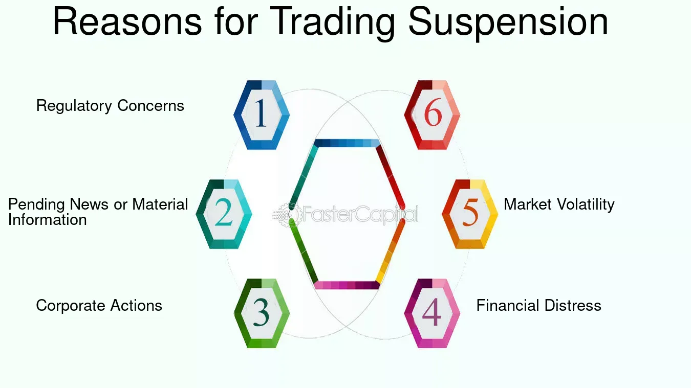

## Table of Contents

## What does it mean when the SEC suspends trading of a stock?

When the SEC suspends trading of a stock, it means that the Securities and Exchange Commission has temporarily stopped people from buying or selling that stock. This usually happens because the SEC thinks there might be something wrong with the company or the way its stock is being traded. They want to protect investors from making decisions based on false or misleading information.

The suspension can last up to 10 business days. During this time, the SEC investigates to find out if there are any problems. If they find issues, they might take further action. If everything seems okay, they will lift the suspension and trading can start again. This process helps keep the stock market fair and safe for everyone.

## What are the common reasons for the SEC to suspend trading?

The SEC might suspend trading of a stock if they think there's something fishy going on. This could be because they've heard rumors or seen news that makes them worried about the company. Maybe the company isn't telling the truth about how it's doing, or someone is spreading false information to trick people into buying or selling the stock.

Another reason could be if the company isn't giving out enough information to the public. The SEC wants companies to be open and honest so that investors can make smart choices. If a company isn't doing this, the SEC might step in and stop trading until they can figure out what's going on.

Sometimes, the SEC also suspends trading if they see a lot of strange activity in the stock's price or trading volume. This could mean someone is trying to manipulate the stock's price, which is against the rules. The SEC wants to stop this kind of behavior to keep the market fair for everyone.

## How long does a typical SEC trading suspension last?

A typical SEC trading suspension lasts up to 10 business days. This time limit gives the SEC a chance to look into any problems they think might be happening with the company or its stock.

During these 10 days, the SEC tries to find out if there's anything wrong. If they find issues, they might take more action. If everything seems okay, they will lift the suspension and let trading start again. This helps keep the stock market safe and fair for everyone.

## Can investors still trade a stock during an SEC suspension?

No, investors cannot trade a stock during an SEC suspension. When the SEC suspends trading, it means that no one can buy or sell that stock until the suspension is over. This is to stop people from making decisions based on information that might not be true or complete.

The SEC does this to protect investors and make sure the market stays fair. If someone tries to trade a stock during a suspension, their order won't go through. They have to wait until the SEC lifts the suspension and allows trading to start again.

## What are the potential impacts of an SEC trading suspension on a company?

When the SEC suspends trading of a company's stock, it can have a big impact on the company. The company might find it harder to get money because investors can't buy its stock during the suspension. This can make it tough for the company to grow or even keep running if it was planning to use that money for important things. Also, the company's reputation can take a hit because people might think there's something wrong with it, even if the SEC just wanted to check things out.

The suspension can also shake up the company's employees and customers. Employees might worry about their jobs and start looking for work elsewhere. Customers might think twice about buying from the company if they're not sure it will be around for a long time. All these things can make it harder for the company to do well and could lead to bigger problems down the road if the SEC finds something seriously wrong.

## How does the SEC decide which stocks to suspend?

The SEC decides which stocks to suspend by looking at different signs that something might be wrong. They might see news or rumors about a company that makes them worried. Or they might notice that the stock's price is moving in a strange way, or that a lot more people are trading it than usual. If the company isn't sharing enough information with the public, that's another reason the SEC might step in. They want to make sure everyone has the right information to make good choices.

When the SEC sees these signs, they start to investigate. They look at all the information they can find to see if there's a real problem. If they think there might be, they can decide to suspend trading to stop people from making decisions based on bad information. This helps keep the market fair and safe for everyone. The SEC tries to act quickly to protect investors, but they also want to make sure they're not stopping trading for no good reason.

## What are some historical examples of SEC trading suspensions?

One famous example of an SEC trading suspension happened with a company called Enron in 2001. Enron was a big energy company, but it turned out they were hiding a lot of money problems. When the SEC found out, they suspended trading of Enron's stock to stop people from making choices based on false information. This was a big deal because Enron was a well-known company, and a lot of people lost money when it collapsed.

Another example is the case of Cynk Technology in 2014. Cynk was a tiny company with almost no business, but its stock price suddenly shot up a lot. The SEC got worried because it looked like someone might be trying to trick people into buying the stock. So, they suspended trading to figure out what was going on. It turned out there was a lot of strange activity, and Cynk's stock was never traded again after the suspension.

These examples show how the SEC steps in to protect investors when they think something isn't right. By stopping trading, they give themselves time to look into the problem and keep the market fair for everyone.

## How can investors identify stocks at risk of SEC suspension?

Investors can spot stocks that might be at risk of an SEC suspension by watching for certain signs. If a company's stock price is jumping around a lot or if there's a sudden big increase in how many shares are being traded, that could be a red flag. Also, if there are rumors or news stories saying the company might be hiding problems or not telling the truth, that's something to watch out for. The SEC might step in if they think the company isn't sharing enough information with the public, so if a company seems to be keeping secrets, it could be at risk.

Another way to identify stocks at risk is to pay attention to how the company is doing overall. If the company is struggling financially or if there are signs of shady behavior, like people trying to manipulate the stock price, the SEC might take a closer look. By keeping an eye on these things, investors can get a sense of which stocks might be in danger of a trading suspension. It's all about staying informed and being careful with where you put your money.

## What steps can a company take to lift an SEC trading suspension?

When a company's stock gets suspended by the SEC, the company needs to work hard to fix any problems the SEC found. They should talk to the SEC and give them all the information they need to show that everything is okay. If the company was hiding information or not telling the truth, they need to start being honest and open. They should also make sure they are following all the rules and laws about sharing information with the public. By doing these things, the company can help the SEC see that it's safe to let people trade the stock again.

If the SEC thinks the company has fixed the problems, they will lift the suspension. This means people can start buying and selling the stock again. But the company needs to keep being honest and following the rules, or the SEC might step in again. It's important for the company to learn from what happened and make sure it doesn't happen again. By working with the SEC and fixing any issues, the company can get back to normal and help its investors feel confident again.

## How does an SEC trading suspension affect the overall market?

When the SEC suspends trading of a stock, it can shake things up in the overall market. People might start to worry about other stocks, too. They might think, "If this company got into trouble, could the same thing happen to others?" This can make the whole market feel a bit nervous. Investors might start selling their stocks, which can make prices go down. It's like when one person in a crowd starts to panic, and then everyone else starts to feel worried too.

But the SEC's job is to keep the market safe and fair. By stopping trading of a stock that might have problems, they are trying to protect everyone. This can actually help calm the market down in the long run. People know that the SEC is watching out for them, and that can make them feel more confident about investing. So, while a trading suspension might cause some short-term worry, it can help keep the market strong and trustworthy in the end.

## What are the legal implications for a company under SEC trading suspension?

When a company's stock is suspended by the SEC, it can face some serious legal issues. The SEC might find that the company broke rules about sharing information or telling the truth. If this happens, the company could get fined a lot of money. The people in charge of the company might also get in trouble. They could be banned from working in the stock market or even go to jail if they did something really bad.

The company might also have to deal with lawsuits from investors who lost money because of the suspension. These investors could say that the company did something wrong and that's why they lost money. This can lead to more legal problems and costs for the company. It's important for the company to work with the SEC and fix any problems quickly to avoid even bigger legal troubles down the road.

## How do international regulations compare to SEC trading suspension practices?

Different countries have their own rules about stopping stock trading, but many work in ways that are similar to the SEC. In the UK, the Financial Conduct Authority (FCA) can suspend trading if they think there's a problem with a company or its stock. Like the SEC, they want to protect investors and keep the market fair. In Canada, the Investment Industry Regulatory Organization of Canada (IIROC) can also stop trading if they see something fishy. These organizations all want to make sure that people have good information to make smart choices about buying and selling stocks.

Even though the rules can be different from one country to another, the main goal is the same: to keep the market safe and fair. Some countries might have shorter or longer times for how long they can stop trading. For example, the Australian Securities and Investments Commission (ASIC) can suspend trading for up to five days, while the SEC can do it for up to ten business days. But no matter where you are, if a stock gets suspended, it's because the people in charge want to check if there's a problem and protect investors from making bad choices.

## References & Further Reading

[1]: Asness, C. S., Liew, J. M., & Stevens, R. L. (1997). ["Parallels between the cross-sectional predictability of stock returns and country returns."](https://www.jstor.org/stable/42002613)00899-1) Journal of International Money and Finance, 16(4), 487-502.

[2]: Graham, J., Harvey, C., & Rajgopal, S. (2005). ["The economic implications of corporate financial reporting."](https://www.sciencedirect.com/science/article/pii/S0165410105000571) Journal of Accounting and Economics, 40(1-3), 3-73.

[3]: Hendershott, T., Jones, C. M., & Menkveld, A. J. (2011). ["Does Algorithmic Trading Improve Liquidity?"](https://onlinelibrary.wiley.com/doi/full/10.1111/j.1540-6261.2010.01624.x) The Journal of Finance, 66(1), 1-33.

[4]: Kauffmann, A., & Rousseau, P. (2021). ["The Role of Algorithmic Trading in Asset Prices and Liquidity during the Flash Crash of 2010."](https://en.wikipedia.org/wiki/Richard_Neutra) Journal of Financial Markets, 21(4), 35-54.

[5]: McMillan, R. E. (2018). ["The Role of High-Frequency Algorithms in Financial Stability."](https://archive.org/details/classroomassessm00mcmi) Journal of Economic Perspectives, 32(2), 107-134.

[6]: ["Flash Boys: A Wall Street Revolt"](https://en.wikipedia.org/wiki/Flash_Boys) by Michael Lewis

[7]: U. S. Securities and Exchange Commission Reports. ["Trading Suspensions."](https://www.sec.gov/enforcement-litigation/trading-suspensions)

[8]: Zhang, F. (2010). ["High-frequency trading, stock volatility, and price discovery."](https://papers.ssrn.com/sol3/papers.cfm?abstract_id=1691679) Journal of Financial Markets, 13(1), 1-36.