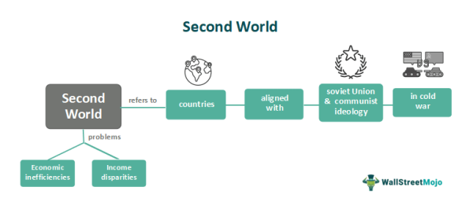

The Cold War era was marked by intense geopolitical tension between two major blocs: the United States and its allies, often referred to as the First World, and the Soviet Union and its satellite states, known as the Second World. This confrontation significantly influenced global politics, separating nations into First, Second, and Third Worlds based largely on their political alignment and economic structure. The term 'Second World' was specifically used to describe the Communist bloc countries, primarily characterized by their centrally planned economies under state control.

During this period, the Second World was composed predominantly of Eastern European nations and the broader Soviet Union, which followed socialist doctrines underpinned by state-planned economic systems. These nations shared a common economy model that focused on centralized planning and government ownership of resources, contrasting sharply with the capitalist systems of the First World, such as those found in the United States. This division of the world into rigid economic and political segments resulted in a unique path of development for the Second World countries.

Understanding the evolution of Second World countries is critical for appreciating their current economic and technological status. Over the decades, many of these nations have transitioned from strict communist economic policies to adopting more liberalized, market-oriented strategies. This transition has enabled them to open their markets, attract foreign investments, and embrace technological advancements, including the notable rise of algorithmic trading practices within their financial systems.

Algorithmic trading, also known as algo trading, represents a significant marker of modernization within these economies. This sophisticated trading approach uses complex algorithms to automate trading processes, thereby enhancing speed and efficiency, a move indicative of a broader shift toward embracing more advanced financial technologies. As Second World countries continue to integrate algorithmic trading, they signify a transformation towards engaging actively in contemporary global financial markets, reflecting broader economic shifts since the end of the Cold War.

## Table of Contents

## Understanding Second World Countries

The term 'Second World' initially referred to the Soviet Union and Eastern Bloc countries, marked by centrally planned, state-controlled economies. These nations were characterized by their adherence to communist ideologies and economic practices that diverged significantly from the free-market principles of the First World, primarily the United States and its Western allies. The economies of Second World countries focused on industrialization under state directive, with limited private enterprise and significant state intervention in economic activities.

With the end of the Cold War, the geopolitical landscape shifted dramatically, and the concept of the 'Second World' also evolved. The term broadened to include countries that found themselves between the development spectrums of the First and Third Worlds. These nations were neither fully industrialized with capitalist economies nor newly developing with significant poverty and underdevelopment. This re-definition encompassed former Soviet states like Hungary and Poland, which transitioned towards market economies, and emerging markets such as Turkey and Thailand, which displayed characteristics of both industrial advancement and developing market [volatility](/wiki/volatility-trading-strategies).

Post-Cold War, these countries embarked on economic restructuring and began integrating more robustly into global markets. For instance, Hungary and Poland undertook extensive privatization, market liberalization, and integration into the European Union, which allowed them to access broader markets and attract foreign investment. The inflow of capital and technologies facilitated economic recovery and growth, transforming their financial landscapes from rigid state-controlled systems to more dynamic and competitive market economies.

Similarly, Turkey and Thailand have developed into significant emerging markets. Turkey, leveraging its strategic location bridging Europe and Asia, has diversified its economic activities, with a strong manufacturing sector and expanding trade relationships. Thailand, part of the rapidly developing Southeast Asian region, has benefited from export-led growth and increasing participation in global supply chains.

In summary, the transformation of Second World countries following the Cold War reflects a broader narrative of adjustment and adaptation. Economic reforms. including the shift towards market mechanisms and global market integration, have not only altered their internal economic structures but also positioned these nations as pivotal players in the ever-evolving global economic system.

## Economic Evolution and Global Integration

Following the collapse of the Soviet Union, Second World countries experienced significant economic reforms that reshaped their economic and financial landscapes. These reforms primarily involved a shift from state-controlled, centrally planned economies to more liberalized, market-oriented systems. The transition was motivated by the necessity to incorporate these nations into the global economic framework, thereby fostering economic growth and development.

Market liberalization marked the first stage of reform for many Second World countries. By dismantling state monopolies and reducing governmental control over markets, these nations encouraged private enterprise and competition. This move attracted substantial foreign direct investment (FDI), which was critical in modernizing industries and enhancing productivity. The influx of foreign capital not only stimulated economic growth but also facilitated the transfer of technology and skills, which were essential for building a competitive market economy.

Foreign investment played a pivotal role in introducing advanced technologies to Second World countries. Many multinational corporations established their presence in these emerging markets, bringing with them cutting-edge technologies and management practices. This technology transfer was crucial in elevating the operational capabilities of local industries and positioning these countries to compete more effectively in the global market.

The amalgamation of foreign investment and technology transfer paved the way for the adoption of sophisticated financial technologies. Among these technologies, [algorithmic trading](/wiki/algorithmic-trading) has gained prominence. With its ability to process large volumes of data and execute trades at rapid speeds, algorithmic trading has transformed the financial sector in many Second World countries. Its integration into financial markets represents a significant shift towards modern financial practices, enabling these nations to enhance market efficiency and [liquidity](/wiki/liquidity-risk-premium).

These economic reforms and integration into the global market have not been without challenges, including regulatory hurdles and the need to balance state oversight with market freedom. Nonetheless, the progress achieved by Second World countries since their market liberalization highlights their dynamism and adaptability in the face of evolving economic paradigms.

## Algorithmic Trading: A Modern Financial Tool

Algorithmic trading, often referred to as algo trading, represents a transformative approach to financial transactions. This method employs intricate algorithms to automate the trading process, significantly enhancing both speed and efficiency. By utilizing mathematical models and innovative technologies, algo trading processes large volumes of trading orders with precision and at scales that human traders cannot match.

Central to the appeal of algorithmic trading is its ability to exploit small price discrepancies in the markets with rapid execution, reducing the latency in decision-making. One common strategy in algorithmic trading is statistical [arbitrage](/wiki/arbitrage), which capitalizes on the statistical mispricing of one or more assets using mathematical analyses. Additionally, algorithms can be designed to track historical data and forecast short-term price movements, offering traders actionable insights.

The adoption of algorithmic trading has escalated in developing and transitional economies, driven by technological advancements and efforts towards market liberalization. These economies, often classified as Second World countries, have recognized the potential of algo trading as a competitive tool in the global financial arena. Market liberalization has facilitated increased access to international capital, technology transfer, and foreign investment, creating favorable conditions for the proliferation of algorithmic trading practices.

For Second World countries, the increasing use of algo trading signifies an essential shift towards adopting modern financial tools to remain competitive. As these nations continue to integrate with the global markets, algorithmic trading has become a cornerstone, aligning their financial practices with those of established economies. This trend underscores the broader theme of modernization and economic restructuring in these countries, as they progressively align with global financial standards and practices.

## Case Studies: Second World Countries in Algo Trading

Russia has emerged as a notable player in the realm of algorithmic trading, leveraging its technological capabilities and significant financial investment. The Russian financial markets have integrated algorithmic trading to enhance the efficiency and speed of transactions, which are crucial in modern trading environments. Russian companies and institutions have capitalized on their technological expertise, particularly in computing and software development, to build sophisticated trading systems. These systems are designed to process high-frequency trading ([HFT](/wiki/high-frequency-trading-strategies)), predictive analytics, and real-time data processing.

Similarly, China represents a unique case where algorithmic trading is surging alongside the balancing act between state control and market dynamics. Chinese markets have gradually opened up, enabling a controlled yet significant adoption of algorithmic trading practices. The Shanghai and Shenzhen stock exchanges are witnessing increased participation from algorithmic traders. This growth is often facilitated by local tech firms and fintech companies that develop proprietary platforms and algorithms, tailored to the regulatory framework imposed by Chinese authorities. The government's strategic plans, such as the "Made in China 2025" initiative, support the integration of [artificial intelligence](/wiki/ai-artificial-intelligence) and [machine learning](/wiki/machine-learning) within these trading platforms, showing a blend of economic planning and market innovation.

In Central and Eastern Europe, countries like Hungary have tapped into technological advancements to embed algorithmic trading within their financial ecosystems. The region's integration into the European Union has facilitated access to technological know-how and investment from Western Europe. Hungary, in particular, has seen a rise in the number of fintech startups that provide algorithmic trading solutions. These solutions are typically powered by algorithms that utilize artificial intelligence and machine learning to predict market movements and execute trades. Such technological growth not only boosts local financial markets but also aligns them more closely with global trading standards.

These case studies highlight how Second World countries are progressively adopting algorithmic trading as a vital component of their financial strategy. Through a combination of local expertise, strategic foreign partnerships, and government policies, these nations are positioning themselves competitively within the global financial landscape.

## Challenges and Opportunities

Second World countries face a range of regulatory challenges as they navigate the burgeoning field of algorithmic trading, a modern financial tool that has increasingly become pivotal in their economic strategies. With the integration of algorithmic trading into their financial systems, these nations must address the complexities of maintaining financial stability. This requires striking a delicate balance between market freedom and state oversight, ensuring that regulatory frameworks are robust enough to manage the rapid advancements of financial technology.

The rise of algorithmic trading in these countries brings forth significant opportunities for innovation in the financial technology (fintech) sector. The potential for economic growth is evident as these markets can leverage advanced technologies to enhance trading efficiency, attract investments, and stimulate further technological advancements. However, this also necessitates the development of sophisticated regulatory environments that can mitigate risks associated with high-frequency and algorithmic trading, such as market manipulation, systemic risk, and technical failures. 

Regulatory bodies in Second World countries must establish clear guidelines to oversee these advanced trading activities, encouraging transparency and accountability while fostering an environment conducive to innovation. This is crucial not only for maintaining market integrity but also for protecting investors and supporting the overall stability of financial markets.

Moreover, the rapid evolution of algorithmic trading presents an opportunity to enhance fintech capabilities, as these nations can become hubs for technological growth and investment in financial services. Strengthening collaborations with global partners and investing in education and infrastructure are integral steps to harnessing these opportunities. By doing so, Second World countries can position themselves competitively within the global financial landscape, paving the way for sustainable economic development.

In conclusion, the dual challenge of regulatory management and the harnessing of fintech innovation presents both hurdles and opportunities for Second World countries pursuing algorithmic trading. Their ability to navigate these complexities will largely determine their future trajectory in the global economy, underscoring the critical need for strategic and forward-looking policy frameworks.

## Conclusion

The Cold War's legacy has undeniably shaped the economic paths of Second World countries, carving out unique trajectories that continue to influence their present and future standings in the global arena. These nations, once characterized by centrally planned economies under Communist influence, have since undergone transformative changes. The dissolution of the Soviet Union catalyzed a wave of market liberalization and economic reform. This shift has not only enabled Second World countries to integrate more deeply into the global economy but also presented them with the opportunity to adopt advanced financial practices.

One such practice is algorithmic trading, a field that has seen substantial growth within these transitional economies. By automating trading processes through sophisticated algorithms, Second World countries are finding new avenues for participation and competitiveness in global financial markets. This shift signifies not just technological advancement but also economic adaptation, as these nations balance market freedom with regulatory necessities to ensure financial stability.

The integration of algorithmic trading into the financial ecosystems of Second World countries underscores their evolving role in global finance. As these nations continue to develop their technological capacities, they are poised to harness further opportunities in financial innovation, setting the stage for substantial economic growth. Understanding the evolution of these countries from their Cold War legacies to modern financial players is essential for anticipating the future dynamics of global markets, where algorithmic trading will likely play a pivotal role. This insight into their economic journey highlights the broader impact of historical geopolitical tensions on current and future financial trends.

## References & Further Reading

[1]: Bergstra, J., Bardenet, R., Bengio, Y., & Kégl, B. (2011). ["Algorithms for Hyper-Parameter Optimization."](https://papers.nips.cc/paper/4443-algorithms-for-hyper-parameter-optimization) Advances in Neural Information Processing Systems 24.

[2]: ["Advances in Financial Machine Learning"](https://www.amazon.com/Advances-Financial-Machine-Learning-Marcos/dp/1119482089) by Marcos Lopez de Prado

[3]: ["Evidence-Based Technical Analysis: Applying the Scientific Method and Statistical Inference to Trading Signals"](https://www.amazon.com/Evidence-Based-Technical-Analysis-Scientific-Statistical/dp/0470008741) by David Aronson

[4]: ["Machine Learning for Algorithmic Trading"](https://github.com/stefan-jansen/machine-learning-for-trading) by Stefan Jansen

[5]: ["Quantitative Trading: How to Build Your Own Algorithmic Trading Business"](https://www.amazon.com/Quantitative-Trading-Build-Algorithmic-Business/dp/1119800064) by Ernest P. Chan