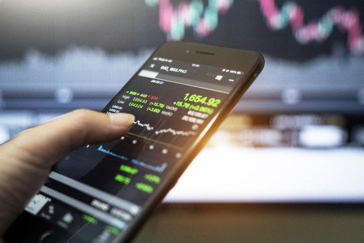

In the modern financial landscape, liquidity and associated risks are central to effective market participation. Liquidity refers to the ease with which an asset can be converted into cash without significantly affecting its price. In financial markets, liquidity is essential as it facilitates smoother transactions, reduces costs, and enhances market efficiency. A market with high liquidity allows traders and investors to buy or sell assets quickly and at predictable prices, thus minimizing the impact of price volatility.

This article explores secondary liquidity, which involves trading in the secondary market, such as stock exchanges where securities are traded post their initial offering in the primary market. Secondary liquidity is crucial for investors who wish to cash out or adapt their portfolios according to changing market conditions. Understanding how secondary liquidity operates and the associated risks, such as those stemming from regulatory and transparency challenges, is fundamental for managing investment strategies effectively.



Moreover, liquidity gaps, which occur when there is a disconnect between the supply and demand of an asset, are examined. These gaps can lead to difficulty in executing trades and are often exacerbated during economic downturns, as exemplified by events like the 2008 financial crisis. The interaction of liquidity gaps with algorithmic trading, a method that uses computer algorithms to automate trading processes, presents additional complexities and opportunities for market participants.

Understanding these concepts is crucial for traders and investors aiming to optimize their strategies and mitigate risks effectively. In particular, integrating liquidity insights into algorithmic trading can enhance decision-making and adapt trading strategies to real-time market conditions, thus promoting success in today's dynamic financial environment.

## Table of Contents

## Understanding Secondary Liquidity

Secondary liquidity denotes trading activity on the secondary market, where previously issued securities such as stocks and bonds are exchanged. Unlike the primary market, where new securities are issued directly by companies to investors, the secondary market facilitates the trading of these securities among investors themselves. This process is crucial because it provides investors with the ability to liquidate or modify their investments without waiting for the issuing organization to repurchase the securities.

Investors benefit from secondary liquidity by gaining the flexibility to respond to market changes through buying or selling securities efficiently. This dynamic is particularly important for portfolio management, allowing for strategic reallocations that align with evolving market conditions or investment goals. For instance, if an investor anticipates market downturns, they might opt to increase liquidity by selling some stocks to mitigate risk.

Market makers play a pivotal role in maintaining secondary [liquidity](/wiki/liquidity-risk-premium). These financial entities or individuals provide liquidity by readying to buy and sell securities at specified prices. They help ensure smoother market operations and narrower bid-ask spreads, thereby enhancing market efficiency. By consistently quoting buy and sell prices for securities, market makers facilitate greater transaction volumes and stability.

Despite its significance, secondary liquidity faces notable challenges. Transparency is often a concern, with limited visibility into the true supply and demand dynamics affecting securities prices. Additionally, markets can suffer from a limited number of participants, leading to liquidity constraints. This reduced number of players can exacerbate price [volatility](/wiki/volatility-trading-strategies) and make it difficult for investors to execute trades at desired prices, especially during periods of market stress.

Addressing these challenges involves improving market infrastructure and regulatory frameworks to enhance transparency and attract a broader pool of participants. Increased transparency can be achieved through greater disclosure requirements, enabling investors to make more informed decisions. Encouraging market participation can be fostered by reducing entry barriers and incentivizing active engagement.

In summary, secondary liquidity represents a critical aspect of financial markets, enabling the transfer and adjustment of ownership of securities. While market makers support its functioning, overcoming transparency and participant limitations remains essential in fostering efficient and resilient markets.

## Financial Risks in Secondary Liquidity

Secondary liquidity presents inherent financial risks that can significantly impact market operations. One primary concern is the lack of regulatory oversight and transparency in trading activities. Unlike primary markets subjected to stringent regulatory frameworks and disclosure requirements, secondary markets often face minimal scrutiny. This absence of comprehensive regulation can lead to information asymmetry, where not all participants have equal access to material information. Consequently, market transparency is compromised, potentially leading to manipulative practices and unfair trading advantages.

Another significant risk associated with secondary liquidity is volatility and price inefficiency. With fewer market participants compared to the primary market, any substantial buy or sell order can disproportionately affect prices, leading to erratic fluctuations and potential market instability. This reduced liquidity can cause wide bid-ask spreads, resulting in increased transaction costs for investors. The limited availability of counterparties often exacerbates these inefficiencies, particularly in times of market stress when liquidity is needed the most.

Furthermore, investors engaging with secondary markets must be vigilant about potential illiquidity issues. Illiquidity can arise from a dearth of willing buyers or sellers, especially for less popular or niche securities. This lack of liquidity can hinder an investor's ability to quickly convert assets into cash without significant loss in value. During economic downturns or financial crises, these problems may intensify, as demonstrated during the 2008 financial crisis when many assets became illiquid, exacerbating market turmoil.

In summary, while secondary markets provide crucial avenues for investors to adjust portfolios and [exit](/wiki/exit-strategy) positions, they come with notable risks. The lack of regulatory oversight and transparency, coupled with potential volatility and illiquidity, requires investors to exercise caution and diligence. Proper risk assessment and management strategies are essential for any participant operating in these markets.

## Examples of Secondary Liquidity

Several hypothetical and real-world scenarios can effectively demonstrate the concept of secondary liquidity in financial markets. Secondary liquidity refers to the ability to quickly buy or sell securities in the secondary market without causing a significant impact on their price. Here, we examine a real-world example and a hypothetical scenario to illustrate this concept.

A notable real-world example of secondary liquidity is the case of Uber's early investors selling their stakes. When Uber decided to go public, not all early investors were inclined to wait for the initial public offering (IPO) to realize their investments. Instead, they opted to sell their shares on the secondary market. Firms like SoftBank took advantage of this opportunity, purchasing shares from these early investors before the IPO. This transaction provided liquidity to the sellers while allowing SoftBank to acquire a significant position in Uber. This example highlights how secondary markets facilitate liquidity by enabling shareholders to monetize their investments before a public exit event.

In a hypothetical scenario, consider a company's founder who might decide to sell some of their shares on the secondary market to diversify holdings. Suppose the founder holds a substantial proportion of the company's stock, making their personal wealth largely dependent on the company's performance. To mitigate risk, the founder could sell a portion of their shares to private investors or funds interested in purchasing equity before a potential IPO or additional fundraising round. This action would provide the founder with liquidity while allowing new investors to gain exposure to the company. Such transactions exemplify how the secondary market provides flexibility and liquidity options to shareholders, enabling them to manage their investment risks effectively.

These examples underscore the importance of secondary liquidity in financial markets by allowing stakeholders to adjust their positions in response to changing financial goals and market conditions.

## Liquity Gaps in Financial Markets

Liquidity gaps arise when there is an imbalance between the supply and demand of assets, complicating the execution of trades in financial markets. These gaps often manifest during periods of financial stress or uncertainty, where a scarcity of buyers or sellers results in significant price shifts and increased transaction costs. The issue stems from the market's inherent inability to provide adequate liquidity to facilitate seamless buying and selling under certain conditions.

A stark example of liquidity gaps was observed during the 2008 financial crisis. During this period, markets worldwide experienced extreme volatility as investor confidence dwindled and banks faced capital shortages. Many financial instruments, particularly complex derivatives and mortgage-backed securities, saw drastic reductions in liquidity. As a result, the spreads between bid and ask prices widened, reflecting the increased risk and uncertainty regarding asset valuation. Market participants, needing immediate liquidity, were often compelled to sell assets at substantial discounts, perpetuating the downward spiral in asset prices.

The presence of liquidity gaps poses significant risks. When assets cannot be sold promptly without a substantial price concession, the resulting liquidity constraints can escalate into solvency problems for individuals and institutions. Solvency issues arise when the lack of liquidity prevents an entity from meeting its short-term obligations, leading potentially to default or bankruptcy. This risk is particularly acute for highly leveraged entities, which rely on continuous access to liquid markets to manage their debt repayments effectively.

Managing liquidity gaps requires proactive measures, including maintaining sufficient cash reserves and diversifying funding sources to weather periods of market stress. Additionally, institutions may adopt advanced risk management strategies, involving stress testing and scenario analysis, to anticipate and mitigate potential liquidity shortfalls before they evolve into solvency crises.

Recognizing the systemic importance of liquidity management, regulatory bodies have implemented frameworks to enhance market liquidity during crises. For instance, the Basel III accords introduced liquidity coverage ratios, requiring banks to hold enough high-quality liquid assets to sustain operations during short-term disruptions. Such measures aim to bolster market resilience, ensuring that liquidity gaps do not precipitate broader financial instability.

## Algorithmic Trading: An Overview

Algorithmic trading involves employing computational systems to execute trades in financial markets based on pre-defined rules and algorithms. It enhances the execution speed, minimizes errors arising from human intervention, and exploits momentary market inefficiencies. The predominant strategies utilized in [algorithmic trading](/wiki/algorithmic-trading) encompass trend-following, [arbitrage](/wiki/arbitrage), and market-making.

Trend-following is a strategy where algorithms identify and exploit upward or downward market trends. These algorithms use historical data to predict future price movements and often involve technical indicators such as moving averages or [momentum](/wiki/momentum) oscillators.

Arbitrage strategies focus on exploiting price discrepancies between different markets or instruments. Algorithms perform arbitrage by simultaneously buying and selling an asset in different markets to benefit from price differences. For instance, [statistical arbitrage](/wiki/statistical-arbitrage) is a widely used strategy that employs mathematical models to identify pricing inefficiencies.

Market-making strategies involve providing liquidity to the market by buying and selling securities and profiting from the bid-ask spread. Algorithms in market-making decide prices and volumes at which trades should be made, optimizing based on the current [order book](/wiki/order-book-trading-strategies) and historical data to maximize profits while managing risk.

The integration of technology and [machine learning](/wiki/machine-learning) significantly optimizes these strategies. Machine learning algorithms analyze vast datasets to identify patterns and make predictions about future price movements. For instance, [reinforcement learning](/wiki/reinforcement-learning), a subset of machine learning, has been used to develop trading strategies that adapt to changing market conditions by learning from historical performance data.

Python, a widely-used programming language in algorithmic trading, provides robust libraries such as NumPy and Pandas for numerical computations, and Scikit-learn for implementing machine learning models.

```python
import numpy as np
import pandas as pd
from sklearn.linear_model import LinearRegression

# Example Python code for a simple predictive model
# Loading historical market data
data = pd.read_csv('historical_data.csv')

# Extracting features and target variable
X = data[['feature1', 'feature2', 'feature3']]  # Features could be historical prices or indicators
y = data['target']  # This could be future prices or returns

# Defining the model
model = LinearRegression()

# Fitting the model
model.fit(X, y)

# Making predictions
predictions = model.predict(X)
```

In conclusion, by leveraging technology and machine learning, algorithmic trading can precisely execute complex strategies, taking advantage of the speed and data processing capabilities that surpass human capacities. As markets evolve, continuous advancements in these technologies will further enhance algorithmic trading efficacy.

## Integrating Liquidity Insights in Algorithmic Trading

In algorithmic trading, integrating liquidity insights is essential for optimal performance, especially in unpredictable market environments. Liquidity refers to the ability to buy or sell assets without causing significant price changes. This is crucial in algorithmic trading, where large volumes of trades are executed in rapid succession.

Advanced algorithms utilize historical liquidity patterns to understand market behavior and make informed trading decisions. By analyzing past data, these algorithms can detect patterns and predict future liquidity events. For instance, during high volatility periods, liquidity tends to decline, potentially leading to wider bid-ask spreads. Anticipating such behaviors enables algorithms to adjust trading strategies proactively.

Machine learning models enhance this prediction process by identifying complex patterns in vast datasets, adapting to new data inputs continuously. These models can predict liquidity conditions with greater accuracy, allowing for dynamic strategy adjustments. For example, a machine learning model might be trained on a dataset of historical trade volumes, price changes, and other market indicators to forecast upcoming liquidity levels. 

A simple Python example to demonstrate how historical data might be used to predict liquidity is shown below:

```python
import pandas as pd
from sklearn.model_selection import train_test_split
from sklearn.ensemble import RandomForestRegressor
from sklearn.metrics import mean_squared_error

# Load historical market data
data = pd.read_csv('market_data.csv') 
features = data[['trade_volume', 'price_change', 'bid_ask_spread']]
target = data['liquidity']

# Split data into training and testing sets
X_train, X_test, y_train, y_test = train_test_split(features, target, test_size=0.2, random_state=42)

# Train a Random Forest model
model = RandomForestRegressor(n_estimators=100, random_state=42)
model.fit(X_train, y_train)

# Predict liquidity conditions
predictions = model.predict(X_test)

# Evaluate model performance
mse = mean_squared_error(y_test, predictions)
print(f'Mean Squared Error: {mse}')
```

This example illustrates how machine learning models can be employed to predict liquidity, enabling traders to adjust their algorithms based on real-time conditions. The integration of such predictive analytics into algorithmic trading systems not only enhances strategy execution but also mitigates risks associated with liquidity fluctuations, thereby optimizing overall trade outcomes.

## Challenges and Opportunities in Algo Trading and Liquidity

Algorithmic trading, which utilizes complex algorithms to automate trading strategies, faces significant challenges associated with managing liquidity gaps. These gaps, caused by discrepancies in asset supply and demand, can disrupt trade execution and lead to substantial market impact. Automated systems, while efficient, can exacerbate these issues if not designed with robust liquidity management mechanisms.

One of the primary challenges in algorithmic trading is the unpredictable nature of liquidity changes. For instance, sudden market shifts or geopolitical events can dramatically alter market conditions, leading to liquidity gaps that automated systems may not swiftly adapt to. This can result in trades being executed at suboptimal prices, thus diminishing profits. Furthermore, high-frequency trading algorithms might unintentionally contribute to market volatility, exacerbating liquidity gaps during periods of stress.

Despite these challenges, significant opportunities exist for traders and firms that leverage predictive analytics. By analyzing historical trading data and liquidity patterns, sophisticated algorithms can be developed to anticipate changes in market liquidity. Predictive models, often powered by machine learning techniques, can signal potential liquidity squeezes, allowing traders to adjust their strategies proactively.

Technological advancements are pivotal in addressing these challenges. The integration of big data analytics, for example, aids in the real-time assessment of market conditions. Enhanced computing power allows algorithms to process vast datasets, identifying liquidity trends and anomalies with greater accuracy and speed. Furthermore, the deployment of machine learning models enables the continuous improvement of algorithmic strategies. These models can learn from previous market behaviors, adapting to new data and improving their predictive accuracy over time.

To illustrate, consider a Python-based algorithm designed to handle liquidity management:

```python
import numpy as np
from sklearn.ensemble import RandomForestRegressor

# Historical liquidity data
X = np.array([...])  # Features: market indicators, historical prices, etc.
y = np.array([...])  # Target: liquidity measure (e.g., bid-ask spread)

# Train a machine learning model
model = RandomForestRegressor(n_estimators=100, random_state=42)
model.fit(X, y)

# Predict future liquidity conditions
future_conditions = np.array([...])  # New market scenario features
predicted_liquidity = model.predict(future_conditions)

# Adjust trading strategy based on predicted liquidity
if predicted_liquidity < threshold:
    # Execute risk management strategy
    print("High risk of liquidity gap, adjusting trading volume.")
else:
    # Proceed with optimized trading strategy
    print("Liquidity conditions stable, proceed with strategy.")
```

This basic example highlights the utility of machine learning in preemptively detecting liquidity risks, thereby mitigating potential losses and optimizing trade executions.

In conclusion, while managing liquidity gaps in algorithmic trading presents significant challenges, technological innovations offer promising solutions. By investing in predictive analytics and machine learning, traders can enhance their ability to foresee market changes, thereby gaining a competitive edge in dynamic trading environments.

## Conclusion

Understanding secondary liquidity and liquidity gaps is vital for risk management and strategic planning in financial markets. Secondary liquidity facilitates the trading of securities post-initial issuance, creating essential opportunities for investors to adjust their portfolios and cash out when needed. However, this liquidity is subject to risks such as transparency issues and market participant limitations, which can lead to volatility and price inefficiencies. Awareness and management of these risks are crucial to maintaining efficient market operations.

Incorporating liquidity data enhances algorithmic trading by optimizing it for real-time market conditions. Algorithmic trading, which automates trading operations using pre-defined rules, relies heavily on the availability and accuracy of market data, including liquidity conditions. Advanced technologies, such as machine learning, allow these systems to analyze historical liquidity patterns and predict future conditions, thereby enabling more precise and dynamic strategy adjustments.

Continuous innovation in trading and risk management strategies is essential for success in financial markets. As markets become increasingly complex and interconnected, the ability to swiftly adapt to changing liquidity conditions can offer significant competitive advantages. By integrating up-to-date liquidity insights and utilizing technological advancements in predictive analytics, both individual traders and institutional participants can refine their strategies and enhance their ability to navigate modern financial landscapes effectively.

## References & Further Reading

[1]: Harris, L. (2003). ["Trading and Exchanges: Market Microstructure for Practitioners."](https://www.amazon.com/Trading-Exchanges-Market-Microstructure-Practitioners/dp/0195144708) Oxford University Press.

[2]: Lopez de Prado, M. (2018). ["Advances in Financial Machine Learning."](https://www.amazon.com/Advances-Financial-Machine-Learning-Marcos/dp/1119482089) Wiley.

[3]: Mackenzie, D. (2020). ["Trading at the Speed of Light: How Ultrafast Algorithms Are Transforming Financial Markets."](https://www.jstor.org/stable/j.ctv191kx1k) Princeton University Press.

[4]: Chan, E. P. (2009). ["Quantitative Trading: How to Build Your Own Algorithmic Trading Business."](https://github.com/ftvision/quant_trading_echan_book) Wiley.

[5]: James, J., & Lawler, S. (2009). ["Liquidity Modelling."](https://courses.washington.edu/cfr590/pdfs/Lawler.2009.pdf) Wiley.

[6]: Kissell, R. (2013). ["The Science of Algorithmic Trading and Portfolio Management."](https://www.sciencedirect.com/book/9780124016897/the-science-of-algorithmic-trading-and-portfolio-management) Academic Press.

[7]: Aronson, D. R. (2006). ["Evidence-Based Technical Analysis: Applying the Scientific Method and Statistical Inference to Trading Signals."](https://www.amazon.com/Evidence-Based-Technical-Analysis-Scientific-Statistical/dp/0470008741) Wiley.