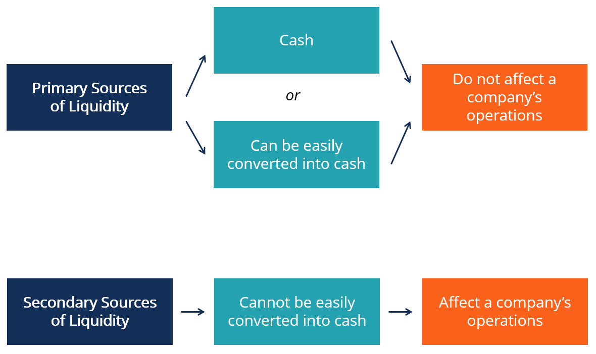

## Table of Contents

## What is secondary liquidity?

Secondary liquidity refers to the ability to buy or sell assets in markets other than the primary market where they were originally issued. For example, if a company issues new stocks in the primary market, those stocks can later be traded among investors in the secondary market, like on a stock exchange. This provides investors with a way to exit their investments or acquire more without involving the issuing company directly.

Having secondary liquidity is important because it makes investments more attractive. When investors know they can easily sell their assets if they need to, they are more likely to invest in the first place. This increased demand can help companies raise more money when they issue new securities. It also helps keep markets stable by allowing prices to adjust based on supply and demand.

## How does secondary liquidity differ from primary liquidity?

Primary liquidity is about the first time an asset, like a stock or bond, is sold to investors. This happens when a company or government issues new securities to raise money. It's like the starting point for these assets. When you buy a new stock directly from the company during its initial public offering (IPO), that's an example of primary liquidity.

Secondary liquidity, on the other hand, is about trading these assets after they've already been issued. It's like a second-hand market where investors buy and sell assets among themselves, without involving the company that issued them. For example, if you buy stocks from another investor on a stock exchange, that's secondary liquidity. This market is crucial because it lets investors get their money back or buy more assets without waiting for the company to issue new ones.

## Why is secondary liquidity important in financial markets?

Secondary liquidity is important in financial markets because it helps investors buy and sell assets easily. When people know they can sell their stocks or bonds whenever they need money, they feel safer about investing in the first place. This makes more people want to invest, which helps companies and governments raise money more easily. Without secondary liquidity, investors might be stuck with assets they can't sell, making them less likely to invest.

Also, secondary liquidity helps keep markets stable. When lots of people are buying and selling, the prices of assets can change based on what people think they're worth. This helps set fair prices for everyone. If there's no secondary market, it can be hard to figure out what an asset is really worth, and the market might become less stable. So, having a good secondary market is key for a healthy financial system.

## What are the common sources of secondary liquidity?

Common sources of secondary liquidity are stock exchanges and over-the-counter (OTC) markets. Stock exchanges, like the New York Stock Exchange or NASDAQ, are places where people can buy and sell stocks and other securities easily. These exchanges have rules and systems that make trading smooth and fair for everyone. On the other hand, OTC markets are less formal. They let people trade securities directly with each other, without a big exchange in the middle. This can be good for trading things that are not listed on big exchanges.

Another source of secondary liquidity is through investment funds, like mutual funds or exchange-traded funds (ETFs). These funds hold a bunch of different investments and let people buy and sell shares in the fund. When you buy or sell a share of a mutual fund or ETF, you're trading with other investors, not the companies the fund invests in. This gives people a way to get in and out of a bunch of different investments all at once, which can be easier than buying and selling each one separately.

## What are the basic mechanisms of secondary markets?

In secondary markets, the basic way things work is through buying and selling between investors. When someone wants to sell a stock or bond, they put it up for sale on a stock exchange or an over-the-counter market. Other investors can see this and decide if they want to buy it. If someone agrees to buy at the price the seller wants, the trade happens. This all happens quickly, often with the help of computers and trading systems that match buyers and sellers.

Another important part of secondary markets is the role of brokers and dealers. Brokers help investors buy and sell by finding the other side of the trade. They might work for a big firm or on their own, but their job is to make sure the trade happens smoothly. Dealers, on the other hand, buy and sell from their own inventory. They keep a stock of securities and are ready to buy or sell at any time, which helps keep the market moving even when there aren't many other buyers or sellers around. Together, these mechanisms help keep the secondary market active and liquid.

## Can you explain the process of trading in secondary markets?

Trading in secondary markets is like a big swap meet where people buy and sell things they already own. Imagine you have a stock you want to sell. You go to a place like a stock exchange, where lots of other people are also buying and selling. You tell the exchange you want to sell your stock at a certain price. If someone else wants to buy it at that price, the exchange matches you up, and the trade happens. It's all done quickly with computers that help find the right buyer for your stock.

Brokers and dealers play a big role in making these trades happen smoothly. A broker is like a helper who finds someone to buy your stock or helps you find a stock to buy. They work to make sure the trade goes through at the best price. Dealers, on the other hand, are like store owners. They have their own stocks and bonds to sell. If you want to sell your stock, a dealer might buy it from you and then sell it to someone else later. This helps keep the market moving, even when there aren't many other people trading.

## What are the risks associated with secondary liquidity?

Trading in secondary markets can be risky because the prices of stocks and bonds can go up and down a lot. If lots of people want to sell something at the same time, the price can drop quickly. This can happen because of news about a company, changes in the economy, or even just because lots of people are feeling nervous. If you need to sell your stock when the price is low, you might lose money. This is called market risk, and it's a big part of trading in secondary markets.

Another risk is that sometimes it can be hard to find someone to buy what you want to sell. This is called liquidity risk. Even though secondary markets are usually busy, there can be times when not many people are trading. If you need to sell something quickly but can't find a buyer, you might have to wait or sell it for less than you wanted. This can be a problem if you need the money right away. So, while secondary markets make it easier to trade, they still come with risks that you need to think about.

## How do market conditions affect secondary liquidity?

Market conditions can make a big difference in how easy it is to buy and sell things in secondary markets. When the economy is doing well, people feel good about investing, and there are lots of buyers and sellers. This makes it easier to trade stocks and bonds because there's always someone on the other side of the deal. But when the economy is not doing well, people get worried and might want to sell their investments. If too many people try to sell at the same time, it can be hard to find buyers, and prices can drop a lot.

Sometimes, big news can change how people feel about the market quickly. For example, if a company reports bad news, people might rush to sell its stock, making it harder to find buyers and lowering the price. Also, things like interest rates and government policies can affect how much people want to invest. When interest rates go up, borrowing money becomes more expensive, and people might be less interested in buying stocks. All these things can make secondary markets more or less liquid, depending on what's happening at the time.

## What role do regulations play in secondary liquidity?

Regulations are important rules that help keep secondary markets fair and safe for everyone. They make sure that people who buy and sell stocks and bonds follow the same rules. For example, regulations might say that companies have to tell the truth about their business so investors can make good choices. They also make sure that stock exchanges and brokers do their jobs right. Without these rules, it would be hard to trust that the market is fair, and fewer people might want to trade.

These rules can also affect how easy it is to buy and sell in the market. If the rules are too strict, it might be harder for new companies to list their stocks, which can make the market less lively. But if the rules are too loose, people might not trust the market, and they might not want to trade as much. So, finding the right balance is important. Good regulations help keep the market running smoothly and make sure there are enough people buying and selling to keep things liquid.

## Can you provide examples of secondary liquidity events?

One example of a secondary liquidity event is when someone sells their shares of a company on a stock exchange like the New York Stock Exchange. Imagine you bought some stock in a company a few years ago, and now you want to sell it to buy a new car. You go to the stock exchange and put your stock up for sale. If someone else wants to buy it at the price you're asking, the trade happens, and you get the money to buy your car. This is a common way people use secondary markets to turn their investments into cash.

Another example is when someone sells their shares in a mutual fund. Let's say you've been investing in a mutual fund that holds a bunch of different stocks. Now, you need money for a big expense, like a house down payment. You can sell your shares in the mutual fund to other investors who want to buy them. The mutual fund company helps match you with buyers, and once the trade is done, you get the money you need. This shows how secondary markets help people get cash from their investments whenever they need it.

## How can investors manage the risks of secondary liquidity?

Investors can manage the risks of secondary liquidity by diversifying their investments. This means not putting all their money into one stock or bond. Instead, they spread it out over different types of investments. If one investment goes down in value, the others might stay the same or even go up, helping to balance out the loss. This way, if it's hard to sell one investment, they might still be able to sell others easily.

Another way to manage these risks is by understanding the market and keeping an eye on it. Investors should know what's happening in the economy and with the companies they've invested in. If they see signs that the market might be getting less liquid, they can plan ahead. For example, they might decide to sell some investments before it becomes too hard to find buyers. By staying informed and ready to act, investors can better handle the ups and downs of secondary markets.

## What advanced strategies can be used to optimize secondary liquidity in large portfolios?

One advanced strategy to optimize secondary liquidity in large portfolios is using algorithmic trading. This means using computers to buy and sell stocks and bonds based on special rules set by the investor. These rules can help find the best times to trade, making it easier to sell when the market is busy and prices are good. By using these smart computer programs, investors can quickly take advantage of small changes in the market, helping them get the best prices and keep their portfolio liquid.

Another strategy is to use derivatives, like options and futures, to manage liquidity. Derivatives are special financial tools that let investors bet on the future price of a stock or bond without actually owning it. By using these tools, investors can protect their big portfolios from big price swings and make sure they can sell their investments when they need to. This can be really helpful for managing a large portfolio because it adds another layer of control over when and how to trade, making the whole process smoother and more liquid.

## References & Further Reading

[1]: Harris, L. (2003). ["Trading and Exchanges: Market Microstructure for Practitioners."](https://www.amazon.com/Trading-Exchanges-Market-Microstructure-Practitioners/dp/0195144708) Oxford University Press.

[2]: Lopez de Prado, M. (2018). ["Advances in Financial Machine Learning."](https://www.amazon.com/Advances-Financial-Machine-Learning-Marcos/dp/1119482089) Wiley.

[3]: Mackenzie, D. (2020). ["Trading at the Speed of Light: How Ultrafast Algorithms Are Transforming Financial Markets."](https://www.jstor.org/stable/j.ctv191kx1k) Princeton University Press.

[4]: Chan, E. P. (2009). ["Quantitative Trading: How to Build Your Own Algorithmic Trading Business."](https://github.com/ftvision/quant_trading_echan_book) Wiley.

[5]: James, J., & Lawler, S. (2009). ["Liquidity Modelling."](https://courses.washington.edu/cfr590/pdfs/Lawler.2009.pdf) Wiley.

[6]: Kissell, R. (2013). ["The Science of Algorithmic Trading and Portfolio Management."](https://www.sciencedirect.com/book/9780124016897/the-science-of-algorithmic-trading-and-portfolio-management) Academic Press.

[7]: Aronson, D. R. (2006). ["Evidence-Based Technical Analysis: Applying the Scientific Method and Statistical Inference to Trading Signals."](https://www.amazon.com/Evidence-Based-Technical-Analysis-Scientific-Statistical/dp/0470008741) Wiley.