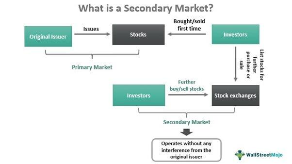

## Table of Contents

## What is a secondary market?

A secondary market is a place where people can buy and sell things that have already been sold once before. These things are usually financial products like stocks or bonds. When a company first sells its stocks or bonds, it does so in the primary market. After that, if someone wants to sell their stocks or bonds, they do it in the secondary market. The most famous secondary market is the stock exchange, like the New York Stock Exchange.

In the secondary market, the price of the stocks or bonds can go up or down based on what people think they are worth. This is different from the primary market where the price is set by the company. The secondary market is important because it lets people who own stocks or bonds sell them to others who want to buy them. This makes it easier for people to invest in companies and helps the economy grow.

## How does the secondary market differ from the primary market?

The primary market is where new securities, like stocks or bonds, are first sold to the public by the company that issues them. This is like a new product launch. When a company wants to raise money, it might sell its stocks or bonds for the first time in the primary market. The price of these securities in the primary market is set by the company, and investors buy them directly from the company.

The secondary market, on the other hand, is where these securities are traded among investors after they have been sold in the primary market. It's like a second-hand market for stocks and bonds. Here, the price of the securities can change based on what buyers and sellers think they are worth. The secondary market is important because it gives investors a chance to sell their securities if they need to, and it helps new investors buy into companies without having to wait for a new issue in the primary market.

## What types of assets are commonly traded in secondary markets?

The most common types of assets traded in secondary markets are stocks and bonds. Stocks are pieces of ownership in a company that people can buy and sell. When you buy a stock, you own a small part of that company. Bonds are like loans that people give to companies or governments. The company or government promises to pay back the money with interest. Both stocks and bonds can be bought and sold in the secondary market after they are first sold in the primary market.

Other assets that are often traded in secondary markets include mutual funds and exchange-traded funds (ETFs). Mutual funds are collections of stocks, bonds, or other investments that are managed by a professional. ETFs are similar but can be bought and sold like stocks on a stock exchange. These funds let people invest in a variety of assets without having to buy each one separately. 

Sometimes, even real estate and art can be traded in secondary markets. Real estate investment trusts (REITs) allow people to buy shares in properties, and these shares can be traded. Artworks can also be bought and sold on secondary markets, where collectors and investors trade pieces that have already been sold once before.

## What is the role of brokers and dealers in the secondary market?

Brokers and dealers are important people in the secondary market. Brokers are like helpers who connect buyers and sellers. They do not own the stocks or bonds themselves. Instead, they find people who want to sell their stocks or bonds and match them with people who want to buy them. Brokers make money by charging a small fee for each trade they help with. This makes it easier for people to buy and sell things in the secondary market because they don't have to find each other on their own.

Dealers, on the other hand, actually own the stocks or bonds. They buy them and then sell them to other people. Dealers are like shops that keep a stock of things to sell. They make money by selling the stocks or bonds for a higher price than they paid for them. This is called the "bid-ask spread." Because dealers have stocks and bonds ready to sell, they can make trades happen quickly. Both brokers and dealers help keep the secondary market running smoothly by making it easier for people to trade.

## How does liquidity affect the secondary market?

Liquidity is very important in the secondary market. It means how easy it is to buy or sell something without changing its price too much. If a market is very liquid, it means there are lots of people buying and selling all the time. This makes it easy for someone to sell their stocks or bonds quickly if they need to. It also means that the price of the stocks or bonds stays pretty stable because there are so many trades happening.

If a market is not very liquid, it can be hard to sell things. There might not be many people wanting to buy, so if someone needs to sell their stocks or bonds, they might have to wait a long time or sell them for less money than they wanted. This can make the price of the stocks or bonds go up and down a lot because there are not enough trades to keep the price steady. So, having good liquidity in the secondary market is important for making sure people can trade easily and the prices stay fair.

## What are the common methods of pricing in the secondary market?

In the secondary market, pricing can be done in a few different ways. One common method is called market pricing. This is when the price of a stock or bond is set by what people are willing to pay for it. If lots of people want to buy a stock, the price goes up. If not many people want it, the price goes down. This happens all the time as people buy and sell, and it's why the prices in the stock market can change every day.

Another way is through a dealer's bid-ask spread. Dealers buy stocks or bonds and then sell them to other people. They set two prices: the bid price, which is what they will pay to buy something, and the ask price, which is what they want to sell it for. The difference between these two prices is how dealers make money. This method helps keep trading smooth because dealers are always ready to buy or sell, but it can affect the price that buyers and sellers see.

Sometimes, auctions are used too. In an auction, people can bid on stocks or bonds, and the highest bid wins. This can be a good way to find out what people think something is worth, but it's not used as much as market pricing or dealer pricing. Each of these methods helps set prices in the secondary market in different ways, depending on how people want to buy and sell.

## How do supply and demand influence prices in the secondary market?

Supply and demand are big reasons why prices go up and down in the secondary market. When lots of people want to buy a stock or bond, but there are not many of them for sale, the price goes up. This is because people have to offer more money to get the sellers to sell to them. On the other hand, if there are lots of stocks or bonds for sale but not many people want to buy them, the price goes down. Sellers have to lower their prices to make people want to buy.

These changes in price happen all the time as people decide to buy and sell. If something happens that makes more people want to buy, like good news about a company, the price can go up fast. If bad news comes out, people might want to sell, and the price can go down. This is why the prices in the secondary market can change a lot, and it's all because of how many people want to buy and how many want to sell.

## What is the impact of market sentiment on secondary market pricing?

Market sentiment is what people feel and think about the market. It can make prices in the secondary market go up or down a lot. If people feel good about the market, they might want to buy more stocks and bonds. This makes the prices go up because there are more buyers than sellers. If everyone is happy and thinks the market will do well, it can create a "bull market" where prices keep going up.

On the other hand, if people feel bad about the market, they might want to sell their stocks and bonds. This makes the prices go down because there are more sellers than buyers. If everyone is worried and thinks the market will do badly, it can create a "bear market" where prices keep going down. So, market sentiment can really move prices in the secondary market because it changes how many people want to buy or sell.

## How do regulatory frameworks affect secondary market operations?

Regulatory frameworks are rules made by governments to keep the secondary market fair and safe for everyone. These rules help make sure that people who buy and sell stocks or bonds do it in an honest way. For example, rules might say that companies have to tell the truth about their business, so people can make good choices about buying or selling. Also, there are rules to stop people from doing bad things like insider trading, where someone uses secret information to make money. These rules help keep the market working well and make people trust it more.

Regulations can also affect how easy or hard it is to trade in the secondary market. For example, rules might say that brokers and dealers have to follow certain steps when they help people buy or sell. This can make trading a bit slower but helps make sure everything is done right. Sometimes, if the rules are too strict, it might make people not want to trade as much, which can make the market less liquid. But if the rules are good, they can help the market stay strong and keep people's money safe.

## What are the risks associated with trading in the secondary market?

Trading in the secondary market can be risky because the prices of stocks and bonds can go up and down a lot. This is called market risk. If the price goes down after you buy, you might lose money. It can happen because of many things like bad news about a company, changes in the economy, or even because of what other people think about the market. This is why people need to be careful and think about what might happen before they buy or sell.

Another risk is called liquidity risk. Sometimes, it can be hard to sell a stock or bond quickly if you need to. If not many people want to buy what you have, you might have to wait a long time or sell it for less money than you wanted. This can be a problem if you need money fast. Also, there's the risk of fraud or mistakes. Some people might try to trick you, or there could be errors in how trades are done. That's why it's important to use trusted brokers and dealers and to know the rules of the market.

## How can technology and automation improve efficiency in the secondary market?

Technology and automation can make the secondary market work better and faster. Computers and special software can help match buyers and sellers quickly, so trades can happen in seconds. This makes the market more liquid because people can buy and sell things easily. Also, using technology means fewer mistakes because everything is done by machines that follow the rules exactly. This helps keep the market fair and safe for everyone.

Automation can also help people make better choices about buying and selling. There are special tools that can look at lots of information and tell people what might happen to prices in the future. This can help people decide when to buy or sell. Plus, technology makes it easy to keep track of all the trades and make sure everything is done right. This makes the market more clear and trustworthy, which is good for everyone who uses it.

## What advanced strategies can traders use to optimize their performance in the secondary market?

Traders can use a strategy called algorithmic trading to make their work easier and faster. This means they use computer programs to buy and sell stocks or bonds automatically. These programs can look at lots of information and make decisions based on what they see. This can help traders buy or sell at the best times and make more money. It also means they don't have to watch the market all the time because the computer does it for them.

Another strategy is called diversification. This means traders buy different kinds of stocks or bonds instead of just one. If one stock or bond goes down in price, the others might go up, so they don't lose all their money. It's like not putting all your eggs in one basket. Diversification can help traders make their money safer and maybe even make more money over time.

## What are the dynamics of the secondary market?

A secondary market is a financial platform where previously issued financial instruments such as stocks, bonds, options, and futures are bought and sold among investors. Unlike primary markets, where securities are initially offered to the public, secondary markets facilitate the trade of these securities after their initial issuance. This trading environment plays a crucial role in the financial ecosystem by providing liquidity—a measure of how quickly and easily an asset can be converted into cash without significantly affecting its price—and enabling price discovery, the process through which market prices are determined through the interaction of buyers and sellers.

Liquidity is a central feature of secondary markets. It allows investors to buy or sell assets with minimal price change, ensuring that securities reflect their true market value. This liquidity supports market stability and encourages investor participation by reducing the risk associated with holding financial assets. For example, on a liquid exchange, an investor looking to sell shares will find buyers quickly, which helps to maintain stable prices and instills investor confidence.

Price discovery is another essential function of secondary markets, involving the constant interaction of supply and demand forces to establish the prices of traded securities. Secondary markets like the New York Stock Exchange (NYSE) and NASDAQ are instrumental in this process. They provide platforms where vast numbers of transactions occur, allowing prices to be continually updated based on the latest information. This ongoing adjustment reflects new data, including changes in a company's financial health, shifts in the economic landscape, and geopolitical events.

Key secondary markets such as the NYSE and NASDAQ exemplify these functions. The NYSE, founded in 1792, is one of the largest and most established stock exchanges globally, known for its stringent listing requirements and predominantly featuring well-established companies. NASDAQ, on the other hand, is a major electronic exchange recognized for its high concentration of technology stocks and less stringent listing criteria, enabling smaller or newer firms to access public markets.

Transaction volumes and liquidity in secondary markets significantly impact pricing. Higher transaction volumes typically lead to greater liquidity, reducing bid-ask spreads (the difference between purchase and sale prices) and stabilizing market prices. Conversely, lower volumes can lead to higher [volatility](/wiki/volatility-trading-strategies) and wider bid-ask spreads, as fewer trades mean less information and more significant price movements due to isolated transactions. The mathematical relationship between liquidity, volume, and pricing in secondary markets can be described using various financial models.

For instance, the bid-ask spread can be empirically modeled as a function of volume and volatility, offered by the simple equation:

$$
\text{Spread} = \frac{1}{\text{Volume}^{\text{a}}} + \text{b} \times \text{Volatility}
$$

where $a$ and $b$ are coefficients reflecting how inversely proportional liquidity and direct proportionality with volatility affect the spread.

By efficiently connecting buyers and sellers, secondary markets facilitate a transparent environment where continuous price adjustments ensure that securities remain accurately valued. This mechanism is vital not only for individual investors but also for institutional participants who rely on precise pricing to make informed decisions regarding portfolio management, investment strategies, and risk assessments.

## References & Further Reading

[1]: MacKenzie, D. (2006). ["An Engine, Not a Camera: How Financial Models Shape Markets."](https://direct.mit.edu/books/monograph/2002/An-Engine-Not-a-CameraHow-Financial-Models-Shape) MIT Press.

[2]: Harris, L. (2003). ["Trading and Exchanges: Market Microstructure for Practitioners."](https://books.google.com/books/about/Trading_and_Exchanges.html?id=xNfnCwAAQBAJ) Oxford University Press.

[3]: Aldridge, I. (2013). ["High-Frequency Trading: A Practical Guide to Algorithmic Strategies and Trading Systems."](https://books.google.com/books/about/High_Frequency_Trading.html?id=6l0DDQAAQBAJ) Wiley.

[4]: Hendershott, T., Jones, C. M., & Menkveld, A. J. (2011). ["Does Algorithmic Trading Improve Liquidity?"](https://onlinelibrary.wiley.com/doi/full/10.1111/j.1540-6261.2010.01624.x) The Review of Financial Studies.

[5]: Mackenzie, M. (2010). ["Algorithmic Trading and the Flash Crash: Why More Regulation Won't Stop Wall Street."](https://www.tandfonline.com/doi/full/10.1080/03085147.2016.1263034) Financial Times.

[6]: Black, F., & Scholes, M. (1973). ["The Pricing of Options and Corporate Liabilities."](https://www.jstor.org/stable/1831029) Journal of Political Economy, 81(3), 637-654.

[7]: DeCambre, M. (2010). ["Flash Crashes Expose Vulnerability in Age of Microsecond Trading."](https://corporatefinanceinstitute.com/resources/equities/2010-flash-crash/) MarketWatch.

[8]: Gould, M. D., Porter, M. A., Williams, S., McDonald, M., Fenn, D. J., & Howison, S. D. (2013). ["The Limit Order Book: A Survey."](https://www.semanticscholar.org/paper/The-Limit-Order-Book%3A-A-Survey-Gould-Porter/2b7c7458fa18fca045016640df5831294cb29f52) Quantitative Finance.