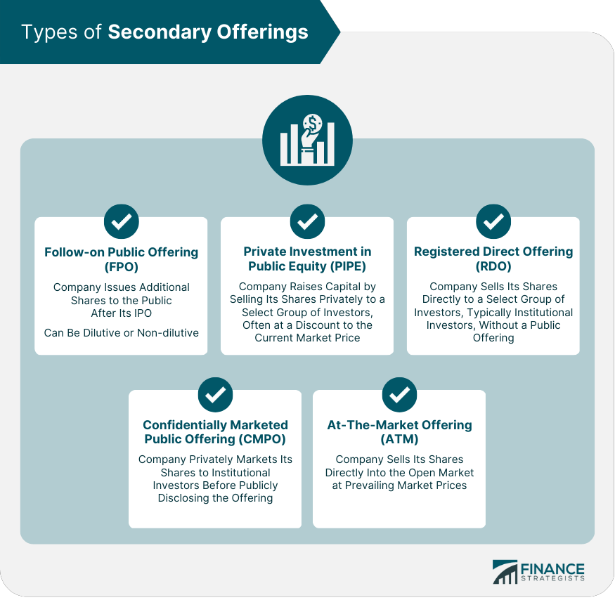

## Table of Contents

## What is a secondary offering?

A secondary offering is when a company that's already public sells more of its stock to the public. This is different from an initial public offering (IPO), which is when a company first sells its stock to the public. Companies do secondary offerings to raise more money. They might need this money to grow their business, pay off debts, or for other reasons.

Sometimes, the people who already own the company's stock, like early investors or company founders, might sell their shares in a secondary offering. This is called a secondary market offering. When this happens, the company doesn't get any money from the sale. Instead, the money goes to the people selling their shares. This can be a way for them to cash out some of their investment.

## How does a secondary offering differ from an initial public offering (IPO)?

A secondary offering happens after a company has already gone public, while an initial public offering (IPO) is the first time a company sells its stock to the public. When a company does an IPO, it's like opening its doors to the public for the first time. It's a big event where the company raises money by selling its shares to investors for the very first time.

In a secondary offering, the company is already public, and it's selling more shares to raise additional money. This can be used for things like expanding the business or paying off debts. Sometimes, in a secondary offering, it's not the company selling the shares but existing shareholders, like early investors or founders, who are selling their shares to the public. When this happens, the money goes to those shareholders, not the company.

## What are the main types of secondary offerings?

There are two main types of secondary offerings: non-dilutive and dilutive. A non-dilutive secondary offering is when existing shareholders, like early investors or company founders, sell their shares to the public. When this happens, the company doesn't get any money from the sale. The money goes to the people selling their shares. This type of offering doesn't change the total number of shares the company has, so it doesn't dilute the value of the existing shares.

A dilutive secondary offering is when the company itself sells new shares to the public. This means the company gets the money from the sale, which it can use for things like growing the business or paying off debts. However, because new shares are being added, the total number of shares goes up. This can dilute the value of the existing shares because the same value of the company is now spread over more shares.

## What is a dilutive secondary offering and how does it affect shareholders?

A dilutive secondary offering happens when a company sells new shares to the public. This means the company gets money from the sale, which it can use for things like growing the business or paying off debts. When the company sells new shares, it increases the total number of shares that are out there.

This increase in the number of shares can affect shareholders because it dilutes the value of their existing shares. Imagine the company's total value stays the same, but now it's spread over more shares. Each share is worth a little less than before. So, if you own shares in the company, your ownership percentage might go down, and the value of your investment could decrease because of the dilution.

## What is a non-dilutive secondary offering and when is it typically used?

A non-dilutive secondary offering is when people who already own shares in a company, like early investors or founders, sell their shares to the public. When this happens, the company doesn't get any money from the sale. Instead, the money goes to the people who are selling their shares. This type of offering is called non-dilutive because it doesn't change the total number of shares the company has. So, the value of the existing shares doesn't get diluted, meaning it doesn't go down because of more shares being added.

Non-dilutive secondary offerings are typically used when early investors or founders want to cash out some of their investment. They might need money for personal reasons or want to diversify their investments. It's also a way for them to take some profit from their investment without affecting the company's overall share count or the value of the shares for other investors. This type of offering can be attractive to the company because it doesn't dilute the value of the existing shares, which can be good for maintaining shareholder confidence.

## What are the steps involved in executing a secondary offering?

To execute a secondary offering, a company first decides if it wants to do a dilutive or non-dilutive offering. If it's a dilutive offering, the company will work with investment banks to set a price for the new shares they want to sell. They figure out how many shares to sell and when to do it. If it's a non-dilutive offering, the company helps existing shareholders, like early investors or founders, sell their shares. They work with investment banks to set a price for these shares too.

Next, the company files the necessary documents with the Securities and Exchange Commission (SEC) to get approval for the offering. This is important because it makes sure everything is legal and transparent. Once the SEC approves, the company and the investment banks start marketing the offering to potential investors. They might do roadshows or meetings to talk about why the offering is a good investment. After the marketing, the shares are sold to the public, and the money from the sale goes to the company if it's a dilutive offering, or to the shareholders selling their shares if it's a non-dilutive offering.

## What regulatory requirements must be met for a secondary offering?

To do a secondary offering, a company has to follow rules set by the Securities and Exchange Commission (SEC). The first step is to file a registration statement with the SEC. This document gives a lot of information about the company, like its financial health and what it plans to do with the money from the offering. The SEC looks at this to make sure everything is clear and honest. The company can't sell the new shares until the SEC says it's okay.

Once the SEC approves the registration, the company has to keep following other rules. They need to give investors a prospectus, which is like a guide that explains the offering in detail. The company also has to follow rules about how they talk about the offering to the public. They can't say things that aren't true or leave out important information. All of this is to make sure investors have the right information to make good choices about buying the shares.

## How does a secondary offering impact the stock price?

When a company does a secondary offering, it can affect the stock price in different ways. If it's a dilutive offering, where the company sells new shares, it can lower the stock price. This happens because more shares are out there, so the value of each share might go down. Also, if investors think the company is selling shares because it needs money and might be in trouble, they might sell their shares, which can push the price down even more.

On the other hand, if it's a non-dilutive offering, where existing shareholders are selling their shares, the impact on the stock price can be different. Since the total number of shares doesn't change, the value of each share might stay the same. But if investors see a lot of big shareholders selling their shares, they might worry that something is wrong with the company. This could make them sell their shares too, which might lower the stock price. So, the stock price can go down in both types of offerings, but for different reasons.

## What are the strategic reasons a company might choose to conduct a secondary offering?

A company might decide to do a secondary offering to get more money for its business. This money can be used to grow the company, like opening new stores or factories, or to pay off debts. It can also help the company buy other businesses or invest in new projects. By raising more money, the company can keep growing and stay strong in its market. This is important for companies that want to keep up with their competition or take advantage of new opportunities.

Sometimes, a secondary offering can be a good way for early investors or founders to get some of their money back. They might need cash for personal reasons or want to spread their investments around. When they sell their shares, it doesn't affect the company's total number of shares, so it's good for the company and the shareholders. This kind of offering can also show that the company is doing well because people are willing to buy the shares. It can make other investors feel more confident about the company's future.

## How can investors assess the potential impact of a secondary offering on their investment?

When a company does a secondary offering, investors should look at whether it's dilutive or non-dilutive. A dilutive offering means the company is selling new shares, which can lower the value of each share because there are more shares now. Investors should check how many new shares are being sold and think about how this might change the company's total value. They should also read the company's reasons for doing the offering. If the company says it needs the money to grow or pay off debts, investors should decide if they think those are good reasons.

In a non-dilutive offering, existing shareholders are selling their shares, so the total number of shares doesn't change. But investors should still be careful. They should look at who is selling the shares and why. If big shareholders are selling, it might mean they think the company's future isn't bright. Investors should also think about how the market might react. If other investors see a lot of shares being sold and start selling too, the stock price could go down. So, it's important for investors to do their homework and think about how the offering might affect their investment.

## What are the long-term effects of secondary offerings on a company's market position?

When a company does a secondary offering, it can affect its market position in the long run. If the offering is dilutive, meaning the company sells new shares, it might get more money to grow its business. This can help the company become stronger and take a better spot in the market. For example, it could use the money to open new stores or buy other companies, making it bigger and more competitive. But, if the stock price goes down a lot because of the offering, it might make the company look weaker to investors and customers, which could hurt its market position.

On the other hand, if the offering is non-dilutive, where existing shareholders sell their shares, the company doesn't get any money. But it can still affect the company's market position. If big shareholders sell a lot of shares, it might make other investors think something is wrong with the company. This could make the stock price go down and hurt the company's reputation. But if the market sees the offering as a sign that the company is doing well because people want to buy the shares, it could actually help the company's market position by making investors more confident.

## How do secondary offerings fit into broader corporate finance strategies?

Secondary offerings are a key part of a company's overall plan to manage its money. They let a company get more cash, which can be used to grow the business, pay off debts, or invest in new projects. When a company does a dilutive offering, it sells new shares and gets the money, which can help it do big things like buy other companies or open new factories. This can make the company stronger and help it compete better in its market. But, the company has to be careful because selling new shares can make the value of each share go down, which might upset current shareholders.

Non-dilutive offerings are also important for a company's money strategy, but in a different way. In these offerings, early investors or founders sell their shares, and the company doesn't get any money. But it can still be good for the company because it lets those shareholders get some of their money back, which can make them happy and keep them supporting the company. It also shows that people want to buy the company's shares, which can make other investors feel good about the company's future. So, secondary offerings, whether dilutive or non-dilutive, are tools that companies use to manage their money and keep growing.

## What is Understanding Secondary Offerings?

Secondary offerings refer to the sale of existing securities by shareholders and are distinct from an initial public offering (IPO), where new shares are created and sold to the public for the first time. This type of financial instrument is integral to the functioning of capital markets, providing [liquidity](/wiki/liquidity-risk-premium) and opportunities for investors to adjust their holdings based on market conditions and company performance.

There are two principal types of secondary offerings: non-dilutive and dilutive. 

1. **Non-dilutive Secondary Offerings**: In a non-dilutive secondary offering, existing shares that are already in circulation are sold by insiders, such as company executives, or large shareholders including institutional investors like venture capitalists or private equity firms. This process does not involve the creation of new shares, meaning the total number of shares outstanding remains unchanged. Non-dilutive offerings provide a means for large investors to liquidate their positions without affecting the company's equity structure or diluting existing shareholders' percentage of ownership. For example, if a venture capital firm that previously invested in a company before its IPO decides to sell its shares post-IPO, it engages in a non-dilutive secondary offering.

2. **Dilutive Secondary Offerings**: In contrast, dilutive secondary offerings involve the issuance of new shares, thus increasing the total number of shares available in the market. As a result, the existing shareholders' equity is reduced, or 'diluted', as their percentage ownership in the company decreases. The dilution occurs because the pie (i.e., total equity) is now divided among a greater number of shares. For instance, if a company with 1,000,000 shares outstanding issues an additional 200,000 shares, the ownership percentage of existing shareholders is reduced, unless they buy more shares to maintain their ownership percentage. This type of offering is often used by companies to raise capital for growth opportunities, debt reduction, or other corporate purposes.

Mathematically, the impact of a dilutive secondary offering can be illustrated by considering the earnings per share (EPS) before and after the offering. If a company has net earnings of $E$ and $N$ shares outstanding, the initial EPS is:

$$
\text{EPS}_{\text{initial}} = \frac{E}{N}
$$

After issuing $\Delta N$ new shares in a dilutive offering, the new number of shares outstanding becomes $N + \Delta N$, and the new EPS can be calculated as:

$$
\text{EPS}_{\text{after}} = \frac{E}{N + \Delta N}
$$

This formula shows that, all else being equal, the $\text{EPS}_{\text{after}}$ will invariably be lower unless the additional capital raised enhances earnings proportionally.

These mechanisms underline the distinct pathways through which secondary offerings can influence a company’s capital structure and shareholder composition. Understanding the differences between non-dilutive and dilutive offerings is critical for both issuers and investors, as these decisions can have significant longer-term impacts on stock value, investor sentiment, and strategic corporate objectives.

## What are the economic implications of secondary offerings?

Secondary offerings, whether dilutive or non-dilutive, have distinct economic implications for a company's stock price and the perception of investors. Understanding these implications can provide clarity on how these offerings are perceived in the market.

Dilutive offerings typically involve the issuance of additional shares, increasing the total number of shares outstanding. This can lead to a decrease in the share price as a result of the dilution effect, where each existing shareholder's equity is reduced due to the increase in share supply. The impact on share price can be approximated using the formula:

$$
P_{\text{new}} = \frac{(P_{\text{old}} \times N_{\text{old}}) + (P_{\text{offered}} \times N_{\text{new}})}{N_{\text{old}} + N_{\text{new}}}
$$

where $P_{\text{new}}$ is the new share price after the offering, $P_{\text{old}}$ is the old share price before the offering, $N_{\text{old}}$ is the number of shares outstanding before the offering, $P_{\text{offered}}$ is the price at which the new shares are offered, and $N_{\text{new}}$ is the number of new shares issued. The potential decrease in share price might generate concern among investors who are wary of the dilution of their investments and its effect on their voting power and dividend rights.

Conversely, in a non-dilutive offering, shares are sold by insiders or large shareholders, meaning no new shares are created. While this does not lead to dilution, it could still affect the stock price based on the perception of why these stakeholders are selling their shares. If the sale is interpreted as a lack of confidence from those close to the company, it might prompt a negative reaction from the market, possibly influencing the stock price downward. Nevertheless, non-dilutive offerings do not inherently alter the company's share supply, which may keep market impacts relatively contained compared to dilutive offerings.

In summary, both types of secondary offerings have specific economic implications determined by changes in share supply and investor sentiment. These factors collectively influence a company's stock price and stakeholder perceptions, shaping investment decisions and company strategies related to capital mobilization.

## References & Further Reading

[1]: Bergstra, J., Bardenet, R., Bengio, Y., & Kégl, B. (2011). ["Algorithms for Hyper-Parameter Optimization."](https://dl.acm.org/doi/10.5555/2986459.2986743) Advances in Neural Information Processing Systems 24.

[2]: ["Advances in Financial Machine Learning"](https://www.amazon.com/Advances-Financial-Machine-Learning-Marcos/dp/1119482089) by Marcos Lopez de Prado.

[3]: ["Evidence-Based Technical Analysis: Applying the Scientific Method and Statistical Inference to Trading Signals"](https://www.amazon.com/Evidence-Based-Technical-Analysis-Scientific-Statistical/dp/0470008741) by David Aronson.

[4]: ["Machine Learning for Algorithmic Trading"](https://github.com/stefan-jansen/machine-learning-for-trading) by Stefan Jansen.

[5]: ["Quantitative Trading: How to Build Your Own Algorithmic Trading Business"](https://www.amazon.com/Quantitative-Trading-Build-Algorithmic-Business/dp/1119800064) by Ernest P. Chan.

[6]: Myers, S. C., & Majluf, N. S. (1984). "Corporate Financing and Investment Decisions When Firms Have Information That Investors Do Not Have." Journal of Financial Economics, 13(2), 187-221. 

[7]: Metrick, A., & Yasuda, A. (2010). "Venture Capital and Other Private Equity: A Survey." European Financial Management, 16(3), 521-546.

[8]: Schwert, G. W. (1989). "Why Does Stock Market Volatility Change Over Time?" Journal of Finance, 44(5), 1115-1153.