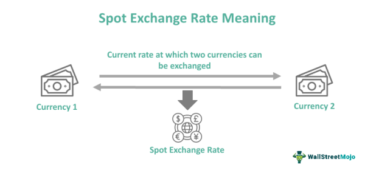

In modern financial markets, trading practices have evolved significantly, paving the way for innovative methods like algorithmic trading. Among the numerous strategies and terminologies that have emerged, "secondary definition spot algo trading" is particularly noteworthy. This article sets out to examine this complex topic, combining insights into spot secondary offerings with the automation capabilities of algorithmic trading.

Spot secondary offerings play a crucial role in financial markets by enabling the rapid reallocation of already issued securities. Understanding the mechanics of these transactions allows market participants to appreciate how liquidity can be swiftly generated without the procedural delays often associated with the Securities and Exchange Commission (SEC) registration. These offerings are typically executed quickly, often by the next business day, and primarily involve institutional investors.



On the other hand, algorithmic trading leverages computer algorithms to automate trading decisions and executions based on set parameters. These algorithms maximize efficiency by executing trades at optimal prices while minimizing transaction costs and market impact. The integration of such algorithms into secondary market activities allows investors to swiftly capitalize on trading opportunities. When combined, these elements enhance trading performance and market efficiency by facilitating large block executions with speed and precision.

This article explores the complexities behind secondary market dynamics and their algorithmic synchronization. As we proceed, we will dissect how these components interplay to elevate market liquidity, empower institutional investors, and drive the evolution of trading systems. This examination aims to provide readers with a comprehensive understanding of the synergies between spot secondary offerings and algorithmic trading, preparing them to engage effectively in an increasingly sophisticated marketplace.

## Table of Contents

## Understanding Secondary Definitions in Trading

The concept of 'secondary' in trading refers to transactions occurring in the secondary market, where securities undergo buying and selling after their initial issuance. This market is integral to financial systems, offering a platform where securities like stocks and bonds, once issued in the primary market, transition to subsequent trading between investors. The primary market is characterized by the issuance of new securities directly from issuing companies or entities to investors, facilitating capital formation. In contrast, the secondary market functions as a venue for existing securities, enabling investors to buy and sell them among themselves.

The secondary market's importance lies heavily in its role in providing liquidity. Liquidity is the ease with which an asset can be converted into cash without significantly affecting its price. High liquidity is essential for investors, as it ensures the quick sale of securities at fair market value. Additionally, the secondary market serves a pivotal function in price discovery, the process by which market prices are determined through the interaction of buyers and sellers. These market activities allow for the reflection of all available information in securities' prices, promoting transparency and efficiency. 

The dynamics between secondary and primary markets are notable in their differences concerning trading mechanisms and participants. Primary markets involve direct transactions between the issuer and investors, often facilitated by investment banks and underwriters. These transactions typically adhere to stringent regulatory requirements, as they involve new securities entering the market. Conversely, secondary markets feature transactions primarily among investors, with less direct involvement from the issuing entities. This environment encourages diverse participants, ranging from individual investors to institutional traders, such as mutual funds, hedge funds, and pension funds. 

Trading within secondary markets can occur in organized exchanges or over-the-counter (OTC) platforms. Organized exchanges, such as the New York Stock Exchange (NYSE), provide a structured environment with standardized rules and regulations. Conversely, OTC markets enable trading without a central exchange, often resulting in less transparency but greater flexibility in terms of securities traded, including those not listed on formal exchanges. 

In understanding the secondary market's intricate dynamics, it becomes evident that these mechanisms facilitate a vibrant ecosystem for securities trading, fostering stability and growth in the broader financial market.

## Spot Secondary Offerings: A Deeper Look

A spot secondary offering is a specific type of financial transaction involving the sale of already issued securities. These transactions are typically directed toward institutional investors, including hedge funds, mutual funds, and insurance companies. The distinctive feature of spot secondary offerings is their expeditious nature, characterized by execution timelines that often complete by the next business day. This rapid execution is facilitated by the lack of requirement for Securities and Exchange Commission (SEC) registration, distinguishing them from more traditional secondary offerings that involve more extended processing periods due to registration demands.

### Characteristics and Advantages

Spot secondary offerings provide immediate [liquidity](/wiki/liquidity-risk-premium), a significant advantage for issuers seeking quick capital infusion. This immediacy is crucial in dynamic market environments where timing can influence financial outcomes. By circumventing the typical SEC registration process, issuers can respond to market opportunities more swiftly and efficiently. The absence of regulatory delays allows for prompt adjustments to investment portfolios, thereby enhancing market liquidity and accommodating the fluidity of capital allocation.

### Process and Key Participants

In a spot secondary offering, the process begins with the issuer partnering with investment banks or financial intermediaries. These intermediaries play a vital role in structuring and marketing the offering to potential institutional buyers. Their expertise ensures the offering is appropriately priced and timed to align with market conditions, optimizing the likelihood of successful execution.

The participants involved in spot secondary offerings include:

- **Issuers:** These are typically corporate entities or institutional investors seeking to reallocate or liquidate substantial blocks of securities.
- **Investment Banks/Intermediaries:** They facilitate the transaction, providing crucial market insights and leveraging their networks to place the securities with institutional buyers.
- **Institutional Investors:** As the primary buyers, they acquire the securities, thus enabling the issuers to achieve their liquidity goals.

### Mechanisms of Transaction

The mechanics of spot secondary offerings involve a streamlined process designed to enable the swift redistribution of securities in the market. The absence of SEC registration means that legal and regulatory review periods are minimized, thus expediting transaction timeframes significantly. For the theoretical underpinning, consider a scenario where $n$ number of shares are being offered. If the market has a prevailing demand characterized by $D$, the offering could be appropriated using algorithmic strategies to match $n$ with potential $D$ swiftly, ensuring optimal pricing and liquidity distribution.

Furthermore, technological advancements and [algorithmic trading](/wiki/algorithmic-trading) systems can be employed to enhance the efficiency of these transactions, allowing for the rapid identification of market demand and strategic placement of securities. This integration leverages both speed and precision, pivotal for achieving favorable trading outcomes.

In conclusion, spot secondary offerings embody a strategic financial maneuver that accelerates capital mobilization by leveraging market dynamics and institutional investment networks. Understanding their mechanics and benefits provides critical insights into how securities can be redistributed quickly and efficiently, highlighting their integral role in modern financial markets.

## Algorithmic Trading: Optimizing Market Actions

Algorithmic trading, commonly known as algo trading, is the practice of using computer algorithms to automate trading activities according to predefined criteria. This method has transformed modern financial markets by enabling traders to execute orders at optimal prices while minimizing the impact on the market and reducing transaction costs. Algorithms determine how to manage and execute trades by analyzing multiple market variables, including price, timing, and [volume](/wiki/volume-trading-strategy).

The efficacy of algorithmic trading stems from its ability to process and analyze vast quantities of financial data at speeds unattainable by human traders. This capacity allows for strategic insights and precise timing, crucial for capitalizing on fleeting market opportunities. Algo trading systems can incorporate a variety of strategies, such as statistical [arbitrage](/wiki/arbitrage), [market making](/wiki/market-making), and [trend following](/wiki/trend-following), each tailored to exploit specific market behaviors or inefficiencies.

One of the primary algorithms used in trading is the "Volume Weighted Average Price" (VWAP) algorithm, which aims to execute trades close to the average price over a specific time period, thereby reducing market impact. Another commonly employed algorithm is the "Implementation Shortfall," designed to minimize the difference between the decision price when a trade is initiated and the actual execution price. Both algorithms are designed to ensure that trades are completed efficiently without significant deviation from desired execution strategies.

In a broader context, algorithmic trading has catalyzed significant changes in how markets operate. It has increased market liquidity, as orders are rapidly filled across various platforms, contributing to smoother transitions between supply and demand. Furthermore, the capability of algorithms to utilize complex mathematical models enhances prediction accuracy, facilitating strategic investment decisions. Algorithms like pairs trading exploit statistical relationships between pairs of securities to identify and profit from discrepancies in their relative movements.

The revolution brought about by algorithmic trading is marked by the continuous development of more sophisticated algorithms that adapt to evolving market conditions. Machine learning and [artificial intelligence](/wiki/ai-artificial-intelligence) techniques are increasingly being integrated into trading systems, offering enhanced predictive power and adaptability. These advancements promise to refine trading strategies further, as algorithms learn and improve from historical data to optimize future trading actions.

In conclusion, algorithmic trading has profoundly impacted market operations by offering rapid, precise, and cost-effective trading solutions. As technology advances, algorithmic strategies continue to evolve, shaping an increasingly dynamic and efficient financial landscape.

## Integrating Spot Secondary and Algorithmic Trading

Integrating spot secondary offerings with algorithmic trading forms an advanced and efficient trading system that enhances the execution of rapid transactions in the secondary market. This integration leverages the capabilities of algorithmic trading to swiftly identify and capitalize on opportunities within spot secondary markets, making use of its speed and precision. Algorithms can be programmed with specific criteria to effectively recognize advantageous moments for acquiring or selling securities, allowing for optimal price execution and reduced market impact.

For institutional investors, this integration becomes a powerful tool for managing large blocks of securities. Spot secondary offerings allow these investors to gain immediate liquidity without the delays typically associated with SEC registration. When combined with algorithmic trading, the process is streamlined, enabling quick capital reallocations and the efficient handling of substantial investment portfolios. This synergy helps mitigate risks, as the automated processes can adjust to market conditions in real-time, reducing human error and enhancing overall market liquidity.

Case studies and scenarios demonstrate the tangible benefits of integrating spot secondary offerings with algorithmic trading. One such example involves the accelerated bookbuild method commonly employed in spot secondary offerings. Here, algorithms can process vast amounts of data quickly to determine pricing dynamics and investor demand, enabling the execution of large trades with minimal price disturbance. As a result, companies can swiftly raise capital, and investors can respond proactively to market conditions.

Another noteworthy scenario is the application of [machine learning](/wiki/machine-learning) algorithms in predicting market trends and optimizing the timing of secondary offerings. By analyzing historical data and identifying patterns, these sophisticated algorithms provide strategic insights that can significantly enhance trading outcomes. Additionally, the flexibility of algorithmic trading allows for continuous improvement as algorithms are updated to align with evolving market environments, ensuring relevance and efficacy.

The future potential of integrating spot secondary and algorithmic trading points toward increasingly sophisticated and adaptive systems. As technology and data analytics continue to advance, the precision and speed of algorithmic trading will likely become even more fine-tuned, enabling faster and more efficient capital flows across markets.

In summary, the integration of spot secondary offerings with algorithmic trading represents a forward-thinking approach that can improve trading performance, enhance liquidity management, and offer strategic advantage to market participants. As this technology evolves, it will likely drive further innovations in financial markets, paving the way for increasingly seamless and effective trading systems.

## Risks and Considerations

Combining spot secondary offerings with algorithmic trading presents numerous opportunities for enhancing market efficiency, yet it is not devoid of risks and challenges. One significant concern is market [volatility](/wiki/volatility-trading-strategies). In volatile markets, sudden price swings can impact the execution of trades, potentially resulting in adverse price movements before completion. Algorithmic strategies, which often rely on historical data and assumptions of normal market behavior, may struggle to adapt swiftly in such environments.

Algorithmic errors pose another important risk. Misconfigurations, coding errors, or unforeseen algorithmic behaviors can lead to incorrect trade executions, which might result in financial losses or market disruptions. As algorithms rely heavily on the accuracy and integrity of data, there is also a risk associated with data quality and latency issues. Failure to update algorithms to reflect current market conditions can exacerbate these risks. Consequently, maintaining a robust system for continuous algorithm testing and validation is crucial.

Regulatory challenges also present significant hurdles. Financial markets are subject to stringent regulatory oversight designed to ensure fair and safe trading environments. Algorithms that do not comply with these regulations can lead to penalties or restrictions. Markets like the U.S. and Europe have specific guidelines for algorithmic trading and spot offerings, requiring traders to stay informed of legal updates and maintain compliance-aware coding practices.

Given these risks, investors and traders must implement comprehensive risk management strategies. This includes setting strict stop-loss limits, using real-time monitoring systems to detect discrepancies promptly, and diversifying investment strategies to mitigate the impact of unforeseen market events. In terms of algorithmic adjustments, incorporating machine learning methods can enhance adaptability. For example, [reinforcement learning](/wiki/reinforcement-learning) models can be utilized to allow algorithms to learn and adapt to real-time market conditions dynamically:

```python
import pandas as pd
from sklearn.ensemble import RandomForestRegressor
from sklearn.model_selection import train_test_split

# Load market data
data = pd.read_csv('market_data.csv')

# Preprocess data
features = data.drop(['target'], axis=1)
target = data['target']

# Split data into training and testing
X_train, X_test, y_train, y_test = train_test_split(features, target, test_size=0.2, random_state=42)

# Train a Random Forest model
model = RandomForestRegressor(n_estimators=100, random_state=42)
model.fit(X_train, y_train)

# Predictions
predictions = model.predict(X_test)

# Output predictions
print(predictions)
```

This simple example shows how machine learning can be integrated into trading strategies for better predictions in volatile markets. By continuously refining algorithmic models and incorporating emerging technologies, traders can better safeguard against various risks and navigate the dynamic landscape of modern financial trading.

## Conclusion

The integration of spot secondary offerings with algorithmic trading techniques signifies a significant advancement in modern financial markets. By combining the immediate liquidity provided by spot secondary transactions with the precision and speed of algorithmic trading, this synergy enhances overall liquidity management. It enables swift reallocation of capital and offers strategic investment opportunities, benefiting both institutional investors and the markets at large.

As technological innovations continue to reshape the trading landscape, we can expect the emergence of even more sophisticated and efficient systems. This progression will likely involve the development of advanced trading algorithms with improved capabilities in data processing and predictive analytics, supported by machine learning and artificial intelligence.

A thorough understanding of how spot secondary offerings and algorithmic trading intersect equips investors and financial professionals to leverage these developments effectively. It fosters a more agile approach to navigating future market conditions, enabling participants to make informed decisions that can maximize returns while mitigating risks. As these methodologies evolve, they promise to redefine trading strategies, offering new avenues for achieving financial objectives with heightened accuracy and minimal latency.

## References & Further Reading

[1]: Bergstra, J., Bardenet, R., Bengio, Y., & Kégl, B. (2011). ["Algorithms for Hyper-Parameter Optimization."](https://dl.acm.org/doi/10.5555/2986459.2986743) Advances in Neural Information Processing Systems 24.

[2]: ["Advances in Financial Machine Learning"](https://www.amazon.com/Advances-Financial-Machine-Learning-Marcos/dp/1119482089) by Marcos Lopez de Prado

[3]: ["Evidence-Based Technical Analysis: Applying the Scientific Method and Statistical Inference to Trading Signals"](https://www.amazon.com/Evidence-Based-Technical-Analysis-Scientific-Statistical/dp/0470008741) by David Aronson

[4]: ["Machine Learning for Algorithmic Trading"](https://github.com/stefan-jansen/machine-learning-for-trading) by Stefan Jansen

[5]: ["Quantitative Trading: How to Build Your Own Algorithmic Trading Business"](https://www.amazon.com/Quantitative-Trading-Build-Algorithmic-Business/dp/1119800064) by Ernest P. Chan