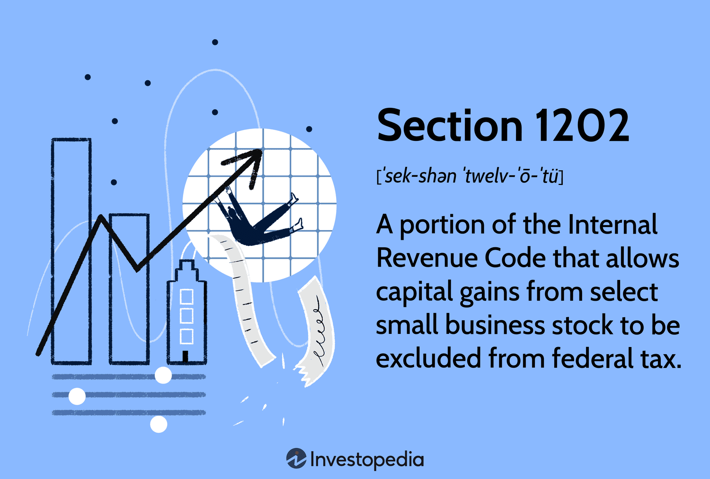

The Internal Revenue Code (IRC) Section 1202, also known as the Qualified Small Business Stock (QSBS) provision, is a significant element in U.S. tax law designed to incentivize investment in small businesses. By offering substantial tax benefits to investors, Section 1202 aims to encourage economic growth and innovation. Primarily, it allows non-corporate taxpayers to exclude a major portion, or sometimes all, of the gain realized from the sale of QSBS, provided certain conditions are met. This incentive plays a crucial role in bolstering small businesses, which are often considered the backbone of the U.S. economy due to their role in job creation and innovation.

Small business tax benefits, such as those provided by Section 1202, have notable implications. They provide much-needed capital to small enterprises, facilitating their expansion and capability to compete in larger markets. These benefits also play a part in risk mitigation for investors by reducing the financial impact of potential losses. As a result, they encourage investments in startups and smaller enterprises that might otherwise be considered too risky.



In parallel, the last few decades have witnessed the rise of algorithmic trading, known as algo trading, which is transforming the financial landscape. Algorithmic trading involves the use of computer programs to execute trades at speeds and volumes unimaginable to human traders. It leverages mathematical models and algorithms to make trading decisions, optimize timing, and execute trades based on pre-set criteria. The rise of algo trading is reshaping investment strategies by offering advantages such as increased execution speed, reduced transaction costs, and the ability to exploit market inefficiencies.

The intersection of IRC Section 1202, small business tax incentives, and algorithmic trading creates opportunities for strategic financial planning. By aligning algo trading strategies with the tax benefits of Section 1202, investors and small businesses can potentially optimize their financial outcomes. This synergy can enhance investors' portfolio diversification and capital gains, which are partially tax-exempt due to the QSBS provision, thus maximizing returns. 

The purpose of this article is to explore the integration of these three domains. We aim to elucidate the benefits and methods of aligning algo trading with Section 1202, examine case studies demonstrating successful implementation, and provide insights into future trends. By understanding these concepts, investors and small businesses can better navigate the financial landscape, optimize their tax positions, and contribute to economic growth.

## Table of Contents

## What is IRC Section 1202?

IRC Section 1202, commonly referred to as the Qualified Small Business Stock (QSBS) provision, is a section of the U.S. Internal Revenue Code designed to incentivize investment in small businesses by offering significant tax benefits to investors. It allows for the exclusion of capital gains from federal taxes, making investments in eligible small businesses financially attractive to investors.

### Definition and Scope

Section 1202 was enacted as part of the Revenue Reconciliation Act of 1993. It provides tax benefits specifically to investors who purchase qualifying small business stock from original issuers and hold the investment long enough to meet specific criteria. The primary goal of this section is to encourage investments in small and emerging businesses by reducing the tax burden associated with capital gains.

### Historical Context and Legislative Background

The legislative inception of IRC Section 1202 can be traced back to the economic policies of the early 1990s, which aimed to foster job creation and innovation through enhanced access to capital for small businesses. Over the years, several amendments have expanded and clarified the provision, most notably with the Small Business Jobs Act of 2010. This act increased the capital gains exclusion percentage, thereby enhancing the attractiveness of investing in qualified small business stocks.

### Key Benefits Offered to Investors

Under IRC Section 1202, investors can potentially exclude up to 100% of the capital gains they realize from the sale of QSBS, depending on when the stock was acquired. The maximum gain eligible for the exclusion is the greater of $10 million or 10 times the adjusted basis of the stock. This exclusion is particularly appealing to investors as it can translate into substantial tax savings, thus making small business investments less risky and more rewarding.

### Eligibility Criteria and Holding Period Requirements

For an investment to qualify as QSBS, several criteria must be met:

1. **Qualified Issuer:** The stock must be issued by a C corporation with gross assets not exceeding $50 million at the time of issuance.

2. **Original Issuer Requirement:** Stock must be acquired directly from the corporation at its original issue, either in exchange for money, property (not including stock), or as compensation for services.

3. **Qualified Trade or Business:** The issuing corporation must be engaged in a “qualified trade or business.” Certain industries, such as financial and professional services, are excluded from qualification.

4. **Holding Period:** Investors must hold the QSBS for more than five years to benefit from the full exclusion of capital gains. A sale of the stock before the five-year threshold may limit or negate the tax benefits.

These conditions establish a framework that rewards long-term investment in small, developing businesses, aligning investor interests with broader economic growth goals. This makes Section 1202 a powerful tool for entrepreneurs seeking to attract investor capital while offering investors avenues to mitigate the capital gains tax implications of their investments.

## Understanding Algo Trading

Algorithmic trading, often referred to as algo trading, is the process of using computer algorithms to automate trading decisions based on pre-programmed instructions. These instructions can account for variables such as timing, price, and [volume](/wiki/volume-trading-strategy), enabling traders to execute orders at speeds and frequencies that would be impossible for a human to achieve.

**Significance of Algorithmic Trading**

Algo trading has become a crucial aspect of modern financial markets, enhancing market [liquidity](/wiki/liquidity-risk-premium) and promoting efficient price discovery. Its significance lies in the capability to analyze vast datasets and execute trades without human intervention, thereby minimizing emotional biases and errors. The increased efficiency reduces transaction costs and improves execution quality, leading to more optimal trading outcomes.

**How Algo Trading is Changing the Financial Landscape**

Algorithmic trading is redefining the financial landscape by providing new ways to manage investments and trade financial instruments. It has democratized access to sophisticated trading strategies, allowing both institutional and retail investors to deploy tactics once reserved for the most experienced professionals. With the proliferation of data analytics, [machine learning](/wiki/machine-learning), and [artificial intelligence](/wiki/ai-artificial-intelligence), these algorithms have become more advanced, offering capabilities such as high-frequency trading ([HFT](/wiki/high-frequency-trading-strategies)) and algorithmic [arbitrage](/wiki/arbitrage), which further deepens market efficiency.

**Benefits and Challenges of Incorporating Algo Trading in Investment Strategies**

The primary benefits of incorporating algo trading into investment strategies include increased speed and accuracy in order execution, reduced transaction costs, and the ability to process multiple variables and data streams simultaneously. These advantages can lead to improved returns on investment.

However, the challenges associated with algo trading are significant. They include the risk of over-optimization, potential technical failures, compliance with regulatory requirements, and the need for continuous monitoring and adjustment of algorithms. Additionally, the complexity of developing effective trading algorithms requires a substantial investment in technological infrastructure and expertise.

**Potential Applications of Algorithmic Trading for Small Businesses**

For small businesses, [algorithmic trading](/wiki/algorithmic-trading) can offer several applications. It can be employed to manage treasury functions, optimize cash flows, and hedge currency or [interest rate](/wiki/interest-rate-trading-strategies) risks. By utilizing algo trading, small businesses can enhance their financial operations without the necessity of maintaining an extensive financial department. For small brokerage firms or financial startups, algo trading offers a way to compete effectively with larger institutions by capitalizing on niche strategies and market inefficiencies.

In conclusion, algorithmic trading represents a significant evolution in financial markets, providing enhanced trading capabilities and competitive advantages. However, it requires careful consideration of the associated challenges and a robust infrastructure to fully leverage its potential.

## Tax Benefits for Small Businesses under Section 1202

Section 1202 of the Internal Revenue Code (IRC), commonly referred to as the provision for Qualified Small Business Stock (QSBS), offers substantial tax benefits to investors in small businesses. Primarily, this provision allows eligible investors to exclude a significant portion of capital gains realized from the sale of QSBS, provided specific criteria are met. Initially, the exclusion rate was set at 50%, but successive amendments have increased this percentage. For stocks acquired after September 27, 2010, the exclusion stands at 100%, thereby allowing investors to exclude the entire gain from federal income tax, subject to certain limitations.

### Key Benefits and Requirements

The primary tax benefit of Section 1202 is the exclusion of capital gains on QSBS held for more than five years. To qualify, the small business must be a C corporation, and the aggregate gross assets must not exceed $50 million at the time the stock is issued. Additionally, at least 80% of the corporation's assets must be used in the active conduct of one or more qualified trades or businesses.

The exclusion cap is the greater of $10 million or ten times the adjusted basis of the investment in QSBS. It's important to note that while federal taxes may be mitigated under Section 1202, state taxes can still apply, depending on the specific state's conformity with federal QSBS rules.

### Examples of Capital Gains Tax Exemptions

For instance, consider an investor who purchases $1 million of QSBS and holds it for over five years. If the sale of this stock results in a $3 million capital gain, and assuming the stock was acquired post-September 27, 2010, the entire gain could be excluded from federal taxation under Section 1202. 

### Case Studies

A prominent example of Section 1202's application can be seen in the tech industry, where startups frequently qualify under this provision. Investors in these companies often benefit from substantial exclusions on gains, promoting further investments in innovative small businesses. A case study could involve an investor in a biotech startup that meets the QSBS criteria, where, after a successful [exit](/wiki/exit-strategy), significant gains were excluded, encouraging reinvestment into emerging biotech enterprises.

### Impact on Small Business Investments

Section 1202 has a positive impact on small business investments, primarily by incentivizing investors to provide capital to qualifying companies. This provision encourages long-term investments, as the five-year holding requirement aligns investor interests with sustainable business growth. Consequently, small businesses experience enhanced capital availability, which can be crucial for expansion and innovation. The overall effect can lead to increased entrepreneurship, job creation, and economic development within sectors that qualify under Section 1202.

The implementation of Section 1202 highlights its role in fostering a conducive environment for small business growth in the United States, underpinned by significant tax incentives. By reducing the tax burden on investors, subsequent investments in small businesses become more attractive, promoting a cycle of growth and innovation.

## Aligning Algo Trading with Section 1202

Integrating algorithmic trading strategies with the tax advantages predicted by Internal Revenue Code (IRC) Section 1202 offers a novel approach to optimizing financial outcomes for small businesses and investors. Section 1202 provides substantial tax benefits on capital gains for investments in Qualified Small Business Stock (QSBS), making it an attractive proposition for contemporary investors, particularly those employing sophisticated trading algorithms.

Algorithmic trading, or algo trading, represents the use of complex algorithms to automate and optimize trading decisions, offering an opportunity for investors to enhance their trading efficiency and precision. When algo trading is aligned with Section 1202-qualified investments, investors can perpetuate long-term positions in stocks while enjoying considerable tax savings on any appreciated value, provided they meet certain conditions such as a five-year holding period. 

### Integration of Algo Trading Strategies with Section 1202

By employing algo trading strategies, investors can identify and capitalize on promising stocks that qualify under Section 1202. These algo systems utilize advanced data analytics and quantitative models to assess market conditions, evaluate investment risks, and predict stock performance. Thus, aligning an algo trading system with the characteristics of QSBS can ensure optimal selection and management of qualifying stocks.

Consider a Python-based algorithm designed to filter potential investments. An example script could include:

```python
def check_qsbs(stock):
    # Placeholder for logic to confirm if a stock qualifies for Section 1202
    # This includes checking the stock's business structure, industry, and other criteria
    is_qsbs = qualified_stock_criteria(stock)
    return is_qsbs

def select_investments(stocks):
    chosen_stocks = []
    for stock in stocks:
        if check_qsbs(stock):
            # Further analysis and decision-making logic would go here
            chosen_stocks.append(stock)
    return chosen_stocks

# Example use:
# stocks is a list of potential stock investments
qualified_stocks = select_investments(stocks)
```

### Leveraging Section 1202 through Algorithmic Trading

Investors can leverage algorithmic trading to maintain diversification while still benefiting from substantial tax breaks under Section 1202. The ability to programmatically execute trades enables a more systematic approach in adhering to the necessary holding requirements, hence optimizing tax efficiency and investment timing.

### Adoption Mechanisms for Small Businesses and Investors

Small businesses can adopt algo trading by integrating these technologies into investment management strategies, which can broaden the scope of available capital and investment opportunities. Meanwhile, investors, particularly angel investors and venture capitalists, can use algorithms to efficiently monitor and manage portfolios that include QSBS, ensuring compliance with Section 1202 requirements and maximizing potential returns.

### Best Practices and Expert Insights

Experts suggest establishing a robust compliance framework to confirm that trading activities adhere to Section 1202 stipulations. This involves a careful review of the issuing company's qualification as a small business and ongoing assessment of stock holdings to maintain eligibility. Aligning algo trading systems with tax planning strategies could further optimize investment decisions and tax advantages.

In sum, the integration of algorithmic trading with IRC Section 1202 presents a strategic advantage for investors seeking to maximize returns through tax-efficient methodologies. By leveraging technology alongside sophisticated investment strategies, both small businesses and investors are positioned for enhanced financial performance within the legal framework provided by Section 1202.

## Amendments and Changes in Section 1202

Since its inception, Internal Revenue Code (IRC) Section 1202 has seen several amendments that have shaped its current framework and application. Understanding these changes is crucial for small business investors, especially within the context of an evolving financial landscape that increasingly incorporates algorithmic trading (algo trading) strategies.

### Key Amendments in Section 1202

Initially enacted as part of the Revenue Reconciliation Act of 1993, Section 1202 was designed to incentivize investment in small businesses by offering exclusion from capital gains tax on the sale of Qualified Small Business Stock (QSBS). Over the years, there have been significant amendments:

1. **Exclusion Percentage Increase**: Originally, Section 1202 allowed a 50% exclusion of capital gains from the sale of QSBS held for more than five years. Subsequent amendments increased this exclusion to 75% and then to 100%, post-September 27, 2010, under the Small Business Jobs Act and further solidified by the American Taxpayer Relief Act of 2012. The 100% exclusion dramatically increased the appeal of qualifying investments, providing a robust incentive to support small business capital formation.

2. **Alternative Minimum Tax (AMT) Relief**: Historically, the gains eligible for exclusion under Section 1202 were subjected to the Alternative Minimum Tax, diminishing its full benefit. However, the Protecting Americans from Tax Hikes Act of 2015 provided AMT relief, allowing the full exclusion from both regular and AMT income.

### Current Legislative Landscape and Future Outlook

As of 2023, Section 1202 plays a vital role in small business investment strategies, particularly with the high section 1202 exclusion and exclusion from AMT. The future outlook of Section 1202 remains tied to broader economic and fiscal policies, with potential changes likely in response to governmental financial strategies and small business advocacy.

Legislative discussions have occasionally broached the idea of revising eligibility criteria, potentially broadening or narrowing the types of businesses that can benefit. Such changes would significantly impact the investment landscape.

### Impact on Small Business Investors and Algorithmic Trading

The amendments to Section 1202 have reinforced its role in promoting small business investment by reducing the financial burden of capital gains taxes. For investors employing algo trading strategies, Section 1202 offers additional layers of financial efficiency. Algorithmic trading can help identify and execute trades in companies that qualify for QSBS, thus optimizing investment portfolios not only for performance gains but also for tax efficiencies.

### Adaptations for Compliance and Maximization of Benefits

To fully maximize the benefits of Section 1202, investors and entrepreneurs should adhere closely to eligibility requirements. Ensuring compliance involves:

- **Diligent Record-keeping**: Maintain comprehensive records to confirm QSBS status, such as the date of stock issuance, business type, and verification of meeting the active business requirement.

- **Strategic Planning**: For businesses seeking to qualify as QSBS, consultation with tax advisors or legal professionals is essential. Strategic business structuring and operational adjustments can enhance compliance prospects.

Implementing such practices, particularly when integrated with modern investment strategies like algo trading, can yield substantial fiscal benefits. Investors and small businesses are encouraged to proactively engage with legal and financial professionals to navigate the complexities of Section 1202 efficiently, leveraging its benefits to foster growth and innovation in the small business sector.

## Choosing the Right Business for Section 1202

### Choosing the Right Business for Section 1202

IRC Section 1202, also known as the Qualified Small Business Stock (QSBS) exclusion, provides significant tax benefits to investors in qualifying small businesses. However, not all businesses are eligible for these benefits. Understanding the criteria and exclusions is critical for both entrepreneurs and investors aiming to tap into Section 1202 advantages.

#### Criteria for a Business to Qualify under IRC Section 1202

To qualify for the QSBS exclusion, a business must meet several criteria:

1. **Corporate Structure**: The business must be a C corporation at the time of the stock issuance and during substantially all of the holding period. S corporations, partnerships, and LLCs are excluded.

2. **Active Business Requirement**: At least 80% of the corporation's assets must be actively used in the conduct of one or more qualified trades or businesses. This is evaluated at the organizational level.

3. **Gross Asset Test**: The corporation's assets must not exceed $50 million at any time before or immediately after the stock issuance. It's important to include both cash and the aggregate adjusted basis of the corporation's other assets in this calculation.

4. **Qualified Business Type**: The business must not fall into specific excluded categories, which are detailed in the next section.

5. **Issuance Requirement**: The stock must be originally issued, meaning it cannot be acquired through a secondary market or gifted.

#### Which Types of Businesses are Excluded?

Under IRC Section 1202, several business categories are specifically excluded from the QSBS benefits:

- **Service Businesses**: Professions such as health, law, engineering, architecture, accounting, actuarial science, performing arts, consulting, athletics, financial services, and brokerage services are excluded.

- **Banking, Insurance, Leasing**: Businesses involved in banking, insurance, financing, leasing, and similar activities are also ineligible.

- **Farming and Extractive Industries**: Businesses engaged in farming, the production of oil and gas, or mining activities are excluded.

- **Hospitality**: Running a hotel, motel, restaurant, or similar business does not qualify for QSBS benefits.

#### Practical Tips for Business Structuring to Qualify for QSBS

To qualify under IRC Section 1202, businesses should consider the following strategies:

- **Incorporate as a C Corporation**: Ensure that the initial structuring of the business is as a C corporation. Consider the tax implications and consult with an accountant or tax attorney to ensure alignment with long-term goals.

- **Asset Allocation**: Regularly review the allocation of business assets to ensure that at least 80% are used for active business purposes. This may involve maintaining detailed records and conducting periodic asset reviews.

- **Monitor Valuation**: Keep track of the company's asset valuation to stay below the $50 million threshold. This requires diligence in asset management and potential restructuring to maintain eligibility.

- **Documentation and Record-Keeping**: Maintain comprehensive documentation of stock issuances and compliance with eligibility criteria to prepare for potential future audits.

#### Mitigating Risks and Ensuring Compliance

Compliance with IRC Section 1202 involves navigating complex regulations and maintaining eligibility throughout the investment period. To mitigate risks:

- **Regular Audits and Compliance Checks**: Conduct regular audits to ensure alignment with QSBS requirements, focusing on asset use and corporate structure.

- **Legal and Financial Advisory**: Engage legal and financial advisors with experience in QSBS to ensure ongoing compliance and to stay informed about legislative changes or IRS guidance.

- **Effective Communication with Investors**: Keep investors informed about the corporate structure and asset allocation to reassure them of the business's compliance with Section 1202.

By adhering to these criteria, exclusions, and best practices, businesses can position themselves effectively to take advantage of the tax benefits provided by IRC Section 1202, fostering potential growth and investment attraction.

## Conclusion

Section 1202 of the Internal Revenue Code (IRC) provides significant tax incentives for individuals investing in qualified small business stocks (QSBS). These benefits can be crucial for investors seeking to optimize their tax strategies while supporting emerging enterprises. Understanding the nuances of Section 1202 is paramount for both investors and small businesses to maximize these benefits. By providing capital gains tax exclusions, Section 1202 encourages investment in small businesses, potentially leading to innovation and economic growth.

Algorithmic trading is revolutionizing the financial landscape, offering new avenues for managing investments efficiently. The integration of algorithmic trading with Section 1202-qualified investments presents unique opportunities, enabling investors to automate and optimize their trading strategies while taking advantage of tax incentives. Investors who leverage algorithms can potentially achieve greater returns by swiftly navigating the complexities of modern financial markets.

Staying informed about amendments and changes to Section 1202 is critical for both investors and businesses to ensure compliance and benefit maximization. The legislative environment surrounding Section 1202 can affect the operational aspects of qualifying investments, with potential implications for planning and strategy development.

To fully capitalize on Section 1202 opportunities, it is advisable for investors and entrepreneurs to consult with financial professionals. These experts can provide tailored advice that considers individual circumstances and objectives, ensuring that stakeholders make well-informed decisions regarding small business investments and the utilization of tax benefits. As the landscape of small business investments and algorithmic trading evolves, staying informed and adaptable remains key to unlocking their full potential.

## References & Further Reading

[1]: Laroque, M. (2014). ["The Role and Advantages of the Qualified Small Business Stock Exclusion in the Current Tax Environment."](https://www.thetaxadviser.com/issues/2021/nov/qualified-small-business-stock-exclusion-eligible.html) Journal of Accountancy.

[2]: Pratt, S.P., & Niculita, A. (2007). [Valuing a Business: The Analysis and Appraisal of Closely Held Companies](https://www.amazon.com/Valuing-Business-6th-Appraisal-Companies/dp/1260121569). McGraw-Hill Education.

[3]: de Prado, M.L. (2018). ["Advances in Financial Machine Learning"](https://www.amazon.com/Advances-Financial-Machine-Learning-Marcos/dp/1119482089). John Wiley & Sons.

[4]: Chan, E.P. (2008). ["Quantitative Trading: How to Build Your Own Algorithmic Trading Business"](https://github.com/ftvision/quant_trading_echan_book). John Wiley & Sons.

[5]: Jansen, S. (2020). ["Machine Learning for Algorithmic Trading: Predictive models to extract signals from market and alternative data for systematic trading strategies with Python, 2nd Edition"](https://www.amazon.com/Machine-Learning-Algorithmic-Trading-alternative/dp/1839217715). Packt Publishing.

[6]: Bankman, J. (1995). ["The Structure of Silicon Valley Start-Ups"](https://irjems.org/irjems-v3i11p120.html). UCLA Law Review, 41, 1737-1791.

[7]: Bartlett, R.P. III. (2010). ["Venture Capital, Agency Costs, and the False Dichotomy of the Corporation."](https://digitalcommons.law.uga.edu/fac_wp/6/) Michigan Law Review, 107(4), 1067-1149.