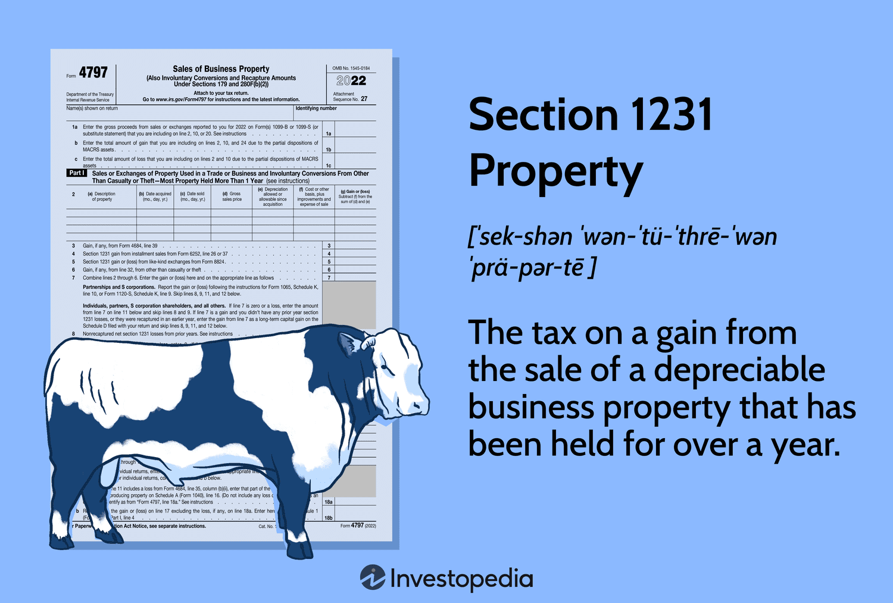

## Table of Contents

## What is Section 1231 property?

Section 1231 property refers to certain types of business assets that can be sold at a gain or loss, which is treated specially for tax purposes. These assets include real or depreciable business property that has been held for more than one year, such as buildings, machinery, vehicles, and land used in a trade or business. If you sell these assets, the gains or losses are not immediately taxed as ordinary income or losses. Instead, they are classified as either Section 1231 gains or losses, which can affect your overall tax situation.

When you sell a Section 1231 property, the tax treatment depends on whether you have a net gain or a net loss. If you have a net Section 1231 gain, it is treated as a long-term capital gain, which is typically taxed at a lower rate than ordinary income. On the other hand, if you have a net Section 1231 loss, it is treated as an ordinary loss, which can be used to offset other income. This special treatment can be beneficial for businesses because it allows them to potentially reduce their tax liability depending on the nature of their gains and losses.

## How does Section 1231 property differ from other types of property?

Section 1231 property is special because it includes things like buildings, machines, and land that a business uses and has owned for over a year. When these items are sold, the money made or lost from the sale is treated differently for taxes than other kinds of property. Instead of being taxed right away like regular income, the gains or losses from Section 1231 property are sorted into a special category.

This special category helps businesses because if they make more money than they lose from selling these items, the profit is taxed at a lower rate, like when you sell a stock you've held for a long time. But if they lose more money than they make, they can use that loss to lower their taxes on other income. This is different from other property, where gains and losses are usually taxed as regular income right away, without these special rules.

## What are the basic tax treatments for gains and losses on Section 1231 property?

When you sell Section 1231 property, the tax rules depend on whether you make a profit or take a loss. If you make more money than you lose from selling these items, you have a net gain. This net gain is treated as a long-term capital gain, which means it's taxed at a lower rate than your regular income. This can save you money on taxes because long-term capital gains have a special, lower tax rate.

On the other hand, if you lose more money than you make from selling these items, you have a net loss. This net loss is treated as an ordinary loss, which you can use to reduce your other income. This means you can lower the amount of taxes you owe on your regular income. So, Section 1231 property gives businesses a way to manage their taxes better, depending on whether they're making or losing money on these sales.

## Can you explain the difference between Section 1231 gains and Section 1231 losses?

When you sell Section 1231 property and make a profit, that's called a Section 1231 gain. This happens when the money you get from selling things like buildings, machines, or land used in your business is more than what you lost from selling other Section 1231 items. The good thing about Section 1231 gains is that they are treated like long-term capital gains. This means you pay less tax on them than you would on your regular income, which can save you money.

On the other hand, if you sell Section 1231 property and lose money, that's called a Section 1231 loss. This happens when the money you lose from selling these items is more than what you made from other sales. Section 1231 losses are treated as ordinary losses, which means you can use them to lower the taxes on your other income. So, if your business has a bad year and you're selling off assets at a loss, these losses can help reduce the amount of tax you owe.

## How are net Section 1231 gains taxed?

When you sell things like buildings, machines, or land that your business has used for over a year and you make more money than you lose, that's called a net Section 1231 gain. This kind of gain is special because it's not taxed like your regular income. Instead, it's treated like a long-term capital gain. This means you get to pay a lower tax rate on the money you made from selling these items.

The tax rate for long-term capital gains is usually lower than the rate for regular income. So, if your business sells some old equipment and makes a profit, you'll pay less tax on that profit than you would if it was just part of your regular income. This can save your business money on taxes, which is a big help for keeping more of what you earn.

## What happens if there is a net Section 1231 loss?

If your business sells things like buildings, machines, or land that it has used for over a year and ends up losing more money than it makes, that's called a net Section 1231 loss. This kind of loss is treated differently for taxes. Instead of being treated like a special kind of loss, it's treated like a regular, ordinary loss. This means you can use it to lower the taxes you owe on your other income.

So, if your business has a tough year and you need to sell some assets at a loss, this can actually help you. By using the net Section 1231 loss to reduce your other income, you can lower the amount of tax you have to pay. This can be a big help in managing your business's finances, especially during times when you're not making as much money.

## How do you calculate the holding period for Section 1231 property?

To figure out the holding period for Section 1231 property, you need to count the number of days you owned the property. The holding period starts the day after you get the property and ends on the day you sell it. For the property to be considered Section 1231 property, you must have owned it for more than one year. This means you need to count at least 366 days, because a year has 365 days, and you start counting from the day after you get the property.

If you're not sure about the exact dates, you can look at your records or receipts to find out when you bought and sold the property. It's important to keep good records because the IRS might ask for proof of your holding period. Once you know the dates, just add up the days to see if it's more than a year. If it is, then the property qualifies as Section 1231 property, and you can use the special tax rules for gains or losses when you sell it.

## What types of assets typically qualify as Section 1231 property?

Section 1231 property includes things that a business uses and has owned for over a year. These things can be buildings, machines, vehicles, and land that the business uses to make money. For example, if a company owns a factory building and has used it for more than a year, that building is Section 1231 property. The same goes for a delivery truck that a business has been using for over a year.

When you sell these kinds of items, the money you make or lose is treated differently for taxes. This special treatment can help businesses save money on taxes, depending on whether they make a profit or take a loss. It's important for businesses to keep track of how long they've owned these items because they need to have owned them for more than a year to get this special tax treatment.

## Are there any special rules or exceptions that apply to Section 1231 property?

Yes, there are some special rules and exceptions for Section 1231 property. One important rule is about something called "recapture." If you've taken tax deductions for depreciation on your Section 1231 property, and you sell it for a profit, you might have to pay some of that profit back as ordinary income instead of getting the lower long-term capital gains tax rate. This is called depreciation recapture, and it's meant to make sure you don't get too much of a tax break from using the property and then selling it.

Another exception is for certain types of property that might look like Section 1231 property but aren't. For example, if you sell inventory or property held mainly for sale to customers, that's not Section 1231 property. Also, if you sell property you've held for a year or less, it doesn't count as Section 1231 property. It's important to know these rules because they can change how much tax you owe when you sell your business assets.

## How does depreciation recapture affect the tax treatment of Section 1231 property?

When you sell Section 1231 property and make a profit, something called depreciation recapture can change how much tax you owe. If you've been taking tax deductions for the wear and tear on your property over the years, the IRS wants some of that money back when you sell it. So, part of your profit might be taxed as ordinary income instead of the lower long-term capital gains rate. This means you could end up paying more in taxes than you expected.

For example, if you bought a machine for your business and took depreciation deductions over time, when you sell that machine, the amount of depreciation you claimed gets added back to your income for tax purposes. This recaptured amount is taxed at your regular income tax rate, not the lower capital gains rate. It's important to keep track of your depreciation because it can affect your tax bill when you sell your Section 1231 property.

## Can you discuss the interaction between Section 1231 and other tax sections like Section 1245 and Section 1250?

When you sell Section 1231 property, you might also have to deal with Section 1245 and Section 1250. These sections are about something called depreciation recapture. Section 1245 applies to things like machinery, equipment, and certain types of personal property that you've used in your business. If you've taken depreciation deductions on these items and then sell them for a profit, part of that profit might be taxed as regular income instead of the lower long-term capital gains rate. This is to make sure you don't get too much of a tax break from using these items and then selling them.

Section 1250, on the other hand, deals with real property like buildings. If you've taken depreciation on a building and then sell it, the profit from the depreciation you claimed might also be taxed as ordinary income. This is similar to Section 1245 but applies to different types of property. Both of these sections work together with Section 1231 because they can change how much tax you owe when you sell your business assets. It's important to understand how these sections interact because they can affect your overall tax situation when selling Section 1231 property.

## What are some advanced strategies for optimizing tax outcomes with Section 1231 property?

One advanced strategy for optimizing tax outcomes with Section 1231 property is to carefully time your sales. If you think you'll have a net gain from selling these items, you might want to wait until you've held them for more than a year. This way, you can take advantage of the lower long-term capital gains tax rate. On the other hand, if you expect a net loss, selling before the end of the tax year can help you use that loss to lower your taxes on other income right away. By planning when to sell, you can make the most of the special tax rules for Section 1231 property.

Another strategy is to keep good records of your depreciation. If you know you'll have to deal with depreciation recapture when you sell, you can plan ahead. For example, if you're selling a machine that you've taken a lot of depreciation on, you might want to sell other assets at a loss to offset the recaptured amount. This can help lower the amount of tax you owe on the recaptured depreciation. By understanding how depreciation recapture works with Section 1231 property, you can make smarter decisions about when and what to sell to minimize your tax bill.

## References & Further Reading

[1]: Hoffman, J., & Murphy, C. (2021). ["Tax Implications of Trading Financial Instruments."](https://journals.sagepub.com/doi/abs/10.1177/1476127020967638) Journal of Accountancy.

[2]: Loeffler, R. (2020). ["The Taxation of Section 1231 Property: A Comprehensive Guide."](https://www.pearson.com/en-us/subject-catalog/p/pearsons-federal-taxation-2022-comprehensive/P200000006023/9780136912729) Tax Foundation.

[3]: Pratt, S.P., & Niculita, A.V. (2007). ["Valuing a Business: The Analysis and Appraisal of Closely Held Companies"](https://www.amazon.com/Valuing-Business-6th-Appraisal-Companies/dp/1260121569). McGraw-Hill.

[4]: Bhandari, M. (2018). ["The Complete Guide to Capital Gains Tax."](https://books.google.com/books/about/A_Guide_to_Company_Law_Procedures.html?id=Aig1BUoiFu8C) Kogan Page.

[5]: U.S. Internal Revenue Service. (2021). ["Publication 544 (2021), Sales and Other Dispositions of Assets."](https://www.irs.gov/pub/irs-prior/p544--2021.pdf) IRS Publications.