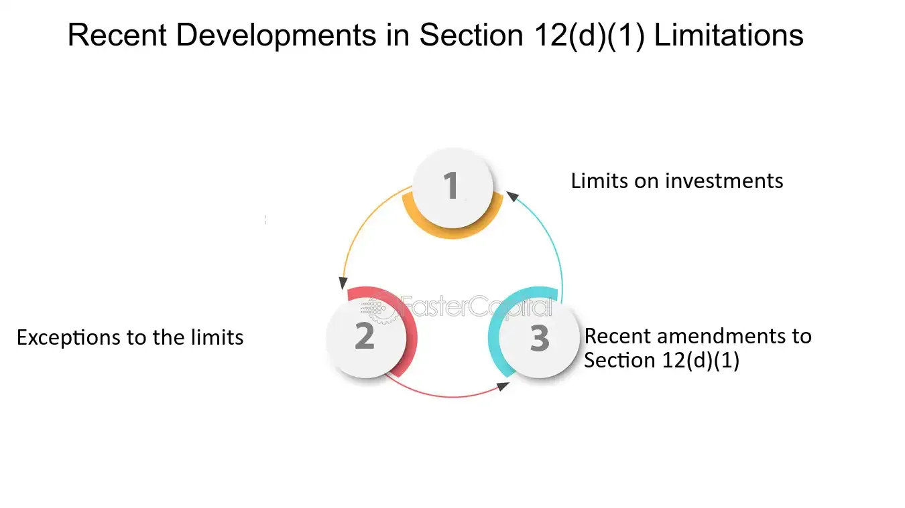

## Table of Contents

## What is Section 12D-1?

Section 12D-1 is a part of the Investment Company Act of 1940 in the United States. It sets rules for how investment companies can sell and advertise their products. The main goal is to protect investors by making sure that investment companies do not mislead people with their sales and ads.

This section says that investment companies cannot use ads that are dishonest or leave out important information. They also cannot use ads that might trick people into thinking they will make more money than they really will. By following these rules, Section 12D-1 helps keep the investment world fair and honest for everyone.

## What is the purpose of Section 12D-1?

Section 12D-1 of the Investment Company Act of 1940 aims to protect investors by making sure that investment companies are honest in how they sell and advertise their products. It stops companies from using ads that are not true or that leave out important details. This helps make sure that people get all the information they need to make good choices about where to invest their money.

By setting these rules, Section 12D-1 helps keep the investment world fair and honest. It makes sure that investment companies do not trick people into thinking they will make more money than they really will. This way, investors can trust the information they see and feel more confident about their investment decisions.

## Who does Section 12D-1 apply to?

Section 12D-1 applies to investment companies in the United States. These are businesses that manage and sell investment products like mutual funds or exchange-traded funds (ETFs). The section is part of the Investment Company Act of 1940, which means it covers a wide range of companies that offer investment opportunities to the public.

The rules in Section 12D-1 are meant to make sure these companies are honest when they advertise their products. This includes how they talk about their funds in ads, on websites, or in any other way they reach out to potential investors. By following these rules, investment companies help keep the investment world fair and protect people from being misled.

## How does Section 12D-1 affect existing laws?

Section 12D-1 adds to the rules that already exist in the Investment Company Act of 1940. It does not take away any old rules but makes them stronger by focusing on how investment companies advertise their products. This section helps make sure that the ads and sales pitches from these companies are honest and do not trick people.

Because of Section 12D-1, investment companies have to be very careful about what they say in their ads. They cannot leave out important information or make promises about high returns that are not true. This helps protect people who are thinking about investing their money, making the whole investment world more fair and trustworthy.

## What are the key terms defined in Section 12D-1?

Section 12D-1 talks about some important words that help explain what the rules are about. One key term is "investment company." This means a business that manages and sells investment products like mutual funds or ETFs to the public. Another term is "advertisement," which includes any way an investment company tries to get people interested in their products, like ads on TV, websites, or in magazines.

The section also uses the term "misleading." This means ads that are not honest or leave out important information. Investment companies cannot use ads that might trick people into thinking they will make more money than they really will. By understanding these terms, it's easier to see how Section 12D-1 helps keep the investment world fair and protects people from being misled.

## How can Section 12D-1 be amended?

Section 12D-1 can be changed by lawmakers in the United States Congress. They can suggest new rules or changes to the old ones. To do this, they need to write a new law or add to the existing Investment Company Act of 1940. Once they have a new idea, they talk about it and vote on it. If most of them agree, the change can move forward. Then, the President has to sign it to make it official.

After the President signs it, the change to Section 12D-1 becomes part of the law. This new rule then applies to all investment companies in the U.S. They have to follow the new rules when they advertise their products. This helps keep the rules up to date and makes sure they protect investors in the best way possible.

## What is the process for proposing amendments to Section 12D-1?

To change Section 12D-1, members of the United States Congress need to start by writing a new law or adding to the existing Investment Company Act of 1940. They come up with ideas on how to make the rules better or fix any problems. After they write down their ideas, they talk about it with other lawmakers to see if everyone agrees. If most of them like the new idea, they vote on it. If the vote passes, the change can move forward.

Next, the new change goes to the President. The President looks at it and decides whether to sign it or not. If the President signs it, the change to Section 12D-1 becomes part of the law. Then, all investment companies in the U.S. have to follow the new rules when they advertise their products. This helps keep the rules up to date and makes sure they protect investors the best way possible.

## What are the historical changes made to Section 12D-1?

Section 12D-1 of the Investment Company Act of 1940 has been changed a few times over the years to keep up with new ways of advertising and to better protect investors. One big change happened in 1970 when the rules were updated to include new kinds of ads, like TV commercials and radio spots. This was important because it made sure that the rules covered all the ways investment companies were reaching out to people.

Another change came in 2010 with the Dodd-Frank Wall Street Reform and Consumer Protection Act. This law added more rules to make sure that investment companies were being even more honest about the risks and rewards of their products. It also made it easier for the government to check if companies were following the rules. These changes helped make the investment world safer and more fair for everyone.

## How do amendments to Section 12D-1 impact legal interpretations?

When Section 12D-1 is changed, it can affect how people understand and use the law. If new rules are added or old ones are changed, lawyers and judges have to look at these updates to see what they mean. This can lead to different ways of thinking about the law. For example, if a new rule says that investment companies must be clearer about the risks of their products, lawyers might argue about what "clear" means. Judges then have to decide based on the new rules, which can change how the law is used in court.

Changes to Section 12D-1 can also make it easier or harder for people to take legal action against investment companies. If the rules get stricter, it might be easier for someone to say that a company broke the law with a misleading ad. On the other hand, if the rules become less strict, it might be harder to win a case. This can affect how companies behave, knowing that the rules have changed and they might face different consequences. Overall, amendments to Section 12D-1 help keep the law up-to-date and fair, but they also create new challenges for legal interpretations.

## What are the common challenges faced when interpreting Section 12D-1?

One big challenge when trying to understand Section 12D-1 is figuring out what counts as a "misleading" ad. The law says investment companies cannot use ads that trick people or leave out important details. But it's not always clear what that means in real life. For example, if an ad talks about how much money people could make, but doesn't say it's risky, is that misleading? Lawyers and judges have to decide, and they might not always agree.

Another challenge is keeping up with new ways of advertising. When Section 12D-1 was first written, there were no internet ads or social media. But now, investment companies use these new ways to reach people. The law has to change to cover these new types of ads, but it can be hard to make rules that fit everything. This means that sometimes the law might not be clear about what is allowed and what is not, which can lead to confusion and disagreements.

## How have courts interpreted Section 12D-1 in landmark cases?

In the case of SEC v. Variable Annuity Life Insurance Co. of America (VALIC) in 1967, the court had to decide if variable annuities counted as securities under the Investment Company Act, which would mean they had to follow Section 12D-1. The court said yes, variable annuities are securities. This meant that companies selling these products had to be careful about their ads and not trick people. This case was important because it made the rules about what counts as a security clearer and helped protect more people from misleading ads.

Another big case was SEC v. Capital Gains Research Bureau, Inc. in 1963. In this case, the court looked at whether investment advisers could give advice that was not true or left out important details. The court decided that advisers had to be honest, just like investment companies do under Section 12D-1. This case showed that the rules about being honest in ads apply to more than just investment companies, which helped make the investment world fairer for everyone.

## What future amendments are being considered for Section 12D-1?

People are talking about making changes to Section 12D-1 to keep up with new ways of advertising. One idea is to make rules about ads on social media and the internet even clearer. Right now, it can be hard to know what counts as a misleading ad online. So, lawmakers want to make sure the rules fit all the new ways companies talk to people, like through videos, blogs, and social media posts.

Another thing they are thinking about is making the rules about being honest even stronger. They want to make sure that investment companies have to tell people about all the risks, not just the good parts. This would help people make better choices about where to put their money. By doing this, they hope to make the investment world safer and more fair for everyone.

## References & Further Reading

[1]: ["Regulatory Development and the Investment Company Act"](https://www.sec.gov/about/divisions-offices/division-investment-management/investment-company-registration-regulation-package) by U.S. Securities and Exchange Commission

[2]: Lopez de Prado, M. (2018). ["Advances in Financial Machine Learning."](https://www.amazon.com/Advances-Financial-Machine-Learning-Marcos/dp/1119482089) Wiley.

[3]: Chan, E. P. (2008). ["Quantitative Trading: How to Build Your Own Algorithmic Trading Business."](https://github.com/ftvision/quant_trading_echan_book) John Wiley & Sons.

[4]: Jansen, S. (2020). ["Machine Learning for Algorithmic Trading - Second Edition."](https://www.amazon.com/Machine-Learning-Algorithmic-Trading-alternative/dp/1839217715) Packt Publishing.

[5]: Aronson, D. R. (2006). ["Evidence-Based Technical Analysis: Applying the Scientific Method and Statistical Inference to Trading Signals."](https://www.amazon.com/Evidence-Based-Technical-Analysis-Scientific-Statistical/dp/0470008741) Wiley.

[6]: SEBI. (2023). ["Draft Framework for Algorithmic Trading for Retail Investors."](https://www.sebi.gov.in/reports-and-statistics/reports/dec-2021/consultation-paper-on-algorithmic-trading-by-retail-investors_54515.html?s=09) Securities and Exchange Board of India.