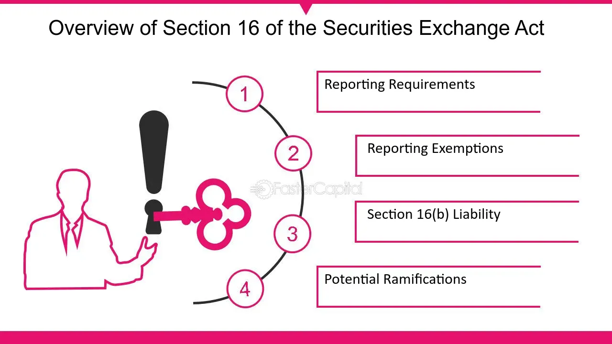

## Table of Contents

## What is Section 16 of the Securities Exchange Act of 1934?

Section 16 of the Securities Exchange Act of 1934 is a rule that focuses on preventing insiders of a company from using their special knowledge to make profits from trading the company's stock. Insiders include company officers, directors, and any shareholders who own more than 10% of the company's stock. The main goal of this section is to stop these insiders from taking advantage of information that the general public does not have.

To achieve this, Section 16 requires insiders to report their stock transactions to the Securities and Exchange Commission (SEC). They must do this within two business days of the transaction. Additionally, any profits made from buying and selling the company's stock within a six-month period must be given back to the company. This is known as the "short-swing profit rule." By enforcing these rules, Section 16 helps to maintain fairness in the stock market and protect regular investors.

## Who is considered an insider under Section 16?

Under Section 16 of the Securities Exchange Act of 1934, an insider is someone who has a special position within a company. This includes officers, like the CEO or CFO, and directors, who are part of the company's board. These people are considered insiders because they have access to important information about the company that the public does not know.

In addition to officers and directors, anyone who owns more than 10% of the company's stock is also considered an insider. These large shareholders can influence the company's decisions and have access to sensitive information. The goal of labeling these people as insiders is to make sure they don't use their special knowledge to make unfair profits from trading the company's stock.

## What are the basic filing requirements under Section 16?

Under Section 16, insiders need to file certain forms with the Securities and Exchange Commission (SEC). The main forms are Form 3, Form 4, and Form 5. Form 3 is filed when someone becomes an insider, like when they are first appointed as an officer or director, or when they buy more than 10% of the company's stock. This form lists all the company's securities they own at that time.

Form 4 is used to report any changes in the insider's ownership of the company's stock. This includes buying or selling stock, or getting stock as part of their job. Insiders must file Form 4 within two business days of the change. Form 5 is an annual report that covers any transactions that were not reported on Form 4, and it must be filed within 45 days after the end of the company's fiscal year.

These filing requirements help keep track of what insiders are doing with the company's stock. By making this information public, the SEC can make sure insiders are not using their special knowledge to make unfair profits. This helps keep the stock market fair for everyone.

## What is a Form 3 and when must it be filed?

Form 3 is a document that insiders need to file with the Securities and Exchange Commission (SEC). Insiders include people like officers, directors, and anyone who owns more than 10% of a company's stock. When someone becomes an insider, they have to fill out Form 3. This form lists all the securities they own in the company at that time.

Insiders must file Form 3 within 10 days of becoming an insider. For example, if someone is appointed as a new director, they need to file Form 3 within 10 days of their appointment. This rule helps make sure that the public knows about the insider's ownership in the company right from the start.

## What is a Form 4 and what triggers its filing?

Form 4 is a document that insiders need to file with the Securities and Exchange Commission (SEC) when there are changes in their ownership of a company's stock. Insiders include officers, directors, and anyone who owns more than 10% of the company's stock. The form is used to report any buying or selling of the company's stock, as well as receiving stock as part of their job, like stock options or bonuses.

The filing of Form 4 is triggered by any change in the insider's ownership of the company's stock. This means that if an insider buys or sells stock, or if they receive stock as part of their job, they need to file Form 4. They must do this within two business days of the change. This rule helps keep the public informed about what insiders are doing with the company's stock, making sure the stock market stays fair for everyone.

## How does Form 5 differ from Forms 3 and 4?

Form 5 is different from Forms 3 and 4 because it is an annual report that insiders file with the SEC. While Form 3 is filed when someone first becomes an insider and Form 4 is used to report any changes in stock ownership within two business days, Form 5 is used to report any transactions that were not reported on Form 4 during the year. This could include small transactions or gifts of stock that did not need to be reported right away. Insiders need to file Form 5 within 45 days after the end of the company's fiscal year.

Forms 3 and 4 focus on immediate reporting of an insider's stock ownership and changes, helping to keep the public informed about what insiders are doing with the company's stock in real-time. On the other hand, Form 5 serves as a yearly check to make sure all transactions have been accounted for. This helps to ensure that insiders are not hiding any stock dealings and keeps the stock market fair for everyone.

## What are the penalties for non-compliance with Section 16 filing requirements?

If insiders do not follow the filing rules of Section 16, they can face big fines and other punishments. The SEC can make them pay money for not filing their forms on time or for not reporting their stock transactions correctly. These fines can be very high and can hurt the insider's wallet a lot. Also, if insiders break the rules on purpose, they might have to go to court and could even go to jail.

Besides fines and jail time, not following Section 16 can also harm the insider's reputation. People might not trust them anymore, and this can make it hard for them to get good jobs or work with other companies. It can also make the company they work for look bad, which can affect the company's stock price and how investors see the company. So, it's really important for insiders to follow the rules to avoid these problems.

## How does the SEC monitor compliance with Section 16?

The SEC keeps an eye on whether insiders follow Section 16 rules by checking the forms that insiders file. They look at Form 3, Form 4, and Form 5 to make sure insiders report their stock ownership and any changes on time. If insiders don't file these forms correctly or on time, the SEC can find out and take action. They use computer systems to track these filings and can spot any mistakes or missing reports easily.

If the SEC finds that an insider did not follow the rules, they can start an investigation. They might ask for more information or even take the insider to court. The SEC can make the insider pay fines or, in serious cases, the insider might have to go to jail. By watching these filings closely, the SEC makes sure that insiders play fair and don't use their special knowledge to make money in ways that hurt regular investors.

## What are the best practices for ensuring timely and accurate Section 16 filings?

To make sure Section 16 filings are done on time and correctly, insiders should set up a good system for tracking their stock transactions. They should keep a close eye on any changes in their stock ownership and use tools like calendars or reminders to remember when they need to file their forms. It's also a good idea to work with a lawyer or a compliance officer who knows the rules well. They can help make sure all the information on the forms is right and that the forms are sent to the SEC on time.

Another important practice is to double-check all the information before sending it to the SEC. Insiders should look over their forms carefully to catch any mistakes or missing details. If they find any problems, they should fix them right away. By being careful and getting help when they need it, insiders can avoid fines and other problems that come from not following the rules. This helps keep the stock market fair for everyone.

## How do Section 16 filings impact corporate governance and transparency?

Section 16 filings help make corporate governance better by making sure insiders play fair. Insiders, like officers and big shareholders, have to tell the SEC about their stock dealings. This rule stops them from using secret company information to make money in ways that are not fair. By making insiders report their stock trades, the company can keep an eye on them and make sure they are not doing anything wrong. This helps the company run in a way that is honest and fair for everyone.

These filings also make things more open and clear for investors. When insiders have to report what they are doing with the company's stock, it gives everyone a good look at what is happening inside the company. Investors can see if insiders are buying or selling stock, which can tell them a lot about how the company is doing. This information helps investors make smart choices about whether to buy or sell the company's stock. By being open about what insiders are doing, Section 16 helps build trust between the company and its investors.

## What are the recent changes or proposed amendments to Section 16 regulations?

There have been some recent talks about changing the rules for Section 16 of the Securities Exchange Act of 1934. One big idea is to make it easier for insiders to report their stock trades. Right now, insiders have to fill out forms like Form 3, Form 4, and Form 5. Some people think that the rules are too hard to follow and want to make them simpler. They also want to use new technology to make reporting faster and easier. This could help insiders make fewer mistakes and keep the SEC happy.

Another change that people are talking about is making the rules stricter for insiders who break them on purpose. Some people think that the fines and punishments are not strong enough to stop insiders from doing bad things. They want to make the punishments bigger to scare insiders into following the rules. By making these changes, the SEC hopes to keep the stock market fair and make sure everyone follows the rules.

## How can technology and automation assist in managing Section 16 filing obligations?

Technology and automation can really help insiders with their Section 16 filing duties. Special software can keep track of all the stock trades insiders make. This software can remind them when they need to file their forms, like Form 3, Form 4, and Form 5. It can also fill out these forms automatically, which means fewer mistakes and less work for the insiders. By using technology, insiders can make sure they send their forms to the SEC on time and correctly.

Automation also helps by making the whole process easier and faster. For example, electronic filing systems can send forms to the SEC with just a few clicks. This cuts down on the time it takes to file and makes sure the information gets to the SEC quickly. Plus, these systems can check the forms for errors before they are sent, which helps keep everything accurate. By using technology and automation, insiders can handle their Section 16 filing duties better and avoid getting into trouble with the SEC.

## References & Further Reading

[1]: ["Section 16 of the Securities Exchange Act of 1934"](https://www.sec.gov/rules-regulations/staff-guidance/compliance-disclosure-interpretations/exchange-act-section-16-related-rules-forms) - U.S. Securities and Exchange Commission

[2]: Haldane, A. G., & Hauser, A. (2011). ["Algorithmic trading and financial markets: A summary of key issues"](https://www.semanticscholar.org/paper/Systemic-risk-in-banking-ecosystems-Haldane-May/4d45190d84f2fd225061cf60930f3d8e38565fc7) - Bank of England

[3]: Johnson, B., & Zhao, J. (2008). ["Income Smoothing in Algorithmic Trading"](https://psycnet.apa.org/record/2008-14580-004) - Journal of Financial Markets

[4]: ["Market Access Rule"](https://www.finra.org/rules-guidance/guidance/reports/2022-finras-examination-and-risk-monitoring-program/market-access-rule) - U.S. Securities and Exchange Commission 

[5]: ["Quantitative Trading: How to Build Your Own Algorithmic Trading Business"](https://www.amazon.com/Quantitative-Trading-Build-Algorithmic-Business/dp/1119800064) by Ernest P. Chan

[6]: Lin, T. C., (2015). ["The New Market Manipulation"](https://scholarlycommons.law.emory.edu/cgi/viewcontent.cgi?article=1076&context=elj) Golden Gate University Law Review, 45(2).

[7]: ["Algorithmic Trading: Overview, Strategies, Pros and Cons, and Risk"](https://www.investopedia.com/terms/a/algorithmictrading.asp) - Investopedia

[8]: Lopez de Prado, M. (2018). ["Advances in Financial Machine Learning"](https://www.amazon.com/Advances-Financial-Machine-Learning-Marcos/dp/1119482089) - Wiley

[9]: Anderson, N. (2016). ["The Impact of Algorithmic Trading on the Foreign Exchange Market"](https://www.researchgate.net/publication/46451850_Rise_of_the_Machines_Algorithmic_Trading_in_the_Foreign_Exchange_Market) - BIS Markets Committee

[10]: ["Understanding RegTech: Digitizing AML and KYC Processes"](https://kyc-chain.com/top-5-ways-regtech-can-improve-kyc-aml-compliance/) - J.P. Morgan