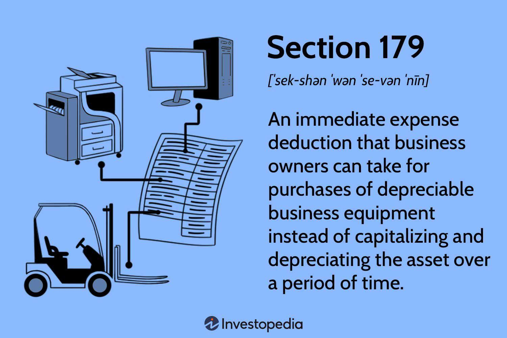

## Table of Contents

## What is the Section 179 Tax Deduction?

The Section 179 Tax Deduction is a part of the U.S. tax code that allows businesses to deduct the full purchase price of qualifying equipment and/or software purchased or financed during the tax year. This means that if a business buys or leases equipment, it can deduct the cost of that equipment from its gross income, reducing the amount of taxes it has to pay. The deduction is designed to encourage businesses to invest in themselves by making it more affordable to acquire new equipment.

To qualify for the Section 179 deduction, the equipment must be used for business purposes more than 50% of the time. This can include things like machinery, vehicles, computers, and office furniture. There is a limit to how much can be deducted each year, and this limit can change, so it's important for businesses to check the current limits set by the IRS. Additionally, if the equipment is later sold, the business may have to recapture some of the deduction, meaning they might have to report some of the deduction as income.

## Who qualifies for the Section 179 Tax Deduction?

Businesses of all sizes can use the Section 179 Tax Deduction. This includes sole proprietors, partnerships, corporations, and even some non-profit organizations. The main rule is that the business must buy or lease equipment that is used more than half the time for business. This equipment can be things like machines, computers, office furniture, or vehicles.

There are some limits to the deduction. The business must have a profit to take the full deduction. If the business doesn't make enough money, the deduction can be carried over to the next year. Also, the total amount that can be deducted changes each year, so businesses need to check the current limit with the IRS. If the equipment is sold later, the business might have to pay back some of the deduction, which is called recapture.

## What types of property are eligible under Section 179?

Section 179 allows businesses to deduct the cost of certain types of property they buy or lease for their business. This includes tangible personal property like machinery, equipment, and office furniture. It also covers vehicles used for business, as long as they are used more than half the time for business purposes. Computers and off-the-shelf software that the business uses can also be deducted under Section 179.

Some other types of property that qualify are improvements made to nonresidential real property, like roofs, heating, ventilation, and air conditioning systems, fire protection systems, and security systems. However, these improvements must be made to the interior of the building and the building must have been in use before the improvements were made. It's important for businesses to check the current rules and limits set by the IRS, as they can change from year to year.

## How does the Section 179 deduction work?

The Section 179 deduction lets businesses deduct the full cost of certain equipment they buy or lease in the same year they get it. This means if a business buys a new computer or a truck for work, they can subtract the cost of that item from their income for that year. This lowers the amount of taxes they have to pay. The equipment has to be used more than half the time for business to qualify. There's a limit to how much can be deducted each year, and this limit can change, so businesses need to check the current rules with the IRS.

If a business sells the equipment later, they might have to pay back some of the deduction. This is called recapture. The business can only take the full deduction if they make enough money that year. If they don't, they can [carry](/wiki/carry-trading) the deduction over to the next year. This deduction helps businesses by making it easier and cheaper to buy new equipment they need to grow and improve.

## What is the maximum deduction amount allowed under Section 179?

The maximum deduction amount allowed under Section 179 changes each year. For the year 2023, the limit is set at $1,160,000. This means that a business can deduct up to this amount for the cost of qualifying equipment they buy or lease in that year. If the total cost of the equipment goes over $2,890,000, the deduction starts to get smaller until it reaches zero.

It's important for businesses to know that they can only take the full deduction if they make enough money that year. If they don't, they can carry the deduction over to the next year. Also, if they sell the equipment later, they might have to pay back some of the deduction, which is called recapture. Checking the current limits and rules with the IRS each year is a good idea because they can change.

## Can the Section 179 deduction be combined with bonus depreciation?

Yes, the Section 179 deduction can be combined with bonus depreciation. This means a business can use both to lower their taxes even more. With Section 179, a business can deduct the full cost of equipment up to a certain limit in the year they buy it. Bonus depreciation lets them deduct a percentage of the cost of the equipment that wasn't covered by Section 179.

For example, if a business buys equipment costing $1,500,000 in 2023, they could use Section 179 to deduct up to $1,160,000. The remaining $340,000 could then be eligible for bonus depreciation, which in 2023 allows a 80% deduction. So, the business could deduct another $272,000 (80% of $340,000) through bonus depreciation. This combination can help businesses save a lot on taxes when they invest in new equipment.

## How does one claim the Section 179 deduction on their tax return?

To claim the Section 179 deduction, a business needs to fill out Form 4562, which is called the Depreciation and Amortization form. This form is part of the business's tax return. On this form, the business lists the cost of the equipment they bought or leased during the year. They then calculate the Section 179 deduction and enter it on the form. The total deduction is also transferred to the business's main tax form, like Schedule C for sole proprietors or Form 1120 for corporations.

It's important for the business to keep good records of the equipment they bought, including receipts and details about how the equipment is used for business. If the IRS asks questions later, having these records can help prove the deduction is correct. The business should also check the current limits and rules for Section 179 each year, because they can change. If the business sells the equipment later, they might have to report some of the deduction as income, which is called recapture.

## What are the limitations and phase-outs of the Section 179 deduction?

The Section 179 deduction has a limit on how much can be deducted each year. For 2023, the limit is $1,160,000. This means a business can deduct up to this amount for the cost of equipment they buy or lease. However, if the total cost of all the equipment bought in a year goes over $2,890,000, the deduction starts to get smaller. This smaller amount is called a phase-out. The deduction goes down dollar for dollar over the $2,890,000 limit until it reaches zero.

Another important rule is that the business must have enough income to take the full deduction. If the business doesn't make enough money, they can only deduct up to the amount of their income for that year. The rest of the deduction can be carried over to the next year. Also, if the business sells the equipment later, they might have to pay back some of the deduction. This is called recapture. It's a good idea for businesses to check the current rules and limits with the IRS each year because they can change.

## How does Section 179 affect state taxes?

Section 179 can affect state taxes differently depending on where the business is located. Some states follow the federal rules for Section 179, which means businesses can take the same deduction on their state taxes as they do on their federal taxes. Other states have their own rules and might not let businesses take the full Section 179 deduction or might have different limits.

It's important for businesses to check the rules for Section 179 in their state. They might need to fill out different forms or do extra calculations to figure out their state tax deduction. If a business doesn't know the rules, they could end up paying more state taxes than they need to or make mistakes on their tax return.

## What are the differences between Section 179 and other forms of depreciation?

Section 179 and other forms of depreciation both help businesses save on taxes by letting them deduct the cost of equipment over time, but they work in different ways. Section 179 lets a business deduct the full cost of equipment in the same year they buy it, up to a certain limit. This can be really helpful if a business wants to lower their taxes right away. But, the equipment has to be used for business more than half the time, and the business has to make enough money to take the full deduction. If they don't, they can carry the deduction over to the next year.

Other forms of depreciation, like the Modified Accelerated Cost Recovery System (MACRS), spread the cost of equipment over several years. With MACRS, a business can deduct a part of the cost each year, usually starting with a bigger part in the first few years and then smaller parts later on. This can be good for businesses that want to spread out their tax savings. Bonus depreciation is another form that lets businesses deduct a big percentage of the equipment cost in the first year, but it's different from Section 179 because it doesn't have the same income limits. So, businesses can choose the method that fits their needs best.

## How has the Section 179 deduction evolved over time?

The Section 179 deduction has changed a lot over the years. It started back in 1958 to help small businesses buy equipment without having to pay a lot of taxes right away. At first, the deduction was small, and only certain types of equipment could be deducted. Over time, the rules got easier, and more types of equipment were allowed. The biggest change came in the early 2000s when the deduction amount went up a lot, and the rules got simpler. This made it easier for businesses to use the deduction to save on taxes.

In recent years, the Section 179 deduction has kept changing. The limits on how much can be deducted go up almost every year. For example, in 2023, the limit is $1,160,000, which is much higher than it used to be. The rules about what kinds of equipment can be deducted have also gotten broader. Now, things like computers, software, and even some improvements to buildings can be included. These changes have made the Section 179 deduction a big help for businesses of all sizes to invest in new equipment and grow.

## What strategic considerations should businesses take into account when using Section 179?

When using the Section 179 deduction, businesses should think about their current and future financial situation. They need to make sure they have enough income to take the full deduction in the year they buy the equipment. If they don't, they can carry the deduction over to the next year, but it might not be as helpful right away. Businesses should also think about their long-term plans. If they plan to sell the equipment soon, they might have to pay back some of the deduction, which is called recapture. This could affect their tax planning and how much they save.

Another thing to consider is how Section 179 fits with other tax strategies. Businesses can use Section 179 along with bonus depreciation to save even more on taxes. But they need to check the rules in their state because some states don't follow the federal rules for Section 179. Also, businesses should keep good records of the equipment they buy, like receipts and details about how it's used for business. This can help if the IRS asks questions later. By thinking about these things, businesses can use Section 179 in a way that helps them the most.

## References & Further Reading

[1]: ["Internal Revenue Service - Section 179 Deduction"](https://www.nerdwallet.com/article/taxes/section-179-deduction) - U.S. Internal Revenue Service publication discussing the Section 179 deduction.

[2]: ["Tax Deductions for Algorithmic Trading Firms"](https://www.finra.org/rules-guidance/key-topics/algorithmic-trading) - Tax Foundation article on tax deductions available to algorithmic trading firms.

[3]: ["Understanding Section 179 and Bonus Depreciation"](https://blog.koenigequipment.com/tax-advantages-understanding-section-179-and-bonus-depreciation) - Journal of Accountancy article explaining the differences and benefits of Section 179 and bonus depreciation.

[4]: ["Advances in Financial Machine Learning"](https://www.amazon.com/Advances-Financial-Machine-Learning-Marcos/dp/1119482089) by Marcos Lopez de Prado - A book exploring practical machine learning techniques for algorithmic trading.

[5]: ["Quantitative Trading: How to Build Your Own Algorithmic Trading Business"](https://www.amazon.com/Quantitative-Trading-Build-Algorithmic-Business/dp/1119800064) by Ernest P. Chan - A comprehensive guide on setting up an algorithmic trading business.

[6]: ["Machine Learning for Algorithmic Trading"](https://github.com/stefan-jansen/machine-learning-for-trading) by Stefan Jansen - An exploration of machine learning techniques applicable to trading strategies.