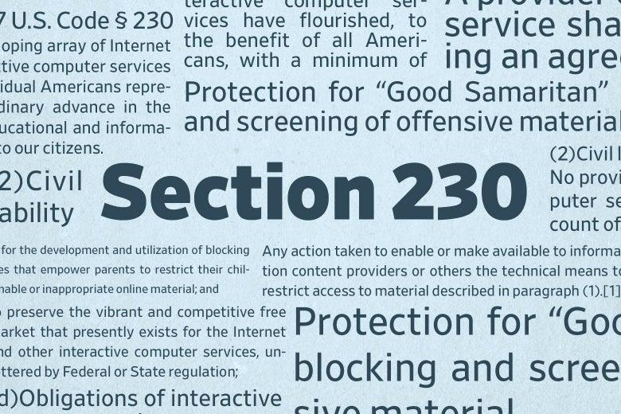

The digital age has transformed how we communicate and conduct business, with the internet playing a pivotal role in our daily lives. Among the many legal frameworks enabling this evolution, Section 230 of the Communications Decency Act of 1996 stands out as a cornerstone. This provision offers immunity to online platforms from liability for third-party content, thereby fostering a climate of innovation and free expression that has fueled the rapid growth of digital spaces.

Section 230's protections have allowed internet platforms to host a wide array of user-generated content without the overhanging threat of legal repercussions. This environment has not only encouraged the dissemination of diverse perspectives but also facilitated the development of robust online communities and services, from social media to e-commerce.



Concurrently, the rise of algorithmic trading has introduced new dimensions into the landscape of financial markets. Leveraging cutting-edge computer algorithms, this form of trading automates decisions to enhance market efficiency and liquidity. The rapid processing of high volumes of data, coupled with sophisticated mathematical models, enables traders to spot and capitalize on market trends almost instantaneously.

However, the intersection of internet law and algorithmic trading presents unique challenges. As algorithms become more prevalent, the implications for regulation and liability become increasingly pronounced. Section 230, traditionally applied to content moderation, is now being scrutinized in contexts it was not initially conceived to address, such as algorithmic trading platforms.

This article explores the legal protections offered by Section 230, its implications for algorithmic trading, and the broader impact on online platforms. By examining how these components interact, we gain insight into the evolving landscape where technology, law, and finance converge.

## Table of Contents

## What is Section 230?

Section 230 is a key provision of the Communications Decency Act of 1996, codified as 47 U.S.C. § 230. It serves as a fundamental legal shield for online platforms, granting them immunity from liability for content posted by third-party users. This legislative measure was designed to foster an environment conducive to free speech and to enhance the dissemination of information across the internet.

The essence of Section 230 lies in its two main provisions, which have significantly influenced the landscape of digital communication and content sharing. The first is that it declares that no provider or user of an interactive computer service shall be treated as the publisher or speaker of any information provided by another information content provider. In practical terms, this means that platforms such as social media networks, forums, and others that host user-generated content are not legally responsible for what their users post. This protection encourages platforms to facilitate and maintain spaces for robust and diverse online discussions without the fear of facing legal consequences for user content.

Additionally, Section 230 includes a provision that protects platforms when they act in good faith to restrict access to or availability of material they consider to be obscene, lewd, excessively violent, harassing, or otherwise objectionable, whether or not such material is constitutionally protected. This allows platforms the flexibility and discretion to moderate content and curate their services without the risk of being sued for taking down or blocking specific user submissions.

The legislative intent behind Section 230 was to strike a balance between the free flow of information and the need for responsible content moderation. By providing a liability shield, the law encourages the development of new technologies and platforms by reducing the potential burden of litigation. Notably, Section 230 has played an intrinsic role in enabling the modern internet to evolve into a dynamic medium for information, expression, and commerce.

Despite its foundational role, Section 230 has been the subject of much debate and scrutiny. Advocates emphasize the importance of protecting platforms that host free, open exchanges, while critics argue that the broad immunity can sometimes lead to unintended negative consequences, such as the spread of misinformation or hate speech. Nevertheless, Section 230 remains a pivotal element in how online platforms operate and moderate content in the digital age.

## Understanding Algorithmic Trading

Algorithmic trading represents a significant advancement in financial markets, utilizing computer algorithms to automate trading decisions, thereby enhancing market efficiency and [liquidity](/wiki/liquidity-risk-premium). This form of trading leverages high-speed data processing and complex mathematical models to identify and capitalize on market trends, offering a dynamic approach to trading that surpasses the limitations of human traders.

At its core, [algorithmic trading](/wiki/algorithmic-trading) employs pre-programmed instructions accounting for variables like timing, price, and [volume](/wiki/volume-trading-strategy). These algorithms can execute large orders with minimal market impact, ensuring optimal execution prices. They often make use of statistical and [machine learning](/wiki/machine-learning) models to analyze vast datasets and predict market movements. A common example of such a model is the Moving Average Crossover strategy, which generates buy or sell signals based on the intersection of short-term and long-term moving averages.

```python
def moving_average(data, window_size):
    return sum(data[-window_size:]) / window_size

# Example usage:
short_term_window = 5
long_term_window = 20
prices = [...]  # List of stock prices

short_term_ma = moving_average(prices, short_term_window)
long_term_ma = moving_average(prices, long_term_window)

if short_term_ma > long_term_ma:
    print("Buy Signal")
elif short_term_ma < long_term_ma:
    print("Sell Signal")
```

The evolution of algorithmic trading has accelerated beyond existing regulatory frameworks, leading to several legal and ethical concerns. One significant challenge is determining accountability when algorithm-driven decisions result in negative financial consequences. For instance, during the "Flash Crash" of May 6, 2010, algorithmic trading substantially contributed to a sudden market drop, raising questions about systemic risks and the adequacy of regulatory oversight.

Concerns also extend to the fairness of markets. Critics argue that high-frequency traders exploit algorithmic trading to gain an unfair advantage over traditional investors by executing trades at speeds that humans cannot match. This raises ethical questions about market manipulation and the need for regulations to ensure a level playing field.

Furthermore, as algorithms become increasingly complex and autonomous, there is a pressing need to address transparency and compliance issues. Regulators are tasked with crafting policies that balance innovation with the potential for automated systems to produce unintended consequences. The challenge lies in aligning technological advancements with the legal and ethical standards necessary to maintain market integrity and protect investor interests.

## Legal Protections and Challenges

Section 230 of the Communications Decency Act serves as a legal safeguard for internet platforms, offering them immunity from liability concerning content created by third parties. While this protection has been instrumental in fostering an open and accessible internet, it has not been without its criticisms. Many argue that its broad scope permits the dissemination of misinformation and shields platforms from accountability in situations where harm has occurred as a result of content published on their sites.

One of the primary criticisms against Section 230 is its capacity to allow the spread of false or harmful information without recourse for those affected. This concern is increasingly relevant in an age where misinformation can rapidly propagate across social media, impacting public opinion and even influencing election outcomes. The provision's broad protection limits the ability of individuals harmed by such content to seek redress, thereby granting platforms a level of immunity that some argue is too expansive.

The issue becomes more complex when considering algorithmic trading. This technology relies heavily on automated decision-making processes, introducing yet another layer of abstraction between the creator of content or the initiator of a trade and the ultimate outcomes. Algorithmic trading platforms, which facilitate high-frequency trades using complex algorithms, are positioned at a unique intersection of financial regulation and internet law. The question arises: should these platforms be held accountable for automated decisions made by their algorithms?

In traditional usage, Section 230 does not easily extend to encompass algorithmic decisions due to the nature of how outcomes are generated. Unlike user-generated content, where the platform merely hosts material produced by others, algorithmic trading involves the execution of decisions based on data inputs and pre-defined strategies. Thus, the issue of liability is more nuanced. If a trading algorithm, hosted by a platform, makes a decision that results in significant financial loss or market disruption, determining accountability becomes challenging.

Consider a scenario where an error in algorithmic computation leads to erroneous trades. The traditional protections offered by Section 230 may not readily account for these circumstances, as the platform is not merely a passive host of content but an active participant in the trading process. Future legal interpretations may need to establish clear guidelines on whether Section 230 can or should shield algorithmic trading platforms from liability arising from automated decision-making.

In summary, while Section 230 has foundational importance in protecting free speech and enabling innovation online, its application to modern technologies, such as algorithmic trading, presents unique challenges. The intersection of internet immunity laws with financial technology requires careful consideration to balance the rights of individuals with the needs of technological advancement.

## The Interplay Between Section 230 and Algorithmic Trading

Platforms hosting algorithmic trading occupy a unique position as they navigate the complex interplay between financial regulation and internet law. At the heart of this intersection lies the debate over whether Section 230 of the Communications Decency Act, traditionally associated with protecting online content platforms from liability for user-generated content, should apply to algorithmic trading platforms.

Algorithmic trading involves the use of sophisticated algorithms to make trading decisions, often without direct human intervention. These platforms generate recommendations and execute trades based on market data analysis, introducing unique legal considerations. Section 230 protections, initially designed to foster free expression and information accessibility on the web, are now being scrutinized in the context of these automated financial services.

The application of Section 230 to algorithmic trading raises significant questions about liability. Specifically, there is an ongoing debate on whether the recommendations and trades executed by algorithms constitute third-party content or if they are intrinsic to the platform itself. Traditionally, Section 230 has shielded internet platforms from liability for user-generated content, but this protection gets murky when considering algorithmically-driven content that could significantly influence financial markets.

Courts face the formidable challenge of defining liability when algorithms impact trading outcomes. One crucial question is whether these trading platforms should bear responsibility for the decisions generated by their algorithms, given that these decisions can significantly influence market integrity, investor trust, and financial stability. The deterministic nature of algorithms, which can be influenced by unforeseen market dynamics, poses additional complications in attributing liability. 

Courts may need to address these complexities by considering factors such as the degree of control platforms have over their algorithms, the transparency of the algorithmic processes, and the platforms' role in monitoring and mitigating potential harm. As the legal landscape evolves, the boundaries of liability for algorithmic trading platforms under Section 230 will likely require clarification, balancing innovation with accountability.

## Case Studies and Supreme Court Considerations

Recent judicial interpretations have drawn attention to the limits of Section 230, particularly as they relate to the sophisticated algorithms employed by online platforms. One of the landmark cases challenging the application of Section 230 is Gonzalez v. Google, currently reviewed by the United States Supreme Court. This case holds significant potential for redefining the scope of Section 230, especially concerning the liability of platforms that utilize complex algorithms to manage and recommend content.

Gonzalez v. Google examines whether Google's algorithmic content recommendations on platforms like YouTube fall under the immunity provisions provided by Section 230. Central to the case is the question of whether platform algorithms that promote or recommend content significantly alter the neutral role that Section 230 was originally designed to protect. Plausible arguments suggest that when platforms utilize algorithms to influence what content users are exposed to, they are actively shaping user experiences and could bear some responsibility for the content disseminated through these mechanisms.

The implications of this case extend into algorithmic trading platforms, where similar algorithm-driven decisions are fundamental to operations. Should the Supreme Court decide that algorithmic recommendations nullify Section 230 immunity, it may set a precedent affecting financial technology companies employing algorithms for trading. These platforms could be held accountable for automated decisions that result in financial harm or misconduct, a notable shift from the traditional applications of Section 230.

Furthermore, as the legal scrutiny on algorithmic processes intensifies, the interpretation of liability for platforms can have broader consequences. Courts may need to consider the degree of algorithmic control and its influence on user actions to evaluate responsibility accurately. Consequently, the outcome of Gonzalez v. Google will not only influence current online dynamics but also shape future regulations governing algorithmic trading. A potential narrowing of Section 230 protections could usher in stricter oversight of trading algorithms, emphasizing transparency and accountability.

As judicial cases like Gonzalez v. Google proceed, they push the boundaries of existing internet and trading laws. The resulting decisions will likely impact how legal frameworks adapt to the emergent technological landscape, where algorithms increasingly mediate both social interactions and market transactions. The balance between fostering innovation and ensuring accountability remains central as courts navigate these complex considerations.

## Future Implications

As technology continues to advance at a rapid pace, the legal landscape must evolve to accommodate emerging internet services and trading mechanisms. The intersection of internet law and algorithm-driven platforms presents unique challenges that may necessitate a reevaluation of existing legal frameworks, particularly Section 230 of the Communications Decency Act.

Algorithmic trading platforms, which leverage complex algorithms to process large volumes of data and execute trades at high speeds, exemplify the transformative nature of technology in financial markets. These platforms operate in an environment where traditional legal protections may fall short in addressing the nuances and potential risks associated with automated decision-making. As these systems become more prevalent, the need to revisit Section 230 becomes apparent. This legal provision was originally designed to foster free expression on internet platforms by limiting their liability for user-generated content. However, it may not adequately address the responsibilities and potential liabilities associated with the automated outputs of algorithm-driven platforms.

Balancing innovation with accountability is crucial to ensuring that technological progress benefits society as a whole. While Section 230's broad protections have historically encouraged innovation and the free flow of information online, they may inadvertently shield algorithmic trading platforms from accountability in cases of harm resulting from algorithmic decisions. Ensuring accountability without stifling innovation requires a nuanced approach, possibly involving adjustments to the current legal framework to reflect the capabilities and impacts of modern technology.

Potential reforms to Section 230 might involve clearer guidelines on the responsibilities of platforms hosting algorithmic trading activities, particularly in cases where algorithms directly affect market outcomes. Additionally, fostering transparency regarding algorithmic decision-making processes could enhance trust and accountability. For instance, requiring platforms to disclose key aspects of their algorithms or mandating third-party audits could provide greater oversight and ensure adherence to ethical standards.

In conclusion, the evolving nature of algorithm-driven platforms underscores the need for a legal framework that strikes a balance between fostering innovation and ensuring accountability. By adapting Section 230 to better align with the realities of modern technology, stakeholders can support continued technological advancement while safeguarding users and the broader public interest.

## Conclusion

Section 230 has undeniably played a crucial role in facilitating the rapid growth and development of the internet by providing online platforms with significant protections against liability for third-party content. This framework has enabled a digital environment that encourages free expression and innovation, resulting in the diverse and expansive online ecosystem we experience today. However, the advancement of algorithmic trading introduces new dimensions to these legal protections, posing significant challenges that necessitate a reevaluation of how Section 230 is applied.

Algorithmic trading, with its reliance on high-speed computing and complex mathematical models, has revolutionized financial markets by enhancing efficiency and liquidity. Yet, it also amplifies the risks of misinformation and potential harm due to its automated nature. Given the increasing sophistication and frequency of algorithmic interventions in market operations, a reassessment of the existing legal framework under Section 230 is imperative to ensure that it remains relevant and effective in this new context.

A comprehensive review of Section 230's applicability in today's digital era is vital to maintaining an appropriate balance between fostering innovation and upholding accountability. This reassessment should consider the unique challenges posed by algorithms that make autonomous decisions, particularly in financial markets where the stakes are high. Clarifying the limits and responsibilities of platforms that employ algorithmic trading will be essential for establishing trust in both the legal system and the technologies driving modern commerce.

Collaboration among key stakeholders, including technology companies, financial institutions, policymakers, and legal experts, is crucial to developing a legal framework that supports innovation while protecting users and the public interest. By engaging in a dialogue that prioritizes transparency, responsibility, and adaptability, stakeholders can work together to evolve Section 230 in a manner that addresses contemporary challenges without stifling technological progress. Ensuring that the legal landscape keeps pace with advancements in technology is essential to safeguarding the continued growth and integrity of the internet.

## References & Further Reading

[1]: Bergstra, J., Bardenet, R., Bengio, Y., & Kégl, B. (2011). ["Algorithms for Hyper-Parameter Optimization."](https://papers.nips.cc/paper/4443-algorithms-for-hyper-parameter-optimization) Advances in Neural Information Processing Systems 24.

[2]: ["Advances in Financial Machine Learning"](https://www.amazon.com/Advances-Financial-Machine-Learning-Marcos/dp/1119482089) by Marcos Lopez de Prado

[3]: ["Evidence-Based Technical Analysis: Applying the Scientific Method and Statistical Inference to Trading Signals"](https://www.amazon.com/Evidence-Based-Technical-Analysis-Scientific-Statistical/dp/0470008741) by David Aronson

[4]: ["Machine Learning for Algorithmic Trading"](https://github.com/stefan-jansen/machine-learning-for-trading) by Stefan Jansen

[5]: ["Quantitative Trading: How to Build Your Own Algorithmic Trading Business"](https://www.amazon.com/Quantitative-Trading-Build-Algorithmic-Business/dp/1119800064) by Ernest P. Chan

[6]: Zittrain, J. (2008). ["The Future of the Internet and How to Stop It."](https://futureoftheinternet.org/wp-content/uploads/sites/12/2013/06/ZittrainTheFutureoftheInternet.pdf) Yale University Press.

[7]: Balkin, J. M. (2014). ["Old School/New School Speech Regulation."](https://harvardlawreview.org/wp-content/uploads/2014/06/vol127_balkin.pdf) Harvard Law Review, 127(8), 2296-2342.