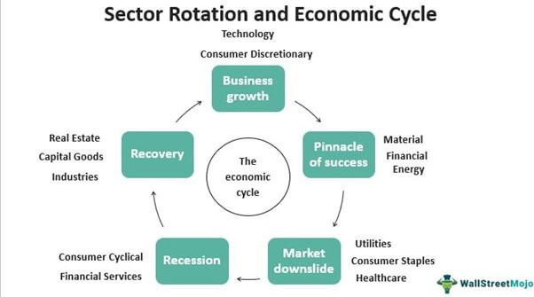

Sector analysis, economic analysis, investment strategies, and algorithmic trading are fundamental aspects of the financial industry. These components are interconnected, forming a framework that optimizes investment choices and enhances trading outcomes. Sector analysis aids in understanding the performance dynamics of specific economic sectors, providing a strategic advantage in making informed investment decisions. Economic analysis equips investors with insights into macroeconomic conditions, assisting in aligning portfolios with prevailing economic trends.

Algorithmic trading represents a paradigm shift in investment strategies. By utilizing computer algorithms to execute trades with precision and speed, investors can navigate complex financial markets more effectively. This shift has transformed sector picking, enabling the application of data-driven and dynamic strategies tailored to the evolving market landscape. The use of sophisticated algorithms allows for real-time analysis of extensive datasets, thus identifying lucrative trading opportunities with accuracy.



The intersection of these financial elements is shaped by innovative methodologies, advanced tools, and emerging trends. The use of big data, artificial intelligence, and machine learning technologies further refines the process of investment, as these technologies offer enhanced predictive capabilities and modeling accuracy. Investors who harness these technological advancements find themselves better positioned to adapt to the fast-paced changes characterizing modern financial markets. This article explores how these methodologies, tools, and trends are currently influencing the financial sector and their potential implications for the future.

## Table of Contents

## Understanding Sector Analysis

Sector analysis is the process of assessing the economic and financial potential of distinct sectors within an economy. It involves evaluating sector-specific conditions alongside overarching macroeconomic factors to predict the potential performance of companies within a given sector. This analysis gives investors valuable insights into the expected trajectory of companies based on various market influences.

To conduct sector analysis effectively, several methodologies can be utilized, with the top-down approach being one of the most common. This involves starting with broad economic and market factors before narrowing the focus onto specific sectors and industries. By examining high-level economic indicators, such as GDP growth rates, inflation, and interest rates, investors can determine which sectors are likely to benefit from the current economic climate.

Sector rotation strategies are another popular method in sector analysis. These strategies involve adjusting an investment portfolio by shifting funds from one sector to another, depending on which sectors are projected to outperform at different stages of the business cycle. For example, during economic expansion, cyclical sectors such as consumer discretionary and technology might see increased investment, while defensive sectors like utilities and healthcare may garner more attention during a recession.

Understanding business cycles is critical for successful sector analysis, as each phase of the cycle—expansion, peak, contraction, and trough—affects sectors differently. This understanding allows investors to anticipate the sectors that will thrive under specific economic conditions and plan their investments accordingly.

Moreover, sector analysis is instrumental in diversifying investments and managing risk. By spreading investments across various sectors, investors reduce the risk associated with a downturn in any single sector. This diversification can also lead to the identification of potential opportunities that might not be evident through a broader market analysis alone.

In conclusion, sector analysis serves as a fundamental tool for investors aiming to optimize their investment choices. By leveraging insights into sector-specific conditions and macroeconomic factors, it facilitates informed decision-making that enhances portfolio performance while mitigating risks.

## Economic Analysis and Investment Strategies

Economic analysis serves as a vital foundation for informed investment decisions by examining macroeconomic indicators such as GDP growth, unemployment rates, and fiscal policies. These indicators provide insights into the overall economic health, influencing the performance of various sectors and guiding investment strategies.

Strategic investing seeks to capitalize on economic cycles by aligning portfolios with sectors forecasted to perform optimally under prevailing economic conditions. For instance, during periods of economic expansion characterized by rising GDP and declining unemployment, growth-focused investment strategies may prioritize sectors such as technology and consumer discretionary. In contrast, during economic contractions, defensive sectors like healthcare and utilities, known for their stability and consistent demand, might become more attractive.

Sector rotation strategies are crucial in adjusting investment allocations as markets transition through different phases of economic cycles. These strategies exploit the cyclical nature of sector performance, encouraging a tactical shift in investments from one sector to another based on expected economic developments. The rationale is to invest in sectors poised for expansion while divesting from those expected to underperform.

Investment strategies can be categorized into growth, value, income, or a mixture of these approaches, contingent upon economic forecasts. Growth strategies focus on companies expected to deliver above-average earnings growth, warranting a premium valuation. Value strategies, on the other hand, seek undervalued stocks—those trading below their intrinsic value—offering a potential for price appreciation once the market corrects the mispricing. Income strategies prioritize generating regular earnings through dividends or interest, common in sectors like utilities and real estate.

Balancing short-term gains with long-term investment horizons necessitates a comprehensive understanding of both sector-specific intricacies and broader economic dynamics. Economic analysis aids in assessing this balance, ensuring that investments not only withstand short-term market fluctuations but also align with long-term economic trends. By integrating economic analysis with sector-specific insights, investors can forge robust investment strategies that optimize returns while effectively managing risks.

In summary, economic analysis is indispensable in shaping investment strategies, allowing investors to navigate complex market environments. By interpreting macroeconomic indicators and understanding their impact on sector performance, investors can make informed decisions that balance immediate opportunities with future growth potential.

## Algorithmic Trading: An Overview

Algorithmic trading has transformed the financial sector by leveraging computer systems to execute trades according to predefined algorithms. This approach reduces human error and increases efficiency, allowing for faster and more accurate trading decisions. These computerized systems are capable of processing vast datasets to uncover trading opportunities by analyzing both historical and real-time data. Algorithms can identify patterns and trends across various sectors, making them invaluable tools for traders looking to optimize sector [picking](/wiki/asset-class-picking) and enhance investment strategies.

One of the primary advantages of [algorithmic trading](/wiki/algorithmic-trading) is its speed. Trades can be executed within milliseconds, far exceeding human capabilities. This rapid processing is critical in the fast-moving financial markets, where delays could result in significant financial losses. The accuracy of algorithmic trading helps ensure that trades are executed at the best possible prices, minimizing slippage and maximizing potential returns.

Scalability is another significant benefit. Algorithms can be designed to handle numerous trades simultaneously, which would be impossible to manage manually. This scalability allows traders and financial institutions to expand their operations without proportionally increasing labor costs. Moreover, the complex data processing capabilities of algorithmic systems enable them to handle and integrate a wide range of information sources, from market prices and financial news to macroeconomic indicators.

Sector picking is a critical application of algorithmic trading. By analyzing data for sectors with high growth potential, algorithms can guide investment decisions towards more promising areas of the market. Machine learning technologies further enhance these capabilities by improving the predictive accuracy of algorithmic models. Machine learning algorithms such as neural networks can identify non-linear patterns in market data that traditional models might miss. This ability is particularly beneficial for predicting market movements and optimizing sector selection.

For example, a basic model for predicting stock price movements could use linear regression to correlate historical stock prices with specific financial indicators. In Python, this might look like:

```python
from sklearn.linear_model import LinearRegression
import numpy as np

# Example data: historical prices and indicators
x = np.array([[1, 2], [2, 3], [3, 4]])  # Financial indicators
y = np.array([2, 3, 4])  # Historical prices

# Linear regression model
model = LinearRegression()
model.fit(x, y)

# Predict future prices
predictions = model.predict(np.array([[4, 5]]))
```

However, [machine learning](/wiki/machine-learning) models like recurrent neural networks (RNNs) or [long short](/wiki/equity-long-short)-term memory networks (LSTMs) can account for sequential dependencies in data, making them more suitable for financial time series analysis. These advanced models continuously learn and adapt to new data, improving their effectiveness in dynamic market environments.

Algorithmic trading continues to evolve, with innovations in [artificial intelligence](/wiki/ai-artificial-intelligence) and machine learning driving advances in predictive modeling and decision-making processes. As more complex data sources become integrated into algorithmic systems, traders will be better equipped to navigate the complexities of modern financial markets and capitalize on investment opportunities with greater precision and efficiency.

## Tools and Technologies for Sector Analysis

Tools like Bloomberg Terminal, MetaTrader, and QuantConnect are essential for conducting comprehensive sector analysis and developing effective trading strategies. Bloomberg Terminal offers financial professionals detailed information on global financial markets, real-time news, and powerful analytics tools, enabling users to perform thorough sector-specific research. MetaTrader, widely popular among individual investors and financial institutions, provides platforms for automated trading through custom scripts, known as Expert Advisors (EAs), which facilitate sector analysis by executing trades based on predefined criteria. QuantConnect, an open algorithmic trading platform, allows users to design, test, and deploy trading algorithms, leveraging cloud computing to handle complex data sets efficiently.

Advanced technologies such as machine learning and AI play a critical role in processing large datasets and identifying trends within different sectors. These technologies can sift through vast amounts of structured and unstructured data to recognize patterns and make predictions about future sector performance. Machine learning models, such as decision trees and neural networks, are trained on historical data to improve the accuracy and efficiency of sector analysis. Implementing these technologies enables analysts to incorporate a wide range of variables and conditions into their assessments, providing a more holistic view of market dynamics.

Sentiment analysis and big data analytics offer additional insights beyond traditional financial metrics by incorporating real-time news and social sentiment. These methods analyze language patterns in media reports, social media posts, and other text sources to gauge the market's mood towards specific sectors. This approach provides a snapshot of public and investor sentiment, supplemented by quantitative data, which can signal potential sector shifts. For sentiment analysis, natural language processing (NLP) technologies are frequently used to process and interpret unstructured text data, providing valuable context to numerical data.

Quantitative analysis and [backtesting](/wiki/backtesting) strategies are vital to ensuring that models remain robust and adaptable to changing market conditions. Quantitative analysis involves statistical and mathematical modeling to understand sector trends and inform investment decisions. Backtesting allows analysts to simulate how a trading strategy would have performed in the past, using historical data to validate the strategy's effectiveness. The process helps refine models to optimize performance under various market scenarios, increasing reliability and reducing the risk of loss.

Emerging technologies like quantum computing hold the potential to revolutionize data processing capabilities in algorithmic trading. Quantum computing could significantly reduce the time required to process large datasets, offering more accurate predictions and enabling the analysis of more complex market dynamics. As these technologies advance, they may provide unparalleled computational power, allowing for more detailed and faster sector analysis, which helps traders make better-informed decisions quickly.

These tools and technologies are redefining the landscape of sector analysis and trading strategy development, offering unprecedented opportunities for investors to refine their approaches and enhance their decision-making capabilities. The convergence of advanced technologies and data analytics continues to open new paths for achieving precision, efficiency, and competitive advantage in financial markets.

## Challenges and Future Trends

Challenges in sector picking are multifaceted, reflecting both technological and market-driven complexities. One primary challenge is data quality, which is critical for making informed decisions. Poor data quality can lead to erroneous insights, misdirecting investment strategies. The [volatility](/wiki/volatility-trading-strategies) inherent in financial markets further complicates sector picking. Markets can fluctuate due to geopolitical tensions, economic shifts, and unforeseen global events, making it difficult for models to maintain accuracy.

Algorithmic bias presents another significant challenge. Algorithms trained on historical data may inadvertently learn biases present in those datasets, influencing trading strategies in unintended ways. This bias can skew predictions, resulting in adverse investment outcomes. Overfitting is a related concern where models are tailored too closely to historical data, thereby losing their applicability in live, unpredictable market conditions. Such models might perform exceptionally in backtesting but falter in a real-world trading environment.

Future trends in sector picking point toward increased reliance on artificial intelligence (AI) and machine learning for predictive analytics and real-time decision-making. These technologies are instrumental in processing vast quantities of data efficiently, deriving patterns, and making prompt decisions. AI can adapt and learn from new data, enhancing the predictive accuracy of sector analysis.

Emerging technologies, such as blockchain and quantum computing, promise to revolutionize data processing capabilities. Blockchain could provide increased transparency and data integrity, while quantum computing has the potential to significantly accelerate data analysis processes. This acceleration enables traders to respond swiftly to market changes, providing a competitive edge.

As sector picking continues to evolve, investment models will integrate more complex data sources. These sources may include [alternative data](/wiki/best-alternative-data) sets like social media sentiment, satellite imagery, and weather patterns, enriching the analysis beyond traditional financial metrics. The enhanced integration of these diverse data sources facilitates more precise predictive modeling, allowing for improved accuracy in sector picking.

In conclusion, successfully navigating the challenges of sector picking involves balancing the latest technological advances with a thorough understanding of market dynamics. The continuous evolution of technology underscores the importance of adaptability and innovation in refining sector analysis methodologies.

## Conclusion

Sector analysis is fundamental to an effective investment strategy, offering essential insights into both economic conditions and the performance of various sectors. Recognizing and understanding the nuances within each sector can significantly enhance investment decisions by highlighting which areas are poised for growth or contraction. Economic analysis is vital in this context, as it aligns investment strategies with market cycles. By examining macroeconomic indicators such as GDP growth, interest rates, and inflation, investors can forecast sector performance and adjust their portfolios accordingly.

Algorithmic trading has revolutionized how sector picking is conducted, leveraging advanced technologies to make precise and efficient trading decisions. By employing sophisticated algorithms, investors can analyze large datasets to identify potential growth sectors, execute trades with minimal latency, and reduce the likelihood of human error. This technological edge is particularly useful in a market environment characterized by rapid fluctuations and abundant information. 

Moreover, as technology continues to advance, the ability to adapt strategies is increasingly important. The financial landscape is constantly shifting, driven by innovations in artificial intelligence, machine learning, and data analytics. These advancements provide tools to not only refine current models but also to anticipate and react to emerging market trends more swiftly. 

Continuous learning and ongoing technological advancements are essential for maximizing returns and effectively managing risks. As new technologies and methodologies emerge, investors must be prepared to integrate these into their strategies to maintain a competitive advantage. By doing so, they can ensure they are well-equipped to capitalize on market opportunities and navigate the complexities of the ever-changing financial landscape.

## References & Further Reading

[1]: Bergstra, J., Bardenet, R., Bengio, Y., & Kégl, B. (2011). ["Algorithms for Hyper-Parameter Optimization."](https://dl.acm.org/doi/10.5555/2986459.2986743) Advances in Neural Information Processing Systems 24.

[2]: ["Advances in Financial Machine Learning"](https://www.amazon.com/Advances-Financial-Machine-Learning-Marcos/dp/1119482089) by Marcos Lopez de Prado

[3]: ["Evidence-Based Technical Analysis: Applying the Scientific Method and Statistical Inference to Trading Signals"](https://www.amazon.com/Evidence-Based-Technical-Analysis-Scientific-Statistical/dp/0470008741) by David Aronson

[4]: ["Machine Learning for Algorithmic Trading"](https://github.com/stefan-jansen/machine-learning-for-trading) by Stefan Jansen

[5]: ["Quantitative Trading: How to Build Your Own Algorithmic Trading Business"](https://www.amazon.com/Quantitative-Trading-Build-Algorithmic-Business/dp/1119800064) by Ernest P. Chan