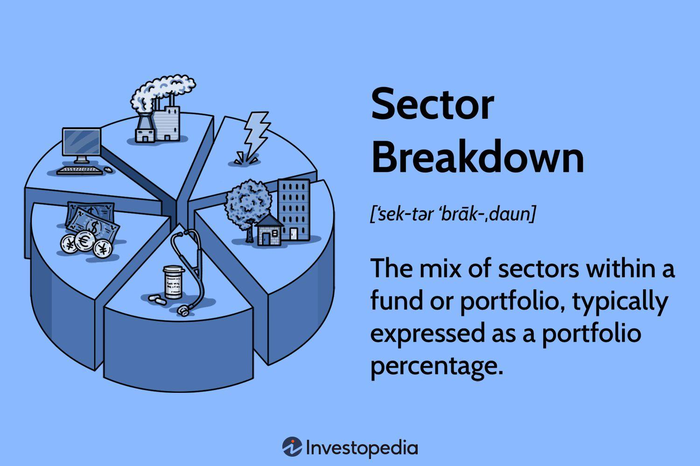

## Table of Contents

## What is a sector breakdown?

A sector breakdown is a way to look at different parts of the economy. It shows how much each part, or sector, contributes to the whole economy. Sectors can include things like farming, making things, and services like banking or healthcare. By understanding the sector breakdown, people can see which parts of the economy are growing or shrinking.

This information is useful for many people. Businesses use it to decide where to invest their money. Governments use it to make plans and policies. Investors look at sector breakdowns to choose where to put their money for the best return. Overall, a sector breakdown helps everyone understand the health and direction of the economy.

## Why is understanding sector breakdown important for investors?

Understanding sector breakdown is important for investors because it helps them see where the economy is strong or weak. If a sector is growing, it might be a good place to invest money. For example, if the technology sector is doing well, an investor might want to buy stocks in tech companies. On the other hand, if a sector is shrinking, it might be risky to invest there. Knowing the sector breakdown helps investors make smarter choices about where to put their money.

Also, sector breakdown can show investors where new opportunities might be. Sometimes, a sector that is not doing well right now might be about to grow. If an investor can see this early, they can get in on the ground floor of a new trend. This can lead to big profits. By keeping an eye on sector breakdowns, investors can stay ahead of the game and find the best places to invest their money.

## How can sector breakdown be used in portfolio management?

Sector breakdown can help people who manage money, like portfolio managers, to make their investment choices better. They look at how different parts of the economy are doing and then decide where to put their money. If one part of the economy is growing fast, they might want to invest more money there. This way, they can try to make more money for the people they work for.

Portfolio managers also use sector breakdown to spread out their risks. They don't want to put all their money in one place because if that part of the economy does badly, they could lose a lot. By knowing which sectors are doing well and which ones are not, they can choose to invest in different sectors. This helps them keep their money safe and still grow it over time.

## What are the common sectors used in sector breakdown analysis?

Sector breakdown analysis often looks at many different parts of the economy. Some of the common sectors include things like energy, which is about oil, gas, and electricity. There's also the technology sector, which includes companies that make computers, software, and internet services. Healthcare is another big sector, covering hospitals, medicine, and health insurance. Other important sectors are financials, which includes banks and insurance companies, and consumer goods, which are things people buy every day like food and clothes.

Another set of common sectors are industrials, which make things like cars and airplanes, and materials, which include companies that mine metals or make chemicals. The utilities sector deals with services like water and electricity, while the real estate sector focuses on buying, selling, and renting property. There's also the communication services sector, which includes companies that provide phone and internet services. By looking at these sectors, people can understand how different parts of the economy are doing and make better decisions about where to invest their money.

## How does sector breakdown differ from industry breakdown?

Sector breakdown and industry breakdown are two ways to look at the economy, but they focus on different levels of detail. A sector is a broad part of the economy, like energy or healthcare. It groups together many businesses that do similar things. For example, the energy sector includes all companies that deal with oil, gas, and electricity. When people talk about sector breakdown, they are looking at these big groups to see how well different parts of the economy are doing.

An industry breakdown, on the other hand, looks at smaller groups within a sector. An industry is a more specific part of a sector. For example, within the energy sector, there might be industries like oil drilling, natural gas production, and renewable energy. Industry breakdown gives a more detailed view of the economy. It helps people see how specific types of businesses are doing, which can be useful for making more focused investment decisions.

## What are the primary sources of data for sector breakdown?

The main places to get information for sector breakdown come from government reports and big companies that collect data. Governments often have groups like the Bureau of Economic Analysis or the Census Bureau that keep track of how different parts of the economy are doing. They share this information in reports that anyone can look at. These reports show how much money each sector is making and how many people are working in each one.

Another important source of data comes from big companies that do research. Companies like Standard & Poor's, Moody's, and Bloomberg collect a lot of information about different sectors. They use this data to make reports and charts that show how sectors are growing or shrinking. Investors and businesses use these reports to make decisions about where to put their money. By looking at data from both government and private sources, people can get a good picture of what's happening in different parts of the economy.

## How can sector breakdown help in identifying market trends?

Sector breakdown can help people see what's happening in the economy and spot new trends. When you look at how different sectors are doing, you can see which ones are growing fast. This might mean that people are buying more of what those sectors make or that new technology is making those sectors more important. For example, if the technology sector is getting bigger, it might mean that more people are using computers and the internet. This can help investors and businesses understand where the market is going and what new opportunities might be coming up.

By watching sector breakdowns over time, you can also see if a trend is just starting or if it's been going on for a while. If a sector keeps growing, it might be a long-term trend. But if it grows quickly and then stops, it might be a short-term thing. Knowing the difference can help people decide when to invest in a sector. For example, if the healthcare sector is growing because more people are getting older, that might be a trend that will last for many years. By using sector breakdown to spot these trends, people can make better choices about where to put their money.

## What are the limitations of using sector breakdown in investment strategies?

Using sector breakdown in investment strategies has some problems. One big problem is that it can be too simple. Sectors are big groups, and they can hide important details. For example, the technology sector might be doing well, but not all tech companies are the same. Some might be doing great, while others are not. If you only look at the sector, you might miss these differences and make bad investment choices.

Another problem is that sector breakdown can change over time. What's hot today might not be hot tomorrow. For example, the energy sector might be doing well because of high oil prices, but if oil prices drop, the sector might not do as well. This means that investors need to keep updating their information and be ready to change their plans. It's hard to predict the future just by looking at sector breakdowns, so it's important to use other information too.

## How do global economic factors influence sector breakdown?

Global economic factors can change how different sectors do in the economy. Things like interest rates, trade rules, and big events like wars or pandemics can make some sectors grow and others shrink. For example, if a country puts a tax on goods from another country, it can hurt the sectors that make those goods. Or if interest rates go up, it can make it harder for companies to borrow money, which can slow down sectors like real estate or construction.

These global factors can also make money move around the world. If one country's economy is doing well, investors might want to put their money there. This can help the sectors in that country grow. But if another country's economy is not doing well, money might leave, and its sectors might struggle. So, understanding global economic factors is important for knowing how sectors will do and making good investment choices.

## What advanced analytical tools are used to enhance sector breakdown analysis?

People use special computer programs and math to make sector breakdown analysis better. These tools help them look at a lot of information quickly and find patterns that might be hard to see otherwise. For example, data visualization software can show sector data in charts and graphs that make it easy to understand. Another tool is machine learning, which uses computers to learn from past data and predict what might happen next. This can help investors see which sectors might grow or shrink in the future.

Another important tool is econometric modeling, which uses math to understand how different parts of the economy affect each other. This can help people see how things like interest rates or trade rules might change sector performance. Also, sentiment analysis tools look at what people are saying on social media or in the news to see how they feel about different sectors. By using these advanced tools, people can get a clearer picture of what's happening in the economy and make better decisions about where to invest their money.

## How can sector breakdown be integrated with other financial analysis techniques?

Sector breakdown can be used with other financial tools to make better investment choices. One way to do this is by using it with [fundamental analysis](/wiki/fundamental-analysis). Fundamental analysis looks at a company's money details like how much it earns and how much it owes. By looking at sector breakdown first, investors can see which sectors are doing well. Then, they can use fundamental analysis to pick the best companies in those sectors to invest in. This helps them find strong companies in growing parts of the economy.

Another way to use sector breakdown is with technical analysis. Technical analysis looks at past prices and trading patterns to guess what might happen next. By knowing which sectors are growing or shrinking, investors can use technical analysis to find the best times to buy or sell stocks in those sectors. This can help them make money by timing their investments well. By combining sector breakdown with other tools, investors can get a fuller picture of the market and make smarter choices.

## What are the future trends in sector breakdown methodologies?

In the future, sector breakdown methods will likely use more technology to make them better. One big change will be the use of [artificial intelligence](/wiki/ai-artificial-intelligence) and machine learning. These tools can look at a lot of data quickly and find patterns that people might miss. They can also predict what might happen next in different sectors. This will help investors see where the economy is going and make better choices about where to put their money. Another change will be better ways to show data, like new kinds of charts and graphs. These will make it easier for people to understand sector breakdowns and see what's happening in the economy.

Another trend will be looking at sectors in new ways. Right now, sectors are often grouped by what they do, like energy or technology. But in the future, people might start grouping them by other things, like how much they help the environment or how they use new technology. This can help investors find companies that are doing good things for the world or using new ideas to grow. Also, as the world gets more connected, sector breakdowns will need to think about global trends more. This means looking at how things like trade rules or big events in other countries can change what happens in different sectors. By using these new methods, people can get a better understanding of the economy and make smarter investment choices.

## What is Understanding Sector Analysis?

Sector analysis examines industries to evaluate trends, opportunities, and risks, serving as an essential tool for informed investment. It provides insights into which sectors may perform well and which could encounter challenges. This analytical approach helps investors understand the complex dynamics of different sectors, which can react distinctly to economic changes, regulatory shifts, and technological advancements. 

For example, sectors like technology and healthcare often respond differently to economic stimuli compared to more traditional industries like manufacturing or utilities. During economic expansions, consumer discretionary and technology sectors might thrive due to increased consumer spending and innovation demand. Conversely, in economic downturns, utility and healthcare sectors might demonstrate resilience due to their essential nature and steady demand.

Sector analysis involves various quantitative and qualitative techniques. Financial metrics, such as growth rates, revenue projections, and profit margins, are pivotal in identifying strong sectors. Additionally, investors assess macroeconomic indicators like GDP growth, interest rates, and unemployment figures to understand broader economic impacts on different industries.

Analyzing historical data can reveal cyclical patterns in sectors, guiding investment decisions. For instance, analysts might use statistical tools like regression analysis to determine how economic variables relate to sector performance. Consider:

$$
\text{Sector Performance} = \beta_0 + \beta_1 \times \text{GDP Growth} + \beta_2 \times \text{Interest Rate} + \epsilon
$$

where $\beta_0$ is the intercept, $\beta_1$ and $\beta_2$ are coefficients representing the relationship of GDP growth and interest rates with sector performance, and $\epsilon$ is the error term. Evaluating these relationships helps predict sector trajectories based on economic conditions.

In addition, technological tools and software enhance sector analysis by processing large datasets quickly, identifying patterns that might not be evident through traditional methods. Advanced data analytics and [machine learning](/wiki/machine-learning) models can provide predictive insights, offering a competitive edge in sector selection. 

By recognizing how and why particular sectors excel under certain conditions, investors can tailor their strategies, aligning portfolios with sectors exhibiting the most promise. This understanding ultimately facilitates strategic asset allocation, risk management, and potential return maximization.

## What are investment strategies that utilize sector analysis?

Sector analysis plays a pivotal role in crafting effective investment strategies, primarily through portfolio diversification and sector rotation. By analyzing different financial sectors, investors can make informed decisions to optimize their returns while mitigating risks.

### Diversification through Sector Analysis

Diversification is a fundamental principle in investing, which involves spreading investments across various financial sectors. This strategy aims to reduce the impact of a single sector's underperformance on the overall portfolio. By investing in multiple sectors, investors can achieve a balance that traditionally insulates against market [volatility](/wiki/volatility-trading-strategies). For example, while the technology sector may experience high growth, it could be offset by downturns in the energy sector due to fluctuating oil prices. By holding a mix of such sectors, the portfolio's risk is minimized.

The mathematical representation of diversification can be understood through variance and covariance. A diversified portfolio aims to minimize the following expression, which represents portfolio variance:

$$
\sigma_p^2 = \sum_{i=1}^{n} w_i^2 \sigma_i^2 + \sum_{i=1}^{n} \sum_{j \neq i}^{n} w_i w_j \sigma_i \sigma_j \rho_{ij}
$$

Here, $\sigma_p^2$ denotes the portfolio variance, $w_i$ and $w_j$ represent the weights of assets $i$ and $j$, $\sigma_i$ and $\sigma_j$ are the standard deviations of these assets, and $\rho_{ij}$ is the correlation coefficient between the returns of assets $i$ and $j$. The goal is to select weights $w_i$ that minimize $\sigma_p^2$.

### Sector Rotation Strategies

Sector rotation is an advanced strategy that involves shifting investments between sectors to exploit economic cycles. Financial sectors do not respond uniformly to macroeconomic changes, and recognizing these patterns can enhance investment outcomes. During economic expansions, cyclical sectors like consumer discretionary and industrials often outperform. Conversely, defensive sectors such as consumer staples and healthcare tend to exhibit resilience during downturns.

Sector rotation can be approached algorithmically by analyzing economic indicators and historical sector performance trends. Python can be employed to develop models predicting sector performance based on macroeconomic data:

```python
import pandas as pd
from sklearn.ensemble import RandomForestRegressor
from sklearn.model_selection import train_test_split

# Example code to predict sector performance
# Load historical sector performance data
data = pd.read_csv('sector_data.csv')

# Identify features (e.g., economic indicators) and target variable (e.g., sector return)
features = data[['GDP_growth', 'interest_rate', 'inflation_rate']]
target = data['sector_return']

# Split data into training and testing sets
X_train, X_test, y_train, y_test = train_test_split(features, target, test_size=0.2)

# Train a Random Forest model
model = RandomForestRegressor(n_estimators=100, random_state=42)
model.fit(X_train, y_train)

# Predict sector performance
predictions = model.predict(X_test)
```

This model can assist investors in dynamically allocating capital across sectors based on projected performance, thereby optimizing returns.

In summary, sector analysis allows investors to strategically allocate investments across different sectors, capitalizing on opportunities while cushioning against potential losses. The combination of diversification and sector rotation strategies addresses both risk mitigation and return enhancement, making it a robust approach in the investment landscape.

## What are the challenges in sector analysis and algorithmic trading?

Data quality and algorithmic biases pose significant challenges in the efficient execution of sector analysis and [algorithmic trading](/wiki/algorithmic-trading). High-quality data is paramount, as unreliable or incomplete datasets can lead to erroneous analysis and poor investment decisions. Ensuring accuracy involves scrubbing raw data, which can be noisy, to remove inaccuracies and fill gaps present in historical records. This process is fundamental for the proper training of algorithms that use historical data to make future predictions.

Algorithmic biases occur when preconceived notions or originally skewed data are inadvertently encoded into trading models. These biases can originate from biased training datasets, where the data used may not accurately represent the current market conditions, or from the algorithms themselves if they are constructed using flawed logic. Such biases can mislead investment decisions, whereby certain sectors are favored over others without justifiable cause.

Overfitting is another critical issue. It happens when a trading model becomes excessively complicated, capturing not only the genuine signals in the data but also the noise. An overfitted model may demonstrate high performance when applied to historical data but fail to generalize to novel data points in the future. This is commonly mitigated by simplifying models and validating them on out-of-sample data to ensure robust performance. Mathematically, the problem of overfitting in model fitting can be illustrated using polynomial regression:

$$
\text{Minimize: } \sum_{i=1}^n (y_i - f(x_i))^2 + \lambda \sum_{j=1}^p \theta_j^2
$$

Here, the first term is the least squares error between the observed data $y_i$ and the predictions $f(x_i)$, and the second term is a regularization term controlled by $\lambda$ that penalizes overly complex models.

Continuous monitoring and algorithm adjustment are vital to maintain relevance and accuracy in dynamic market environments. Markets are inherently volatile, influenced by myriad factors including economic data releases, geopolitical events, and sentiment shifts, necessitating regular updates to trading algorithms. Adaptation might involve retraining algorithms with the latest data, recalibrating to current economic conditions, or deploying new features detected through ongoing research and development.

In conclusion, managing data quality, avoiding algorithmic biases, and preventing overfitting, alongside ongoing refinement and adaptation of algorithms, are essential challenges that must be addressed to ensure effective sector analysis and successful algorithmic trading. These steps are pivotal in enabling these systems to provide reliable and accurate investment guidance.

## References & Further Reading

[1]: Bergstra, J., Bardenet, R., Bengio, Y., & Kégl, B. (2011). ["Algorithms for Hyper-Parameter Optimization."](https://dl.acm.org/doi/10.5555/2986459.2986743) Advances in Neural Information Processing Systems 24.

[2]: ["Advances in Financial Machine Learning"](https://www.amazon.com/Advances-Financial-Machine-Learning-Marcos/dp/1119482089) by Marcos Lopez de Prado

[3]: ["Evidence-Based Technical Analysis: Applying the Scientific Method and Statistical Inference to Trading Signals"](https://www.amazon.com/Evidence-Based-Technical-Analysis-Scientific-Statistical/dp/0470008741) by David Aronson

[4]: ["Machine Learning for Algorithmic Trading"](https://github.com/stefan-jansen/machine-learning-for-trading) by Stefan Jansen

[5]: ["Quantitative Trading: How to Build Your Own Algorithmic Trading Business"](https://www.amazon.com/Quantitative-Trading-Build-Algorithmic-Business/dp/1119800064) by Ernest P. Chan