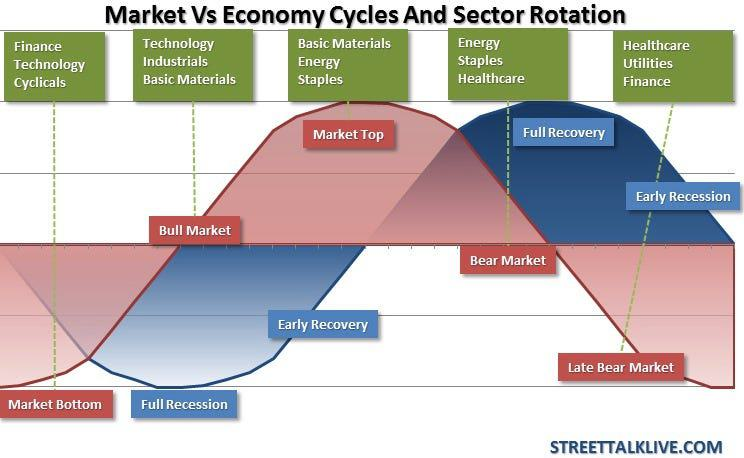

Investment strategies have evolved significantly with the advent of sector exchange-traded funds (ETFs) and algorithmic trading, offering investors new pathways to optimize their portfolios. Sector ETFs provide a focused investment vehicle by allowing investors to target specific sectors of the economy, such as technology, healthcare, or financial services. This targeted approach offers a level of diversification that enhances portfolio management by spreading risk across various sector-specific securities rather than relying solely on individual stocks.

Diversification remains a cornerstone of effective portfolio management. By including sector ETFs in an investment portfolio, investors can achieve diversification at a nuanced level, targeting specific sectors that align with their longer-term economic outlook or personal investment goals. This strategy enhances the ability to balance risk and return, providing an opportunity to capitalize on specific economic trends while mitigating sector-specific risks.

Algorithmic trading, which involves using computer algorithms to execute trades at high speed and volume, has become increasingly integral to managing modern investment portfolios. With its capacity for speed, precision, and processing vast amounts of data, algorithmic trading enables investors to take advantage of market inefficiencies and make timely, informed decisions. It reduces the emotional bias in trading and allows the implementation of complex strategies that would be challenging for human traders alone.

The purpose of this article is to discuss strategic approaches that leverage sector ETFs with algorithmic trading, offering insights into how these tools can work together to enhance investment outcomes. By understanding the nuances of sector ETFs and the capabilities of algorithmic trading, investors can strategically position themselves in the ever-evolving financial markets to achieve their financial objectives.

## Table of Contents

## Understanding Sector ETFs

Sector Exchange-Traded Funds (ETFs) are financial instruments that enable investors to focus their investments on specific sectors of the economy. They are pooled investment vehicles similar to mutual funds, but they trade on stock exchanges like individual stocks. Sector ETFs are designed to track the performance of a particular industry or sector, providing investors with exposure to that segment without requiring direct investment in individual stocks.

Investing in Sector ETFs offers several benefits, particularly in terms of diversification. By including Sector ETFs in a portfolio, investors can achieve exposure to various industries, thereby spreading risk across different segments. This approach allows investors to mitigate the risks associated with sector-specific economic downturns. For example, an investor holding a diversified set of Sector ETFs in technology, healthcare, and financial services may be better insulated from a crisis affecting only one sector.

Popular sectors often represented in Sector ETFs include technology, healthcare, and financial services. The technology sector [ETF](/wiki/etf-trading-strategies) may consist of stocks from companies involved in software development, hardware manufacturing, and IT services. Healthcare Sector ETFs typically contain investments in pharmaceuticals, biotechnology, and medical devices, while financial services Sector ETFs generally comprise banks, insurance companies, and investment firms.

Sector ETFs can complement traditional equity and bond investments by providing targeted exposure to high-growth industries. For instance, during periods of economic expansion, certain sectors such as technology or industrials may outperform the broader market. By investing in Sector ETFs, investors can capitalize on these growth opportunities while maintaining a core portfolio of broader-based equities and bonds for stability.

When choosing Sector ETFs, investors should consider prevailing market trends and economic forecasts. Factors such as technological advancements, regulatory changes, and demographic shifts can significantly impact the performance of certain sectors. For example, a projected increase in healthcare spending due to an aging population may make healthcare Sector ETFs an attractive option. Similarly, economic forecasts predicting robust growth in digital technologies could incentivize investments in technology Sector ETFs.

Considerations such as the expense ratio and the underlying index methodology also play a crucial role in the selection process. Investors should assess how closely a Sector ETF tracks its benchmark index and evaluate the fund's historical performance and [liquidity](/wiki/liquidity-risk-premium). Understanding the economic and market dynamics driving sector performance is essential for making informed decisions about Sector ETF investments.

## Algorithmic Trading and Its Benefits

Algorithmic trading refers to the use of computerized systems to enter and execute trading orders, employing pre-programmed instructions that account for variables like timing, price, and [volume](/wiki/volume-trading-strategy). This method leverages advanced mathematical models and high-speed computational power to facilitate trading strategies, often eliminating the need for direct human intervention. Algorithmic trading is increasingly popular across various markets, including equities, futures, options, and, notably, Sector Exchange-Traded Funds (ETFs).

The incorporation of technology and data analysis is crucial in [algorithmic trading](/wiki/algorithmic-trading). Algorithms analyze vast datasets to detect patterns and predict market movements, allowing trades to occur at speeds and frequencies that a human trader cannot achieve. Machine learning and [artificial intelligence](/wiki/ai-artificial-intelligence) play a pivotal role, enabling adaptive strategies that can learn from market conditions and historical data. For instance, artificial neural networks might be employed to forecast price movements based on historical patterns.

Algorithmic trading offers significant advantages when applied to Sector ETFs. One of the primary benefits is speed; algorithms execute trades within milliseconds, taking advantage of fleeting market opportunities and [arbitrage](/wiki/arbitrage) situations. Precision is another key advantage, as algorithms can operate without the emotional biases that often affect human traders, reducing the likelihood of errors in fast-paced markets. This precision is particularly beneficial for Sector ETFs, where market dynamics can rapidly shift due to sector-specific news and trends.

Numerous algorithms are employed in trading Sector ETFs, each designed to capitalize on different aspects of the market. Some common types include:

1. **Trend-Following Algorithms**: These algorithms identify and capitalize on emerging trends by entering trades in the direction of the trend. They often rely on moving averages and momentum indicators.

2. **Market-Making Algorithms**: These provide liquidity by continuously quoting buy and sell prices, profiting from the bid-ask spread.

3. **Mean Reversion Algorithms**: These strategies assume that prices will revert to a historical mean, identifying securities that have deviated significantly from their average prices.

4. **Arbitrage Algorithms**: These exploit price discrepancies in different markets or instruments. For example, they may simultaneously buy and sell an ETF and its underlying securities.

Despite its advantages, algorithmic trading is not without risks and challenges. The reliance on technology means that system failures or glitches can lead to significant financial losses. High-frequency trading, a subset of algorithmic strategies, can lead to market anomalies or "flash crashes," where prices plummet and recover rapidly. These issues highlight the importance of robust risk management practices, including thorough testing and fail-safes to prevent undesired outcomes.

To mitigate risks, traders often employ techniques such as [backtesting](/wiki/backtesting), which involves simulating the algorithm on historical data to assess its viability. Continuous monitoring and updating of the algorithms are crucial to adapt to changing market conditions. Moreover, regulatory oversight is essential to ensure fair trading practices, as algorithmic trading can sometimes lead to market manipulation or unfair advantages.

Algorithmic trading significantly enhances the capability to execute sophisticated trading strategies efficiently. By marrying advanced technology with intelligent data analysis, investors can optimize their trades in Sector ETFs, capitalizing on both the speed and accuracy offered by algorithms while remaining vigilant of inherent risks.

## Developing Investment Strategies with Sector ETFs and Algo Trading

## Developing Investment Strategies with Sector ETFs and Algo Trading

When developing an investment strategy that combines Sector ETFs and algorithmic trading, several key considerations should guide your approach to optimize potential returns while managing risks.

### Key Considerations

1. **Diversification Benefits**: Sector ETFs allow investors to focus on specific industries, such as technology or healthcare. By leveraging multiple Sector ETFs, investors can diversify their portfolios, reducing the risk associated with market volatility in any one sector.

2. **Market Conditions and Trends**: It is crucial to assess current market conditions and trends. Historical data, analyst reports, and economic indicators can inform decisions regarding which sectors may perform well, guiding the selection of Sector ETFs.

3. **Algorithm Selection**: Choosing appropriate algorithms tailored to sector-specific strategies is vital. Momentum trading algorithms, for instance, can capitalize on trending sectors, while mean reversion strategies may benefit sectors experiencing cyclical fluctuations.

### Balancing Risk and Reward

Sector ETFs can contain inherent volatilities, especially in sectors prone to rapid changes, like technology. Balancing risk and reward involves:

- **Risk Assessment**: Evaluating the beta of Sector ETFs, which measures their volatility relative to the market, helps in understanding and managing risk profiles.

- **Allocation Strategy**: Implement a sector rotation strategy, reallocating investments as sectors go out and into favor, to capitalize on economic cycles while minimizing exposure to underperforming sectors.

### Algorithmic Trading Scenarios

Algorithmic trading can enhance returns on Sector ETFs through strategic execution:

- **Scenario 1: Statistical Arbitrage**: An algorithm could identify price discrepancies between related Sector ETFs, executing simultaneous buy and sell orders to profit from mean reversion.

- **Scenario 2: Trend Following**: Algorithms detect upward or downward trends in sectors, executing trades aligned with the prevailing trend to maximize gains while minimizing lag.

### Importance of Market Research and Backtesting

Incorporating rigorous market research and backtesting into your strategy is crucial:

- **Market Research**: Continuous analysis of sector performance metrics, global events, and industry reports equips investors with insights to preemptively adjust strategies.

- **Backtesting**: Before implementing an algorithm, historical data is used to simulate its performance, ensuring reliability and efficacy in real-world applications.

### Aligning Strategies with Financial Goals

To align investment strategies with financial goals and risk tolerance:

- **Define Clear Objectives**: Establish whether the goal is income generation, capital growth, or risk minimization. Each requires different strategic emphases.

- **Risk Tolerance Calibration**: Use quantitative metrics like the Sharpe Ratio to evaluate the risk-return profile of strategies, ensuring they align with your comfort level.

- **Iterative Review**: Regularly review and adjust strategies to reflect changing market dynamics, personal goals, and performance outcomes.

In conclusion, developing effective investment strategies with Sector ETFs and algorithmic trading is a multidimensional task that benefits from careful planning, ongoing analysis, and adaptability. By leveraging the complementary strengths of these tools, investors can position themselves to achieve their financial objectives more efficiently and effectively.

## Tools and Resources for Effective Sector ETF and Algo Trading

An essential component of successful investment strategies involving Sector ETFs and algorithmic trading is the utilization of robust platforms and software. Popular trading platforms like MetaTrader, [Interactive Brokers](/wiki/interactive-brokers-api), and Thinkorswim provide tools specifically designed to facilitate ETF trading. These platforms offer users real-time data feeds, advanced charting capabilities, and automated trading features that are indispensable for efficient algorithmic trading.

Data analytics plays a crucial role in crafting effective investment strategies. By leveraging data analytics, investors can interpret large datasets to identify trends, backtest strategies, and optimize their trading algorithms. Python's predominant libraries like Pandas and NumPy are extensively used for data manipulation and analysis. Furthermore, [machine learning](/wiki/machine-learning) integration with frameworks such as TensorFlow and Scikit-learn assists traders in developing predictive models that can enhance ETF trading decisions. 

Staying informed about sector trends and advancements in algorithmic trading is vital for investors seeking to maintain a competitive edge. Websites like ETF.com and Morningstar provide detailed analyses and updates on sector ETFs, while platforms like QuantConnect and Quantopian offer environments where traders can experiment with algorithmic trading strategies. Additionally, financial news sources such as Bloomberg and CNBC offer timely information regarding market movements and economic forecasts.

For traders at different levels of experience, tutorials and guides serve as valuable resources for skill enhancement. Online platforms like Coursera, edX, and Udemy offer courses ranging from introductory to advanced algorithmic trading and data analysis. Furthermore, many brokers and financial institutions provide educational webinars and resources tailored to the nuances of ETF trading.

Leveraging professional advice and community insights can significantly enhance decision-making processes. Engaging with online forums, such as Elite Trader and Reddit's r/algotrading, allows traders to exchange ideas, strategies, and insights with a community of like-minded individuals. Additionally, consulting with financial advisors and subscribing to professional newsletters can offer personalized advice and expert opinions that can guide strategic decisions.

Overall, the integration of technological tools, data analytics, continuous learning, and community engagement equips investors with the necessary resources to effectively navigate the complexities of Sector ETF and algorithmic trading.

## Trends and Future Outlook

The exchange-traded fund (ETF) market has experienced significant growth over the past decade, with sector ETFs becoming increasingly popular among investors looking for targeted exposure within specific industries such as technology, healthcare, and financial services. This trend has significant implications for investors, particularly those utilizing algorithmic trading strategies to optimize their portfolios.

As of recent years, the ETF market has seen an accelerated adoption of thematic ETFs, which allow investors to invest in specific industry trends, such as sustainability or artificial intelligence. This shift is driven by investors' desire for diversification coupled with more customized exposure to market segments. However, the high degree of concentration within specific sectors may increase [volatility](/wiki/volatility-trading-strategies), requiring investors to pay close attention to sector-specific risks.

Algorithmic trading is transforming investment strategies with advancements in technology and data analytics. Algorithms can process vast amounts of data at speeds unattainable by human traders, thus allowing for more precise and timely trades. Machine learning and artificial intelligence (AI) are being increasingly integrated into algorithmic trading systems, enabling the development of more sophisticated trading models that can adapt to changing market conditions.

The convergence of sector ETFs and algorithmic trading presents both opportunities and challenges. On one hand, investors can leverage algorithmic systems to exploit short-term market inefficiencies and optimize their sector ETF allocations dynamically. On the other hand, the increased reliance on automated systems brings challenges such as the potential for technical glitches and increased competition among traders using similar strategies. This necessitates a robust risk management framework to mitigate potential downsides.

Experts forecast that the evolution of investment strategies will continue to trend towards greater automation and precision. Innovations in blockchain and cloud computing are expected to further enhance the capabilities of algorithmic trading platforms. The introduction of quantum computing, although still in its nascent stages, holds the potential to exponentially increase computation speeds, thus transforming data processing capabilities in quantitative finance.

Investors must stay informed and adaptable to navigate the changing market landscape successfully. Continuous education on algorithmic systems, data analytics, and sector trends is essential. Keeping abreast of regulatory changes and ethical considerations is also crucial as the technological landscape evolves. By doing so, investors can position themselves to take advantage of emerging opportunities while effectively managing risks associated with sector ETFs and algorithmic trading.

## Conclusion

This article has explored the strategic integration of Sector ETFs and algorithmic trading, underscoring their potential in modern investment portfolios. Sector ETFs offer targeted exposure to specific segments of the economy, aiding in diversification and allowing investors to capitalize on sector-specific growth trends. When combined with algorithmic trading, which enhances precision and execution speed, the potential for optimizing investment returns becomes substantial. Notably, algorithms can analyze extensive data sets, adjust strategies in real-time, and mitigate risks effectively.

The long-term potential of Sector ETFs and algorithmic trading lies in their adaptability and capability to respond to evolving market conditions. As financial technologies continue to advance, the synergy between Sector ETFs and algorithmic trading is projected to grow, offering investors robust tools for portfolio management.

Continuous learning remains crucial for investors seeking to maintain a competitive edge. By staying informed about technological advancements and market dynamics, investors can harness these tools to their fullest potential. Engaging with educational resources and professional networks can significantly enhance one's ability to adapt strategies as new trends and data emerge.

Informed investment decisions rely on well-researched strategies that balance risk and reward. Investors should employ thorough market analysis and backtesting to ensure their approaches are grounded in robust evidence. The ability to refine strategies based on historical performance and predictive modeling is a hallmark of successful portfolio management.

This article encourages both novice and experienced investors to actively explore the integration of Sector ETFs and algorithmic trading within their diversified investment strategies. By adopting these innovative approaches, investors can potentially unlock new opportunities and enhance their portfolio's resilience and growth potential.

## References & Further Reading

[1]: Bergstra, J., Bardenet, R., Bengio, Y., & Kégl, B. (2011). ["Algorithms for Hyper-Parameter Optimization."](https://papers.nips.cc/paper/4443-algorithms-for-hyper-parameter-optimization) Advances in Neural Information Processing Systems 24.

[2]: ["Advances in Financial Machine Learning"](https://www.amazon.com/Advances-Financial-Machine-Learning-Marcos/dp/1119482089) by Marcos Lopez de Prado

[3]: ["Evidence-Based Technical Analysis: Applying the Scientific Method and Statistical Inference to Trading Signals"](https://www.amazon.com/Evidence-Based-Technical-Analysis-Scientific-Statistical/dp/0470008741) by David Aronson

[4]: ["Machine Learning for Algorithmic Trading"](https://github.com/stefan-jansen/machine-learning-for-trading) by Stefan Jansen

[5]: ["Quantitative Trading: How to Build Your Own Algorithmic Trading Business"](https://www.amazon.com/Quantitative-Trading-Build-Algorithmic-Business/dp/1119800064) by Ernest P. Chan