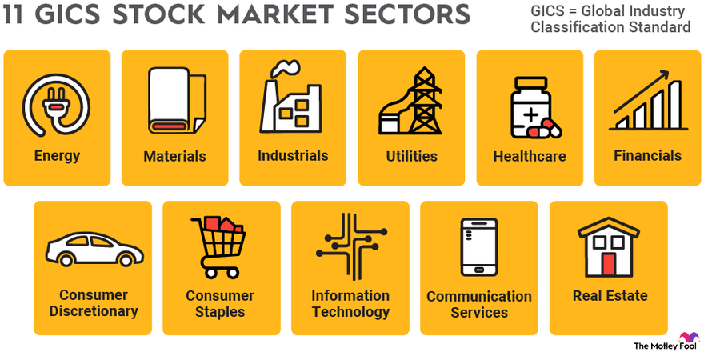

## Table of Contents

## What is a sector ETF?

A sector ETF, or exchange-traded fund, is a type of investment fund that focuses on a specific industry or sector of the economy. Instead of buying stocks from many different industries, you can invest in a sector ETF to put your money into companies that all belong to the same sector, like technology, healthcare, or energy. This can be a good way to bet on the growth of a particular part of the economy that you think will do well.

Sector ETFs are traded on stock exchanges, just like individual stocks. This means you can buy and sell them throughout the trading day at market prices. They are also diversified within their sector, which can help spread out your risk compared to investing in just one or two companies. However, because they focus on one sector, they can be riskier than a more broadly diversified fund, as the performance of the sector ETF will depend heavily on how that specific sector is doing.

## How do sector ETFs differ from other types of ETFs?

Sector ETFs are different from other ETFs because they focus on a single part of the economy, like tech or healthcare. Other ETFs might include companies from many different industries, or they might follow a broad market index like the S&P 500. So, if you want to invest in just one type of industry, sector ETFs are the way to go. But if you want a more spread-out investment, you might choose a different kind of ETF.

Another difference is that sector ETFs can be riskier than other ETFs. Because they only invest in one sector, if that sector does badly, your investment could lose a lot of value. On the other hand, if the sector does well, you could see bigger gains. Other ETFs, like those that track a broad market index, are usually less risky because they include many different kinds of companies. So, sector ETFs can be a good choice if you have a strong belief about which sector will do well, but they might not be the best fit if you want a safer, more balanced investment.

## What are the main sectors represented by sector ETFs?

Sector ETFs cover a wide range of industries, each focusing on a specific part of the economy. Some of the main sectors include technology, which includes companies that make software, hardware, and other tech products. Another big sector is healthcare, which includes companies that make drugs, medical devices, and provide healthcare services. The financial sector is also important, with ETFs that invest in banks, insurance companies, and other financial services. 

Energy is another key sector, with ETFs that focus on companies involved in oil, gas, and renewable energy. The consumer discretionary sector includes companies that sell things people want but don't need, like cars and luxury goods. On the other hand, the consumer staples sector includes companies that sell things people always need, like food and household products. There are also ETFs for the industrials sector, which includes companies that make things like machinery and airplanes, and the materials sector, which includes companies that produce chemicals, metals, and other raw materials.

Other sectors include utilities, which provide services like electricity and water, and real estate, which focuses on property and real estate investment trusts (REITs). The communication services sector is newer and includes companies in media, entertainment, and telecommunications. Each of these sectors can be a way to invest in different parts of the economy, depending on what you think will do well in the future.

## What are the benefits of investing in sector ETFs?

Investing in sector ETFs can help you focus your money on a part of the economy you think will do well. For example, if you believe technology will grow a lot, you can put your money in a tech sector [ETF](/wiki/etf-trading-strategies). This way, you don't need to pick individual tech companies, which can be hard and risky. The ETF will already have a mix of tech companies, so it's easier and can be less risky than betting on one company.

Another benefit is that sector ETFs can help you spread out your investments within one industry. Even though they focus on one sector, they usually include many different companies in that sector. This can help reduce the risk that comes with investing in just a few stocks. Plus, sector ETFs are easy to buy and sell because they trade on stock exchanges like regular stocks, so you can quickly change your investments if you need to.

## What are the risks associated with sector ETFs?

One big risk with sector ETFs is that they only focus on one part of the economy. If that sector does badly, your investment could lose a lot of money. For example, if you invest in a tech sector ETF and the tech industry has a bad year, your investment could go down a lot. This is riskier than investing in a fund that includes many different industries, because if one industry does badly, the others might still do well and help balance out your losses.

Another risk is that sector ETFs can be more volatile than other types of ETFs. This means their prices can go up and down a lot more. If you need to sell your investment quickly, you might have to sell it for less than you wanted. Also, sector ETFs can be affected by things that only impact their specific industry. For example, new laws or regulations that hurt the energy sector could make an energy sector ETF lose value, even if the rest of the market is doing okay.

## How can sector ETFs be used to diversify an investment portfolio?

Sector ETFs can help you spread out your investments by letting you put money into different parts of the economy. If you already have a lot of your money in one industry, like tech, you can use sector ETFs to invest in other sectors, like healthcare or energy. This way, if the tech industry has a bad year, your other investments in different sectors might still do well and help balance out your losses.

Another way sector ETFs can help diversify your portfolio is by giving you access to industries you might not know much about. Instead of trying to pick individual stocks in a sector you're not familiar with, you can invest in a sector ETF that already has a mix of companies in that industry. This can make it easier and less risky to get exposure to new sectors and help you build a more balanced investment portfolio.

## What strategies can be employed when investing in sector ETFs?

One strategy for investing in sector ETFs is to focus on sectors you think will do well in the future. For example, if you believe technology will keep growing, you might invest more in a tech sector ETF. This way, you can take advantage of the growth in that industry without having to pick individual stocks. Another strategy is to use sector ETFs to balance out your investments. If you have a lot of money in one sector, like healthcare, you can invest in other sector ETFs, like energy or consumer goods, to spread out your risk. This can help protect your money if one sector does badly.

Another approach is to use sector ETFs for short-term trading. Since sector ETFs can go up and down a lot, some people try to buy them when they think a sector will do well and sell them when they think it will do badly. This can be riskier but might give you a chance to make more money if you guess right. Finally, you can use sector ETFs to keep up with changes in the economy. If you think a new sector, like renewable energy, will become more important, you can invest in a sector ETF to get in early and possibly benefit from its growth.

## How do market cycles affect sector ETF performance?

Market cycles can really change how well sector ETFs do. A market cycle is like the ups and downs the economy goes through over time. When the economy is doing well, some sectors like technology and consumer discretionary might do better because people have more money to spend on things they want. But when the economy is not doing so great, sectors like utilities and consumer staples might do better because people still need to buy basic things like electricity and food, no matter what.

On the other hand, when the economy is going down, sectors like energy and industrials might struggle because companies might not want to spend as much on big projects or new equipment. So, if you invest in a sector ETF, it's important to think about where we are in the market cycle. If you think the economy is about to get better, you might want to invest in sectors that do well when things are going up. But if you think things might get worse, you might want to put your money in sectors that are more stable during tough times.

## What are some advanced techniques for analyzing sector ETFs?

One advanced technique for analyzing sector ETFs is to look at how they perform compared to the overall market. You can do this by comparing the ETF's returns to a broad market index like the S&P 500. If the sector ETF is doing better than the market, it might mean that the sector is strong and could keep doing well. You can also use something called "relative strength" to see if the sector ETF is getting stronger or weaker compared to other sectors. This can help you decide if you should invest more in that sector or look for better opportunities elsewhere.

Another technique is to use technical analysis, which involves looking at charts and patterns to predict future price movements. You can look at things like moving averages, which smooth out price data over time, to see if the sector ETF is trending up or down. You can also use indicators like the Relative Strength Index (RSI) to see if the ETF is overbought or oversold, which can help you decide when to buy or sell. By combining these technical tools with an understanding of the sector's fundamentals, like how well the companies in the ETF are doing, you can make more informed decisions about when to invest in sector ETFs.

## How can sector rotation strategies enhance returns in sector ETF investing?

Sector rotation strategies can help you make more money when you invest in sector ETFs by letting you move your money to different parts of the economy at different times. The idea is to buy sector ETFs that are about to do well and sell them when they start to do badly. For example, if you think the economy is going to grow, you might invest in sector ETFs for technology or consumer discretionary because these sectors usually do well when people have more money to spend. But if you think the economy might slow down, you could switch your money to sector ETFs in utilities or consumer staples, which tend to be more stable during tough times.

By paying attention to where we are in the market cycle and moving your money around, you can try to get better returns than if you just kept your money in one sector all the time. It's like trying to catch the wave at the right time – you want to be in the sectors that are about to go up and get out before they go down. This can be a bit tricky and takes some work to figure out, but if you get it right, it can help you make more money from your investments in sector ETFs.

## What role do sector ETFs play in tactical asset allocation?

Sector ETFs are really useful in tactical asset allocation because they let you move your money around to different parts of the economy when you think they will do well. Tactical asset allocation is all about changing your investments based on what you think will happen in the market. With sector ETFs, you can quickly switch your money to sectors that you believe are about to grow or do better than others. For example, if you think technology is going to boom, you can put more money into a tech sector ETF. This way, you can try to get better returns by being in the right place at the right time.

Another way sector ETFs help with tactical asset allocation is by giving you a lot of choices. You can pick from many different sectors, like healthcare, energy, or consumer goods, depending on what you think will happen next. If you see signs that the economy is slowing down, you might move your money into sectors that are more stable, like utilities or consumer staples. By using sector ETFs, you can adjust your investments to match your predictions about the market, which can help you make more money and manage your risks better.

## How can investors use sector ETFs for hedging purposes?

Investors can use sector ETFs for hedging by putting money into sectors that tend to do well when other parts of their portfolio are doing badly. For example, if you have a lot of your money in stocks that might go down if the economy slows down, you could invest in a sector ETF for utilities or consumer staples. These sectors usually don't lose as much value during tough economic times, so they can help balance out losses in other parts of your portfolio.

Another way to use sector ETFs for hedging is to invest in sectors that are less affected by the same things that impact your other investments. If you think a certain event, like a change in interest rates, might hurt your current investments, you can buy a sector ETF in an industry that might not be affected as much by that event. This way, if your main investments go down, the sector ETF might stay steady or even go up, helping to protect your overall portfolio from big losses.

## References & Further Reading

[1]: Bergstra, J., Bardenet, R., Bengio, Y., & Kégl, B. (2011). ["Algorithms for Hyper-Parameter Optimization."](https://papers.nips.cc/paper/4443-algorithms-for-hyper-parameter-optimization) Advances in Neural Information Processing Systems 24.

[2]: ["Advances in Financial Machine Learning"](https://www.amazon.com/Advances-Financial-Machine-Learning-Marcos/dp/1119482089) by Marcos Lopez de Prado

[3]: ["Evidence-Based Technical Analysis: Applying the Scientific Method and Statistical Inference to Trading Signals"](https://www.amazon.com/Evidence-Based-Technical-Analysis-Scientific-Statistical/dp/0470008741) by David Aronson

[4]: ["Machine Learning for Algorithmic Trading"](https://github.com/stefan-jansen/machine-learning-for-trading) by Stefan Jansen

[5]: ["Quantitative Trading: How to Build Your Own Algorithmic Trading Business"](https://www.amazon.com/Quantitative-Trading-Build-Algorithmic-Business/dp/1119800064) by Ernest P. Chan