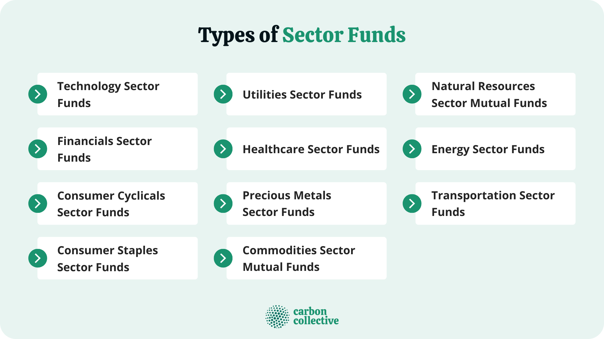

The financial markets represent a multifaceted ecosystem characterized by an array of investment vehicles, trading strategies, and continuous technological advancements. Within this dynamic landscape, innovative strategies such as sector funds and algorithmic trading have garnered significant attention. Sector funds enable investors to target specific segments of the economy by investing in companies within a single industry sector, providing both opportunities and risks tied to sector performance. Algorithmic trading, on the other hand, employs sophisticated computational algorithms to automate trading processes, enhancing speed and efficiency while minimizing human error. This interplay between strategic investment approaches and technology reflects the ongoing evolution of the financial markets in response to emerging trends and investor demands.

As financial markets continue to advance, understanding the synergy between sector funds, investment funds, and algorithmic trading becomes crucial. Sector funds offer investors tailored exposure to economic sectors like technology or healthcare, while investment funds, including mutual funds and ETFs, provide diversified access to various asset classes. Algorithmic trading further complements these strategies by employing data-driven decisions to execute trades at rapid speeds. By exploring the integration of these components, this article aims to equip readers with a comprehensive understanding of their interactions and implications for investors seeking to navigate the complexities of modern finance effectively.

## Table of Contents

## Understanding Sector Funds

Sector funds play a significant role in contemporary investment strategies, focusing on specific sectors of the economy to provide targeted investment opportunities. These funds are usually structured as mutual funds or exchange-traded funds (ETFs) and concentrate their investments on companies operating within a singular industry sector. This specialization allows investors to gain exposure to particular market segments that may offer promising growth potential or defensive characteristics.

### Structural Composition

Sector funds typically encapsulate investments focusing on technology, healthcare, and financial sectors, among others. Each sector holds unique economic characteristics and market behaviors that influence investment returns. For instance, technology sector funds often invest in companies involved with software production, electronic equipment, or digital services, capitalizing on rapid innovation and technological advancement. Conversely, healthcare sector funds target companies in pharmaceuticals, biotechnology, and medical devices, appealing to investors seeking exposure to consistent demand driven by an aging population and ongoing advancements in medical research.

### Risks and Advantages

The primary advantage of sector funds lies in their ability to concentrate investments, potentially yielding substantial returns if a particular sector outperforms the broader market. Moreover, sector funds allow investors to align their portfolios with specific economic trends or their personal convictions, such as environmental sustainability or technological innovation.

However, the lack of diversification inherent in sector funds exposes investors to heightened risks. Since their holdings are concentrated in a single sector, they are more susceptible to sector-specific downturns than diversified funds with broader market exposure. For example, a regulatory change adversely affecting healthcare could impact all companies within that sector fund, leading to significant [volatility](/wiki/volatility-trading-strategies).

### Mathematical Model

Investment in a sector fund can be represented through portfolio allocation techniques, where the expected return is calculated as a weighted sum of individual asset returns:

$$
E(R_p) = \sum_{i=1}^{N} w_i \cdot E(R_i)
$$

where $E(R_p)$ is the expected return of the portfolio, $w_i$ is the allocation weight to asset $i$, and $E(R_i)$ is the expected return of asset $i$. Risk assessment for sector funds involves evaluating the portfolio's variance:

$$
\sigma_p^2 = \sum_{i=1}^{N} \sum_{j=1}^{N} w_i w_j \text{Cov}(R_i, R_j)
$$

with $\text{Cov}(R_i, R_j)$ representing the covariance between the returns of assets $i$ and $j$.

### Conclusion

Sector funds offer strategic choices for investors aiming to capitalize on specific economic sectors, balancing potential high returns with increased exposure to sector-centric risks. As the financial landscape evolves, investors are encouraged to carefully weigh these factors, considering both market conditions and personal investment objectives.

## The Role of Investment Funds

Investment funds play a critical role in modern financial markets by pooling resources from multiple investors to invest in a diverse array of asset classes. This pooling mechanism allows for the efficient allocation of capital, enabling investors to gain exposure to broader investment opportunities that might be unattainable individually due to financial constraints or risk factors.

Diverse types of investment funds cater to a variety of investor needs and strategies. Mutual funds are one of the most prevalent forms, offering professional management and diversification by investing across various securities such as stocks, bonds, and other assets. These funds charge management fees and sometimes performance-related fees, reflecting the costs of active fund management. Mutual funds are generally actively managed, meaning fund managers make decisions about how to allocate assets within the fund to outperform market indices.

Exchange-Traded Funds (ETFs) represent another popular investment vehicle, providing a way for investors to purchase a basket of securities through a single transaction. Unlike mutual funds, ETFs trade on stock exchanges, thus offering greater [liquidity](/wiki/liquidity-risk-premium) and pricing transparency throughout the trading day. Many ETFs aim to replicate the performance of a specified index and are often passively managed, which typically translates to lower fees compared to actively managed mutual funds.

Hedge funds, meanwhile, target high-net-worth individuals and institutional investors, employing complex strategies that encompass leveraging, short-selling, and derivatives trading to achieve higher returns. Hedge funds are more flexible than mutual funds in terms of investment strategies but often [carry](/wiki/carry-trading) higher risks and fees.

Investment funds contribute significantly to market liquidity and structure by aggregating capital from diverse sources and deploying it across global markets. Their activities facilitate the efficient functioning of financial markets by ensuring that capital is continuously moving to where it is most effectively utilized. Market liquidity, defined as the ease with which assets can be bought or sold without causing a significant price change, is enhanced by the presence of these funds as they participate actively in buying and selling securities.

Moreover, investment funds provide risk adjustment and diversification benefits to investors. By investing in a pool of diversified assets, risks are spread out, minimizing the impact of poor performance in any single security or sector. This attribute is crucial for investors seeking to reduce unsystematic risk, which is risk associated with individual investments as opposed to the overall market.

In the context of modern finance, investment funds are indispensable for their role in democratizing access to asset classes and investment strategies once reserved for institutional players. They enable both individual and institutional investors to construct diversified portfolios, meeting a range of risk tolerance levels and financial goals. As financial innovation continues to progress, investment funds are likely to evolve, offering new products and strategies to meet the ever-changing demands of the market landscape.

## Algorithmic Trading: An Overview

Algorithmic trading refers to the use of computational algorithms to automatically make trading decisions and execute trades in financial markets. This approach leverages technology to manage the intricacies of trading operations, catering to the demand for speed and precision in financial transactions. 

One of the core principles of [algorithmic trading](/wiki/algorithmic-trading) is speed. Algorithms can analyze vast amounts of market data at a pace that far exceeds human capabilities, enabling quick decision-making that can capitalize on even minute price discrepancies. High frequency trading ([HFT](/wiki/high-frequency-trading-strategies)), a subset of algorithmic trading, exemplifies this principle by executing a large number of orders in fractions of a second to exploit small bid-ask spreads.

Efficiency is another fundamental advantage of algorithmic trading. Algorithms are designed to optimize trade execution, minimize transaction costs, and reduce market impact. This efficiency is especially crucial for large institutional trades, where manual execution could have significant adverse effects on the market price.

Moreover, algorithmic trading reduces the likelihood of human error. By operating based on pre-defined rules and quantitative models, algorithms minimize subjective decision-making and emotional bias that often accompany human trading. This objective approach enhances consistency and reliability in trading operations.

The incorporation of [artificial intelligence](/wiki/ai-artificial-intelligence) (AI) and [machine learning](/wiki/machine-learning) has further advanced algorithmic trading capabilities. These technologies enable the development of adaptive algorithms that learn from historical data, identify patterns, and refine their strategies over time. Machine learning can detect complex market signals that were previously unobservable, allowing for more sophisticated and predictive market strategies.

Algorithmic trading is not confined to a particular class of investors but is widely adopted across different markets. Hedge funds utilize it to implement complex strategies that require the rapid processing of information. Investment banks employ algorithmic trading to manage large portfolios and execute trades with minimal market friction. Even retail investors are increasingly interested in using algorithmic strategies to manage their investments through platforms that offer algorithm-building tools.

Python, with its powerful libraries such as NumPy, pandas, and scikit-learn, is a popular programming language for developing algorithmic trading systems. Its libraries provide the necessary tools for data manipulation, statistical analysis, and machine learning, making it a versatile choice for traders looking to implement and test their strategies.

In conclusion, algorithmic trading represents a critical evolution in the financial markets, offering speed, efficiency, and precision. As AI and machine learning continue to enhance these systems, the scope and sophistication of algorithmic strategies are expected to grow, further embedding this technology into the fabric of modern trading practices.

## Financial Markets and Algorithmic Trading

Financial markets have undergone substantial transformation with the emergence of algorithmic trading strategies, which have effectively revolutionized trading operations. One of the primary advantages of algorithmic trading is the enhancement of market efficiency. Algorithms are capable of processing vast amounts of data at high speeds, allowing them to identify and exploit fleeting pricing inefficiencies more effectively than human traders. This capability leads to narrower bid-ask spreads and improved price discovery, ultimately benefiting market participants.

However, the increased reliance on algorithmic trading presents several challenges. A significant concern is the potential for increased market volatility. High-frequency trading (HFT), a subset of algorithmic trading, can process thousands of transactions per second. As a result, small market imbalances can be amplified rapidly, leading to substantial price fluctuations. The infamous "Flash Crash" of May 2010 exemplifies such volatility, where the Dow Jones Industrial Average plummeted nearly 1,000 points within minutes, only to recover a substantial portion shortly thereafter.

In addition to volatility, algorithmic trading poses regulatory concerns, particularly regarding market manipulation and fairness. Algorithms can inadvertently exacerbate market disparities, and their opaque nature can make it difficult for regulators to detect manipulative practices. This has prompted regulatory bodies such as the U.S. Securities and Exchange Commission (SEC) to introduce measures aimed at enhancing transparency and oversight.

High-frequency trading and algorithmic strategies have facilitated the creation of sophisticated trading platforms capable of executing orders in milliseconds. These platforms often rely on co-location services, where servers are positioned in close proximity to exchange data centers to minimize latency, further augmenting trading speed.

The integration of algorithmic trading within sector funds and broader investment strategies is also noteworthy. Algorithms enable the dynamic reallocation of assets within sector funds, enhancing responsiveness to market conditions. For instance, a sector fund focused on technology might use algorithms to swiftly adjust its holdings based on real-time data, optimizing performance while managing risk.

In conclusion, while algorithmic trading has undeniably improved market efficiency and enabled novel investment strategies, it has also brought about challenges that necessitate careful regulatory oversight. The ongoing evolution of these strategies requires continuous adaptation by market participants and regulators to ensure the robustness and fairness of financial markets.

## Potential Risks and Regulatory Considerations

Algorithmic trading, despite its advantages, presents several risks that can have severe implications for financial markets. One of the key concerns is market manipulation. Algorithms can be misused to create false market signals or execute strategies like spoofing and layering, where fake orders are placed with the intention of influencing market prices. These practices can distort market integrity and harm investor confidence.

Additionally, systemic risks are a significant worry, as algorithmic trading has the potential to amplify market volatility. For instance, the 2010 Flash Crash demonstrated how algorithmic trading can lead to rapid and severe market disruptions, causing massive fluctuations in asset prices within minutes. Such incidents highlight the fragility of interconnected global markets when trading systems malfunction or interact unpredictably.

To address these risks, regulators worldwide have introduced measures to ensure fair market practices. The European Union implemented the Markets in Financial Instruments Directive II (MiFID II), which mandates rigorous testing and approval of trading algorithms to prevent adverse market impacts. Similarly, the U.S. Securities and Exchange Commission (SEC) has tightened regulations with measures like the Consolidated Audit Trail (CAT), which enhances the monitoring and reconstruction of trading activities for better oversight.

Global financial regulatory bodies play a crucial role in overseeing algorithmic trading practices. The International Organization of Securities Commissions (IOSCO) has set forth guidelines that promote transparency and risk management for entities engaged in high-frequency trading. These guidelines encourage robust risk controls and stress testing of algorithmic systems to safeguard market stability.

Looking ahead, the regulatory landscape is expected to evolve with the advancement of trading technologies. Future trends may involve stricter data requirements and enhanced real-time surveillance mechanisms to detect and prevent manipulative activities. Additionally, increased collaboration and data sharing among global regulators could become necessary to manage cross-border trading activities effectively.

For investors, understanding these regulatory trends is vital, as tighter regulations could impact trading strategies, costs, and market behavior. An informed approach to investing, with a keen awareness of the regulatory environment, is essential to navigating potential challenges that arise from the dynamic interplay between technology and finance.

## Conclusion

Sector funds and algorithmic trading have emerged as pivotal components in the dynamics of contemporary financial markets. These investment and trading strategies offer unique opportunities and challenges that require careful understanding and management. Throughout this article, we have outlined their definitions and functions, shedding light on how they contribute to the broader investment landscape.

Sector funds provide investors with targeted exposure to specific economic sectors, such as technology, healthcare, or financials. While this focused approach can yield substantial returns, it inherently carries increased risk due to a lack of diversification. On the other hand, algorithmic trading automates the trading process, enhancing market efficiency and reducing human error. However, it also brings challenges, including potential market manipulation and systemic risks.

As financial markets become increasingly complex, a robust understanding of these elements is essential for investors aiming to navigate the evolving landscape. Sector funds and algorithmic trading both play significant roles in shaping market structures and investment strategies. Therefore, investors must stay informed about the continuous developments in financial technology and emerging trading strategies.

In an era marked by rapid technological advancements and shifting market dynamics, ongoing education and adaptability are crucial. By equipping themselves with comprehensive knowledge of sector funds and algorithmic trading, investors can better position themselves to make informed decisions, optimize their portfolios, and mitigate potential risks in the ever-changing world of finance.

## References & Further Reading

[1]: Bergstra, J., Bardenet, R., Bengio, Y., & Kégl, B. (2011). ["Algorithms for Hyper-Parameter Optimization."](https://papers.nips.cc/paper/4443-algorithms-for-hyper-parameter-optimization) Advances in Neural Information Processing Systems 24.

[2]: ["Advances in Financial Machine Learning"](https://www.amazon.com/Advances-Financial-Machine-Learning-Marcos/dp/1119482089) by Marcos Lopez de Prado

[3]: ["Evidence-Based Technical Analysis: Applying the Scientific Method and Statistical Inference to Trading Signals"](https://www.amazon.com/Evidence-Based-Technical-Analysis-Scientific-Statistical/dp/0470008741) by David Aronson

[4]: ["Machine Learning for Algorithmic Trading"](https://github.com/stefan-jansen/machine-learning-for-trading) by Stefan Jansen

[5]: ["Quantitative Trading: How to Build Your Own Algorithmic Trading Business"](https://www.amazon.com/Quantitative-Trading-Build-Algorithmic-Business/dp/1119800064) by Ernest P. Chan