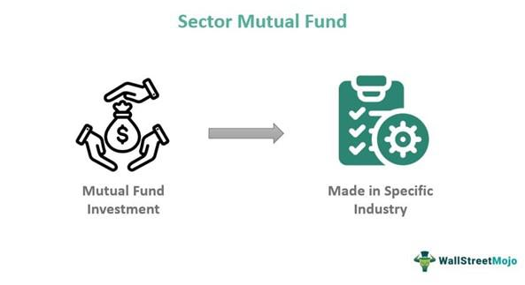

Investment funds, mutual funds, sector mutual funds, and algorithmic trading are integral components of the contemporary financial landscape. These elements provide investors with diverse options and strategies that are essential for effective portfolio management and the optimization of returns. By pooling resources, investment funds offer the advantages of diversification and professional management, thereby making them appealing to both individual and institutional investors seeking broad market exposure.

Mutual funds, a subset of investment funds, allow investors to access professionally managed portfolios of stocks, bonds, and other securities. They are particularly popular due to their accessibility and the variety of funds available that cater to different risk tolerances and investment objectives. Sector mutual funds, for instance, enable investors to target specific economic sectors, such as technology or healthcare, aligning their investments with anticipated sectoral growth trends or economic shifts.



Algorithmic trading, or algo trading, further enhances investment strategies through the use of computational algorithms to automate and execute trades at high speeds and efficiencies. The integration of technology in trading allows investors to capitalize on market inefficiencies and reduce transaction costs while minimizing human errors. This confluence of advanced trading techniques and traditional investment vehicles requires a robust understanding of both digital tools and financial market dynamics.

Analyzing the synergies between these approaches and technological advancements is crucial as they collectively influence modern financial markets. As investors and fund managers strive to navigate the complexities of today's economy, understanding the interplay of these financial elements is key to making informed decisions and achieving strategic objectives. This article aims to provide a comprehensive overview of these investment vehicles and strategies, highlighting their functionalities, benefits, and potential risks, thereby enabling readers to enhance their financial literacy and investment acumen.

## Table of Contents

## Understanding Investment Funds

Investment funds are collective investment schemes designed to pool capital from multiple investors with the purpose of investing in a diversified portfolio of securities. This pooling mechanism enables investors to access a broader range of asset classes while simultaneously benefiting from professional management and diversification of risk. The investment fund industry encompasses various types of funds, including mutual funds, exchange-traded funds (ETFs), hedge funds, and more, each offering distinct features to cater to different investor needs.

Mutual funds stand out as one of the most accessible and prevalent types of investment funds. They are structured to cater to a broad audience, providing retail investors an entry point into the financial markets. A typical mutual fund holds a diversified collection of assets, such as stocks, bonds, or a combination of both (often called balanced or hybrid funds), allowing investors to select funds that align with their individual risk tolerance and investment objectives. This diversification method aims to minimize unsystematic risk — the risk associated with a specific company or industry.

ETFs are another popular form of investment funds. These funds trade on stock exchanges, similar to individual stocks, and typically seek to mirror the performance of a specific index, commodity, or asset class. The [liquidity](/wiki/liquidity-risk-premium), tax efficiency, and generally lower expense ratios of ETFs make them attractive for many investors, particularly those interested in passive investment strategies.

Hedge funds, in contrast, are private investment funds that often employ a wide array of complex strategies to maximize returns. These can include leverage, derivatives, and short selling, aimed at achieving absolute returns irrespective of market conditions. However, due to their sophisticated nature, hedge funds typically require substantial initial investments and are often limited to accredited or high-net-worth individuals.

Professional management serves as a cornerstone of mutual and other investment funds, providing investors with the expertise of seasoned fund managers who make strategic decisions regarding asset allocation, security selection, and market timing. This professional oversight is particularly advantageous for investors who may lack the time, interest, or knowledge to manage their investments actively.

Furthermore, the industry offers a diverse array of funds, accommodating different investment horizons and financial goals. From growth and value funds to income and international funds, the multiplicity of options allows investors to tailor their portfolios in accordance with specific preferences and expectations.

In summary, investment funds present an efficient means for investors to enhance portfolio diversification and leverage professional investment management. By pooling resources, investors gain access to a wider array of investment opportunities and strategies, thereby increasing potential returns while managing associated risks.

## The Rise and Role of Mutual Funds

Mutual funds have become indispensable in modern investment strategies due to their inherent ability to provide diversification and professional management. As collective investment vehicles, mutual funds pool capital from numerous investors, enabling them to invest in a diversified portfolio of securities. This diversification is a fundamental benefit as it reduces the risk associated with investing in individual assets.

Investors have access to a broad spectrum of mutual funds, each catering to different asset preferences and risk tolerance levels. Equity funds, for instance, focus on stocks, while bond funds invest in fixed-income securities. Balanced funds might offer a blend of both stocks and bonds, allowing investors to fine-tune their exposure to various economic conditions and cycles.

A critical consideration for investors when selecting mutual funds is the impact of expense ratios and management fees. These costs can significantly affect net returns over time. The expense ratio is typically expressed as a percentage of the fund's assets and covers various operational costs, including management fees, administrative fees, and other expenses. Higher expense ratios can erode returns, thus making it essential for investors to compare these fees across funds to ensure alignment with their financial goals and objectives.

Recent innovations in mutual fund offerings have led to the development of sector mutual funds, which concentrate their investments in specific economic sectors such as technology, healthcare, or energy. These funds allow investors to capitalize on sector-specific growth trends or hedge against broader market [volatility](/wiki/volatility-trading-strategies). However, they also entail increased exposure to sector-specific risks, necessitating careful analysis and strategic decision-making by investors.

In conclusion, mutual funds play a pivotal role in modern financial markets by providing investors with diversified, professionally managed investment options. The variety of mutual fund types, along with their cost implications, underscores the importance of informed decision-making to align investments with personal financial goals.

## What Are Sector Mutual Funds?

Sector mutual funds offer investors a focused approach to investing by concentrating their portfolios within specific sectors or industries such as energy, healthcare, technology, and more. This form of investment enables investors to capitalize on sector-specific growth opportunities, potentially offering higher returns compared to broad-based funds.

### Focused Investment Strategy
Investors are attracted to sector mutual funds as they allow them to leverage insights and forecasts about distinct economic sectors. Those who anticipate robust growth in a specific sector can benefit from targeted exposure. For example, an investor believing in the continuing growth of the technology sector might choose a technology-focused sector fund to maximize potential returns.

### Potential Risks and Volatility
However, with the potential for significant returns comes increased risk. Sector funds are inherently less diversified compared to general mutual funds since they concentrate on a single sector. This lack of diversification increases vulnerability to sector-specific economic changes and market volatility. For instance, if the technology sector experiences downturns due to regulatory changes or economic setbacks, a technology sector fund could face substantial losses.

### Strategic Selection
Due to the unique risk profile of sector mutual funds, investors need to perform careful analysis and strategic selection. This involves an evaluation of market forecasts, economic indicators, and personal risk tolerance. It is crucial to understand the dynamics of the chosen sector and anticipate how different factors might influence its performance.

### Conclusion
Sector mutual funds can be powerful tools for investors aiming to exploit specific market segments. Nevertheless, these funds require a thorough understanding of sector trends and potential risks. Investors must balance the pursuit of high returns with careful risk management, ensuring their investment choices align with their financial goals and market outlook.

## Exploring Algo Trading

Algorithmic trading, commonly referred to as algo trading, utilizes computational algorithms to automate and execute trades at rapid speeds, which is critical in modern financial markets. These algorithms operate based on pre-defined rulesets, optimizing trade execution by reducing transaction costs and lowering the probability of human error. This automation provides traders and institutions with a significant edge, increasing efficiency and precision in trading activities.

A variety of strategies are prevalent within the algo trading landscape. One such approach is trend-following, which involves developing algorithms that capitalize on market trends by buying assets poised to rise and selling those likely to drop based on historical patterns and predictive analysis. Arbitrage opportunities are also harnessed, where algorithms identify and exploit price discrepancies between correlated securities or markets. High-frequency trading ([HFT](/wiki/high-frequency-trading-strategies)) is another widely used strategy, characterized by executing a large number of orders at extremely high speeds, frequently measured in milliseconds.

The benefits of algo trading are manifold. Speed and accuracy in trade execution enable traders to react instantly to market changes, ensuring they capitalize on opportunities as soon as they arise. The elimination of emotional decision-making reduces errors common in traditional trading, where human bias often interferes with strategy adherence.

However, algo trading is not without its challenges and risks. System errors, whether due to bugs in code or unexpected market conditions not accounted for in the algorithm, can lead to significant financial losses. Additionally, the speed and [volume](/wiki/volume-trading-strategy) of trades executed can exacerbate market volatility, potentially leading to destabilizing effects. Flash crashes, instances where major indices plunge rapidly before recovering, exemplify the risks associated with high-frequency and automated trading systems.

Despite these risks, the advancements in computational power and data analysis techniques continually enhance the capabilities and sophistication of [algorithmic trading](/wiki/algorithmic-trading) systems. The integration of [machine learning](/wiki/machine-learning) and [artificial intelligence](/wiki/ai-artificial-intelligence) into these systems has further facilitated the development of adaptable algorithms capable of refining their strategies based on evolving market conditions, offering the potential for improved accuracy and profitability. Maintaining robust technological infrastructures and employing rigorous risk management strategies remain vital to successfully exploiting the benefits of algorithmic trading within the financial sector.

## Integrating Algo Trading with Investment Funds

Integrating algorithmic trading with mutual and sector mutual funds has become a pivotal strategy for enhancing trading efficiency and improving portfolio management. Algorithmic trading, by its very nature, automates and optimizes the process of buying and selling securities, and its incorporation within investment funds can lead to substantial benefits.

Algorithms can dynamically adjust fund compositions by analyzing real-time market data. This adaptability allows funds to respond quickly to market fluctuations, optimizing returns while mitigating associated risks. For instance, an algorithm might use quantitative indicators such as moving averages or relative strength indicators (RSI) to make buy or sell decisions. In Python, a simple moving average crossover strategy might look like this:

```python
def moving_average_crossover(prices, short_window, long_window):
    signals = pd.DataFrame(index=prices.index)
    signals['price'] = prices
    signals['short_mavg'] = prices.rolling(window=short_window, min_periods=1, center=False).mean()
    signals['long_mavg'] = prices.rolling(window=long_window, min_periods=1, center=False).mean()
    signals['signal'] = 0.0
    signals['signal'][short_window:] = np.where(signals['short_mavg'][short_window:] > signals['long_mavg'][short_window:], 1.0, 0.0)
    signals['positions'] = signals['signal'].diff()
    return signals
```

By automating these routine transactions, fund managers are able to devote more of their resources to strategic tasks such as interpreting market trends and conducting in-depth financial analyses. This added value is a significant advantage for investors, who rely on professional fund managers to navigate complex financial environments effectively.

Despite the considerable advantages of algorithmic integration, several challenges must be addressed to ensure successful implementation. A robust technological infrastructure is critical, as system failures can lead to significant financial losses. Moreover, a comprehensive data infrastructure is necessary to handle the vast amounts of real-time data involved in algorithmic trading. This requires investment in high-performance computing resources and secure data management systems.

In summary, the integration of algorithmic trading with investment funds offers a transformative approach to managing portfolios. By leveraging technology, fund managers can enhance decision-making processes and deliver greater value to investors. However, these benefits must be balanced with careful attention to technological and operational risks to ensure stability and reliability in financial markets.

## Potential Risks and Regulatory Considerations

Both investment in sector mutual funds and the use of algorithmic trading (algo trading) involve inherent risks that must be managed to safeguard investor interests and maintain market stability.

Sector mutual funds, which focus on specific industry sectors such as energy, healthcare, or technology, are inherently susceptible to sector-specific volatility. This can be attributed to factors like economic cycles, technological advancements, regulatory changes, and geopolitical events, which can disproportionately impact prices within a particular sector. For instance, a downturn in oil prices may significantly affect energy sector funds, leading to potential losses. Investors must conduct thorough economic analysis and assess market predictions to anticipate such fluctuations, calibrating their exposure according to their risk tolerance and investment objectives.

Algorithmic trading, on the other hand, integrates computational algorithms to conduct trades based on pre-specified criteria. While it offers benefits of high-speed execution and precision, it introduces several challenges. Systemic risk is a primary concern, where a failure or error in trading algorithms can lead to significant market disruptions. An example of this includes the infamous "Flash Crash" of May 6, 2010, when rapid sell-offs led to a temporary market crash. Additionally, the automated nature of algo trading can exacerbate market manipulation tactics, such as spoofing, wherein large orders are placed to influence prices without any intention of execution.

To mitigate these risks and preserve market integrity, adherence to stringent regulations is essential. Regulatory bodies like the U.S. Securities and Exchange Commission (SEC) and the Financial Industry Regulatory Authority (FINRA) enforce rules to ensure that algorithmic trading systems operate fairly and transparently. Key regulations address issues like the need for adequate system safeguards, real-time surveillance to detect fraudulent activities, and regular audits to ensure compliance.

Investors and fund managers must remain vigilant about the regulatory landscape, as compliance is crucial not only for legal operation but also for safeguarding investor trust. This involves staying informed of ongoing regulatory updates and ensuring robust compliance frameworks are in place. Proactive engagement with regulatory developments can help anticipate and adapt to changes, ensuring both stability and competitiveness in rapidly evolving financial markets.

## Conclusion

The evolving nature of modern finance is highlighted by the interaction between investment funds, mutual funds, sector mutual funds, and algorithmic trading. These financial instruments and strategies offer a diverse range of opportunities for investors to optimize portfolio returns and manage risks effectively. Each segment plays a unique role: investment funds and mutual funds provide diversification and professional management, sector mutual funds allow for concentrated investments in specific industries, and algo trading introduces automation and speed to trading activities.

Effectively leveraging these tools demands a thorough understanding of their distinct roles, benefits, and potential risks. For instance, while sector mutual funds can capitalize on sector-specific growth, they also [carry](/wiki/carry-trading) increased vulnerability to economic shifts within those sectors. Similarly, algorithmic trading can enhance transaction efficiency but also entails risks like technological failures and regulatory challenges.

Investors equipped with the necessary knowledge and technology can strategically position themselves to navigate these complexities. This strategic positioning involves routine assessment of market trends and the implementation of adaptive strategies that align with personal investment objectives and risk tolerances.

Ongoing education and adaptability are critical. The financial landscape continually evolves with technological innovations and economic changes. Investors must remain informed about emerging trends and regulatory developments to make informed decisions that optimize their investment outcomes and maintain compliance with legal standards. By doing so, they can effectively harness the interplay of these dynamic financial tools to achieve sustained success.

## References & Further Reading

[1]: ["Advances in Financial Machine Learning"](https://www.amazon.com/Advances-Financial-Machine-Learning-Marcos/dp/1119482089) by Marcos Lopez de Prado

[2]: ["Quantitative Trading: How to Build Your Own Algorithmic Trading Business"](https://www.amazon.com/Quantitative-Trading-Build-Algorithmic-Business/dp/1119800064) by Ernest P. Chan

[3]: Bergstra, J., Bardenet, R., Bengio, Y., & Kégl, B. (2011). ["Algorithms for Hyper-Parameter Optimization."](https://dl.acm.org/doi/10.5555/2986459.2986743) Advances in Neural Information Processing Systems 24.

[4]: ["Evidence-Based Technical Analysis: Applying the Scientific Method and Statistical Inference to Trading Signals"](https://www.amazon.com/Evidence-Based-Technical-Analysis-Scientific-Statistical/dp/0470008741) by David Aronson

[5]: ["Machine Learning for Algorithmic Trading"](https://github.com/stefan-jansen/machine-learning-for-trading) by Stefan Jansen