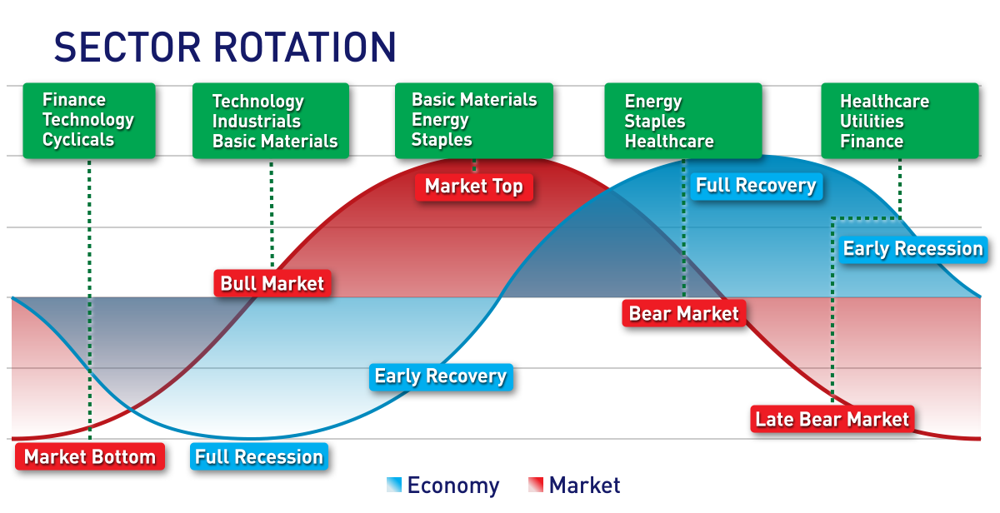

## Table of Contents

## What is sector rotation in investing?

Sector rotation in investing is when investors move their money from one industry to another, trying to make more money by guessing which industries will do well next. It's like trying to predict which team will win in sports and betting on them. Investors look at things like the economy, interest rates, and what's happening in the world to decide where to put their money. They might move their money into industries that do well when the economy is growing, like technology or consumer goods, or into industries that do well when the economy is slowing down, like utilities or healthcare.

This strategy can help investors make more money if they guess right, but it can also be risky because it's hard to predict the future. If the economy changes in a way that nobody expected, investors might lose money if they put it all in one place. That's why some investors use sector rotation carefully, spreading their money around to different industries to lower the risk. It's a bit like not putting all your eggs in one basket, so if one industry doesn't do well, the others might make up for it.

## Why is sector rotation important for investors?

Sector rotation is important for investors because it helps them make more money by moving their investments into industries that are expected to do well in the future. By paying attention to what's happening in the economy, like if it's growing or slowing down, investors can guess which sectors will perform better. For example, if the economy is booming, investors might put more money into technology or consumer goods because people are spending more. This strategy can lead to higher returns if the investor's predictions are correct.

However, sector rotation also comes with risks. It's hard to predict the future, and if the economy doesn't behave as expected, investors could lose money if they've put all their investments into one sector. That's why many investors use sector rotation as part of a broader strategy, spreading their money across different industries to reduce the risk. By not putting all their eggs in one basket, they can protect themselves from big losses if one sector doesn't perform well.

## How does the economic cycle influence sector rotation?

The economic cycle plays a big role in sector rotation because different industries do better at different times. When the economy is growing, people have more money to spend, so industries like technology, consumer goods, and real estate often do well. Investors see this and move their money into these sectors, hoping to make more money as these industries grow. On the other hand, when the economy is slowing down or in a recession, people spend less, and industries like utilities, healthcare, and consumer staples, which people need no matter what, tend to do better. Investors then shift their money into these more stable sectors to protect their investments.

Understanding the economic cycle helps investors guess which sectors will do well next. For example, if the economy is starting to recover from a recession, investors might start putting money into sectors that do well in the early stages of recovery, like industrials or materials. As the economy keeps growing, they might then move money into sectors that do well in the later stages, like consumer discretionary or technology. By watching the economic cycle, investors can try to stay one step ahead and make smarter choices about where to put their money.

## What are the main sectors typically involved in sector rotation?

The main sectors involved in sector rotation are often divided into groups based on how they perform during different parts of the economic cycle. When the economy is growing, sectors like technology, consumer discretionary, and industrials usually do well. Technology companies often see more demand for their products and services, consumer discretionary includes things like cars and luxury goods that people buy more of when they have extra money, and industrials do well because businesses are investing in growth.

On the other hand, when the economy is slowing down or in a recession, sectors like utilities, healthcare, and consumer staples tend to be more stable. Utilities provide essential services like electricity and water, which people need no matter what. Healthcare is always important because people need medical care. Consumer staples include things like food and household goods, which people continue to buy even when times are tough. By moving money between these sectors, investors try to take advantage of the economic cycle and make more money.

## How can an investor identify when a sector rotation is occurring?

An investor can identify when a sector rotation is happening by keeping an eye on how different parts of the economy are doing. If the economy is growing, you might see more money going into sectors like technology, where companies make things like computers and phones, or consumer discretionary, which includes things people buy when they have extra money, like cars and clothes. If the economy starts to slow down, investors might move their money into safer sectors like utilities, which provide electricity and water, or healthcare, because people always need medical care.

Another way to spot sector rotation is by watching the news and reports about the economy. If there's news about interest rates going up or down, or if there are big changes in jobs and spending, these can be signs that investors are shifting their money around. For example, if interest rates are low, it might be a good time for sectors like real estate to do well, and investors might move money there. By staying informed and looking at how different sectors are performing, an investor can get a sense of when sector rotation is happening and make smarter choices about where to put their money.

## What are the common strategies used for sector rotation?

One common strategy for sector rotation is to follow the economic cycle. Investors watch the economy to see if it's growing or slowing down. When the economy is doing well, they might put more money into sectors like technology or consumer goods because people are spending more. But if the economy starts to slow down, they might move their money into safer sectors like utilities or healthcare, which people need no matter what. By paying attention to the economy, investors try to guess which sectors will do well next and move their money accordingly.

Another strategy is to use technical analysis. This means looking at charts and numbers to see how different sectors are doing. If a sector's stock prices are going up and more people are buying, it might be a good time to invest in that sector. On the other hand, if a sector's prices are going down and people are selling, it might be time to move money out. By watching these patterns, investors can try to jump into sectors that are starting to do well and get out of those that are not.

Some investors also use a mix of both strategies. They look at the economy and use technical analysis to make their decisions. This way, they can get a better idea of when to move their money from one sector to another. By combining different methods, investors hope to make smarter choices and increase their chances of making more money.

## How does sector rotation affect portfolio diversification?

Sector rotation can help make a portfolio more diverse by spreading money across different industries. When investors move money from one sector to another, they're not putting all their eggs in one basket. For example, if an investor has a lot of money in technology stocks and sees that the economy is slowing down, they might move some of that money into healthcare or utilities. By doing this, they're making their portfolio more diverse because they're not relying on just one sector to do well. This can help protect their money if one sector doesn't do as well as expected.

However, sector rotation can also make a portfolio less diverse if an investor moves too much money into one sector at a time. If an investor thinks one sector will do really well and puts all their money there, their portfolio becomes less diverse. This can be risky because if that sector doesn't do well, the investor could lose a lot of money. So, while sector rotation can be a good way to try to make more money, it's important for investors to keep their portfolios balanced and not move all their money into one place.

## What tools and indicators do investors use to predict sector rotation?

Investors use a few different tools and indicators to predict sector rotation. One important tool is economic indicators, like GDP growth, unemployment rates, and consumer spending. These help investors see if the economy is growing or slowing down. If the economy is doing well, they might guess that sectors like technology or consumer goods will do better. But if the economy is slowing down, they might think sectors like utilities or healthcare will be safer bets. Another tool is interest rates. If interest rates go up, it might be a good time for sectors like financials, while low interest rates could help sectors like real estate.

Another set of tools investors use are technical indicators. These are charts and numbers that show how different sectors are doing. For example, if a sector's stock prices are going up and more people are buying, it might be a good time to invest in that sector. On the other hand, if a sector's prices are going down and people are selling, it might be time to move money out. Investors also look at things like the Relative Strength Index (RSI) to see if a sector is overbought or oversold. By watching these patterns, investors can try to predict when it's time to move their money from one sector to another.

## Can sector rotation be applied to both short-term and long-term investing strategies?

Yes, sector rotation can be used for both short-term and long-term investing strategies. For short-term investing, investors might quickly move their money from one sector to another based on what's happening in the economy or the stock market right now. They might use charts and numbers to guess which sectors will do well in the next few weeks or months. This can be a bit risky because it's hard to predict the short-term future, but it can also lead to quick profits if the investor guesses right.

For long-term investing, sector rotation is about looking at bigger trends and making slower moves. Investors might watch the economy over years to see which sectors do well during different stages of the economic cycle. For example, they might move more money into technology and consumer goods when the economy is growing and into utilities and healthcare when it's slowing down. This approach can help investors make more money over time by staying ahead of big economic changes, but it's important to keep a balanced portfolio to reduce the risk.

## What are the risks associated with sector rotation investing?

One big risk with sector rotation investing is that it's hard to guess the future. The economy can change in ways nobody expects, and if an investor puts all their money into one sector thinking it will do well, they could lose a lot if that sector doesn't perform as expected. For example, if an investor moves all their money into technology stocks because they think the economy will keep growing, but then the economy suddenly slows down, they could see their investments drop in value.

Another risk is that moving money around too much can lead to higher costs. Every time an investor buys or sells stocks, they might have to pay fees or taxes. If they're constantly switching from one sector to another, these costs can add up and eat into their profits. It's important for investors to think about these costs and make sure the potential benefits of sector rotation are worth it.

## How do global economic events influence sector rotation?

Global economic events can have a big impact on sector rotation. When something big happens, like a new trade deal or a war, it can change how the economy works around the world. For example, if a new trade deal makes it easier for companies to sell things in other countries, sectors like manufacturing or technology might do better because they can sell more stuff. On the other hand, if there's a war or a big natural disaster, it might make the economy slow down, and investors might move their money into safer sectors like utilities or healthcare.

Investors watch these global events closely to decide where to put their money. If they think an event will help certain sectors grow, they might move their money into those sectors, hoping to make more money. But if they think an event will hurt the economy, they might move their money into sectors that are less affected by what's happening around the world. By paying attention to these events, investors try to guess which sectors will do well next and make their investment choices based on that.

## What advanced techniques can experts use to optimize returns from sector rotation?

Experts can use something called quantitative analysis to make better guesses about which sectors will do well. This means they use math and computers to look at a lot of numbers and find patterns. For example, they might look at how different sectors have done in the past when the economy was doing certain things. By using this information, they can make smarter choices about where to put their money. They might also use special computer programs that can look at a lot of data very quickly and help them see which sectors are starting to do better or worse.

Another way experts can optimize returns from sector rotation is by using something called sentiment analysis. This means they look at what people are saying and thinking about different sectors. They might read news articles, social media posts, and reports to see if people are feeling good or bad about certain industries. If a lot of people are talking positively about a sector, it might be a good time to invest in it. By combining this information with other data, experts can get a better idea of when to move their money from one sector to another and try to make more money.

## References & Further Reading

[1]: Bergstra, J., Bardenet, R., Bengio, Y., & Kégl, B. (2011). ["Algorithms for Hyper-Parameter Optimization."](https://papers.nips.cc/paper/4443-algorithms-for-hyper-parameter-optimization) Advances in Neural Information Processing Systems 24.

[2]: ["Advances in Financial Machine Learning"](https://www.amazon.com/Advances-Financial-Machine-Learning-Marcos/dp/1119482089) by Marcos Lopez de Prado

[3]: ["Evidence-Based Technical Analysis: Applying the Scientific Method and Statistical Inference to Trading Signals"](https://www.amazon.com/Evidence-Based-Technical-Analysis-Scientific-Statistical/dp/0470008741) by David Aronson

[4]: ["Machine Learning for Algorithmic Trading"](https://github.com/PacktPublishing/Machine-Learning-for-Algorithmic-Trading-Second-Edition) by Stefan Jansen

[5]: ["Quantitative Trading: How to Build Your Own Algorithmic Trading Business"](https://www.amazon.com/Quantitative-Trading-Build-Algorithmic-Business/dp/0470284889) by Ernest P. Chan