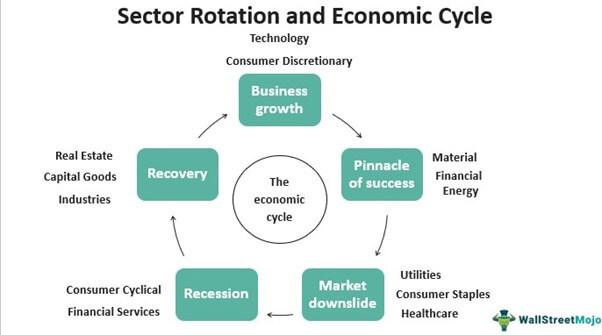

In the ever-evolving world of financial markets, investors are constantly seeking effective strategies to optimize their returns. Among the myriad of approaches available, sector rotation stands out as a timeless investment strategy that leverages different phases of economic cycles to enhance portfolio performance. It involves the strategic shifting of investments across various sectors, based on the anticipation of which sectors will outperform during specific economic phases. By understanding economic indicators and market signals, investors can strategically time their moves to gain an edge.

Simultaneously, algo trading, or algorithmic trading, has revolutionized the investment landscape by integrating technology to execute trades at frequencies and complexities far beyond human capability. This approach minimizes human intervention, thereby reducing emotional biases and execution errors, enabling strategies ranging from simple moving average calculations to intricate machine learning models. The synergy between sector rotation and algo trading can significantly amplify the benefits of both strategies. 



This article explores how these two sophisticated approaches can be harmonized to create a robust investment strategy, enhancing portfolio performance through the smart use of technology and an understanding of market dynamics. By leveraging advanced algorithms, investors can craft a sophisticated strategy that continuously optimizes their portfolios in response to changing market conditions. This fusion of traditional investment strategies with cutting-edge technology offers promising avenues for investors seeking to navigate the complexities of modern financial markets effectively.

## Table of Contents

## Understanding Sector Rotation in Financial Markets

Sector rotation involves strategically reallocating investment capital across different sectors of the economy to leverage the varying performance of industries during distinct phases of the business cycle. This investment strategy is grounded in the understanding that certain sectors tend to outperform others during specific phases of economic activity, such as expansion, peak, contraction, and trough.

During economic expansions, sectors like technology and consumer discretionary often experience robust growth due to increased consumer spending and corporate investments. For example, in periods of economic recovery, consumers may have more disposable income, resulting in increased demand for technology products and consumer goods. Conversely, during economic recessions or downturns, sectors such as utilities and healthcare might be more resilient. These sectors are considered more defensive because they provide essential services that are in demand regardless of the economic climate, thus offering stability and consistent returns.

Historical data provide valuable insights into the efficacy of sector rotation strategies. For instance, during the 2008 financial crisis, utilities and healthcare stocks were generally less volatile and offered better returns compared to more cyclical sectors like financials and industrials. Similarly, the technology sector experienced significant growth during the economic recovery in the subsequent years, highlighting the potential of sector rotation in optimizing returns.

Successful cases of sector rotation hinge on the ability to accurately interpret economic indicators and market signals. Key economic indicators such as GDP growth rates, [interest rate](/wiki/interest-rate-trading-strategies) trends, unemployment rates, and consumer confidence indices can offer clues on the state of the economy and help investors anticipate sector performance. Additionally, leading indicators like manufacturing indices and housing market data can provide early signals of economic shifts, enabling investors to preemptively adjust their portfolios.

Investors can leverage these insights by employing quantitative models or heuristic analysis to predict sector trends. For example, a simplified Python model utilizing historical performance and economic indicators might look like this:

```python
import pandas as pd
from sklearn.linear_model import LinearRegression

# Example historical data and economic indicators
data = pd.DataFrame({
    'GDP_growth': [2.1, 3.0, 1.5, ...],
    'interest_rate': [1.5, 2.0, 1.0, ...],
    # Sector performances
    'tech_returns': [10, 12, 8, ...],
    'util_returns': [3, 4, 2, ...]
})

# Define target sector based on phase
target = data['tech_returns']  # For expanding economy scenario

# Set independent variables
X = data[['GDP_growth', 'interest_rate']]

# Build a linear regression model
model = LinearRegression().fit(X, target)

# Predict performance based on current indicators
current_indicators = pd.DataFrame({'GDP_growth': [2.5], 'interest_rate': [1.75]})
predicted_performance = model.predict(current_indicators)

print("Predicted Technology Sector Performance:", predicted_performance)
```
This model provides a basic framework to predict which sectors may thrive under current economic conditions, aiding investors in making informed rotation decisions. By strategically timing their market moves and adapting to economic changes, investors can potentially gain a competitive edge with this approach.

## The Role of Algo Trading in Modern Investment Strategies

Algorithmic trading, often referred to as algo trading, employs computerized systems to execute trades with speed and precision. This technology significantly reduces human intervention, thereby minimizing emotional biases and execution errors. By automating trading processes, algo trading can outperform manual methods, especially in rapidly changing market environments.

The foundation of [algorithmic trading](/wiki/algorithmic-trading) is built on quantitative models, which can range from straightforward moving average calculations to complex [machine learning](/wiki/machine-learning) paradigms. A simple yet effective example is the moving average crossover strategy, where trades are executed based on the intersection of short-term and long-term moving averages. The basic logic behind this strategy is expressed in the following Python code snippet:

```python
# Example of a moving average crossover strategy
def buy_signal(short_window, long_window, prices):
    short_mavg = prices[-short_window:].mean()
    long_mavg = prices[-long_window:].mean()
    return short_mavg > long_mavg

def sell_signal(short_window, long_window, prices):
    short_mavg = prices[-short_window:].mean()
    long_mavg = prices[-long_window:].mean()
    return short_mavg < long_mavg

# Sample data and usage
import numpy as np

# Mock price data
prices = np.array([100, 102, 101, 105, 107, 110, 111])

# Define windows
short_window = 3
long_window = 5

# Determine signals
if buy_signal(short_window, long_window, prices):
    print("Buy Signal Triggered")
elif sell_signal(short_window, long_window, prices):
    print("Sell Signal Triggered")
```

More advanced algorithms harness the power of machine learning to predict market movements based on historical and real-time data. These techniques include [reinforcement learning](/wiki/reinforcement-learning), neural networks, and natural language processing, which analyze vast datasets (including social media and news feeds) to forecast trading opportunities.

The utility of algorithmic trading extends to various market conditions, enabling investors to deploy sophisticated strategies. For example, [arbitrage](/wiki/arbitrage) algorithms exploit price inefficiencies between markets, while [statistical arbitrage](/wiki/statistical-arbitrage) uses historical pricing relationships to identify profitable trades. High-frequency trading ([HFT](/wiki/high-frequency-trading-strategies)), a subset of algo trading, rapidly executes a large number of orders at extremely fast speeds, often capitalizing on small price discrepancies.

Given its reliance on precision and speed, algorithmic trading demands robust technological infrastructure. This includes high-performance computing systems and stable, low-latency connections to financial markets. As such, institutions employing algo trading must invest in cutting-edge technologies to maintain competitiveness.

In summary, the role of algo trading in modern investment strategies is pivotal. By reducing human errors and employing complex analytical models, algo trading provides a dynamic and efficient approach to navigating contemporary financial markets.

## Integrating Sector Rotation with Algo Trading

Integrating sector rotation with algorithmic trading presents a compelling opportunity to enhance the efficiency and effectiveness of investment strategies. Sector rotation involves shifting investments between different sectors of the market based on anticipated economic cycles, a task that benefits greatly from the computational power and speed of algo trading systems. These systems can process and analyze vast volumes of market data in real-time to predict sector performances and execute trades with precision and speed beyond human capability.

To effectively implement an algorithm for sector rotation, it's important to design a framework that incorporates sector trends and market signals into the trading algorithm. This involves selecting appropriate indicators that reflect economic cycles, such as interest rates, inflation data, and other macroeconomic indicators. The algorithm can then use these data points to make informed predictions about which sectors are likely to outperform or underperform.

For example, in Python, the development of such an algorithm can begin with libraries such as pandas and numpy to handle data analysis, alongside more specialized libraries like TA-Lib for technical analysis or sklearn for incorporating machine learning models. A basic structure for an algorithm might involve: 

```python
import pandas as pd
import numpy as np
from sklearn.ensemble import RandomForestClassifier

# Load historical market data
data = pd.read_csv('market_data.csv')

# Feature engineering to capture economic indicators
data['interest_rate_change'] = data['interest_rate'].pct_change()
data['inflation_change'] = data['inflation'].pct_change()

# Define target sectors based on historical performance
target = data['target_sector']

# Train a machine learning model to predict sector performance
features = data[['interest_rate_change', 'inflation_change']]
model = RandomForestClassifier()
model.fit(features, target)

# Predict future sector performance
predicted_sectors = model.predict(features)
```

This approach allows the algorithm to automate the sector rotation process, making continuous adjustments based on real-time data without the need for constant manual intervention. This not only increases efficiency but also allows investors to respond more swiftly to changing market conditions.

Case studies have shown the success of integrating algorithmic trading with sector rotation. For instance, during periods of economic expansion, algorithms that shifted between technology and consumer discretionary sectors based on macroeconomic indicators achieved significant gains. Conversely, in downturns, algorithms shifting investments towards sectors like utilities and healthcare, which are historically more resilient, were able to mitigate losses.

Successful integration of these strategies requires not just a robust algorithm, but also careful risk management and regular evaluation. Algorithms should be backtested against historical data to validate their performance and adjusted as necessary to account for anomalies or changes in market behavior. Additionally, continuous monitoring and updates are crucial to ensure the algorithm remains aligned with current market trends and conditions.

## Best Practices for Developing an Algorithmic Sector Rotation Strategy

Developing an algorithmic sector rotation strategy requires meticulous planning and a thorough grasp of market complexities. This approach combines the analytical capabilities of algorithmic trading with the strategic aspect of sector rotation, demanding precision and adaptability.

**Risk Management**

At the core of any effective trading strategy is robust risk management. It is crucial to establish well-defined stop-loss orders and capital allocation strategies to mitigate potential losses. Stop-loss orders are particularly important for protecting against significant downturns in volatile markets. By predefining the maximum loss one is willing to accept, these orders help maintain financial discipline and protect the portfolio from catastrophic losses. Additionally, diversifying capital allocation across various sectors and applying systematic rebalancing can spread risk and reduce exposure to any single sector.

**Backtesting**

Backtesting an algorithm against historical data is essential to validate its efficacy before live deployment. By evaluating how the algorithm would have performed using past market data, investors can assess its potential success and identify any inherent weaknesses. Historical data analysis allows for the calibration of parameters and the optimization of algorithmic rules. However, it is important to ensure the data set used for [backtesting](/wiki/backtesting) is comprehensive and accounts for various market conditions to avoid bias.

**Continuous Monitoring and Optimization**

Financial markets are dynamic, and algorithms must be continuously monitored and refined to stay effective. Ongoing performance assessment is critical to detect anomalies, inefficiencies, or degradation in the algorithm's performance. By leveraging real-time data analytics and machine learning techniques, investors can enhance algorithm adaptability. Optimization may involve tweaking algorithm parameters or incorporating new market indicators. Utilizing modern tools and frameworks, such as Python's Pandas for data manipulation and SciKit-Learn for algorithm development, can facilitate this continuous enhancement process.

```python
import pandas as pd
from sklearn.ensemble import RandomForestClassifier

# Example of a simple data preprocessing and model training pipeline
data = pd.read_csv('market_data.csv')
features = data[['indicator1', 'indicator2', 'indicator3']]
target = data['sector_performance']

model = RandomForestClassifier()
model.fit(features, target)

# Function to update model with new data
def update_model(new_data):
    features_new = new_data[['indicator1', 'indicator2', 'indicator3']]
    target_new = new_data['sector_performance']
    model.fit(features_new, target_new)
```

**Practical Tips and Considerations**

Developers should prioritize creating scalable and efficient algorithms. Algorithms should be designed to handle large volumes of data swiftly and execute trades with minimal latency. Understanding transaction costs and slippage is vital, as these can erode profits if not managed effectively. Regularly reviewing regulatory changes that may impact algorithm design and operation is also essential.

Lastly, collaboration with professionals from diverse fields such as data science, finance, and software engineering can enhance the algorithm's robustness. Testing strategies against unforeseen market environments and stress-testing with simulated market shocks will better prepare the strategy for real-world application.

These practices, when applied diligently, facilitate the development of a sophisticated algorithmic sector rotation strategy capable of navigating the complexities of modern financial markets.

## Challenges and Limitations

Despite their many advantages, both sector rotation and algorithmic trading are not without challenges. Investors and traders must navigate various complexities and potential pitfalls to maximize the benefits of these strategies.

### Market Volatility and Global Events

One of the primary challenges is market [volatility](/wiki/volatility-trading-strategies), which can significantly impact the effectiveness of both sector rotation and algo trading strategies. Volatility is often exacerbated by unforeseen global events, such as geopolitical tensions, economic downturns, and pandemics. These events can lead to rapid and sometimes erratic changes in market conditions, rendering predefined trading models less effective. Models relying heavily on historical data may fail to predict or adapt quickly to these extraordinary circumstances. A suitable approach to mitigate this risk is incorporating real-time data feeds and adaptive algorithms that can alter strategy parameters in response to volatility changes.

### Technical Issues

Algorithmic trading is heavily dependent on technology, which introduces its own set of challenges. System failures, network latency, and software bugs can all negatively affect the performance of algorithmic trades. Latency, in particular, can be detrimental in high-frequency trading environments where trades are executed in milliseconds. Investors must utilize robust infrastructure and implement comprehensive testing to prevent these issues. For example, deploying redundant systems and real-time monitoring can help detect and rectify issues before significant losses occur. Furthermore, utilizing programming languages known for their efficiency, like Python or C++, can ensure faster computation and execution times.

### Regulatory Changes

Regulatory changes pose another challenge, impacting both sector rotation strategies and algorithmic trading. Regulations can influence the attractiveness of certain sectors by introducing new compliance requirements or altering existing ones. For algorithmic trading, regulations such as those requiring market transparency, restrictions on certain high-frequency trading practices, or transaction reporting requirements can necessitate adjustments in trading algorithms. Staying informed about regulatory developments and maintaining agile compliance mechanisms are crucial for navigating this ever-shifting landscape. Collaborating with legal experts and utilizing compliance technology platforms can aid in quickly adapting to regulatory changes.

### Mitigation Strategies

To address these challenges, several strategies can be employed:

1. **Dynamic Risk Management**: Implementing advanced risk management techniques, such as dynamic hedging and value-at-risk (VaR) models, can help mitigate the effects of market volatility and unexpected events.

2. **Continuous Testing and Optimization**: Regularly backtesting and fine-tuning algorithms can ensure that they remain effective under changing market conditions. Employing techniques like machine learning to dynamically optimize trading parameters can further enhance performance.

3. **Infrastructure Enhancements**: Investing in high-quality infrastructure, including low-latency networks and failover systems, can reduce the risk of technical issues. Cloud-based trading platforms can offer scalable and flexible solutions to manage infrastructure needs efficiently.

4. **Regulatory Compliance Automation**: Leveraging regulatory technology (RegTech) solutions can automate compliance monitoring, reducing the burden of manually updating algorithms to meet new rules.

By understanding and preparing for these challenges, investors can enhance the resilience of their sector rotation and algorithmic trading strategies, thereby increasing the likelihood of achieving superior returns in a complex market environment.

## Conclusion

Sector rotation and algorithmic trading each offer distinct advantages for investors navigating the complexities of financial markets. Sector rotation, by aligning investment focus with prevailing economic cycles, enables investors to systematically capitalize on shifting trends. Concurrently, algorithmic trading augments this strategy through high-speed data analysis and execution capabilities, minimizing human error and optimizing decision-making processes.

Integrating sector rotation with algorithmic trading provides a strategic advantage. This amalgamation allows for the automated identification of sector trends and the prompt execution of trades based on real-time data, enhancing the adaptability and responsiveness of investment strategies. By leveraging advancements in financial technology, investors are well-positioned to construct robust and diversified portfolios that can withstand market volatility.

The financial technology landscape is continuously evolving, ushering in opportunities for novel investment strategies. As such, staying abreast of technological developments and market dynamics is essential for constructing and maintaining a resilient investment portfolio. Financial innovation will persist, and adaptive strategies that integrate both algorithmic trading and sector rotation will continue to be pivotal in achieving long-term investment success.

## References & Further Reading

[1]: Bergstra, J., Bardenet, R., Bengio, Y., & Kégl, B. (2011). ["Algorithms for Hyper-Parameter Optimization."](https://papers.nips.cc/paper/4443-algorithms-for-hyper-parameter-optimization) Advances in Neural Information Processing Systems 24.

[2]: ["Advances in Financial Machine Learning"](https://www.amazon.com/Advances-Financial-Machine-Learning-Marcos/dp/1119482089) by Marcos Lopez de Prado

[3]: ["Evidence-Based Technical Analysis: Applying the Scientific Method and Statistical Inference to Trading Signals"](https://www.amazon.com/Evidence-Based-Technical-Analysis-Scientific-Statistical/dp/0470008741) by David Aronson

[4]: ["Machine Learning for Algorithmic Trading"](https://github.com/PacktPublishing/Machine-Learning-for-Algorithmic-Trading-Second-Edition) by Stefan Jansen

[5]: ["Quantitative Trading: How to Build Your Own Algorithmic Trading Business"](https://www.amazon.com/Quantitative-Trading-Build-Algorithmic-Business/dp/0470284889) by Ernest P. Chan