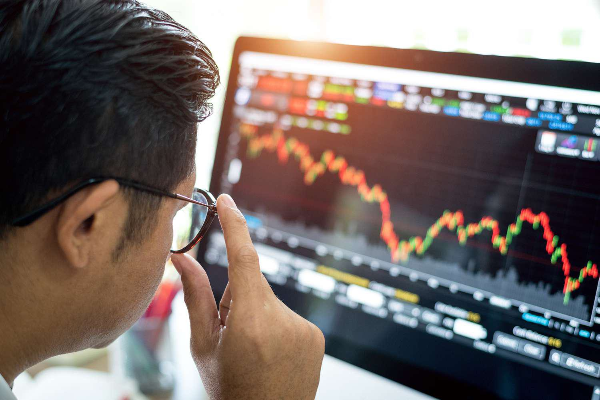

In today’s complex financial landscape, a thorough comprehension of investment strategies, stock market trends, secular investing, and algorithmic trading is essential for both novice and seasoned investors. As markets become increasingly intricate and interconnected, the ability to navigate these domains provides a significant advantage in making informed financial decisions. Investment strategies, tailored to meet specific financial goals and varying risk appetites, form the backbone of successful investing. Simultaneously, understanding stock market trends, which indicate market sentiment and potential future movements, is crucial for investors aiming to align their strategies with the dynamic financial environment.

Secular investing, characterized by a focus on long-term market trends, offers investors a framework for capitalizing on consistent growth opportunities driven by macroeconomic factors. This approach, combined with a grasp of secular trends, offers potential for resilient portfolio construction in the face of evolving market conditions. Additionally, algorithmic trading, which leverages sophisticated computer algorithms to execute trades, has revolutionized the speed and efficiency of transactions, becoming an invaluable tool for institutional investors.



This article aims to provide comprehensive insights into these essential components, illustrating how they intersect to form a robust foundation for effective investment decisions. By defining key concepts and exploring practical applications, this guide serves as an essential resource for enhancing one's understanding of these critical financial domains.

## Table of Contents

## Investment Strategies

Investment strategies are structured approaches that investors employ to achieve their financial objectives based on specific goals, time horizons, and risk tolerances. These strategies guide decision-making concerning asset allocation, security selection, and market timing, ultimately aiming to optimize return potential while managing associated risks. 

One of the most prominent investment strategies is value investing, which revolves around identifying undervalued stocks trading below their intrinsic value as assessed by financial metrics such as price-to-earnings (P/E) and price-to-book (P/B) ratios. Proponents of value investing, such as Benjamin Graham and Warren Buffett, emphasize thorough analysis of financial statements to select investments that the market has overlooked or undervalued, thus providing potential for significant long-term gains.

Growth investing, by contrast, focuses on companies that exhibit signs of above-average growth, regardless of their current valuation. This strategy targets firms with high potential for earning increases, driven by innovation, emerging markets, or strong competitive advantages. Growth investors are typically more willing to pay a premium for stocks, expecting returns through capital appreciation rather than income. The risk associated with growth investing lies in the volatility of growth stocks, which may not always meet high growth expectations.

Income investing prioritizes generating a steady stream of income through dividends or interest payments, and is often favored by investors seeking regular cash flows with lower risk tolerance. This strategy commonly involves investing in dividend-paying stocks, bonds, and real estate investment trusts (REITs). Income investing appeals particularly to retirees or individuals who require consistent revenue, but it must be balanced against inflation risks which can erode purchasing power over time.

Investors frequently customize these strategies to align with their individual risk profiles, financial goals, and the prevailing market conditions. A balanced approach, for instance, may combine elements of value and growth investing to leverage the strengths of both strategies, while mitigating risks. Tailoring investment strategies thus involves analyzing both qualitative and quantitative data to achieve a diversified and robust portfolio.

When adopting a specific investment strategy, investors should consider their own tolerance for risk and their capacity to withstand market fluctuations. For instance, a Python script to quantify the risk-adjusted return of a portfolio could employ the Sharpe ratio, calculated as the average return of the portfolio less the risk-free rate, divided by the standard deviation of the portfolio's excess return:

```python
def sharpe_ratio(returns, risk_free_rate):
    excess_returns = returns - risk_free_rate
    return excess_returns.mean() / excess_returns.std()

# Example usage:
import numpy as np

# Hypothetical monthly returns and risk-free rate
portfolio_returns = np.array([0.02, 0.01, 0.015, 0.03, 0.005])
risk_free_rate = 0.002  # Monthly risk-free rate

sharpe = sharpe_ratio(portfolio_returns, risk_free_rate)
print("Sharpe Ratio:", sharpe)
```

Successful execution of an investment strategy requires diligent research, continuous monitoring of investments, and the flexibility to adapt to changing economic conditions or personal circumstances.

## Understanding Stock Market Trends

Stock market trends are crucial indicators that provide insights into market sentiment and potential future financial movements. Understanding these trends enables investors to make informed decisions by anticipating broader economic shifts that may impact their portfolios.

Analysts classify stock market trends into short-term fluctuations and long-term secular trends. Short-term fluctuations are usually driven by immediate economic events, political developments, or changes in investor sentiment. These can result in [volatility](/wiki/volatility-trading-strategies), where stock prices experience rapid increases or decreases within a few days or weeks. High-frequency traders may capitalize on these short-term movements using algorithmic strategies to gain quick profits.

On the other hand, long-term secular trends reflect deeper, more sustained shifts in economic, technological, or demographic factors that can influence market behavior over decades. These trends are less susceptible to short-term noise and emphasize the intrinsic growth potential of various sectors. For example, the ongoing digital transformation and the push towards sustainable energy sources represent secular trends that investors consider for long-term growth opportunities.

Recognizing and understanding stock market trends is vital for aligning investment strategies with evolving market dynamics. By differentiating between transient market movements and enduring secular shifts, investors can tailor their strategies to mitigate risks and exploit growth opportunities. This alignment requires continuously monitoring economic indicators, corporate earnings reports, and geopolitical events to adapt strategies according to changing market conditions.

In practical terms, investors can use financial modeling and data analysis tools to identify trends and forecast their potential impacts on the market. Python, with libraries such as pandas and matplotlib, allows investors to analyze historical stock data and visualize trends, aiding in decision-making. Here is a simple example in Python to plot a stock's historical price data:

```python
import pandas as pd
import matplotlib.pyplot as plt
import yfinance as yf

# Download historical data for a stock, e.g., Apple Inc.
data = yf.download('AAPL', start='2010-01-01', end='2023-01-01')

# Plot the historical closing price
plt.figure(figsize=(10, 6))
plt.plot(data['Close'], label='AAPL Closing Prices')
plt.title('Apple Inc. Historical Closing Prices')
plt.xlabel('Date')
plt.ylabel('Price (USD)')
plt.legend()
plt.show()
```

Such analyses facilitate the identification of both short-term volatility and long-term trends, empowering investors to align their portfolios strategically with market developments.

## Secular Investing: Long-term View

Secular investing is a strategic approach that hinges on identifying and capitalizing on long-term market trends, which can extend over several decades. Unlike short-term investing, which focuses on immediate gains from market fluctuations, secular investing requires a deep understanding of underlying macroeconomic factors that drive sustained change. 

Technological innovation is a significant pillar of secular trends. As new technologies disrupt traditional industries, they create enduring shifts in economic structures. For example, the rise of [artificial intelligence](/wiki/ai-artificial-intelligence) and [machine learning](/wiki/machine-learning) continues to reshape various sectors such as healthcare, finance, and manufacturing, offering investors opportunities for long-term growth. By evaluating the potential impact and adoption curve of these technologies, investors can strategically position their portfolios to benefit from technological advancement.

Demographic shifts also play a crucial role in secular investing. Trends such as aging populations in developed countries and increasing middle-class growth in emerging economies affect consumer behavior, labor markets, and government policies. These demographic changes can have profound implications for sectors like healthcare, consumer goods, and real estate. By understanding these shifts, investors can anticipate demand for products and services and identify sectors likely to experience sustained growth.

Regulatory changes represent another critical element in secular investing. Government policies and regulations can either hinder or propel market trends. For instance, shifts towards renewable energy and stricter environmental regulations have led to substantial growth opportunities in the clean energy sector. Regulators can also influence financial markets through monetary and fiscal policies, impacting interest rates, inflation, and overall economic growth.

Investors who align their portfolios with secular trends aim to harness the consistent growth opportunities they present. By focusing on industries and companies positioned to benefit from these enduring changes, secular investors seek to achieve sustained capital appreciation. This approach minimizes the influence of short-term market volatility, as the focus remains on the long-term potential of significant global changes.

Successful secular investing requires a forward-looking perspective and a comprehensive analysis of macroeconomic variables. By understanding how these factors interplay and shape the future, investors can make informed decisions that capitalize on long-term structural changes rather than transient market episodes.

## Algorithmic Trading

Algorithmic trading employs advanced computer algorithms to execute trades automatically, based on a set of predefined conditions such as timing, price, and [volume](/wiki/volume-trading-strategy). This method leverages computational power to process extensive data sets, identify potential trading opportunities, and exploit market inefficiencies more quickly and efficiently than traditional manual trading.

One of the core advantages of [algorithmic trading](/wiki/algorithmic-trading) is its ability to interpret and act on vast amounts of real-time financial data. Algorithms are designed to detect patterns and trends that might be invisible to human traders, allowing for the execution of trades at optimal moments. For example, a trading algorithm might be programmed to buy a stock when its price drops below a certain threshold and sell it when the price rises to a desired level. 

```python
# Example of a basic trading algorithm using Python
def simple_moving_average(prices, window):
    return sum(prices[-window:]) / window

def trading_signal(prices):
    short_window = 5
    long_window = 20
    short_ma = simple_moving_average(prices, short_window)
    long_ma = simple_moving_average(prices, long_window)

    if short_ma > long_ma:
        return "Buy"
    elif short_ma < long_ma:
        return "Sell"
    else:
        return "Hold"
```

The popularity of algorithmic trading among institutional investors stems from its ability to significantly increase the speed and efficiency of trading operations. Algorithms can execute thousands of trades per second across different markets, which is particularly advantageous in markets where split-second decisions can make a substantial difference in profitability.

Moreover, algorithmic trading minimizes human intervention and emotion, which are often sources of error in financial markets. By adhering strictly to specified rules and conditions, algorithms maintain discipline and consistency in executing trading strategies.

The efficiency brought by algorithmic trading is also evident in reducing transaction costs. By optimizing trade execution, algorithms help in achieving better pricing and minimizing the impact of trading on market prices. Additionally, the scalability of algorithmic strategies allows for the handling of large trading volumes without significant human resource constraints.

As financial markets continue to advance technologically, the role of algorithmic trading is expected to expand further. Future developments in artificial intelligence and machine learning promise to enhance the sophistication of trading algorithms, enabling more intricate pattern recognition and predictive capabilities. This evolution will likely reinforce the dominance of algorithmic trading, particularly within institutional trading environments.

## Impact of Secular Trends on Investment Strategies

Secular trends have become pivotal in reshaping investment strategies, providing investors with clear direction amidst market volatility. Two of the most significant secular trends are digital transformation and the rise of sustainable energy. Both have fundamentally altered the investment landscape, offering both opportunities and challenges for investors to consider.

Digital transformation continues to drive significant shifts in various industries, including technology, finance, healthcare, and retail. Companies that successfully integrate digital technologies into their operations can enhance efficiency, scale operations, and improve customer engagement. This transformation has encouraged investors to focus on technology-driven companies and those that demonstrate a strong digital strategy. For instance, firms adopting artificial intelligence, cloud computing, and big data analytics are often seen as better positioned for long-term growth.

Sustainable energy is another critical trend reshaping investment strategies. With increasing global focus on environmental sustainability and regulatory pressures for carbon reduction, renewable energy sources such as solar, wind, and hydroelectric power are gaining prominence. Investments in companies that produce or support these energy sources are becoming more attractive, as they align with environmental targets and benefit from government incentives and public support.

Investors can capitalize on these trends by identifying sectors poised for long-term growth due to their alignment with these secular changes. For example, the renewable energy sector presents numerous opportunities, as it is expected to see substantial growth over the coming decades. Similarly, technology companies that provide digital solutions across various sectors are likely to experience sustained demand.

Aligning investment portfolios with secular trends not only taps into potential growth but also provides resilience against market volatility. Unlike cyclical trends, which can lead to short-term fluctuations, secular trends offer a more stable growth path by capitalizing on fundamental shifts in the economy and society. As such, investing in sectors influenced by these trends can potentially stabilize portfolio performance during economic downturns.

An example of leveraging these trends could be observed in constructing a diversified portfolio. An investor might allocate a significant portion of the portfolio to technology companies with strong digital transformation strategies and invest in renewable energy projects or companies with robust commitments to sustainable practices. Such a strategy provides exposure to the growth potential of these secular trends while mitigating risks associated with market volatility.

In conclusion, understanding and leveraging secular trends like digital transformation and sustainable energy is critical for modern investors. By focusing on these long-term shifts, investors can enhance the resilience and growth potential of their portfolios, making better-informed decisions in ever-evolving market conditions.

## Practical Considerations and Risk Management

Successful investing requires a balanced understanding of opportunities and associated risks. Investors must engage in comprehensive research and remain adaptable to fluctuating market conditions to effectively manage these risks.

Thorough research is the cornerstone of any successful investment strategy. It involves analyzing financial statements, understanding industry dynamics, evaluating competitor performance, and staying informed about macroeconomic indicators. Rigorous research enables investors to make informed decisions based on empirical data rather than speculation.

Adaptability to market changes is another critical component for risk management. Markets are inherently dynamic, influenced by a plethora of factors including political events, economic cycles, and technological advancements. Investors need to monitor these factors continuously and be prepared to adjust their portfolios in response to shifts in market conditions. This requires maintaining a flexible investment strategy that allows for quick repositioning without incurring significant losses.

Diversification is a key risk management strategy that involves spreading investments across various asset classes to reduce exposure to any single asset or risk. The idea is that a diverse portfolio is less likely to be severely impacted by the underperformance of a single investment. The effectiveness of diversification can be mathematically expressed through the formula for portfolio variance:

$$
\sigma_p^2 = \sum_{i=1}^{n} w_i^2 \sigma_i^2 + \sum_{i=1}^{n} \sum_{j=1, j \neq i}^{n} w_i w_j \sigma_i \sigma_j \rho_{ij}
$$

where $\sigma_p^2$ represents the portfolio variance, $w_i$ and $w_j$ are the weights of the assets in the portfolio, $\sigma_i$ and $\sigma_j$ denote the standard deviations of the assets, and $\rho_{ij}$ is the correlation between the returns of assets $i$ and $j$. By spreading investments, an investor can lower the overall portfolio risk.

A clear understanding of market risks is also essential. Market risk, often referred to as systematic risk, pertains to factors that affect the entire market, such as economic recessions or global events. Although diversification cannot eliminate market risk, understanding its nature helps investors to make more informed decisions in timing and selecting investments. Besides market risk, investors should consider other types of risks, such as credit risk, [liquidity](/wiki/liquidity-risk-premium) risk, and operational risk, which might affect individual securities or specific investments.

In summary, successful investing requires a strategic approach to risk management, which includes diligent research, portfolio diversification, and an understanding of various market risks. This approach not only helps in mitigating potential losses but also in capitalizing on opportunities for financial growth.

## Conclusion

Informed investment strategies, when combined with a deep understanding of secular trends and algorithmic trading, can significantly enhance an investor's ability to successfully navigate the stock market's complexities. By integrating these elements, investors are better equipped to make informed decisions that align with both current market conditions and future potential.

Being proactive in recognizing and adapting to market trends enables investors to capitalize on emerging opportunities while mitigating risks. Technology-driven approaches such as algorithmic trading offer advantages by swiftly processing large datasets to identify inefficiencies and take timely action. This agility can translate into higher returns and a more robust investment position.

Moreover, continual learning and adaptability are essential for sustaining success in the dynamic financial environment. As new trends emerge and technologies evolve, investors who prioritize ongoing education and flexible strategies are more likely to achieve their financial goals. This adaptability not only allows for resilience against unforeseen market shifts but also positions investors to thrive amid changes.

In summary, a strategic blend of informed investment strategies, awareness of long-term trends, and the adoption of advanced trading technologies empowers investors to achieve their financial objectives while navigating the complexities of the stock market with confidence.

## References & Further Reading

[1]: Bergstra, J., Bardenet, R., Bengio, Y., & Kégl, B. (2011). ["Algorithms for Hyper-Parameter Optimization."](https://papers.nips.cc/paper/4443-algorithms-for-hyper-parameter-optimization) Advances in Neural Information Processing Systems 24.

[2]: ["Advances in Financial Machine Learning"](https://www.amazon.com/Advances-Financial-Machine-Learning-Marcos/dp/1119482089) by Marcos Lopez de Prado

[3]: ["Evidence-Based Technical Analysis: Applying the Scientific Method and Statistical Inference to Trading Signals"](https://books.google.com/books/about/Evidence_Based_Technical_Analysis.html?id=MeoJAQAAMAAJ) by David Aronson

[4]: ["Machine Learning for Algorithmic Trading"](https://github.com/stefan-jansen/machine-learning-for-trading) by Stefan Jansen

[5]: ["Quantitative Trading: How to Build Your Own Algorithmic Trading Business"](https://www.amazon.com/Quantitative-Trading-Build-Algorithmic-Business/dp/1119800064) by Ernest P. Chan