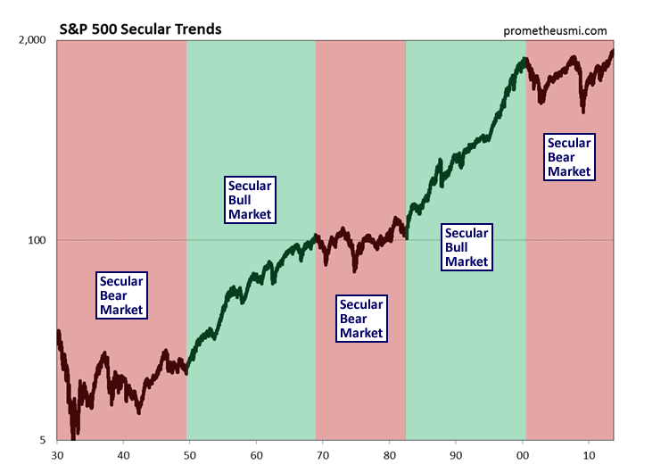

## Table of Contents

## What are secular trends in stock investing?

Secular trends in stock investing are long-term patterns that shape the direction of the market over many years. These trends can be influenced by broad economic factors, technological advancements, demographic shifts, and changes in consumer behavior. For example, the rise of the internet and digital technology has been a secular trend that has created new industries and transformed existing ones, leading to significant growth in tech stocks over the past few decades.

Investors who recognize and invest in these secular trends early can potentially achieve substantial returns. For instance, investing in renewable energy stocks as the world shifts towards sustainable energy sources could be beneficial in the long run. However, it's important to be aware that while secular trends provide a general direction, they don't guarantee success for every stock within the trend. Market conditions, company performance, and other factors can still impact individual stock prices.

Understanding secular trends requires patience and a long-term perspective. It's not about quick gains but about recognizing where the world is heading and positioning your investments accordingly. By focusing on these long-term patterns, investors can make more informed decisions and potentially build wealth over time.

## How do secular trends differ from cyclical trends?

Secular trends are long-lasting changes that happen over many years or even decades. They are driven by big shifts in things like technology, how people live, and what they value. For example, the move towards using more renewable energy is a secular trend because it's a slow but steady change in how we get our power. These trends help investors see where the world is heading and can guide them in choosing stocks that will grow over a long time.

Cyclical trends, on the other hand, are shorter and go up and down in a cycle. They are often tied to the economy, like how businesses do better when the economy is growing and worse when it's shrinking. For example, car sales might go up during good economic times and drop during bad times. These trends are important for investors who want to make money by buying and selling stocks at the right times within these shorter cycles.

In simple terms, secular trends are like slow-moving rivers that change the landscape over time, while cyclical trends are like waves that come and go with the tide. Both are important for investors, but they need different strategies. Secular trends are for long-term planning, while cyclical trends are for shorter-term trading.

## Can you provide examples of past secular trends in the stock market?

One big secular trend in the past was the rise of the automobile industry. Back in the early 1900s, cars started to become popular and changed how people lived and worked. Companies like Ford and General Motors grew a lot because more and more people wanted to buy cars. This trend lasted for many years and made these companies very successful. Investors who saw this trend early and bought stocks in car companies made a lot of money over time.

Another important secular trend was the growth of the computer and technology industry. Starting in the 1970s and 1980s, computers began to be used in homes and businesses. Companies like IBM, Microsoft, and later Apple, saw huge growth because of this. The trend continued into the internet age in the 1990s and 2000s, with companies like Amazon and Google becoming giants. People who invested in these tech companies early on saw their investments grow a lot over the years.

A third example is the rise of healthcare and pharmaceuticals. As people started living longer and medicine got better, there was more demand for healthcare services and drugs. This trend started in the mid-20th century and is still going strong today. Companies like Johnson & Johnson and Pfizer have grown a lot because of this. Investors who put money into these companies over the long term have seen good returns because the need for healthcare keeps growing.

## What are the key factors that drive secular trends in stock investing?

Secular trends in stock investing are driven by big changes that happen over a long time. These changes can come from new technology, like how the internet changed the way we live and work. They can also come from how people's lives are changing, like more people getting older and needing more healthcare. Another [factor](/wiki/factor-investing) is what people care about, like wanting to use less energy from oil and more from the sun or wind. All these things slowly change what kinds of businesses do well over many years.

Another key factor is the economy and how it grows and changes over time. For example, when more countries start to build factories and make things, it can lead to a secular trend in manufacturing. Also, when people in different countries start to earn more money, they might buy more things, which can drive trends in consumer goods. These big shifts in the economy can create new opportunities for businesses and guide where investors put their money for the long term.

## How can investors identify emerging secular trends?

To spot new secular trends, investors need to keep an eye on big changes happening around the world. This means watching new technologies, like how smartphones changed everything, or how [artificial intelligence](/wiki/ai-artificial-intelligence) is starting to do more and more. It also means looking at how people's lives are changing, like more people moving to cities or working from home. By reading news, reports, and talking to experts, investors can start to see where things are heading.

Another way to find these trends is by paying attention to what people care about and what they're spending money on. For example, if more people are worried about the environment, they might spend more on green products. This could mean a secular trend in companies that make these products. Also, looking at what governments are doing can help. If they're making new laws about things like electric cars or renewable energy, that can be a sign of a new trend. By staying curious and connected, investors can spot these trends early and make smart choices about where to put their money for the long term.

## What are the risks associated with investing in secular trends?

Investing in secular trends can be risky because even if a trend looks good, it doesn't mean every company in that trend will do well. Some companies might not be able to keep up with the changes or might not be as good as others. Also, sometimes a trend can take longer to grow than expected, or it might not grow as much as people thought. This means investors might have to wait a long time before they see any money back, or they might lose money if the trend doesn't go the way they hoped.

Another risk is that new things can come along and change the trend. For example, a new technology might make an old one less important. This can hurt companies that were doing well in the old trend. Also, things like new laws or big changes in the world economy can affect trends. If an investor puts all their money into one trend and something goes wrong, they could lose a lot. It's important for investors to spread their money around and not put all their eggs in one basket, even if a trend seems really promising.

## How should a beginner approach investing in secular trends?

For a beginner, the first step in investing in secular trends is to learn about the big changes happening in the world. This means reading news, watching documentaries, and maybe even talking to people who know a lot about different industries. Look for trends that seem like they will last a long time, like the move to green energy or the growth of technology. Once you find a trend that interests you, research the companies that are part of it. Not all companies will do well, so it's important to pick the ones that seem strong and have a good future.

After [picking](/wiki/asset-class-picking) some companies, don't put all your money into one place. It's smart to spread your money around, so if one company doesn't do well, you won't lose everything. Start with a small amount of money that you can afford to lose, and be ready to wait a long time before you see big returns. Investing in secular trends is about playing the long game, so patience is key. Keep learning and stay updated on your investments, and over time, you might see your money grow as the trend takes off.

## What tools and resources can help investors track secular trends?

One good tool for tracking secular trends is the internet. Websites like Bloomberg, Reuters, and The Financial Times have lots of news and articles about big changes in the world. You can also use social media to follow experts and companies that are part of these trends. Another useful tool is stock market analysis websites like Yahoo Finance or Morningstar, which give you information about how companies are doing and what people think about them.

Another resource is industry reports and research papers. Companies like McKinsey and Deloitte put out reports about what's happening in different industries. These can help you see the big picture and understand where things are heading. Also, joining online forums or groups where people talk about investing can be helpful. You can learn from others and share what you know. By using these tools and resources, you can stay on top of secular trends and make smarter investment choices.

## How do global economic shifts influence secular trends in stock investing?

Global economic shifts play a big role in shaping secular trends in stock investing. When countries like China and India start to grow their economies a lot, it can create new trends. For example, as these countries get richer, more people can buy things like cars and smartphones. This can make companies that make these products grow over many years. Also, when the world economy changes, like when countries start trading more with each other, it can lead to trends in industries like shipping and technology.

These shifts can also change what people care about and how they spend their money. For instance, if the world economy is doing well, people might spend more on luxury items, leading to a trend in those kinds of companies. On the other hand, if there's a big economic problem, like a recession, people might focus more on saving money and buying things that are necessary, which can drive trends in cheaper products or services. By watching these global changes, investors can get a better idea of where to put their money for the long term.

## What role do technological advancements play in shaping secular trends?

Technological advancements are a big reason why secular trends happen. When new technology comes out, it can change how we live and work. For example, the internet changed everything when it started to be used by everyone. Companies that used the internet to sell things or help people connect, like Amazon and Google, grew a lot because of this trend. New technology can also make old ways of doing things less important. Like how smartphones made a lot of other gadgets less needed. This can create new trends in the companies that make and use the new technology.

These changes can take a long time to happen, but they can last for many years. For example, the move to using more computers in businesses and homes started a long time ago and is still going. This has made tech companies very important and has changed how almost every business works. Investors who see these trends early can make good choices about where to put their money. But it's not just about the technology itself. It's also about how people use it and what new things it lets us do. So, keeping an eye on new technology and how it's changing things can help investors find the next big trend.

## How can investors balance their portfolio between secular trends and other investment strategies?

Balancing a portfolio between secular trends and other investment strategies is important for spreading risk and getting the best returns. Secular trends are great for long-term growth because they follow big changes that happen over many years. But they can take a long time to pay off, and not every company in a trend will do well. So, it's smart to not put all your money into just one trend. Instead, you can also invest in other ways, like buying stocks that go up and down with the economy's short-term cycles or investing in safe things like bonds that give you steady income.

To do this, you can start by deciding how much risk you want to take and how long you can wait for your investments to grow. If you're okay with waiting a long time and taking some risk, you might put more money into secular trends. But if you want some money to grow faster or need it to be safer, you can put some money into cyclical stocks or bonds. The key is to mix different types of investments so that if one doesn't do well, the others might help balance it out. By keeping your portfolio diverse and checking it now and then, you can make sure you're on the right track with your investments.

## What advanced strategies can experts use to capitalize on secular trends?

Experts can use advanced strategies like sector rotation to make the most of secular trends. This means they move their money from one industry to another as different trends start to grow. For example, if they see that renewable energy is becoming a big trend, they might sell stocks in old energy companies and buy stocks in solar or wind companies. By doing this, they can stay ahead of the curve and make money as new trends take off. They also use something called thematic investing, where they focus on specific themes like technology or healthcare that they think will do well over time. This way, they can pick the best companies within those themes and make big returns.

Another strategy experts use is called long-short equity. This means they buy stocks they think will go up because of a secular trend and also bet against stocks they think will go down. For example, if they believe electric cars will become more popular, they might buy stocks in electric car companies and bet against companies that only make gas cars. This can help them make money no matter which way the market goes. They also pay close attention to global economic changes and new technologies to find the next big trend early. By combining these strategies, experts can take advantage of secular trends and build a strong investment portfolio.

## What are the practical considerations and how should risk management be approached?

Successful investing requires a balanced understanding of opportunities and associated risks. Investors must engage in comprehensive research and remain adaptable to fluctuating market conditions to effectively manage these risks.

Thorough research is the cornerstone of any successful investment strategy. It involves analyzing financial statements, understanding industry dynamics, evaluating competitor performance, and staying informed about macroeconomic indicators. Rigorous research enables investors to make informed decisions based on empirical data rather than speculation.

Adaptability to market changes is another critical component for risk management. Markets are inherently dynamic, influenced by a plethora of factors including political events, economic cycles, and technological advancements. Investors need to monitor these factors continuously and be prepared to adjust their portfolios in response to shifts in market conditions. This requires maintaining a flexible investment strategy that allows for quick repositioning without incurring significant losses.

Diversification is a key risk management strategy that involves spreading investments across various asset classes to reduce exposure to any single asset or risk. The idea is that a diverse portfolio is less likely to be severely impacted by the underperformance of a single investment. The effectiveness of diversification can be mathematically expressed through the formula for portfolio variance:

$$
\sigma_p^2 = \sum_{i=1}^{n} w_i^2 \sigma_i^2 + \sum_{i=1}^{n} \sum_{j=1, j \neq i}^{n} w_i w_j \sigma_i \sigma_j \rho_{ij}
$$

where $\sigma_p^2$ represents the portfolio variance, $w_i$ and $w_j$ are the weights of the assets in the portfolio, $\sigma_i$ and $\sigma_j$ denote the standard deviations of the assets, and $\rho_{ij}$ is the correlation between the returns of assets $i$ and $j$. By spreading investments, an investor can lower the overall portfolio risk.

A clear understanding of market risks is also essential. Market risk, often referred to as systematic risk, pertains to factors that affect the entire market, such as economic recessions or global events. Although diversification cannot eliminate market risk, understanding its nature helps investors to make more informed decisions in timing and selecting investments. Besides market risk, investors should consider other types of risks, such as credit risk, [liquidity](/wiki/liquidity-risk-premium) risk, and operational risk, which might affect individual securities or specific investments.

In summary, successful investing requires a strategic approach to risk management, which includes diligent research, portfolio diversification, and an understanding of various market risks. This approach not only helps in mitigating potential losses but also in capitalizing on opportunities for financial growth.

## References & Further Reading

[1]: Bergstra, J., Bardenet, R., Bengio, Y., & Kégl, B. (2011). ["Algorithms for Hyper-Parameter Optimization."](https://papers.nips.cc/paper/4443-algorithms-for-hyper-parameter-optimization) Advances in Neural Information Processing Systems 24.

[2]: ["Advances in Financial Machine Learning"](https://www.amazon.com/Advances-Financial-Machine-Learning-Marcos/dp/1119482089) by Marcos Lopez de Prado

[3]: ["Evidence-Based Technical Analysis: Applying the Scientific Method and Statistical Inference to Trading Signals"](https://books.google.com/books/about/Evidence_Based_Technical_Analysis.html?id=MeoJAQAAMAAJ) by David Aronson

[4]: ["Machine Learning for Algorithmic Trading"](https://github.com/stefan-jansen/machine-learning-for-trading) by Stefan Jansen

[5]: ["Quantitative Trading: How to Build Your Own Algorithmic Trading Business"](https://www.amazon.com/Quantitative-Trading-Build-Algorithmic-Business/dp/1119800064) by Ernest P. Chan