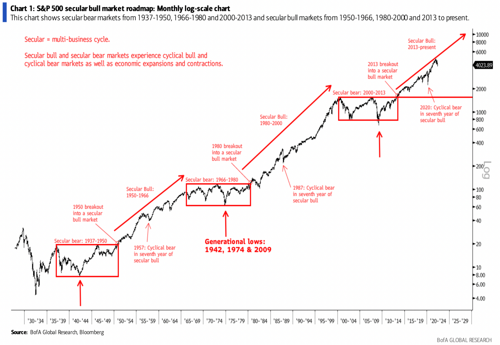

## Table of Contents

## What is the difference between secular and cyclical markets?

Secular markets are long-term trends that last for many years, often a decade or more. They are driven by big changes in the economy, like new technology or shifts in how people live and work. For example, the rise of the internet created a long-term growth trend in tech companies. In a secular bull market, the overall market goes up over a long time, while in a secular bear market, it goes down over a long time.

Cyclical markets, on the other hand, are shorter-term trends that happen within the bigger secular trends. They can last from a few months to a few years and are influenced by things like interest rates, employment levels, and consumer spending. For instance, the housing market often goes through cycles where prices go up and down based on economic conditions. Cyclical markets can be bull markets, where prices rise, or bear markets, where prices fall, but these changes are temporary compared to the longer-lasting secular trends.

Understanding the difference between secular and cyclical markets can help investors make better decisions. If you know a market is in a long-term secular trend, you might hold onto investments for a longer time. But if you see a short-term cyclical trend, you might buy or sell based on those shorter movements. Both types of trends are important to watch, but they affect the market in different ways and over different time periods.

## Can you provide examples of secular market trends?

A good example of a secular market trend is the growth of the technology sector over the past few decades. Starting in the 1990s, the rise of the internet and personal computers led to a long-term increase in the value of tech companies. This trend continued as smartphones, social media, and cloud computing became more important in our daily lives. Even though there were ups and downs along the way, the overall direction of the tech market has been upward for a very long time.

Another example is the secular decline in the tobacco industry. As more people became aware of the health risks associated with smoking, the demand for cigarettes started to fall. This trend began in the late 20th century and has continued into the 21st century. Despite short-term fluctuations, the overall market for tobacco products has been shrinking over the long term. This shows how big changes in society, like health awareness, can lead to long-lasting trends in the market.

## What are some examples of cyclical market trends?

One example of a cyclical market trend is in the housing market. Sometimes, the economy is doing well, people have jobs, and they feel confident about buying homes. During these times, home prices go up because a lot of people want to buy. But then, the economy might slow down, people might lose jobs, and they might not want to buy homes anymore. When this happens, home prices can go down because fewer people are buying. These ups and downs in the housing market are short-term cycles that happen over a few years.

Another example is in the car industry. When the economy is strong, people have more money to spend, and they might decide to buy new cars. Car sales go up, and car companies do well. But if the economy gets weaker, people might not want to spend money on new cars. They might keep their old cars longer or buy used ones instead. This causes car sales to drop, and car companies might struggle. These cycles in the car market can last a few years and are influenced by how the overall economy is doing.

## How do secular trends affect long-term investment strategies?

Secular trends are big changes that last for many years. They can affect long-term investment strategies because they show where the market is going over a long time. If you know there's a secular trend, like the growth of technology, you might want to invest in tech companies. This is because the trend suggests that tech will keep growing for a long time, so your investment could do well over many years. By understanding these big trends, you can make choices that fit with where the market is heading, not just what's happening right now.

For example, if you see a secular trend towards renewable energy because more people care about the environment, you might decide to invest in solar or wind power companies. Even if these companies go through ups and downs in the short term, the long-term trend suggests they will do well over time. This helps you plan your investments to grow over many years, rather than trying to make quick profits. Knowing about secular trends can make your investment strategy more stable and focused on the future.

## What impact do cyclical trends have on short-term trading?

Cyclical trends can really change how people do short-term trading. These trends are like waves in the market that last a few months or years. Traders watch these waves closely because they can make quick money by buying when prices are low and selling when they go up. For example, if they see that car sales are going up because the economy is doing well, they might buy car company stocks. Then, when they think the cycle is about to go down, they sell those stocks to make a profit.

But, these cycles can also be risky. If a trader guesses wrong about where the cycle is going, they could lose money. For instance, if they buy stocks thinking the market will go up, but it actually goes down, they'll be stuck with stocks that are worth less. So, traders need to be very careful and keep a close eye on things like interest rates, employment numbers, and consumer spending to try and predict these cycles. It's all about timing and trying to stay one step ahead of the market's short-term ups and downs.

## How can investors identify the beginning of a secular trend?

Identifying the start of a secular trend can be tough, but it helps to look at big changes in society or technology. For example, when the internet started becoming popular in the 1990s, it was clear that it would change how people live and work. Investors who noticed this early could see that companies involved with the internet might grow for a long time. So, they might have started investing in tech companies then. To spot these trends, investors need to pay attention to news, new inventions, and shifts in what people care about or how they live.

Another way to identify the beginning of a secular trend is by watching economic reports and long-term data. If you see that certain industries are growing steadily over many years, it might be the start of a secular trend. For instance, if renewable energy companies keep getting bigger and more important year after year, it could mean that we're at the start of a long-term shift towards cleaner energy. By keeping an eye on these big patterns, investors can make smart choices about where to put their money for the long haul.

## What indicators are used to predict cyclical market movements?

To predict cyclical market movements, investors often look at economic indicators like interest rates, employment levels, and consumer spending. Interest rates are important because when they go up, borrowing money becomes more expensive, and people might buy less. When they go down, borrowing is cheaper, and people might spend more. Employment levels matter too. If more people have jobs, they have money to spend, which can boost the economy. But if lots of people lose their jobs, they won't spend as much, and the economy might slow down.

Consumer spending is another big indicator. When people feel good about the economy, they spend more on things like cars and houses. But if they're worried about the future, they might save their money instead. Investors also watch things like the housing market and car sales because these often go through cycles. By keeping an eye on these indicators, investors can try to guess when the market might go up or down in the short term. It's not an exact science, but these signs can help make better trading decisions.

## How do economic policies influence secular and cyclical markets?

Economic policies can have a big impact on both secular and cyclical markets. For secular markets, which are long-term trends, policies like tax changes or big government spending on things like infrastructure can create new trends. For example, if the government decides to spend a lot on renewable energy, it could start a long-term trend where those companies grow more and more over many years. This is because the policy gives these companies a boost and shows that they will be important in the future. So, investors might see this policy change and decide to put their money into renewable energy companies, expecting them to do well over a long time.

For cyclical markets, which are shorter-term ups and downs, economic policies like changing interest rates or giving out stimulus checks can make a big difference. If the government lowers interest rates, it can make borrowing cheaper, which might help the economy grow faster for a while. This can cause a short-term cycle where people buy more and the market goes up. But if the government raises interest rates to slow down the economy, it might start a cycle where people buy less and the market goes down. By watching these policy changes, investors can try to predict these short-term cycles and make trading decisions based on what they think will happen next.

## What role do global events play in shaping secular vs. cyclical markets?

Global events can really change both secular and cyclical markets, but in different ways. For secular markets, which are long-term trends, big events like new technology or major changes in how the world works can start new trends. For example, when the internet became popular, it started a long-term trend where tech companies grew a lot over many years. Another big event, like a global push for cleaner energy, can start a secular trend where companies making solar or wind power grow for a long time. These events set the stage for where the market is heading over many years.

For cyclical markets, which are shorter-term ups and downs, global events can cause quick changes. Things like wars, pandemics, or big economic changes can make the market go up or down in the short term. For instance, when a country goes to war, it might make people worried, and they might sell their stocks, causing a short-term drop in the market. But if a country finds a new way to make more money, like discovering oil, it can cause a short-term boom. These events can shake up the market for a little while, but they don't usually change the long-term direction set by secular trends.

## How can portfolio diversification strategies differ between secular and cyclical markets?

When you're thinking about diversifying your portfolio in a secular market, you want to look at the big trends that will last for many years. For example, if you see that technology is growing a lot and will keep growing, you might put more money into tech companies. You might also want to invest in other areas that are part of this big trend, like companies that make parts for tech products or those that use technology to do their business. The idea is to spread your money across different companies and industries that are all part of the same long-term trend, so if one company doesn't do well, others might still grow and help your portfolio.

In a cyclical market, you need to think about the short-term ups and downs. You might want to have some money in industries that go through these cycles, like housing or cars, but you also need to be ready to move your money around quickly. You might put some money in stocks that do well when the economy is growing and some in stocks that do well when the economy slows down. This way, no matter which way the short-term cycle goes, part of your portfolio can still do well. It's about balancing your investments so you can take advantage of the short-term cycles without putting all your money in one place that might go down.

## What advanced analytical tools are used to forecast secular market shifts?

To forecast secular market shifts, investors use advanced analytical tools like long-term trend analysis and econometric models. Long-term trend analysis looks at data over many years to find patterns that show where the market might be heading. For example, if you see that the use of renewable energy is growing every year, you might use this tool to predict that it will keep growing for a long time. Econometric models are another tool that uses math to understand how different things in the economy affect each other. By putting in data about things like population growth, technology changes, and government policies, these models can help predict big shifts in the market.

Another tool is scenario analysis, which helps investors think about different ways the future might go. By imagining different possible futures, like a world where everyone uses electric cars or a world where people go back to using less technology, investors can see how their investments might do in each case. This helps them prepare for big changes. Lastly, sentiment analysis looks at what people are saying and feeling about the market. By using computer programs to read news articles, social media posts, and other writings, investors can get a sense of whether people are hopeful or worried about the future. This can give clues about where the market might be headed over the long term.

## How do expert investors balance investments between secular and cyclical markets for optimal returns?

Expert investors balance their investments between secular and cyclical markets by understanding the different roles each type of market plays in their portfolio. For secular markets, which are long-term trends, they look for big changes in the world that will last for many years. They might invest in areas like technology or renewable energy, where they see a clear trend of growth. By putting a good amount of their money into these areas, they can ride the wave of these long-term trends and see their investments grow over time. They also make sure to spread their investments across different companies and industries within the same trend, so if one company doesn't do well, others might still grow.

For cyclical markets, which go through shorter ups and downs, expert investors use a different approach. They keep some of their money in industries that go through these cycles, like housing or cars, but they're ready to move their money around quickly. They might have some investments in stocks that do well when the economy is growing and others in stocks that do well when the economy slows down. This way, they can take advantage of the short-term cycles without putting all their money in one place that might go down. By balancing their portfolio between these long-term trends and short-term cycles, expert investors aim to get the best returns over time, making sure they're prepared for both the big changes and the smaller ups and downs in the market.

## References & Further Reading

[1]: Damodaran, A. (2012). ["Investment Philosophies: Successful Strategies and the Investors Who Made Them Work"](https://archive.org/details/investmentphilos0000damo) Wiley.

[2]: Shiller, R. J. (2000). ["Irrational Exuberance"](https://press.princeton.edu/books/paperback/9780691173122/irrational-exuberance) Princeton University Press.

[3]: Lo, A. W. (2017). ["Adaptive Markets: Financial Evolution at the Speed of Thought"](https://www.amazon.com/Adaptive-Markets-Financial-Evolution-Thought/dp/0691135142) Princeton University Press.

[4]: Steiner, M. (2020). ["Algorithmic Trading: A Practitioner's Guide"](https://www.amazon.com/Algorithmic-Trading-Practitioners-Jeffrey-Bacidore/dp/0578715236) Wiley.

[5]: Haugen, R. A. (2006). ["The New Finance: Overreaction, Complexity and Uniqueness"](https://books.google.com/books/about/The_New_Finance.html?id=R18gAQAAIAAJ) Prentice Hall.