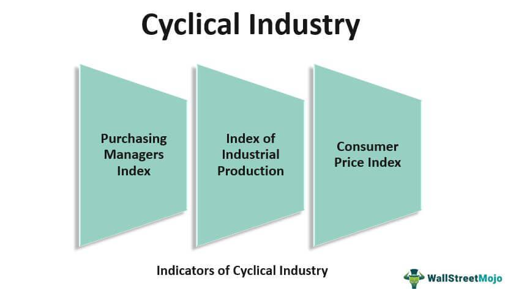

The world of financial markets is diverse and complex, with dynamics often encapsulated in terms like 'secular' and 'cyclical' markets. Grasping these concepts is vital for investors, regardless of experience level, to effectively navigate trends and make sound financial decisions. This article provides an exploration of the concepts of secular and cyclical markets, alongside market trends and the emergence of algorithmic trading. 

Secular markets are influenced by long-term drivers and can span years or decades, whereas cyclical markets are shaped by shorter-term business cycles. This article aims to translate these ideas into clear, understandable concepts through expert analysis and real-world examples. Additionally, we examine the growing role of algorithmic trading within these market types, highlighting its increasing influence. As technology continues to advance, understanding the impact of algorithmic trading becomes crucial, offering a window into modern market dynamics.



## Table of Contents

## Understanding Secular Markets

Secular markets are shaped by enduring forces, displaying trends that span extended periods, often lasting several years to decades. These markets are predominantly characterized by overarching economic and industry-specific indicators that drive consistent long-term growth or decline.

A secular bull market emerges when enduring positive economic conditions align with robust corporate earnings, fueling investor confidence and sustained market growth. This type of market scenario is marked by prolonged periods during which stock prices rise and economic indicators remain favorable. A classic example of a secular bull market occurred from the early 1980s to the late 1990s, driven by technological revolutions and substantial productivity gains.

Conversely, secular bear markets are identified by extended periods of pessimism in the market, where prevailing economic conditions deteriorate, leading to declining stock prices and investor sentiment. During these times, even favorable economic news might not significantly alter the market's downward trajectory, as the underlying structural challenges tend to overshadow short-term positive developments.

Secular market trends are significantly influenced by large-scale national and international developments. Among these are demographic shifts, regulatory changes, and importantly, advancements in technology. Technological innovations, particularly, serve as a robust example of secular market forces at play. For instance, the relentless demand for innovation and improvement in the technology sector continuously drives long-term growth. The rise of personal computing in the late 20th century and the growth of the internet and digital services in the early 21st century are testament to technology acting as a secular force, underpinning sustained industry expansion.

Understanding secular markets requires recognizing these broad and long-lasting trends that persist despite short-term economic fluctuations. This demands an analysis of macroeconomic conditions, technological evolution, and societal changes that collectively influence market dynamics over extended periods. Investors with a keen insight into these trends can leverage them to make informed long-term investment decisions, ensuring alignment with the enduring forces shaping the economic landscape.

## Cyclical Markets Explained

Cyclical markets are characterized by their tendency to fluctuate over shorter periods compared to secular markets, often aligning with the peaks and troughs of business cycles. These markets are sensitive to macroeconomic variables such as GDP growth, unemployment rates, and inflation, which influence consumer spending and business investment. Consequently, cyclical markets display a relatively higher level of [volatility](/wiki/volatility-trading-strategies), reflecting the economic environment's shifts.

Industries that fall under cyclical markets typically include sectors that are heavily reliant on consumer discretionary spending and capital investments, such as the automotive, construction, and consumer durables industries. For instance, during periods of economic expansion, consumer confidence and disposable income usually increase, boosting demand for automobiles and other high-ticket items. Conversely, during economic contractions or recessions, these industries tend to experience significant declines as consumers become more conservative in their spending, focusing on essential goods and services.

Investors operating in cyclical markets must possess a keen ability to interpret economic indicators and gauge business cycle phases. Timing is crucial, as entering and exiting investments at the right moments can lead to substantial returns or mitigate potential losses. An effective strategy often involves monitoring key indicators such as industrial production indices, consumer confidence surveys, and employment figures, which provide insights into the economic climate. Additionally, diversification across multiple sectors and geographies may help investors manage the inherent risks associated with cyclical markets.

To illustrate these concepts, consider a Python example that analyzes historical GDP growth data and predicts potential turning points in the business cycle using moving averages:

```python
import pandas as pd
import numpy as np

# Load GDP data
gdp_data = pd.read_csv('gdp_growth.csv')  # Assume the file contains historical GDP growth rates

# Calculate moving averages
gdp_data['3_year_MA'] = gdp_data['GDP_Growth'].rolling(window=3).mean()
gdp_data['5_year_MA'] = gdp_data['GDP_Growth'].rolling(window=5).mean()

# Identify turning points
gdp_data['Turning_Point'] = np.where(gdp_data['3_year_MA'] > gdp_data['5_year_MA'], 'Expansion', 'Contraction')

# Display results
print(gdp_data[['Year', 'GDP_Growth', '3_year_MA', '5_year_MA', 'Turning_Point']])
```

In this example, the moving averages help identify periods of economic expansion and contraction by highlighting changes in the GDP growth trend. Such analyses are invaluable for investors seeking to optimize their entry and [exit](/wiki/exit-strategy) points in cyclical markets.

## Market Trends and Their Significance

Tracking market trends is an essential practice for investors seeking to identify potential opportunities and mitigate risks in both secular and cyclical markets. By analyzing these trends, investors can gain insights into the economic forces that drive market movements, enabling them to make informed investment decisions.

Secular bull markets are characterized by prolonged periods of positive growth, offering lucrative investment opportunities due to underlying economic strength and robust corporate earnings. During such phases, the market exhibits upward [momentum](/wiki/momentum) driven by fundamentals like technological advancements, demographic shifts, and favorable policy environments. For example, the prolonged growth of the technology sector in recent decades can be attributed to continuous innovation and increasing global demand for digital solutions. Investors can capitalize on these conditions by adopting long-term investment strategies, aiming to benefit from sustained economic prosperity.

Conversely, cyclical market trends are subject to more frequent fluctuations and are closely tied to business cycles and macroeconomic conditions. These trends offer insights into economic cycles, such as expansions and recessions, which impact industries differently. Cyclical markets often experience rapid shifts based on consumer spending, interest rates, and external economic indicators. For instance, the automotive and consumer durables industries tend to flourish during economic expansions but face downturns during recessions. Investors aiming for short-term gains can benefit from identifying and timing these cycles, making tactical adjustments to their portfolios to align with economic forecasts.

Understanding historical market trends is invaluable in predicting future market movements. By analyzing past data, investors can identify patterns and correlations that recur under similar economic conditions. This analysis aids in the formulation of strategic decisions, allowing investors to anticipate shifts in market dynamics and adjust their strategies accordingly. For example, by studying previous bull and bear markets, investors can develop models to forecast potential turning points, thus optimizing their investment timing.

In Python, data analysis libraries such as pandas can be employed to analyze historical market data, helping investors visualize trends and make data-driven decisions. Here's a simple example of how to use Python to plot historical stock price trends:

```python
import pandas as pd
import matplotlib.pyplot as plt

# Load historical stock data from a CSV file
data = pd.read_csv('historical_stock_prices.csv')

# Convert the 'Date' column to datetime format
data['Date'] = pd.to_datetime(data['Date'])

# Set 'Date' as the index
data.set_index('Date', inplace=True)

# Plot the stock price trend
plt.figure(figsize=(12, 6))
plt.plot(data['Close'], label='Stock Price')
plt.title('Historical Stock Price Trend')
plt.xlabel('Date')
plt.ylabel('Price')
plt.legend()
plt.show()
```

By leveraging such analytical tools, investors can enhance their understanding of market trends, thereby improving their ability to navigate the complexities of both secular and cyclical markets.

## The Role of Algorithmic Trading in Market Dynamics

Algorithmic trading utilizes sophisticated computer algorithms to manage and execute trades at speeds and efficiencies far beyond human capabilities, impacting market dynamics across the financial landscape. As a pivotal advancement in trading technology, it underpins the evolution of both secular and cyclical market strategies.

Rapid decision-making facilitated by [algorithmic trading](/wiki/algorithmic-trading) is crucial in contemporary financial markets characterized by their volatility and rapid shifts. By processing vast datasets in real time, algorithms can identify optimal trading conditions based on pre-set criteria including price, timing, and [volume](/wiki/volume-trading-strategy). This capability is essential in fast-moving markets where even small delays can affect profitability.

The strategies employed in algorithmic trading are versatile, tailoring their approach to either secular or cyclical markets. In secular markets, algorithmic systems often rely on long-term trend analysis and statistical measures to align with persistent economic patterns. On the other hand, cyclical market strategies focus on adapting to more frequent fluctuations, utilizing data-driven insights to make short-term predictions and trades. For instance, mean reversion strategies, commonly used in cyclical markets, assume that asset prices will revert to their average value over time. The following Python snippet illustrates a basic mean reversion strategy:

```python
import numpy as np

def mean_reversion_strategy(prices, window=20):
    moving_avg = np.convolve(prices, np.ones(window)/window, 'valid')
    signals = np.zeros(len(prices))

    for i in range(len(moving_avg)):
        if prices[i] < moving_avg[i]:
            signals[i] = 1  # Buy signal
        elif prices[i] > moving_avg[i]:
            signals[i] = -1  # Sell signal
    return signals

# Example usage with a hypothetical price series
prices = [100, 102, 101, 98, 96, 95, 94, 96, 98, 102]
signals = mean_reversion_strategy(prices)
print("Mean Reversion Signals:", signals)
```

The increasing prevalence of algorithmic trading has significantly altered how investors engage with markets. The ability to execute transactions with precision and efficiency is reshaping investment strategies, particularly in contexts like high-frequency trading ([HFT](/wiki/high-frequency-trading-strategies)) where substantial quantities of orders are placed within short time frames to capitalize on minute price discrepancies. As a result, the landscape of asset management and trading evolves, pushing traditional investors to adapt by incorporating technology-driven approaches to maintain their competitive edge.

In conclusion, algorithmic trading is a transformative force in finance, reshaping how market participants understand and interact with both secular and cyclical markets. By enhancing speed, precision, and adaptability in trading strategies, it plays a fundamental role in the ongoing evolution of financial markets, compelling investors to continuously innovate to succeed.

## Conclusion

Understanding the differences between secular and cyclical markets is essential for effectively navigating the financial landscape. Secular markets, driven by long-term economic forces, can span decades and are often characterized by persistent trends, such as sustained technological advancements or demographic shifts. In contrast, cyclical markets are influenced by shorter economic cycles, frequently fluctuating in response to economic indicators like GDP growth and consumer spending. Recognizing these distinctions allows investors to tailor their strategies to either capitalize on long-term growth opportunities or adapt to short-term market volatilities.

Market trends, both long-term and short-term, play a crucial role in investment strategy formulation. Long-term trends in secular markets can help investors identify stable investment opportunities with the potential for gradual appreciation over time. In cyclical markets, short-term trends offer insights into timing investments and taking advantage of market peaks and troughs for potential profit. Understanding these trends enables investors to make informed decisions and optimize their portfolios accordingly.

As algorithmic trading becomes more integral, its influence on market behavior and investment approaches will only increase. Algorithms can analyze vast amounts of data quickly, detecting patterns and executing trades with precision and speed unattainable by human traders. This technology's role in managing both secular and cyclical market conditions is becoming increasingly significant, as it allows for more dynamic and responsive investment strategies. 

Investors must continue to educate themselves on these dynamics to remain competitive and informed in an ever-evolving market environment. Keeping abreast of advances in algorithmic trading and understanding market trends will be essential skills. This knowledge will enable investors to navigate the complexities of financial markets and enhance their investment outcomes in the face of changing economic landscapes.

## References & Further Reading

[1]: Damodaran, A. (2012). ["Investment Philosophies: Successful Strategies and the Investors Who Made Them Work"](https://archive.org/details/investmentphilos0000damo) Wiley.

[2]: Shiller, R. J. (2000). ["Irrational Exuberance"](https://press.princeton.edu/books/paperback/9780691173122/irrational-exuberance) Princeton University Press.

[3]: Lo, A. W. (2017). ["Adaptive Markets: Financial Evolution at the Speed of Thought"](https://www.amazon.com/Adaptive-Markets-Financial-Evolution-Thought/dp/0691135142) Princeton University Press.

[4]: Steiner, M. (2020). ["Algorithmic Trading: A Practitioner's Guide"](https://www.amazon.com/Algorithmic-Trading-Practitioners-Jeffrey-Bacidore/dp/0578715236) Wiley.

[5]: Haugen, R. A. (2006). ["The New Finance: Overreaction, Complexity and Uniqueness"](https://books.google.com/books/about/The_New_Finance.html?id=R18gAQAAIAAJ) Prentice Hall.