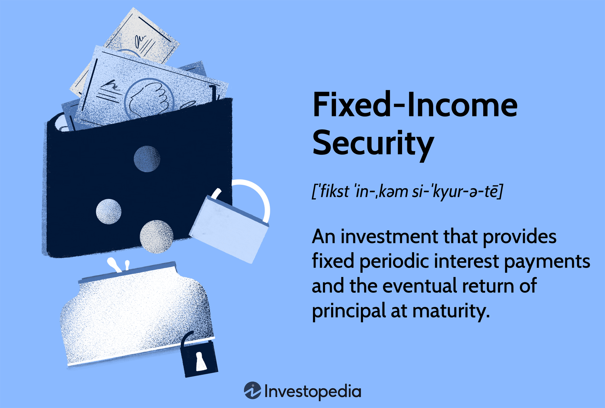

## Table of Contents

## What are secured bonds?

Secured bonds are a type of bond that is backed by specific assets of the issuer. This means if the issuer can't pay back the bond, the bondholders can take the assets that were promised as security. These assets could be buildings, equipment, or other valuable things. Because the bond is backed by something, it is seen as less risky. This makes investors feel more comfortable lending money to the issuer.

Because secured bonds are less risky, they usually have lower interest rates than unsecured bonds. Unsecured bonds don't have specific assets backing them, so they are riskier. Investors want a higher interest rate to take on that extra risk. So, if you're an investor looking for a safer investment, you might choose a secured bond. But if you're willing to take more risk for a chance at a higher return, you might go for an unsecured bond.

## How do secured bonds differ from unsecured bonds?

Secured bonds and unsecured bonds are different in how they are backed. Secured bonds have specific assets from the issuer that back them up. If the issuer can't pay back the bond, the bondholders can take those assets. These assets could be things like buildings or equipment. Because secured bonds have this backup, they are seen as less risky. This makes investors feel safer when they buy them.

On the other hand, unsecured bonds don't have specific assets backing them. This means if the issuer can't pay back the bond, there's no guaranteed way for bondholders to get their money back. Because of this, unsecured bonds are riskier. To make up for this risk, unsecured bonds usually offer higher interest rates. So, investors might choose unsecured bonds if they want a chance at a higher return, even though it's riskier.

In summary, the main difference between secured and unsecured bonds is the presence of collateral. Secured bonds have collateral, making them safer but with lower interest rates. Unsecured bonds don't have collateral, making them riskier but with potentially higher returns.

## What types of assets are typically used as collateral for secured bonds?

When companies issue secured bonds, they often use physical assets as collateral. These can include things like buildings, land, or equipment. For example, a company might use its factories or office buildings as security. If the company can't pay back the bond, the bondholders can take these assets to get their money back. This makes secured bonds less risky because there's something valuable backing them up.

Sometimes, secured bonds can also be backed by financial assets. These could be things like cash, stocks, or other bonds that the company owns. For instance, a company might use its investment portfolio as collateral. This gives bondholders another way to recover their investment if the company fails to make payments. Using financial assets as collateral can be helpful for companies that don't have a lot of physical property but still want to issue secured bonds.

## What are the benefits of investing in secured bonds?

Investing in secured bonds has some good benefits. One big benefit is that they are safer than unsecured bonds. This is because secured bonds have specific assets backing them up. If the company can't pay back the bond, you can take those assets. This makes you feel more secure as an investor because you know there's something valuable behind your investment.

Another benefit is that secured bonds usually have lower interest rates. This might sound like a downside, but it can be good for certain investors. If you're looking for a steady and safe investment, the lower [interest rate](/wiki/interest-rate-trading-strategies) of a secured bond can be attractive. You get a bit less return, but you also take on less risk. This can be a smart choice if you want to keep your money safe while still [earning](/wiki/earning-announcement) some interest.

## What are the risks associated with secured bonds?

Even though secured bonds are safer than unsecured bonds, they still have some risks. One risk is that the value of the assets backing the bond might go down. If the company can't pay back the bond and you have to take the assets, they might not be worth as much as you thought. This means you might not get all your money back. For example, if the bond was backed by a building and the building's value drops a lot, you could lose money.

Another risk is that selling the assets might take a long time. If the company goes bankrupt, it can take a while to sort everything out and sell the assets. During this time, you might not get your money back quickly. This can be a problem if you need your money soon. So, even though secured bonds are backed by assets, there are still some things that can go wrong.

## How do secured bonds fit into a diversified fixed income portfolio?

Secured bonds can be a good part of a diversified fixed income portfolio. They are less risky than unsecured bonds because they have assets backing them up. This makes them a safer choice if you want to keep your money secure while still earning some interest. Adding secured bonds to your portfolio can help balance out riskier investments. For example, if you also have stocks or unsecured bonds, the secured bonds can make your overall portfolio safer.

However, it's important to remember that secured bonds still have some risks. The value of the assets backing the bond might go down, or it might take a long time to sell those assets if the company can't pay back the bond. So, while secured bonds can help lower the risk in your portfolio, they're not completely risk-free. By including a mix of secured bonds, unsecured bonds, and other investments, you can create a portfolio that matches your risk comfort level and financial goals.

## What is the process of issuing secured bonds?

When a company wants to issue secured bonds, they first decide which assets they will use as collateral. These could be things like buildings, land, or equipment. The company works with lawyers and financial experts to make sure the assets are legally set up as security for the bond. They also create a detailed document called a bond indenture that explains all the rules and terms of the bond, including what happens if the company can't pay back the bond.

Once everything is set up, the company starts selling the bonds to investors. They usually do this through a process called underwriting, where investment banks help sell the bonds to the public. The company gets money from selling the bonds, and the investors get the bonds. The investors then receive regular interest payments from the company, and at the end of the bond's term, they get their money back. If the company can't pay back the bond, the investors can take the assets that were promised as collateral.

## How are the values of the collateral assets assessed for secured bonds?

When a company wants to issue secured bonds, they need to figure out how much the assets they're using as collateral are worth. This is important because it helps investors know how safe their investment is. The company usually hires experts like appraisers or valuation firms to do this job. These experts look at things like the market value of the assets, how old they are, and their condition. For example, if the collateral is a building, the appraiser will check its location, size, and any recent sales of similar buildings in the area.

After the experts do their work, they give the company a report on the value of the assets. This report is shared with potential investors so they can see if the collateral is worth enough to back the bond. Sometimes, the value of the assets can change over time, so the company might need to get new appraisals to keep the bondholders informed. This helps everyone feel more secure about the bond because they know the collateral's value is being watched closely.

## What happens if a borrower defaults on a secured bond?

If a borrower defaults on a secured bond, it means they can't pay back the money they owe. When this happens, the bondholders can take the assets that were promised as collateral. These assets could be things like buildings or equipment. The bondholders might sell these assets to get their money back. This is why secured bonds are seen as safer than unsecured bonds. The bondholders have something valuable to fall back on if the borrower can't pay.

However, selling the assets can take time. If the company goes bankrupt, it can be a long process to sort everything out and sell the assets. During this time, bondholders might not get their money back right away. Also, the value of the assets might have gone down since the bond was issued. If the assets are worth less than expected, the bondholders might not get all their money back. So, even though secured bonds are backed by assets, there are still some risks involved.

## Can you provide examples of secured bonds in the market?

One example of secured bonds in the market is mortgage-backed securities. These are bonds that are backed by home loans. When people take out mortgages to buy houses, banks can bundle these loans together and sell them as bonds. If homeowners stop paying their mortgages, the bondholders can take the houses. This makes mortgage-backed securities a type of secured bond because they are backed by real estate.

Another example is asset-backed securities. These are bonds that are backed by other types of assets, like car loans or credit card debt. For instance, a company might bundle a bunch of car loans together and sell them as bonds. If people stop paying their car loans, the bondholders can take the cars. This makes asset-backed securities another type of secured bond because they are backed by specific assets.

These examples show how secured bonds work in real life. They are used by companies and banks to raise money, and they give investors a safer way to invest because they have assets backing them up. However, even though they are safer, there are still some risks involved, like if the value of the assets goes down or if it takes a long time to sell them.

## How do secured bonds perform during economic downturns?

Secured bonds can be a good choice during economic downturns because they are safer than unsecured bonds. They have assets backing them up, like buildings or equipment. If the company can't pay back the bond, investors can take these assets. This makes investors feel more secure because they know there's something valuable behind their investment. During tough economic times, people often look for safer places to put their money, and secured bonds can be a good option.

However, even secured bonds can face problems during economic downturns. If the value of the assets goes down a lot, like if the real estate market crashes, the assets might not be worth enough to cover the bond. Also, if the company goes bankrupt, it can take a long time to sell the assets. This means investors might not get their money back quickly. So, while secured bonds are safer, they still have risks, especially during economic downturns when everything can be more uncertain.

## What advanced strategies can be used when investing in secured bonds?

When investing in secured bonds, one advanced strategy is to look at the quality and type of collateral backing the bond. Different assets can have different risks. For example, real estate might be a good choice if you think the property market will stay strong. But if you think real estate prices might drop, you might want to choose bonds backed by other types of assets, like equipment or financial assets. By understanding the collateral, you can make smarter choices about which secured bonds to buy.

Another strategy is to pay attention to the bond's covenants. Covenants are rules that the company has to follow. They can help protect you as an investor. For example, some covenants might say the company has to keep the collateral in good condition or can't take on too much more debt. By choosing bonds with strong covenants, you can lower your risk. It's also smart to keep an eye on the company's financial health. If the company is doing well, it's more likely to pay back the bond. But if the company is struggling, you might want to be more careful.

Lastly, diversifying your investments can be a good idea. Instead of putting all your money into one secured bond, you can spread it out across different bonds with different types of collateral. This way, if one bond doesn't do well, you still have other bonds to fall back on. Diversification can help you manage risk and keep your investments safer, especially during uncertain times.

## What are the different types of bonds and how can we examine them more closely?

Bonds are fixed-income securities that offer investors varying degrees of risk and return, depending on their type. Each bond category serves distinct investor needs and market conditions, affecting their attractiveness and functionality.

**Government Bonds**

Government bonds are regarded as low-risk investments since they are backed by the creditworthiness and taxing power of national or local governments. These securities are often used to finance public projects and government spending. Due to the perceived safety of government bonds, they usually offer lower yields compared to riskier securities. Examples include U.S. Treasury bonds, British Gilts, and Japanese Government Bonds (JGBs). The formula for calculating the yield on a government bond is straightforward:

$$
\text{Yield} = \frac{\text{Coupon Payment}}{\text{Current Price}}
$$

This characteristic, combined with their relatively stable returns, makes government bonds an essential component in conservative investment portfolios.

**Corporate Bonds**

Corporate bonds are issued by corporations seeking to raise capital for expansion, acquisitions, or other business needs. Unlike government bonds, these securities come with increased credit risk due to the possibility of corporate default. As a result, they typically offer higher yields to compensate investors for bearing this additional risk. Credit ratings provided by agencies like Moody's and Standard & Poor's help investors assess the credit risk associated with corporate bonds. The return on a corporate bond is often higher, reflecting the risk-return tradeoff present in financial markets.

**Municipal Bonds**

Municipal bonds, also known as 'munis,' are issued by states, cities, and other local government entities to fund public projects like schools, highways, and hospitals. A notable advantage of municipal bonds is that, in many cases, the interest income is exempt from federal income taxes and possibly state and local taxes as well. This tax-exempt status can make them particularly attractive to investors in high tax brackets. Like other bonds, municipal bonds [carry](/wiki/carry-trading) some default risk, although this is usually lower compared to corporate bonds.

**Convertible Bonds**

Convertible bonds present a unique hybrid character, as they can be converted into a predetermined number of the issuing company's equity shares. This conversion option provides potential upside exposure to the underlying stock's performance while still offering the fixed income of a bond. The presence of the conversion feature typically results in a lower yield compared to non-convertible corporate bonds, as it compensates investors for the potential capital appreciation from conversion. The decision to convert is often influenced by the stock's market price relative to the bond's conversion price.

Understanding these bond types and their risk-return profiles is crucial for constructing a diversified investment strategy tailored to an investor’s financial goals and risk tolerance. By recognizing the benefits and drawbacks of each bond category, investors can make more informed decisions in navigating the complexities of fixed-income securities.

## References & Further Reading

[1]: ["Fixed Income Securities: Tools for Today's Markets"](https://www.amazon.com/Fixed-Income-Securities-Markets-Finance/dp/1119835550) by Bruce Tuckman and Angel Serrat

[2]: ["Algorithmic Trading: Winning Strategies and Their Rationale"](https://www.amazon.com/Algorithmic-Trading-Winning-Strategies-Rationale-ebook/dp/B00CY5HC0U) by Ernie Chan

[3]: Fabozzi, F. J. (2007). ["Fixed Income Analysis"](https://books.google.com/books/about/Fixed_Income_Analysis.html?id=lujLawVLS3YC). John Wiley & Sons, Inc.

[4]: ["The Fundamentals of Municipal Bonds"](https://www.amazon.com/Fundamentals-Municipal-Bonds-SIFMA/dp/0470903384) by The Bond Market Association

[5]: Treynor, J. L., & Mazuy, K. K. (1966). ["Can Mutual Funds Outguess the Market?"](https://www.semanticscholar.org/paper/Can-mutual-funds-outguess-the-market-Harvard-Review-Treynor-Mazuy/46f77dbcc3c07c1475640aa0a4ef4a957c026d99) Harvard Business Review.

[6]: Chordia, T., Roll, R., & Subrahmanyam, A. (2005). ["Evidence on the speed of convergence to market efficiency."](https://www.anderson.ucla.edu/documents/areas/fac/finance/17-01.pdf) Journal of Financial Economics.

[7]: ["Managing Fixed Income Portfolios"](https://www.cfainstitute.org/insights/professional-learning/refresher-readings/2024/overview-fixed-income-portfolio-management) by Frank J. Fabozzi

[8]: ["The Handbook of Fixed Income Securities"](https://www.amazon.com/Handbook-Fixed-Income-Securities-Eighth/dp/0071768467) by Frank J. Fabozzi

[9]: Hasbrouck, J., & Saar, G. (2013). ["Low-latency trading."](https://www.sciencedirect.com/science/article/abs/pii/S1386418113000165) Review of Financial Studies.