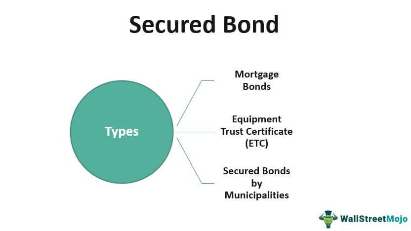

Fixed-income investments are an essential component of financial markets, providing investors with stable returns derived predominantly from interest payments. These investments help balance portfolios by mitigating risk through a predictable income stream. A quintessential example of fixed-income securities is bonds, which are typically perceived as safer investment avenues compared to equities due to their structured payment schedules and defined maturities.

Bonds, as a subset of fixed-income instruments, function as debt securities issued by entities such as governments, municipalities, or corporations to raise capital. In return, investors receive periodic interest payments until the bond's maturity date, when the principal amount is repaid. This structure offers a degree of security and predictability, which appeals to risk-averse investors seeking a steady income.

The advent of algorithmic trading has significantly altered the landscape of trading bonds and other fixed-income securities, offering unprecedented speed and efficiency. Algorithmic trading employs computer programs to automatically execute trades based on predefined criteria, drastically reducing the time required for decision-making and execution. This technological advancement has not only increased the liquidity of bond markets but also enhanced market efficiency by narrowing bid-ask spreads and cutting transaction costs.

This article provides a comprehensive examination of secured bonds within the fixed-income sphere, sheds light on various types of bonds, and assesses the transformative impact of algorithmic trading. By understanding these critical aspects of fixed-income investments, investors can make informed decisions that leverage both traditional and modern elements of the financial markets.

## Table of Contents

## Understanding Secured Bonds in Fixed Income

Secured bonds represent a critical category within the fixed-income investment spectrum. These instruments are secured by an asset or a pool of assets pledged as collateral. This mechanism effectively reduces the risk for investors, as the collateral can be liquidated to repay the bondholders in the event of issuer default.

Types of secured bonds include collateral trust bonds, mortgage bonds, and equipment trust certificates. Collateral trust bonds are secured by a portfolio of securities held in trust, typically comprising stocks or other bonds. Mortgage bonds are backed by real estate assets. Equipment trust certificates are secured by equipment or physical assets, commonly used by transportation companies for financing vehicles and machinery.

Municipalities and corporations frequently issue secured bonds to raise capital for various projects and operational needs. For municipalities, these bonds can fund infrastructure projects, schools, and public utilities, while corporations may use them for expansion or asset acquisition.

Though secured bonds offer enhanced security through collateralization, they are not entirely risk-free. The primary risks include the potential decrease in the value of the collateral over time and [liquidity](/wiki/liquidity-risk-premium) risk, where the assets may not be easily convertible to cash. Additionally, market risks, such as changes in interest rates, can affect the market value and yield of these bonds.

Investors considering secured bonds should perform due diligence on the asset's valuation and the issuer's creditworthiness, ensuring that the collateral's value exceeds the bond's face value to mitigate potential losses. Understanding these dynamics is crucial for effectively integrating secured bonds into a diversified investment portfolio.

## Exploring Bond Types: A Closer Look

Bonds are fixed-income securities that offer investors varying degrees of risk and return, depending on their type. Each bond category serves distinct investor needs and market conditions, affecting their attractiveness and functionality.

**Government Bonds**

Government bonds are regarded as low-risk investments since they are backed by the creditworthiness and taxing power of national or local governments. These securities are often used to finance public projects and government spending. Due to the perceived safety of government bonds, they usually offer lower yields compared to riskier securities. Examples include U.S. Treasury bonds, British Gilts, and Japanese Government Bonds (JGBs). The formula for calculating the yield on a government bond is straightforward:

$$
\text{Yield} = \frac{\text{Coupon Payment}}{\text{Current Price}}
$$

This characteristic, combined with their relatively stable returns, makes government bonds an essential component in conservative investment portfolios.

**Corporate Bonds**

Corporate bonds are issued by corporations seeking to raise capital for expansion, acquisitions, or other business needs. Unlike government bonds, these securities come with increased credit risk due to the possibility of corporate default. As a result, they typically offer higher yields to compensate investors for bearing this additional risk. Credit ratings provided by agencies like Moody's and Standard & Poor's help investors assess the credit risk associated with corporate bonds. The return on a corporate bond is often higher, reflecting the risk-return tradeoff present in financial markets.

**Municipal Bonds**

Municipal bonds, also known as 'munis,' are issued by states, cities, and other local government entities to fund public projects like schools, highways, and hospitals. A notable advantage of municipal bonds is that, in many cases, the interest income is exempt from federal income taxes and possibly state and local taxes as well. This tax-exempt status can make them particularly attractive to investors in high tax brackets. Like other bonds, municipal bonds [carry](/wiki/carry-trading) some default risk, although this is usually lower compared to corporate bonds.

**Convertible Bonds**

Convertible bonds present a unique hybrid character, as they can be converted into a predetermined number of the issuing company's equity shares. This conversion option provides potential upside exposure to the underlying stock's performance while still offering the fixed income of a bond. The presence of the conversion feature typically results in a lower yield compared to non-convertible corporate bonds, as it compensates investors for the potential capital appreciation from conversion. The decision to convert is often influenced by the stock's market price relative to the bond's conversion price.

Understanding these bond types and their risk-return profiles is crucial for constructing a diversified investment strategy tailored to an investor’s financial goals and risk tolerance. By recognizing the benefits and drawbacks of each bond category, investors can make more informed decisions in navigating the complexities of fixed-income securities.

## The Rise of Algorithmic Trading in Fixed-Income Markets

Algorithmic trading has profoundly transformed fixed-income markets, bypassing the physical and cognitive limitations of human traders. By leveraging computer programs, trades are executed at lightning speed, enabling swift responses to market shifts. This technology analyzes vast datasets to identify patterns, executing trades based on pre-established criteria, thereby enhancing decision-making processes.

One of the core components of [algorithmic trading](/wiki/algorithmic-trading) is its ability to process large volumes of information. Algorithms examine historical data and real-time feeds to generate insights in milliseconds. For instance, they might scan news reports, interest rates, or credit ratings to adjust trading strategies promptly. The algorithms' capacity to crunch large datasets allows for more informed and timely decisions, optimizing returns and mitigating risks.

Algorithmic trading has notably enhanced market efficiency. Through automated systems, trades are executed with precision and minimal delay, which reduces the bid-ask spread and increases liquidity. Enhanced liquidity not only improves the price discovery process but also attracts more participants to the market, fostering a more robust trading environment.

Furthermore, algorithmic trading has contributed to the reduction of trading costs. Traditional trading methods involved higher brokerage fees due to slower transaction speeds and manual processes. In contrast, algorithms streamline operations by minimizing human intervention and errors. The reduced transaction costs benefit both large institutional investors and smaller retail investors, making fixed-income markets more accessible.

Despite its advantages, algorithmic trading also presents challenges and risks. High-frequency trading, a subset of algorithmic trading, has been criticized for potential market manipulation and the creation of flash crashes. Therefore, regulatory frameworks must continuously adapt to address these concerns, ensuring fair and stable markets.

In summary, algorithmic trading has revolutionized fixed-income markets by providing speed, efficiency, and cost-effectiveness. Its ability to analyze and act upon data in real-time has modernized trading practices, making markets more efficient and accessible. However, maintaining market integrity requires ongoing oversight and regulation.

## Advantages and Risks of Fixed-Income Securities

Fixed-income securities, such as bonds, are popular investment vehicles known for offering predictable income through regular interest payments. These securities are generally considered less volatile than stocks, making them appealing to risk-averse investors who prioritize stable returns over potentially higher, yet unpredictable, equity gains.

One of the core advantages of fixed-income securities is their ability to provide reliable cash flow. Investors receive interest payments, usually on a semi-annual basis, until the bond matures. At maturity, the principal amount is returned, assuming no default occurs. This predictability allows investors to plan their financial future with greater certainty. Fixed-income securities typically exhibit lower sensitivity to market fluctuations compared to stocks, which can experience significant price swings.

However, investing in fixed-income securities is not without risks. Key risks include [interest rate](/wiki/interest-rate-trading-strategies) risk, inflation risk, and credit risk. 

1. **Interest Rate Risk**: The value of fixed-income securities is inversely related to interest rates. When interest rates rise, the price of existing bonds falls, and vice versa. This occurs because newer issues offer higher coupon rates, making older bonds with lower rates less attractive. The duration of a bond, which measures its sensitivity to interest rate changes, can help investors estimate potential price fluctuations. 

2. **Inflation Risk**: Inflation erodes the purchasing power of future cash flows. If inflation rates exceed the interest income generated by a bond, the real return on investment declines. Inflation-linked bonds, like Treasury Inflation-Protected Securities (TIPS), can mitigate this risk as their principal adjusts according to inflation rates.

3. **Credit Risk**: The possibility that the bond issuer may default on its obligations poses a significant threat to fixed-income investors. Credit ratings, assigned by agencies like Moody's and Standard & Poor's, assess the creditworthiness of issuers and can influence a bond's interest rate. Higher-rated bonds typically offer lower yields due to reduced default risk, while lower-rated, or "junk," bonds carry higher yields to compensate for the elevated risk.

Investors should carefully evaluate these risks to manage and mitigate potential negative impacts. Diversification, choosing bonds with varying maturities and credit qualities, can help reduce the concentration of risk. Additionally, staying informed about economic trends and interest rate forecasts assists investors in making informed decisions about their fixed-income portfolios. Understanding the trade-off between risk and return in fixed-income investments is crucial for achieving long-term financial objectives while navigating the complexities of the market.

## The Future of Fixed-Income Investments

Advancements in technology, particularly [artificial intelligence](/wiki/ai-artificial-intelligence) (AI) and [machine learning](/wiki/machine-learning) (ML), are significantly influencing the future of fixed-income investments. AI-driven algorithms are transforming trade execution by enhancing the speed and accuracy at which trades are conducted. These algorithms can process vast amounts of market data in real-time, enabling them to identify trading opportunities and execute orders faster than human traders.

One notable application of AI in fixed-income markets is the optimization of trade execution. Algorithms can minimize the impact of market fluctuations by executing trades in smaller increments or at optimal times, thereby improving the overall execution quality. Moreover, machine learning models can analyze historical trading data to predict future price movements, allowing for better-informed trading decisions. For instance, an algorithm might use a time series analysis to forecast changes in bond yields, helping traders adjust their strategies accordingly.

Risk management in fixed-income portfolios also benefits from AI technologies. Machine learning algorithms can assess risk factors by evaluating correlations between various financial instruments and identifying potential vulnerabilities in a portfolio. This enables investors to hedge against risks more effectively. For example, the application of predictive analytics can forecast interest rate changes or credit rating downgrades, allowing investors to adjust their fixed-income holdings preemptively.

The integration of AI and machine learning in fixed-income investments offers opportunities for improved portfolio performance. By automating processes and providing deeper insights, these technologies allow investors to optimize their asset allocations and enhance their returns. AI can also facilitate diversification by identifying underweighted sectors or new investment opportunities based on data-driven insights.

Overall, the ongoing technological advancements in AI and machine learning are poised to further reshape the fixed-income market. These innovations are not only enhancing operational efficiency and reducing costs but also providing investors with tools to achieve better risk-adjusted returns. As technology continues to evolve, its integration into fixed-income investments will likely lead to more sophisticated investment strategies and improved outcomes for investors.

## Conclusion

Fixed-income securities, notably bonds, continue to serve as a crucial component of diversified investment portfolios by providing stability and predictable income. Their role in financial strategies underscores the importance of understanding the different types of bonds available and the implications of using algorithmic trading in their management. 

Each bond type, from government to corporate, offers distinct risk-return profiles, necessitating a comprehensive grasp of their individual characteristics. For instance, government bonds typically present lower risks due to government backing, while corporate bonds, though offering higher returns, require careful consideration of credit risk. Additionally, municipal bonds come with tax incentives, adding a layer of complexity to their evaluation.

The rise of algorithmic trading has dramatically transformed the fixed-income market, enhancing efficiency and lowering transaction costs through the use of sophisticated algorithms. These algorithms utilize advanced data analysis techniques to make rapid trade decisions, a process which previously required significant manual input. As technology continues to evolve, incorporating elements such as artificial intelligence and machine learning, these systems promise to further refine trade execution and risk management practices.

Investors must remain vigilant to adapt successfully to these technological advancements. Embracing these changes allows for improved portfolio performance and effective navigation of the modern financial landscape. Continual learning and adaptation to new technologies will equip investors to manage risks better and leverage opportunities presented by the fixed-income securities market.

## FAQs

### What are the primary differences between equity and fixed-income instruments?

Equity and fixed-income instruments are two major categories of financial securities with distinct characteristics. Equity instruments, typically represented by stocks, give investors ownership in a company and a share in its profits through dividends. Consequently, the value of equity is tied to the company's performance and broader market conditions, leading to higher [volatility](/wiki/volatility-trading-strategies). Conversely, fixed-income instruments, such as bonds, provide a predetermined return in the form of interest payments over a specified period. They are generally considered less risky because they offer regular income and return the principal amount at maturity. However, the trade-off is that the potential for higher returns is limited compared to equity investments.

### How do credit ratings affect bond investments?

Credit ratings assess the creditworthiness of a bond issuer, indicating their ability to meet financial commitments. Agencies like Moody's, Standard & Poor's, and Fitch Ratings assign ratings ranging from AAA (highest) to D (default). These ratings influence the interest rates on bonds; higher-rated bonds (investment grade) typically offer lower yields due to their perceived safety, while lower-rated bonds (junk bonds) provide higher yields to compensate for increased risk. Investors should consider credit ratings as a key [factor](/wiki/factor-investing) in evaluating the risk-return profile of bond investments.

### What is the role of algorithmic trading in the bond market?

Algorithmic trading involves the use of computer algorithms to automate and optimize trade execution in financial markets, including bonds. This technology analyzes large datasets, identifies patterns, and executes trades at speeds beyond human capability. In the bond market, algorithmic trading enhances liquidity, improves market efficiency, and reduces transaction costs. For instance, algorithms can quickly adjust to changing market conditions, facilitating better price discovery and risk management. Although algorithmic trading has benefited the bond market, it also requires constant monitoring and refinement to manage potential risks like systemic instability.

### How can investors mitigate risks associated with fixed-income securities?

Investors can mitigate risks in fixed-income securities by employing several strategies. Firstly, diversifying their bond portfolio across issuers, maturities, and sectors reduces exposure to any single issuer's default risk. Secondly, regularly reviewing and adjusting the portfolio in response to interest rate changes helps manage interest rate risk. Utilizing inflation-protected securities, such as Treasury Inflation-Protected Securities (TIPS), can guard against inflation risk. Lastly, investors should consider bonds aligned with their risk tolerance, using credit ratings as a guide to balance between yield and safety.

## References & Further Reading

[1]: ["Fixed Income Securities: Tools for Today's Markets"](https://www.amazon.com/Fixed-Income-Securities-Markets-Finance/dp/1119835550) by Bruce Tuckman and Angel Serrat

[2]: ["Algorithmic Trading: Winning Strategies and Their Rationale"](https://www.amazon.com/Algorithmic-Trading-Winning-Strategies-Rationale-ebook/dp/B00CY5HC0U) by Ernie Chan

[3]: Fabozzi, F. J. (2007). ["Fixed Income Analysis"](https://books.google.com/books/about/Fixed_Income_Analysis.html?id=lujLawVLS3YC). John Wiley & Sons, Inc.

[4]: ["The Fundamentals of Municipal Bonds"](https://www.amazon.com/Fundamentals-Municipal-Bonds-SIFMA/dp/0470903384) by The Bond Market Association

[5]: Treynor, J. L., & Mazuy, K. K. (1966). ["Can Mutual Funds Outguess the Market?"](https://www.semanticscholar.org/paper/Can-mutual-funds-outguess-the-market-Harvard-Review-Treynor-Mazuy/46f77dbcc3c07c1475640aa0a4ef4a957c026d99) Harvard Business Review.

[6]: Chordia, T., Roll, R., & Subrahmanyam, A. (2005). ["Evidence on the speed of convergence to market efficiency."](https://www.anderson.ucla.edu/documents/areas/fac/finance/17-01.pdf) Journal of Financial Economics.

[7]: ["Managing Fixed Income Portfolios"](https://www.cfainstitute.org/insights/professional-learning/refresher-readings/2024/overview-fixed-income-portfolio-management) by Frank J. Fabozzi

[8]: ["The Handbook of Fixed Income Securities"](https://www.amazon.com/Handbook-Fixed-Income-Securities-Eighth/dp/0071768467) by Frank J. Fabozzi

[9]: Hasbrouck, J., & Saar, G. (2013). ["Low-latency trading."](https://www.sciencedirect.com/science/article/abs/pii/S1386418113000165) Review of Financial Studies.