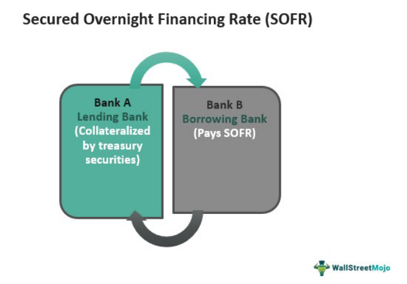

The Secured Overnight Financing Rate (SOFR) has emerged as a pivotal benchmark in modern finance, particularly for derivatives and loans denominated in U.S. dollars. Officially replacing the London Interbank Offered Rate (LIBOR) in June 2023, SOFR aims to provide a more reliable and less manipulable standard for a wide array of financial transactions. The necessity for this transition stemmed from LIBOR's susceptibility to manipulation and its dependence on estimates rather than actual transactions, leading to calls for a more transparent and stable benchmark.

SOFR is derived from the U.S. Treasury repurchase market, where it reflects the cost of borrowing cash overnight collateralized by Treasury securities. This feature ensures that SOFR is deeply rooted in real, observable market transactions, thus minimizing the potential for manipulation that plagued LIBOR. Such a characteristic establishes SOFR as a robust indicator of borrowing costs, laying the foundation for more secure financial markets.



This article investigates the impact of SOFR on loan interest rates, focusing particularly on variable-rate loans such as adjustable-rate mortgages and certain types of student loans. Loans indexed to SOFR can better mirror the actual cost of borrowing due to SOFR’s transparent calculation methodology. The transition presents implications for borrowers, who may encounter different interest rate adjustments compared to those based on LIBOR.

Additionally, algorithmic trading plays a critical role in managing interest-rate risks associated with SOFR. Trading algorithms, adept at responding to market fluctuations, enable traders to optimize investment strategies and operations efficiently. Integrating SOFR into these algorithms is crucial for those aiming to exploit trends and mitigate risks in the dynamic financial landscape.

Finally, this article will explore the broad implications for future financial markets. With SOFR's adoption, the financial community anticipates more resilient and transparent structures, potentially leading to increased automation and integration of SOFR in financial products and services. The global transition continues with alternative rates like SONIA (Sterling Overnight Index Average) and EONIA (Euro Overnight Index Average), indicating a worldwide shift towards stable, localized benchmarks.

By exploring these facets, this article connects SOFR's introduction to its broader effects on financing rates, algorithmic trading, and the future of financial markets, providing insights for investors, borrowers, and professionals seeking clarity amid these significant changes.

## Table of Contents

## Understanding the Secured Overnight Financing Rate (SOFR)

The Secured Overnight Financing Rate (SOFR) is a critical benchmark in contemporary finance, supplanting the London Interbank Offered Rate (LIBOR) due to its enhanced reliability and transparency. SOFR is derived from the U.S. Treasury repurchase (repo) market transactions, ensuring a benchmark grounded in actual market activity. Repo transactions involve the sale and subsequent repurchase of Treasury securities, typically conducted overnight, and are a fundamental component of the short-term funding market.

SOFR's basis in tangible transactions contrasts starkly with LIBOR, which relied on estimated rates submitted by banks. This difference substantially minimizes the potential for rate manipulation, a significant issue that plagued LIBOR and led to its eventual discontinuation. The daily [volume](/wiki/volume-trading-strategy) of transactions underpinning SOFR further ensures its robustness, with amounts often exceeding $1 trillion, providing a comprehensive reflection of the overnight funding market.

The shift from LIBOR to SOFR signifies a substantial global movement towards adopting more secure financial benchmarks that are less susceptible to manipulation. This paradigm shift aims to cultivate trust in financial systems and enhance market integrity. Among SOFR's notable advantages is its reliance on overnight loans secured by U.S. Treasury securities, lending SOFR additional stability and making it a reliable gauge of borrowing costs. It accurately reflects the costs banks incur to obtain short-term funding, providing a foundation for setting interest rates for various financial products. 

Financial practitioners and analysts work to integrate SOFR into pricing models and financial forecasting, acknowledging its capacity to convey instantaneous funding costs without the distortions previously associated with estimated rate submissions. The groundwork SOFR establishes in real transactions fosters confidence and precision in financial markets, supporting the construction of a fortified and transparent economic environment.

## Impact of SOFR on Loan Interest Rates

The Secured Overnight Financing Rate (SOFR) significantly affects loan interest rates, especially for financial products with variable rates, such as adjustable-rate mortgages and certain student loans. Unlike its predecessor, the London Interbank Offered Rate (LIBOR), SOFR provides a more accurate reflection of borrowing costs by utilizing a transparent and transaction-based methodology. This fundamental shift in benchmark rates impacts borrowers and lenders, necessitating adjustments in [interest rate](/wiki/interest-rate-trading-strategies) calculations to align with SOFR’s daily updates.

SOFR’s influence on loan interest rates can be understood by considering its calculation approach. SOFR is derived from the cost of overnight borrowing collateralized by U.S. Treasury securities, offering a market-driven and data-backed figure. This contrasts with LIBOR, which, being based on bank estimates, was susceptible to manipulation and misrepresentation of true market conditions. Consequently, financial products indexed to SOFR are expected to mirror the prevailing interest rate environment more accurately, as they capture real-time changes in market conditions.

For borrowers, the shift from LIBOR to SOFR can lead to different interest rate adjustments. For example, a variable-rate loan indexed to SOFR might show increased sensitivity to market fluctuations, as the SOFR rate is subject to daily updates based on actual transaction data. This means that the interest rates on loans could vary more frequently, affecting monthly payments and potentially altering long-term borrowing costs.

Consider a simplified example where a loan’s interest rate is defined as the sum of a benchmark rate and a fixed margin. Under the LIBOR framework, borrowers might experience lagged adjustments, while under SOFR, changes could occur daily. If the benchmark rate is $R_t$ and the margin is $M$, the interest rate $I_t$ at time $t$ can be represented as:

$$
I_t = R_t + M
$$

Where SOFR, representing $R_t$, reflects immediate changes in borrowing costs, leading to a more volatile $I_t$ compared to a LIBOR-based approach.

Financial institutions must therefore recalibrate their systems to incorporate SOFR’s variability, ensuring that loan agreements and interest rate models accurately reflect this new benchmark. Similarly, borrowers should understand potential fluctuations in their loan payments, aligning budgeting strategies with SOFR’s inherent transparency and responsiveness to market conditions.

As the financial sector adapts to SOFR, understanding its impact on loan interest rates remains crucial. Enhanced transparency and reduced opportunities for rate manipulation promise a more reliable framework for determining the cost of borrowing, thereby influencing both borrowing strategies and lending practices.

## Algorithmic Trading and SOFR

Algorithmic trading plays a pivotal role in the contemporary financial landscape, particularly in the context of interest-rate benchmarks like the Secured Overnight Financing Rate (SOFR). As SOFR becomes increasingly integral to various financial products, [algorithmic trading](/wiki/algorithmic-trading) offers sophisticated tools to manage associated interest-rate risks effectively.

Trading algorithms have the inherent advantage of processing large volumes of data at high speeds, allowing them to respond swiftly to fluctuations in SOFR. This capability is crucial for optimizing investment strategies, as it enables traders to adjust their positions in accordance with real-time changes. For instance, an algorithm might be programmed to sell or buy Treasury securities based on specific triggers related to SOFR movements, thus ensuring that trades are executed at the most advantageous moments.

To illustrate, consider a basic algorithm that monitors SOFR changes and adjusts the portfolio's duration risk. The algorithm might include conditions such as:

```python
def adjust_portfolio_based_on_SOFR(sofr_current, sofr_threshold, current_holdings):
    if sofr_current > sofr_threshold:
        # Reduce exposure to interest rate risk
        sell_treasury_securities(current_holdings)
    elif sofr_current < sofr_threshold:
        # Increase exposure based on favorable rates
        buy_treasury_securities(current_holdings)
```

This simple example underscores the importance of real-time data monitoring and triggers that can lead to automated decision-making. For traders, seamlessly integrating SOFR into trading algorithms is vital for capitalizing on market trends and fluctuations. Successful implementation requires a thorough understanding of SOFR's behavior, historical data patterns, and market sentiment analysis.

Furthermore, algorithmic trading strategies centered around SOFR must consider [liquidity](/wiki/liquidity-risk-premium) provision and execution quality to avoid slippage and other trading inefficiencies. Consequently, robust algorithms must incorporate predictive analytics and [machine learning](/wiki/machine-learning) models to foresee SOFR trends and price movements, thereby enhancing their decision-making process.

In summary, the marriage of SOFR with algorithmic trading not only aids in managing interest-rate risks but also presents opportunities to refine trading strategies. Mastery of these technologies empowers traders and institutions, allowing them to capitalize on SOFR's integration into global financial products.

## Transition Challenges from LIBOR to SOFR

The transition from the London Interbank Offered Rate (LIBOR) to the Secured Overnight Financing Rate (SOFR) presents several challenges, particularly in revising existing contracts and updating financial instruments. LIBOR was deeply embedded in the financial system, underpinning a multitude of financial products ranging from derivatives to home mortgages. Consequently, shifting to SOFR involves a comprehensive overhaul of financial contracts to adapt to the new benchmark.

One major complexity in this transition is the renegotiation of existing contracts that previously referenced LIBOR. These contracts often lack clear fallback provisions, which define the alternative reference rate to be used if LIBOR becomes unavailable. As a result, financial institutions need to engage with clients and counterparties to amend terms and ensure a seamless transition to SOFR. For many instruments, this requires developing new contract terms that adequately reflect SOFR's characteristics, which can differ significantly from those of LIBOR.

Financial institutions must carefully manage this transition to prevent disruptions in their operations. Since SOFR is inherently different from LIBOR—being a transaction-based rate derived from the overnight repurchase agreement market, rather than a forward-looking rate—financial products incorporating SOFR may experience altered risk and return profiles. Institutions must recalibrate their risk management frameworks and upgrade their financial models to accommodate SOFR's specific features. This includes adapting to SOFR's [volatility](/wiki/volatility-trading-strategies) characteristics and understanding its implications for hedging strategies.

Adopting SOFR necessitates embracing new market dynamics, as it reflects secured borrowing costs backed by U.S. Treasury securities. The transition entails a shift from an unsecured loan market to one grounded in secured transactions, altering the risk landscape for borrowers and lenders alike. Market participants must understand these nuances to effectively incorporate SOFR into pricing, risk management, and valuation processes.

The transition from LIBOR to SOFR is a pivotal moment in financial markets—a move towards more robust and transparent benchmarks. It requires a concerted effort by financial institutions to manage contract amendments, operational adjustments, and strategic transformations. Carefully navigating these complexities is crucial to ensuring a smooth transition, minimizing market disruptions, and maintaining ongoing operational efficiency.

## Future of Financial Markets with SOFR

SOFR's adoption represents a significant milestone in the evolution of financial markets, emphasizing enhanced transparency and stability. As a benchmark grounded in actual overnight transactions in the U.S. Treasury repurchase market, SOFR provides a clear view of borrowing costs and fosters trust among financial professionals. This transformation is expected to lead to several future trends, notably in the automation and integration of SOFR within various financial products and services.

Automation in financial markets is likely to increase as institutions develop and refine algorithms that are contingent upon SOFR data. This trend facilitates the real-time adjustment of interest rates and risk assessments, providing more accurate pricing and efficient allocation of resources. Organizations deploying advanced algorithmic solutions will be able to harness fluctuations in SOFR, thus optimizing their investment strategies.

Moreover, the integration of SOFR into financial products will become more prevalent as entities transition away from legacy benchmarks like LIBOR. This seamless integration is crucial for the development of new financial instruments that align closely with the interests of market participants. Financial products such as adjustable-rate mortgages, corporate loans, and derivatives will increasingly rely on SOFR, leading to a more robust framework for assessing interest rate exposures.

The global landscape of financial benchmarks is also evolving, with the ongoing development of alternative rates such as the Sterling Overnight Index Average (SONIA) in the UK and the Euro Overnight Index Average (EONIA) in the Eurozone. These localized benchmarks reflect a broader, worldwide trend towards creating stable, region-specific indicators that cater to distinct market needs. Such diversification benefits the global financial system by offering tailored mechanisms that are less susceptible to systemic risks and manipulations.

As financial markets look to the future, the emphasis on transparency, accuracy, and resilience underscores the importance of adopting SOFR and similar benchmarks. Institutions that actively engage with these developments will position themselves advantageously, capitalizing on the opportunities presented by these new financial paradigms. The continued evolution of financial benchmarks will undoubtedly shape the markets, making them more reliable and efficient for all participants.

## Conclusion

The Secured Overnight Financing Rate (SOFR) has fundamentally transformed the landscape of financial benchmarks and interest rates. It provides a more secure and transparent alternative to the previously used London Interbank Offered Rate (LIBOR). Its adoption is informed by real transactions in the U.S. Treasury repurchase market, which makes it a robust indicator of actual borrowing costs. Consequently, understanding SOFR's implications on financing rates and trading is critical for gaining a competitive edge in today's markets.

SOFR's transparency ensures that interest rates on variable-rate loans and financial products indexed to it more accurately reflect true market conditions. This clarity can lead to substantial advantages for investors and borrowers alike, reducing the uncertainties previously associated with LIBOR-based benchmarks. As the financial world continues to adapt, it is crucial for market participants to engage in ongoing education and develop strategies that accommodate this benchmark's unique characteristics. The adjustment period presents both challenges and opportunities, necessitating a strategic approach to leverage SOFR for optimized outcomes.

For investors and financial professionals, staying informed of SOFR's continual developments and impacts is essential. With the transition from LIBOR to SOFR, the financial landscape is becoming increasingly reliant on accuracy and stability, fostering a more resilient global financial system. Regular updates on SOFR's trajectory and its integration into various financial products will help stakeholders make informed decisions and maintain competitiveness. Embracing SOFR not only signifies a shift towards more stable financial markets but also highlights the importance of adapting to evolving benchmarks for future success.

## References & Further Reading

[1]: [Federal Reserve Bank of New York. Secured Overnight Financing Rate Data.](https://www.newyorkfed.org/markets/reference-rates/sofr) 

[2]: Duffie, D., & Stein, J. C. (2015). "Reforming LIBOR and Other Financial-Market Benchmarks." *Journal of Economic Perspectives,* 29(2), 191-212. 

[3]: ["Alternative Reference Rates Committee (ARRC) Publications."](https://www.newyorkfed.org/arrc/publications) 

[4]: Gyntelberg, J., & Wooldridge, P. (2008). "Interbank rate fixings during the recent turmoil." *BIS Quarterly Review.*

[5]: ["Interest Rate Risk Management and the Transition from LIBOR to Risk-Free Rates"](https://www.nortonrosefulbright.com/en/knowledge/publications/5949ea18/libor-and-risk-free-rates-frequently-asked-questions) by Deloitte

[6]: ["ISDA LIBOR & Benchmark Reform."](https://www.isda.org/2022/05/16/benchmark-reform-and-transition-from-libor/) 

[7]: ["The SOFR Academy."](https://sofracademy.com/) 

[8]: Patton, A. J. (2009). "Are 'market neutral' hedge funds really market neutral?" *Review of Financial Studies,* 22(7), 2495-2530. 

[9]: Miyajima, K., & Shim, I. (2014). "Asset managers in emerging market economies." *BIS Quarterly Review.*