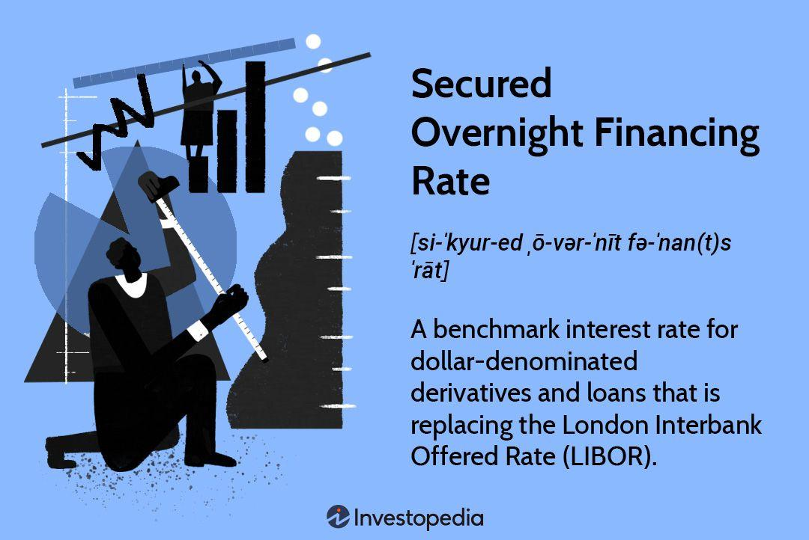

## Table of Contents

## What is the Secured Overnight Financing Rate (SOFR)?

The Secured Overnight Financing Rate (SOFR) is a benchmark interest rate that shows how much it costs to borrow money overnight using U.S. Treasury securities as collateral. It's used by banks and other financial institutions to set rates for various financial products like loans and derivatives. SOFR was introduced to replace the London Interbank Offered Rate (LIBOR), which was found to be unreliable due to manipulation by banks.

SOFR is calculated by taking the cost of overnight loans backed by Treasury securities in the repurchase agreement (repo) market. This market is very large and active, making SOFR a reliable and transparent rate. Because it's based on actual transactions, it's considered a more accurate reflection of the true cost of borrowing than LIBOR was.

## How is SOFR calculated?

SOFR is calculated by looking at the cost of borrowing money overnight using U.S. Treasury securities as collateral. This happens in a market called the repurchase agreement (repo) market. Every day, banks and other financial institutions lend and borrow money from each other, using these securities as a guarantee. The New York Federal Reserve collects all this data and figures out the average interest rate that was paid for these overnight loans.

To get the SOFR, the New York Fed takes the total interest paid on these loans and divides it by the total amount of money borrowed. This gives them the [volume](/wiki/volume-trading-strategy)-weighted median rate, which is the SOFR. This method makes sure that SOFR reflects what's really happening in the market, based on actual transactions rather than just estimates or guesses.

## Why was SOFR developed?

SOFR was developed because the old benchmark rate, called LIBOR, was found to be unreliable. Banks were able to manipulate LIBOR, which made it not a good measure of the real cost of borrowing money. This caused a lot of problems in the financial world, so people needed a new and better rate.

The new rate, SOFR, is based on actual transactions in the repo market, where banks borrow and lend money overnight using U.S. Treasury securities as collateral. Because SOFR uses real data from a big and active market, it's a more honest and clear way to see what it costs to borrow money. This makes it a much better choice than LIBOR for setting rates on loans and other financial products.

## What is the difference between SOFR and LIBOR?

SOFR and LIBOR are both benchmark interest rates, but they work in different ways. SOFR is the Secured Overnight Financing Rate, and it's based on the cost of borrowing money overnight using U.S. Treasury securities as collateral. This happens in the repo market, where real transactions take place every day. Because SOFR uses actual data from these transactions, it's seen as a more accurate and reliable measure of borrowing costs.

On the other hand, LIBOR, which stands for London Interbank Offered Rate, was based on estimates from banks about what they thought they would have to pay to borrow money from each other. This made LIBOR easier to manipulate, and there were big problems when banks were found to be changing these estimates on purpose. Because of this, people started looking for a better rate, and that's why SOFR was created.

The key difference is that SOFR is based on real transactions and is considered more secure and transparent, while LIBOR relied on banks' guesses and turned out to be less trustworthy. This is why SOFR is now used more often to set rates for loans and other financial products, replacing LIBOR which is being phased out.

## Who publishes SOFR and how often is it updated?

The New York Federal Reserve publishes SOFR. They collect data every day from the repo market where banks borrow and lend money overnight using U.S. Treasury securities as collateral. After gathering all the data, the New York Fed calculates the average interest rate paid for these loans, which becomes the SOFR.

SOFR is updated every business day. This means you can see a new SOFR number almost every day, except on weekends and holidays. Because it's updated so often, SOFR gives a very current picture of what it costs to borrow money overnight.

## How does SOFR impact financial markets?

SOFR has a big impact on financial markets because it's used to set interest rates for many different kinds of loans and financial products. When SOFR goes up, it usually means that borrowing money costs more, so the rates on loans like mortgages, car loans, and business loans might go up too. On the other hand, if SOFR goes down, borrowing money becomes cheaper, and loan rates might go down. This can affect how much people and businesses want to borrow and spend, which in turn can influence the whole economy.

SOFR also helps make financial markets more stable and fair. Because it's based on real transactions in a big market, it's harder for anyone to cheat or manipulate it like they did with LIBOR. This makes people trust the rates they see, and that trust is important for a healthy financial system. When everyone can rely on the numbers, it's easier for banks and businesses to plan and make good decisions, which helps keep the economy running smoothly.

## What types of financial products use SOFR as a reference rate?

SOFR is used as a reference rate for many different types of financial products. It's commonly used for setting interest rates on loans like mortgages, car loans, and business loans. When banks and other lenders set these rates, they often look at SOFR to decide how much interest to charge. This helps make sure the rates are fair and based on what's really happening in the market.

SOFR is also used for other financial products like derivatives, which are agreements between two parties to buy or sell something in the future. These can include interest rate swaps, where two parties exchange one type of interest payment for another, often using SOFR as the base rate. Because SOFR is seen as a reliable and honest rate, it helps make these financial deals more trustworthy and easier to manage.

Overall, SOFR plays a big role in many parts of the financial world. By using SOFR, banks and other financial institutions can set rates that reflect real market conditions, which helps keep the financial system stable and fair for everyone involved.

## Can you explain the transition from LIBOR to SOFR?

The transition from LIBOR to SOFR happened because people found out that banks were cheating with LIBOR. LIBOR was a guess about what banks thought they would have to pay to borrow money from each other. But some banks were making up these guesses to make more money, which caused big problems. So, everyone started looking for a better way to figure out borrowing costs, and that's how SOFR came about. SOFR uses real data from the repo market, where banks borrow and lend money overnight using U.S. Treasury securities as collateral. This makes SOFR a more honest and clear way to see what it costs to borrow money.

The move to SOFR has been a big change for banks and other financial institutions. They had to update their systems and contracts to use SOFR instead of LIBOR. This transition has been happening over several years, with a lot of planning and work to make sure everything goes smoothly. Now, SOFR is used to set rates for many loans and financial products like mortgages, car loans, and derivatives. This helps keep the financial system more stable and fair because SOFR is based on real transactions and can't be easily cheated.

## What are the advantages of using SOFR over other benchmark rates?

SOFR has some big advantages over other benchmark rates like LIBOR. One of the main advantages is that SOFR is based on real transactions in the repo market. This means it uses actual data from when banks borrow and lend money overnight using U.S. Treasury securities as collateral. Because it's based on real numbers, SOFR is more honest and harder to cheat than rates like LIBOR, which were based on guesses and could be manipulated by banks.

Another advantage of SOFR is that it's very transparent and easy to understand. The New York Federal Reserve collects all the data every day and calculates the rate in a clear way. This makes it easier for everyone in the financial world to trust the numbers and use them to set rates for loans and other financial products. When people trust the rates, it helps make the financial system more stable and fair for everyone involved.

## How does SOFR help in reducing financial risk?

SOFR helps reduce financial risk by being based on real transactions in the repo market. This means it uses actual data from when banks borrow and lend money overnight using U.S. Treasury securities as collateral. Because SOFR is based on real numbers, it's harder for anyone to cheat or manipulate it like they did with LIBOR. When people can trust that the rate they see is honest, it makes the financial system more stable. This stability helps reduce the risk of big problems that can happen when rates are not trustworthy.

Another way SOFR helps reduce financial risk is by being very transparent and easy to understand. The New York Federal Reserve collects all the data every day and calculates the rate in a clear way. This transparency means that everyone in the financial world can see how the rate is figured out and trust the numbers. When everyone can rely on the rates, it helps banks and businesses make better decisions about borrowing and lending. This leads to a more predictable and less risky financial environment for everyone involved.

## What are the potential challenges or limitations of using SOFR?

One challenge of using SOFR is that it's an overnight rate, which means it's based on borrowing money for just one night. This can be different from longer-term loans that people and businesses might need. To use SOFR for these longer loans, banks have to come up with ways to turn the overnight rate into a longer-term rate. This can be tricky and might not always work perfectly, which can cause some uncertainty.

Another limitation is that SOFR might not move in the same way as other rates that are based on things like how much risk there is in the market. For example, when people think the economy is risky, other rates might go up to cover that risk, but SOFR might not change as much because it's based on the very safe repo market. This can make it harder for banks to use SOFR to set rates that match what's happening in the broader economy.

## How can financial institutions prepare for and adapt to using SOFR?

Financial institutions can prepare for using SOFR by first understanding how it works and how it's different from LIBOR. They need to learn that SOFR is based on real transactions in the repo market, so it's more honest and harder to cheat. They should also know that SOFR is an overnight rate, which means they'll need to find ways to use it for longer-term loans. To do this, they can use tools like term SOFR rates, which are made by averaging SOFR over a longer time. This helps them set rates for mortgages, car loans, and other products that last longer than one night.

To adapt to SOFR, financial institutions need to update their systems and contracts. They should change their computer systems to calculate rates using SOFR instead of LIBOR. They also need to go through their old contracts and agreements to make sure they can switch to SOFR without any problems. This might mean talking to customers and other banks to explain the change and make sure everyone understands it. By doing all this, financial institutions can make sure they're ready to use SOFR and help keep the financial system stable and fair.

## What is the impact of SOFR on loan interest rates?

The Secured Overnight Financing Rate (SOFR) significantly affects loan interest rates, especially for financial products with variable rates, such as adjustable-rate mortgages and certain student loans. Unlike its predecessor, the London Interbank Offered Rate (LIBOR), SOFR provides a more accurate reflection of borrowing costs by utilizing a transparent and transaction-based methodology. This fundamental shift in benchmark rates impacts borrowers and lenders, necessitating adjustments in [interest rate](/wiki/interest-rate-trading-strategies) calculations to align with SOFR’s daily updates.

SOFR’s influence on loan interest rates can be understood by considering its calculation approach. SOFR is derived from the cost of overnight borrowing collateralized by U.S. Treasury securities, offering a market-driven and data-backed figure. This contrasts with LIBOR, which, being based on bank estimates, was susceptible to manipulation and misrepresentation of true market conditions. Consequently, financial products indexed to SOFR are expected to mirror the prevailing interest rate environment more accurately, as they capture real-time changes in market conditions.

For borrowers, the shift from LIBOR to SOFR can lead to different interest rate adjustments. For example, a variable-rate loan indexed to SOFR might show increased sensitivity to market fluctuations, as the SOFR rate is subject to daily updates based on actual transaction data. This means that the interest rates on loans could vary more frequently, affecting monthly payments and potentially altering long-term borrowing costs.

Consider a simplified example where a loan’s interest rate is defined as the sum of a benchmark rate and a fixed margin. Under the LIBOR framework, borrowers might experience lagged adjustments, while under SOFR, changes could occur daily. If the benchmark rate is $R_t$ and the margin is $M$, the interest rate $I_t$ at time $t$ can be represented as:

$$
I_t = R_t + M
$$

Where SOFR, representing $R_t$, reflects immediate changes in borrowing costs, leading to a more volatile $I_t$ compared to a LIBOR-based approach.

Financial institutions must therefore recalibrate their systems to incorporate SOFR’s variability, ensuring that loan agreements and interest rate models accurately reflect this new benchmark. Similarly, borrowers should understand potential fluctuations in their loan payments, aligning budgeting strategies with SOFR’s inherent transparency and responsiveness to market conditions.

As the financial sector adapts to SOFR, understanding its impact on loan interest rates remains crucial. Enhanced transparency and reduced opportunities for rate manipulation promise a more reliable framework for determining the cost of borrowing, thereby influencing both borrowing strategies and lending practices.

## References & Further Reading

[1]: [Federal Reserve Bank of New York. Secured Overnight Financing Rate Data.](https://www.newyorkfed.org/markets/reference-rates/sofr) 

[2]: Duffie, D., & Stein, J. C. (2015). "Reforming LIBOR and Other Financial-Market Benchmarks." *Journal of Economic Perspectives,* 29(2), 191-212. 

[3]: ["Alternative Reference Rates Committee (ARRC) Publications."](https://www.newyorkfed.org/arrc/publications) 

[4]: Gyntelberg, J., & Wooldridge, P. (2008). "Interbank rate fixings during the recent turmoil." *BIS Quarterly Review.*

[5]: ["Interest Rate Risk Management and the Transition from LIBOR to Risk-Free Rates"](https://www.nortonrosefulbright.com/en/knowledge/publications/5949ea18/libor-and-risk-free-rates-frequently-asked-questions) by Deloitte

[6]: ["ISDA LIBOR & Benchmark Reform."](https://www.isda.org/2022/05/16/benchmark-reform-and-transition-from-libor/) 

[7]: ["The SOFR Academy."](https://sofracademy.com/) 

[8]: Patton, A. J. (2009). "Are 'market neutral' hedge funds really market neutral?" *Review of Financial Studies,* 22(7), 2495-2530. 

[9]: Miyajima, K., & Shim, I. (2014). "Asset managers in emerging market economies." *BIS Quarterly Review.*