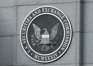

The interplay between investment law and financial regulation is essential for maintaining fair and transparent financial markets. An integral component of this complex framework is the Securities Act of 1933. Enacted in the wake of the 1929 stock market crash, this Act established the groundwork for modern securities regulation in the United States, mandating the registration and disclosure of significant information by companies seeking to sell securities publicly.

In recent years, technological advancements have significantly affected trading practices, notably through the rise of algorithmic trading. This practice utilizes sophisticated computer models and algorithms to execute trades at speeds and frequencies far beyond human capability. While algorithmic trading enhances market liquidity and efficiency, it simultaneously raises concerns about market volatility and the potential for systemic risk. Consequently, questions arise about how existing laws, especially those conceived long before such technologies, address these issues.



The ensuing sections of this article will provide a comprehensive exploration of investment law and financial regulation by focusing on the historical context and fundamental principles established by the Securities Act of 1933. We will also investigate how these foundations are applied to modern trading innovations like algorithmic trading. Understanding these aspects is crucial for investors and market participants to navigate the intricate and evolving landscape of financial markets while adhering to established legal norms.

By engaging with this discussion, readers will acquire insights into the enduring relevance of the Securities Act of 1933 and its impact on today’s trading environments. Furthermore, the article will elucidate the regulatory challenges that algorithmic trading presents under this legislative framework, fostering a deeper appreciation of the continuous dialogue between traditional regulations and modern technological advancements in finance.

## Table of Contents

## An Overview of Investment Law and Financial Regulation

Investment law forms the backbone of financial markets, establishing an array of rules and regulations aimed at governing the operations within these markets. These laws are essential for protecting the interests of investors and ensuring the stability of the economic environment. At its core, investment law seeks to promote confidence among market participants by safeguarding their investments and fostering a transparent and fair marketplace.

Financial regulation is a crucial facet of investment law, often focusing on maintaining market integrity, preventing market manipulation, and ensuring transparency. Regulators work to ensure that all market activities are conducted in an honest, orderly, and efficient manner. This involves creating guidelines and standards that promote fair trading practices and deter fraudulent activities. By enforcing compliance, regulatory bodies help maintain public trust in the financial system.

The regulatory frameworks governing financial markets vary across jurisdictions, reflecting differences in economic structures, legal systems, and market sizes. Despite these differences, the overarching goal is to provide a safe environment for investing activities. Common objectives include protecting investors, maintaining fair, orderly, and efficient markets, and facilitating capital formation.

In the United States, investment law is characterized by a comprehensive regulatory structure created by a combination of federal and state laws. Federal regulations are typically more uniform, providing a cohesive set of rules governing securities and investments across the nation. The Securities and Exchange Commission (SEC) is the primary federal agency responsible for enforcing federal securities laws and regulating the securities industry, the nation's stock and options exchanges, and other related activities and organizations.

State laws complement federal regulations, allowing states to impose their own requirements on securities offerings and sales within their jurisdiction. These are often referred to as "blue sky laws," designed to protect investors against fraudulent sales practices and activities. While these state laws differ, they generally aim to offer additional protection to investors by regulating the sale of securities and ensuring that investors have access to necessary information.

The importance of investment law has magnified in today's increasingly complex financial system. With dynamic market conditions and evolving financial instruments, the regulatory landscape must continuously adapt to new challenges. Ensuring that investment laws and financial regulations are robust and responsive to change is crucial for preserving market stability and protecting investors. This comprehensive regulatory framework plays an integral role in mitigating risks, fostering transparency, and maintaining the functionality of financial markets globally.

## Understanding the Securities Act of 1933

The Securities Act of 1933, enacted following the notorious 1929 stock market crash, represents the inaugural federal legislation aimed at regulating the stock market in the United States. Its primary mission is to enhance transparency in financial reporting, equipping investors with the requisite information to make informed decisions. This objective is critical, as it seeks to restore investor confidence by promoting fair practices in the nation's financial markets.

At its core, the Act mandates that any company intending to offer securities to the public must first register them with the Securities and Exchange Commission (SEC). This registration process involves the submission of detailed disclosures about the securities and the company’s overall financial situation. Such information typically includes financial statements that elucidate the company’s performance, business description, the management team, and any legal proceedings that may impact the company’s financial health. These disclosures are intended to mitigate the risk of fraudulent activities and ensure that all potential investors have access to material information before making investment decisions.

The Act’s requirements for transparency and disclosure have significant implications for issuers. Companies must ensure that their filings with the SEC are comprehensive and truthful, as any misrepresentation or omission of key information can result in severe legal liabilities. Moreover, this process demands rigorous attention to detail and compliance with accounting standards, imposing a considerable responsibility on corporate management and their legal advisors.

For investors, the Securities Act offers a layer of protection by enabling a more thorough assessment of investment opportunities. By granting access to a company’s financial condition and operations, the Act empowers investors to evaluate the risks and potential returns associated with securities more accurately. This foundational approach to securities regulation has contributed to the development of a more robust and reliable financial system, fostering an environment where market integrity and investor protection are prioritized.

Understanding the objectives, requirements, and implications of the Securities Act of 1933 is instrumental in grasping how it continues to have a profound influence on modern investment practices. Its principles underscore the importance of transparency and accountability, serving as a bedrock upon which further securities laws and regulations have been constructed. The Act remains a critical component of the regulatory framework that supports investor confidence and market stability.

## Algorithmic Trading: A Modern Financial Innovation

Algorithmic trading, often referred to as algo trading, is a financial innovation that employs intricate mathematical models and algorithms to execute trading activities at unprecedented speeds and frequencies. By automating the trading process, algorithms can analyze multiple market variables simultaneously, making split-second decisions that were previously unimaginable in traditional trading paradigms.

The core strength of [algorithmic trading](/wiki/algorithmic-trading) lies in its ability to enhance both [liquidity](/wiki/liquidity-risk-premium) and price efficiency. Liquidity, a measure of how easily an asset can be bought or sold in the market without affecting its price, benefits from the continuous presence of algorithmic strategies that perpetually offer buy and sell orders. This constant activity helps stabilize prices and narrow bid-ask spreads, ultimately fostering a more fluid trading environment.

Price efficiency, achieved when asset prices fully reflect all available information, is bolstered by algorithmic trading's capacity to swiftly incorporate new data into market valuations. By systematically processing news, economic indicators, and even social media sentiments, algo trading can adjust asset prices almost instantaneously, ensuring they align closely with their intrinsic values.

However, the rapid pace and substantial [volume](/wiki/volume-trading-strategy) associated with high-frequency trading ([HFT](/wiki/high-frequency-trading-strategies)), a subset of algorithmic trading, have sparked debates regarding market [volatility](/wiki/volatility-trading-strategies) and systemic risk. Critics argue that the speed at which algorithms can operate exacerbates volatility, as evidenced in events like the 2010 "Flash Crash," where algorithmic missteps triggered a significant market drop. Moreover, the complexity of these algorithms and their interconnectedness may pose systemic risks, as a failure in one algorithm can cascade through financial systems, amplifying disruptions.

In Python, a simple model of an algorithmic trading strategy might look like this:

```python
import numpy as np

# Generate random price data
np.random.seed(42)
price_data = np.random.normal(loc=100, scale=1, size=1000)

# Simple moving average strategy
window_size = 50
moving_avg = np.convolve(price_data, np.ones(window_size)/window_size, mode='valid')

# Generate buy/sell signals based on moving average crossover
signals = np.where(price_data[window_size-1:] > moving_avg, 'Buy', 'Sell')

print(signals)
```

This code snippet exemplifies a basic moving average trading strategy, where the algorithm generates buy or sell signals based on whether the current price is above or below the 50-period moving average. Although simplistic, it captures the essence of how algorithms can automate decision-making processes based on specific criteria.

As technology continues to play a pivotal role in finance, integrating algorithmic trading within existing regulatory frameworks becomes crucial. Regulatory bodies are tasked with the challenge of balancing innovation with market safety, often necessitating the revision or reinterpretation of traditional financial regulations. Ensuring that algorithmic trading practices do not compromise market integrity or investor protection is essential in adapting to the evolving landscape of modern financial systems.

## Regulating Algorithmic Trading under the Securities Act of 1933

The rise of algorithmic trading, characterized by high-speed and high-frequency transactions executed by computer algorithms, presents unique challenges that existing financial regulations, such as the Securities Act of 1933, may not fully address. Initially crafted to reestablish investor confidence after the 1929 stock market crash, the Securities Act of 1933 was not designed with the consideration of modern technological advancements like algorithmic trading. Its primary focus was on ensuring transparency and accountability in the sale of securities, primarily through registration requirements and comprehensive disclosure of information by issuers. 

Algorithmic trading has fundamentally transformed the way financial markets operate by enhancing liquidity and facilitating more efficient price discovery. However, it has also raised significant concerns about increased market volatility and systemic risk, primarily due to the speeds and complexities involved. Instances of “flash crashes,” where markets drop precipitously in fractions of a second, exemplify the kind of disruptions that can occur due to algorithmic trading.

Regulators face the evolving task of interpreting and adapting these foundational laws to manage financial innovations effectively. While the Securities Act of 1933 mandates that securities offered to the public in the United States must be registered and that issuers provide essential financial and operational details to investors, it does not directly address the trading mechanisms themselves. The tools required to oversee algorithmic trading go beyond traditional regulatory measures, necessitating innovations in both technology and legal frameworks.

There is a significant need for clearer guidelines on the implementation and monitoring of algorithmic trading to ensure it aligns with the principles laid out by the Securities Act. One potential solution could be the adaptation of existing disclosure requirements to include detailed algorithmic strategies and their potential market impacts. Providing transparency into algorithmic decision-making processes may help mitigate some of the associated risks of these trading methods.

Furthermore, the Securities and Exchange Commission (SEC) and other regulatory bodies may consider new rules or amendments aimed at addressing specific challenges posed by algorithmic trading. Such measures could include the enhancement of system safeguards to prevent unintended trading anomalies, rigorous stress testing of algorithms, and mandatory reporting of algorithmic trading activities to regulatory authorities. These steps could form a regulatory framework capable of addressing the current technological environment's complexities.

Additionally, international cooperation among regulators might be necessary due to the often cross-border nature of financial markets influenced by algorithmic trading. As this technology continues to evolve, a dynamic regulatory approach that seeks to protect market integrity without stifling innovation is essential.

In conclusion, while the Securities Act of 1933 provides a foundation for investor protection and market transparency, the unique challenges presented by algorithmic trading necessitate legislative and regulatory evolution. By considering new regulations and updating existing ones, regulators can better align the Act with the demands of modern trading platforms while safeguarding market stability.

## Future Trends and Conclusions

The financial landscape is in a state of perpetual evolution, with emerging technologies and innovations prompting a continuous reassessment of the laws and regulations governing the market. Traditional frameworks, such as the Securities Act of 1933, must be revisited to ensure they remain relevant in the face of modern trading practices. As algorithmic trading and digital assets become more integrated into financial markets, the need for adaptive regulations becomes paramount.

One of the emerging trends is the integration of [artificial intelligence](/wiki/ai-artificial-intelligence) (AI) and [machine learning](/wiki/machine-learning) (ML) in trading strategies, which could significantly enhance both the speed and accuracy of transactions. However, these technologies also introduce new regulatory challenges, including issues related to transparency, accountability, and the potential for biased algorithms. Regulators will need to devise novel approaches to address these complexities while ensuring that the principles of fairness and market integrity are upheld.

Furthermore, the rise of decentralized finance (DeFi) and blockchain technology represents another transformative trend. These technologies challenge traditional regulatory frameworks by facilitating transactions that bypass conventional financial intermediaries. Regulators may need to consider international standards to effectively oversee these decentralized networks, given their inherently borderless nature.

As financial innovations continue to advance, a dynamic and flexible regulatory approach is essential. This could involve crafting new legislation or amending existing laws to address the unique characteristics of emerging technologies. Regulatory sandboxes, where new financial products can be tested in a controlled environment, could serve as a valuable tool for both regulators and innovators to explore the impact of these innovations without risking systemic stability.

Ultimately, the interplay between established laws like the Securities Act of 1933 and contemporary trading practices will be a determinative [factor](/wiki/factor-investing) in shaping future legal and economic developments. Understanding investment laws is crucial for market participants to navigate future challenges effectively, ensuring compliance while fostering innovation. As we look forward, the focus should not only be on refining regulatory frameworks but also on maintaining a balance that protects investors and encourages technological progress.

## References & Further Reading

[1]: Benston, G. J. (1973). ["Required Disclosure and the Stock Market: An Evaluation of the Securities Exchange Act of 1934."](https://www.jstor.org/stable/1803131) The American Economic Review, 63(1), 132-155.

[2]: Securities and Exchange Commission. (n.d.). ["The Laws That Govern the Securities Industry."](https://www.sec.gov/rules-regulations/statutes-regulations) 

[3]: Securities and Exchange Commission. (n.d.). ["Fast Answers: Rule 144: Selling Restricted and Control Securities."](https://www.sec.gov/about/reports-publications/investorpubsrule144)

[4]: Lopez de Prado, M. (2018). ["Advances in Financial Machine Learning."](https://books.google.com/books/about/Advances_in_Financial_Machine_Learning.html?id=oU9KDwAAQBAJ) Wiley.

[5]: Aldridge, I. (2013). ["High-Frequency Trading: A Practical Guide to Algorithmic Strategies and Trading Systems."](https://www.ahmetbeyefendi.com/wp-content/uploads/2020/07/High-Frequency-Trading-Irene-Aldridge.pdf) Wiley.

[6]: Financial Industry Regulatory Authority. (n.d.). ["Algorithmic Trading Survey Report."](https://www.finra.org/rules-guidance/guidance/reports/2024-finra-annual-regulatory-oversight-report)

[7]: Peterson, M., et al. (2011). ["Flash Crash: Lessons Learned and Implications for the Securities Markets."](https://www.researchgate.net/publication/230709994_Ecological_Niches_and_Geographic_Distributions) CFA Institute.

[8]: Chan, E. (2008). ["Quantitative Trading: How to Build Your Own Algorithmic Trading Business."](https://github.com/ftvision/quant_trading_echan_book) Wiley.