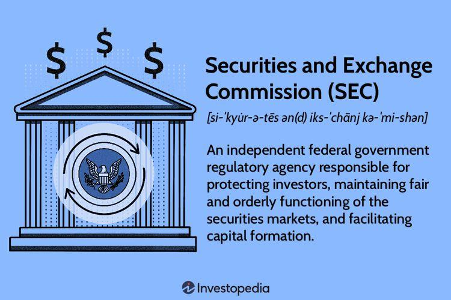

## Table of Contents

## What is the Securities and Exchange Commission (SEC)?

The Securities and Exchange Commission (SEC) is a government agency in the United States that helps protect people who invest money in stocks and other financial products. It was created in 1934 after a big stock market crash to make sure that companies tell the truth about their businesses and to stop people from cheating investors.

The SEC makes rules that companies have to follow when they want to sell stocks or bonds to the public. It also checks to make sure these companies are following the rules. If someone breaks the rules, the SEC can take them to court and make them pay fines or even go to jail. This helps keep the stock market fair and safe for everyone who wants to invest their money.

## When was the SEC established and why?

The Securities and Exchange Commission (SEC) was established in 1934. This was right after a big stock market crash in 1929, which made a lot of people lose their money and caused the Great Depression. The government wanted to make sure something like that wouldn't happen again, so they created the SEC to watch over the stock market and protect people who invest their money.

The main reason for setting up the SEC was to stop companies from lying about their businesses and to prevent fraud. Before the SEC, some companies would trick people into buying their stocks by saying things that weren't true. The SEC was made to make sure companies tell the truth and follow the rules when they sell stocks or bonds. This way, people can trust the stock market and feel safer when they invest their money.

## What are the main functions of the SEC?

The main job of the Securities and Exchange Commission (SEC) is to protect people who invest their money in the stock market. The SEC makes sure that companies tell the truth about their businesses when they want to sell stocks or bonds to the public. This is important because it helps people make smart choices about where to put their money. If a company lies or doesn't follow the rules, the SEC can take them to court and make them pay fines or even go to jail.

Another big part of what the SEC does is to keep the stock market fair and safe for everyone. The SEC watches over the stock market to stop people from cheating or doing things that could hurt investors. They also make rules that everyone in the stock market has to follow. By doing this, the SEC helps make sure that the stock market works well and that people can trust it with their money.

## How does the SEC protect investors?

The SEC protects investors by making sure that companies tell the truth about their businesses. When a company wants to sell stocks or bonds to the public, they have to share a lot of information about their business. The SEC checks this information to make sure it's honest and complete. If a company lies or leaves out important details, the SEC can stop them from selling their stocks or bonds. This helps investors make better choices because they can trust the information they're getting.

The SEC also keeps the stock market fair and safe by watching over it all the time. They make rules that everyone in the stock market has to follow, and they check to make sure people are following these rules. If someone is cheating or doing something wrong, the SEC can take them to court. They can make the person pay a fine or even go to jail. By doing all this, the SEC helps make sure that the stock market is a safe place for people to invest their money.

## What types of securities does the SEC regulate?

The Securities and Exchange Commission (SEC) regulates different types of securities that people can buy and sell in the market. These include stocks, which are shares in a company, and bonds, which are like loans that people give to companies or the government. The SEC also keeps an eye on mutual funds, which are a way for people to invest in a mix of stocks and bonds all at once.

Another type of security the SEC regulates is exchange-traded funds (ETFs), which are similar to mutual funds but can be bought and sold throughout the day like stocks. The SEC also watches over other kinds of investment products, like options and futures, which let people bet on what will happen to the price of a stock or other things in the future. By making rules for all these different securities, the SEC helps make sure the market is fair and safe for everyone.

## How does the SEC enforce securities laws?

The SEC enforces securities laws by keeping a close watch on the stock market and the companies that sell stocks and bonds. If they find out that a company or someone is breaking the rules, like lying about their business or cheating investors, the SEC can take action. They do this by starting investigations. During these investigations, the SEC can ask for documents, talk to people, and look at all the evidence to see if there's been a problem.

If the SEC finds that someone broke the law, they can take them to court. The court can make the person or company pay a fine, which is like a punishment fee, or even send them to jail if what they did was very bad. This helps stop people from doing wrong things in the stock market and keeps it fair for everyone. By doing all this, the SEC makes sure that companies tell the truth and that the market is a safe place for people to invest their money.

## What is the role of the SEC in maintaining fair, orderly, and efficient markets?

The SEC works hard to keep the stock market fair, orderly, and efficient. They do this by making rules that everyone in the market has to follow. These rules stop people from cheating or doing things that could hurt other investors. The SEC also watches the market all the time to make sure everyone is playing by the rules. If they see something wrong, they start investigations to find out what happened and who did it.

If the SEC finds out someone broke the rules, they can take them to court. The court can make the person or company pay a fine or even go to jail if what they did was very bad. This helps keep the market fair because people know there will be consequences if they don't follow the rules. By doing all this, the SEC makes sure that the stock market is a safe and honest place for people to invest their money.

## How does the SEC oversee financial disclosures and reporting?

The SEC makes sure that companies tell the truth about their businesses by overseeing their financial disclosures and reporting. When a company wants to sell stocks or bonds to the public, they have to share a lot of information about their business. This includes things like how much money they are making, what they own, and what they owe. The SEC checks all this information to make sure it's honest and complete. If a company lies or leaves out important details, the SEC can stop them from selling their stocks or bonds. This helps investors make better choices because they can trust the information they're getting.

The SEC also keeps an eye on the regular reports that companies have to file. Companies have to send these reports to the SEC every year, and sometimes more often, to keep everyone updated on how they're doing. The SEC reviews these reports to make sure the company is still telling the truth. If they find anything wrong, they can start an investigation. By doing all this, the SEC helps make sure that investors always have the most accurate and up-to-date information about the companies they might want to invest in.

## What are some notable cases or actions taken by the SEC?

One famous case the SEC worked on was against Enron, a big energy company. In the early 2000s, Enron was found to be lying about how much money they were making. They used tricky accounting to hide their debts and make their business look better than it was. When the truth came out, Enron went bankrupt, and a lot of people lost their money. The SEC took action against Enron and its leaders, and many of them went to jail. This case showed how important it is for the SEC to make sure companies tell the truth.

Another big action the SEC took was against Bernie Madoff. Madoff ran a huge Ponzi scheme, which is when someone uses new investors' money to pay off old investors, making it look like they're making money. Madoff promised big returns to his investors, but he was just lying and stealing their money. When the scheme fell apart in 2008, people lost billions of dollars. The SEC eventually caught Madoff and he went to jail for a long time. This case showed how the SEC works to stop people from cheating investors and keep the market safe.

The SEC also took action against WorldCom, another big company that lied about its finances. In the early 2000s, WorldCom said it was making more money than it really was by hiding its expenses. When the truth came out, WorldCom went bankrupt, and it was one of the biggest corporate scandals in history. The SEC investigated and took the company and its leaders to court. Many of them faced fines and jail time. This case showed how the SEC works to make sure companies are honest and to protect investors from big lies.

## How does the SEC interact with other financial regulatory bodies?

The SEC works with other financial regulatory bodies to make sure the whole financial system is safe and fair. One important group they work with is the Financial Industry Regulatory Authority (FINRA). FINRA helps the SEC by watching over the people and companies that sell stocks and bonds. They make sure these people follow the rules and treat investors fairly. The SEC and FINRA share information and work together to stop bad behavior in the stock market.

The SEC also works with the Commodity Futures Trading Commission (CFTC). The CFTC looks after markets for things like oil, gold, and futures contracts. Sometimes, the SEC and CFTC need to work together because some financial products can be both securities and commodities. By working together, they can make sure all parts of the financial markets are safe and that no one is cheating investors. This teamwork helps keep the whole financial system honest and fair.

## What are the current challenges and criticisms facing the SEC?

The SEC faces a lot of challenges and criticisms these days. One big challenge is keeping up with new technology and new types of investments, like cryptocurrencies. These are hard to watch over because they are new and different from traditional stocks and bonds. The SEC has to figure out how to make rules for these new things without slowing down innovation. Another challenge is having enough money and people to do their job well. The SEC needs to check a lot of information and watch over a huge market, but they don't always have enough resources to do everything they need to do.

People also criticize the SEC for different reasons. Some say the SEC is too slow to act when there are problems in the market. They think the SEC should be quicker to stop bad behavior and protect investors. Others say the SEC is too tough on small companies and startups, making it hard for them to grow and raise money. There's also a worry that the SEC might be influenced by big companies or political groups, which could make their decisions unfair. All these criticisms show that the SEC has a tough job balancing the need to protect investors with the need to keep the market working well.

## How has the SEC adapted to new financial technologies and markets?

The SEC has been working hard to keep up with new financial technologies and markets, like cryptocurrencies and online trading platforms. They've been making new rules to make sure these new things are safe for people to use. For example, the SEC has been trying to figure out how to watch over cryptocurrencies, which are like digital money. They want to stop people from using these new technologies to trick others or steal their money. The SEC also looks at new online platforms where people can trade stocks and other investments. They make sure these platforms follow the rules and treat everyone fairly.

Even though it's hard, the SEC is trying to balance protecting people with letting new ideas grow. They know that new technology can help make investing easier and more open to everyone, but they also want to make sure it's safe. The SEC talks with other groups, like the Commodity Futures Trading Commission, to understand these new markets better. They also use new technology themselves to watch over the market more closely. By doing all this, the SEC hopes to keep the market fair and safe, even as it changes and grows with new technology.

## References & Further Reading

[1]: Bergstra, J., Bardenet, R., Bengio, Y., & Kégl, B. (2011). ["Algorithms for Hyper-Parameter Optimization."](https://papers.nips.cc/paper/4443-algorithms-for-hyper-parameter-optimization) Advances in Neural Information Processing Systems 24.

[2]: ["Advances in Financial Machine Learning"](https://www.amazon.com/Advances-Financial-Machine-Learning-Marcos/dp/1119482089) by Marcos Lopez de Prado

[3]: ["Evidence-Based Technical Analysis: Applying the Scientific Method and Statistical Inference to Trading Signals"](https://www.amazon.com/Evidence-Based-Technical-Analysis-Scientific-Statistical/dp/0470008741) by David Aronson

[4]: ["Machine Learning for Algorithmic Trading"](https://github.com/stefan-jansen/machine-learning-for-trading) by Stefan Jansen

[5]: ["Quantitative Trading: How to Build Your Own Algorithmic Trading Business"](https://books.google.com/books/about/Quantitative_Trading.html?id=j70yEAAAQBAJ) by Ernest P. Chan