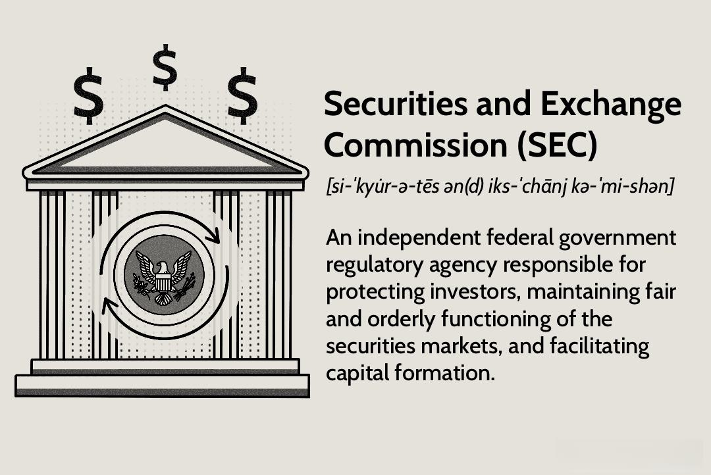

The financial landscape has evolved significantly over the decades, characterized by rapid advancements and the introduction of innovative trading mechanisms. Regulatory bodies have found themselves in a perpetual race to match these complexities with appropriate rules and monitoring systems. Among these bodies, the Securities and Exchange Commission (SEC) stands as a cornerstone of securities market regulation, tasked with safeguarding investor interests and fostering transparent market practices.

Established in 1934, the SEC was a direct response to the turbulent aftermath of the 1929 stock market crash. It has since been at the forefront of ensuring the orderly functioning of the financial markets in the United States. Through stringent regulatory frameworks, the SEC aims to protect investors from fraudulent practices and maintain the integrity of the securities industry.

This article examines the nuanced relationship between the SEC's regulations and the advancement of automated trading, particularly focusing on algorithmic trading. Algorithmic trading, which utilizes complex algorithms to make rapid trading decisions, has revolutionized the landscape of financial transactions. These advancements, while offering potential for greater market efficiency, also introduce challenges such as market manipulation and systemic risks.

By exploring the SEC's role, history, and enforcement mechanisms, a comprehensive understanding of its impact on financial markets is achieved. This perspective sheds light on how the agency navigates the fine line between promoting innovation and ensuring robust investor protection. As we proceed through this discussion, insights into the ongoing balance between regulation and technological advancement will emerge, highlighting the pivotal role of the SEC in an ever-evolving financial world.

## Table of Contents

## The Role of the SEC in Financial Markets

The Securities and Exchange Commission (SEC) serves as an independent federal agency tasked with the critical role of maintaining fair, orderly, and efficient markets within the United States. Established in 1934 through the enactment of the Securities Exchange Act, the SEC was a legislative response to the catastrophic stock market crash of 1929, which precipitated worldwide economic turmoil during the Great Depression.[^1^]

The foundation of the SEC was driven by the necessity to restore public confidence in the U.S. capital markets by mandating truthful financial disclosure and curbing deceitful practices. The SEC is vested with the authority to protect investors, and this is achieved by enforcing rules that require comprehensive and accurate disclosure by public companies.[^2^] These disclosures enable investors to make informed judgments about their economic interests, thereby leveling the informational playing field.

The SEC's purview extends to overseeing a wide array of market participants. These include securities exchanges, brokerage firms, investment advisors, and investment funds. The intent is to ensure that entities operating within the securities markets conform to established laws and ethical standards while engaging with investors and clients. The SEC's regulations aim to mitigate fraudulent activities, such as insider trading and misleading financial reporting.

Investor protection remains a cornerstone of the SEC's mission. Through its enforcement division, the SEC investigates potential violations of securities laws, bringing civil enforcement actions against offenders. This not only deters malfeasance but also instills a sense of accountability among market participants. By fostering transparency and holding entities accountable for misleading or deceitful practices, the SEC plays a pivotal role in sustaining investor trust and market stability.[^3^]

In summary, the SEC's creation was a direct countermeasure to the financial mismanagement that led to the 1929 crisis. Its ongoing mission is to ensure that financial markets operate smoothly and transparently, with investors rightfully protected against fraud and misinformation.

[^1^]: Securities Exchange Act of 1934, Pub.L. 73–291, 48 Stat. 881, enacted June 6, 1934.
[^2^]: SEC 2009 Performance and Accountability Report.
[^3^]: U.S. Securities and Exchange Commission. (n.d.). What We Do. Retrieved from https://www.sec.gov/Article/whatwedo.html

## Algorithmic Trading and the Need for Regulation

Algorithmic trading is a method that utilizes complex algorithms to automate trading processes, facilitate rapid decision-making, and execute transactions at speeds unattainable by human traders. This technology-driven approach has gained substantial traction due to its ability to analyze vast datasets swiftly, reduce human error, and capitalize on market opportunities within milliseconds.

The advancement of [algorithmic trading](/wiki/algorithmic-trading) necessitates robust regulatory frameworks due to several pivotal concerns. One significant issue is market manipulation, where traders could potentially use algorithms to manipulate market prices intentionally. For example, "spoofing" is a tactic wherein traders place large orders with no intent to execute, only to cancel them after affecting price movement. Such practices can disrupt market integrity, making it imperative for regulators to monitor and curb manipulative behaviors effectively.

Flash crashes present another concern. These are dramatic and rapid price-level drops occurring within minutes, often triggered by malfunctioning algorithms or cascading effects from automated trading systems. The flash crash of May 6, 2010, serves as a prominent example, where the Dow Jones Industrial Average plummeted nearly 1,000 points: a brief but impactful event that spotlighted vulnerabilities in algorithmic trading systems.

Systemic risks are also prominent due to the interconnected nature of financial institutions relying on algorithmic trading. A malfunction or failure within one system has the potential to cascade across the market, precipitating broader financial instability. Hence, algorithms must be rigorously tested and monitored to mitigate these risks effectively.

Given these complexities, the need for regulatory oversight becomes increasingly vital. Regulators must ensure that market participants adhere to fair trading practices by enforcing transparency and enhancing market surveillance technologies. The development and implementation of comprehensive regulatory frameworks can safeguard the financial markets, ensuring algorithmic trading contributes positively to market efficiency without compromising stability and fairness.

## SEC Regulations and Algorithmic Trading

The Securities and Exchange Commission (SEC) plays a central role in regulating algorithmic trading, enforcing a framework designed to ensure fairness and transparency in financial markets. As algorithmic and high-frequency trading have become significant components of the modern trading landscape, the SEC's approach includes a series of regulatory measures aimed at preventing market manipulation and mitigating systemic risks.

One of the core requirements imposed by the SEC is the registration and compliance of firms engaged in algorithmic trading. These firms are mandated to register as broker-dealers with the SEC, ensuring they adhere to established standards and practices. Registration is essential for these entities as it subjects them to rigorous oversight and requires consistent monitoring of their trading activities. This measure is a preventive tactic to deter manipulative practices such as spoofing and layering, which can distort market prices and exploit unsuspecting investors.

Additionally, the SEC has developed specific rules to further fortify market integrity. For instance, Regulation SCI (Systems Compliance and Integrity) mandates that key market participants, including exchanges and alternative trading systems, establish comprehensive policies and controls to safeguard their technology systems. This regulation is pivotal as it imposes obligations on firms to maintain robust system security, capacity, and integrity, ultimately reducing the risk of market disruptions caused by technological failures.

Collaboration with other regulatory bodies forms a vital component of the SEC's strategy to oversee algorithmic trading. The SEC works closely with the Commodity Futures Trading Commission (CFTC) to monitor activities involving both securities and derivatives markets. This partnership facilitates a harmonized regulatory approach that addresses the complexities and interconnectedness of modern trading environments. By aligning regulations, both agencies aim to create a cohesive oversight framework that prevents regulatory [arbitrage](/wiki/arbitrage), where firms might attempt to exploit discrepancies between the jurisdictions of different regulators.

Continuous monitoring and analysis of trading activities is crucial for the SEC to effectively administer regulations. Advanced surveillance systems are utilized to detect unusual trading patterns and potential manipulative behavior in real-time. These systems employ sophisticated algorithms capable of analyzing vast amounts of market data to spot anomalies indicative of illegal activities. This proactive surveillance aids the SEC in maintaining orderly markets and safeguarding investor interests.

In summary, the SEC's regulatory regime for algorithmic trading is comprehensive, encompassing registration, compliance, collaboration, and advanced monitoring. Through these mechanisms, the SEC strives to protect investors by fostering transparent and stable financial markets, notwithstanding the rapid technological advancements characterizing today's trading activities.

## Enforcement and Challenges

The Securities and Exchange Commission (SEC) employs a variety of mechanisms to enforce securities laws, primarily through civil actions in federal courts and administrative proceedings. This dual approach allows the SEC to address violations effectively while maintaining market integrity and protecting investors. Enforcement actions typically involve lawsuits against individuals or companies accused of fraudulent activities, insider trading, or other illegal market behaviors. The SEC has the authority to impose penalties, such as fines, disgorgement of ill-gotten gains, and injunctions against future violations.

Recent Supreme Court decisions, notably SEC v. Jarkesy, have significantly affected the SEC's enforcement strategy. This particular case ruled that the SEC must conduct more of its enforcement actions in federal courts rather than relying on its in-house administrative law judges. This decision imposes additional procedural requirements on the SEC, potentially slowing down its ability to swiftly address and mitigate securities law violations. The shift necessitates a strategic adaptation by the agency to align its enforcement capabilities with judicial expectations, increasing the complexity and duration of its prosecutorial efforts.

Despite these judicial challenges, the SEC continues to prioritize investor protection vigorously. The commission has intensified its focus on combatting fraud and illegal market activities, recognizing that emerging technologies and trading strategies, such as algorithmic trading, pose new risks to market fairness and transparency. The SEC's dedication is evident in its pursuit of high-profile cases and its collaborations with other regulatory bodies to tackle multi-jurisdictional trading activities and systemic threats.

To address the dynamic nature of financial markets and technological advancements, the SEC is continuously refining its enforcement framework. It leverages data analytics and advanced monitoring tools to detect irregularities and potential misconduct. This proactive stance enables the SEC to adapt to evolving market conditions and preemptively address threats to market stability, ensuring robust investor protection and fair market practices.

## Conclusion

The Securities and Exchange Commission (SEC) continues to be a crucial entity in preserving the integrity of U.S. financial markets. As the financial landscape undergoes rapid transformations driven by technological advancements such as algorithmic trading, the SEC's role in formulating and enforcing regulations that ensure a balance between fostering innovation and safeguarding investor interests becomes increasingly significant. Algorithmic trading, with its potential for rapid execution and efficiency, also poses risks such as market manipulation and systemic disruptions. Consequently, the SEC's proactive regulation helps mitigate these risks, providing a framework within which technology can thrive without compromising market stability.

Understanding the SEC’s history, its foundational purpose, and the contemporary challenges it faces offers essential insights into the dynamic relationship between regulatory oversight and market efficiency. Since its inception following the stock market crash of 1929, the SEC's mandate has been to protect investors by promoting fair and transparent markets. This mission remains relevant today, as the commission navigates evolving market landscapes characterized by high-frequency trading and complex financial instruments.

The SEC's efforts underscore the importance of adapting regulatory approaches to address the nuances of modern financial technologies while maintaining investor confidence and systemic health. Its continual engagement with market participants and cooperation with other regulatory bodies fortify its capacity to confront emerging challenges effectively. As financial markets continue to advance, the SEC’s commitment to upholding market integrity and investor protection ensures that the U.S. financial system remains robust and trustworthy.

## References & Further Reading

[1]: Securities Exchange Act of 1934, Pub.L. 73–291, 48 Stat. 881, enacted June 6, 1934.

[2]: U.S. Securities and Exchange Commission. (n.d.). ["What We Do."](https://www.sec.gov/) Retrieved from the SEC official website.

[3]: Kirilenko, A. A., & Lo, A. W. (2013). ["Moore's Law versus Murphy's Law: Algorithmic Trading and Its Discontents."](https://www.aeaweb.org/articles?id=10.1257/jep.27.2.51) National Bureau of Economic Research.

[4]: Aldridge, I. (2013). ["High-Frequency Trading: A Practical Guide to Algorithmic Strategies and Trading Systems."](https://books.google.com/books/about/High_Frequency_Trading.html?id=8QpIsVUMhmEC) Wiley.

[5]: Patterson, S. (2013). ["Dark Pools: The Rise of the Machine Traders and the Rigging of the U.S. Stock Market."](https://www.amazon.com/Dark-Pools-Machine-Traders-Rigging/dp/0307887189) Crown Business. 

[6]: Hendershott, T., Jones, C. M., & Menkveld, A. J. (2011). ["Does Algorithmic Trading Improve Liquidity?"](https://onlinelibrary.wiley.com/doi/full/10.1111/j.1540-6261.2010.01624.x) Journal of Finance.