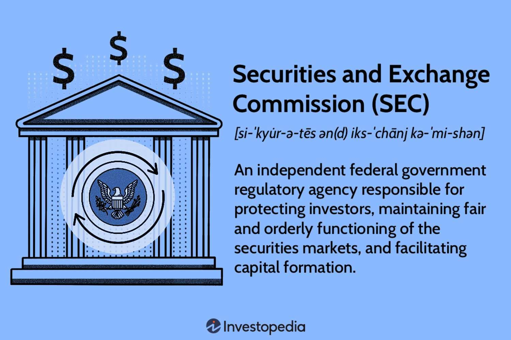

## Table of Contents

## What is the Securities and Exchange Commission (SEC)?

The Securities and Exchange Commission (SEC) is a government agency in the United States. It was created to protect people who invest in stocks, bonds, and other types of investments. The SEC makes sure that companies follow rules when they sell stocks or other securities to the public. This helps keep the stock market fair and honest.

The SEC also makes sure that companies tell the truth about their business and finances. If a company wants to sell stocks, it has to give the SEC a lot of information about its business. The SEC checks this information to make sure it is correct. If a company or person breaks the rules, the SEC can take action, like fining them or stopping them from selling securities. This helps keep investors safe and the market trustworthy.

## What is the primary mission of the SEC?

The main job of the Securities and Exchange Commission (SEC) is to protect people who invest their money in things like stocks and bonds. The SEC makes sure that the stock market is fair and that companies follow the rules when they sell investments to the public. This helps keep investors safe and makes sure that everyone plays by the same rules.

The SEC also makes sure that companies tell the truth about their business and money situation. If a company wants to sell stocks, it has to give the SEC a lot of information about its business. The SEC checks this information to make sure it is correct. If a company or person breaks the rules, the SEC can take action, like giving them a fine or stopping them from selling securities. This helps keep the market honest and trustworthy.

## How was the SEC established and when?

The Securities and Exchange Commission (SEC) was created by the U.S. government in 1934. This happened after a big stock market crash in 1929, which made a lot of people lose their money. The government wanted to make sure this wouldn't happen again, so they made the SEC to watch over the stock market and protect people who invest their money.

The SEC was set up through a law called the Securities Exchange Act of 1934. This law gave the SEC the power to make rules for the stock market and to make sure companies tell the truth about their business. The SEC started working right away to help keep the market fair and safe for everyone.

## What are the main functions of the SEC?

The Securities and Exchange Commission (SEC) has several important jobs to help keep the stock market fair and protect people who invest their money. One big job is to make sure companies follow the rules when they sell stocks or other investments to the public. The SEC checks the information companies give about their business and money situation to make sure it's true and complete. If a company lies or leaves out important information, the SEC can take action against them.

Another important job of the SEC is to watch over the stock market to make sure it's working fairly. The SEC makes rules that everyone has to follow, and they check to see if people are breaking these rules. If someone does something wrong, like cheating or lying, the SEC can stop them and even fine them. This helps keep the market honest and safe for everyone who wants to invest their money.

The SEC also helps people understand the stock market better. They give out information and tools that can help people make smart choices about where to put their money. By doing all these things, the SEC works to make sure the stock market is a place where everyone can trust and feel safe investing.

## Who oversees the operations of the SEC?

The operations of the Securities and Exchange Commission (SEC) are overseen by its Commissioners. There are five Commissioners in total, and they are appointed by the President of the United States. The President also picks one of the Commissioners to be the Chairperson, who leads the SEC. The Commissioners work together to make sure the SEC is doing its job to protect investors and keep the stock market fair.

The Commissioners meet regularly to talk about important issues and make decisions about rules and actions the SEC should take. They also make sure the SEC is following the laws that Congress made, like the Securities Exchange Act of 1934. By working together, the Commissioners help guide the SEC in its mission to keep the stock market honest and safe for everyone.

## What types of securities does the SEC regulate?

The Securities and Exchange Commission (SEC) regulates many different types of securities. Securities are things like stocks, bonds, and other investments that people can buy and sell. The SEC makes sure that when companies sell stocks, they tell the truth about their business and money situation. This includes stocks in big companies, small companies, and even new companies that are just starting out. The SEC also watches over mutual funds, which are a way for people to invest in a bunch of different stocks all at once.

The SEC also regulates bonds, which are like loans that people can buy from companies or the government. When you buy a bond, you're lending money to the company or government, and they promise to pay you back with interest. The SEC makes sure that the information about these bonds is correct so that people know what they're getting into. Another type of security the SEC looks after is called a derivative. Derivatives are a bit more complicated, but they're basically agreements between people to buy or sell something in the future, like a stock or a commodity. The SEC makes sure these agreements follow the rules and are fair to everyone involved.

## How does the SEC protect investors?

The SEC protects investors by making sure companies follow the rules when they sell stocks or other securities. When a company wants to sell stocks to the public, it has to give the SEC a lot of information about its business and finances. The SEC checks this information to make sure it's true and complete. If a company lies or leaves out important information, the SEC can take action against them, like fining them or stopping them from selling securities. This helps keep the market honest and safe for people who want to invest their money.

The SEC also watches over the stock market to make sure it's working fairly. They make rules that everyone has to follow, and they check to see if people are breaking these rules. If someone cheats or lies, the SEC can stop them and even fine them. This helps keep the market a place where everyone can trust and feel safe investing. The SEC also gives out information and tools to help people understand the stock market better, so they can make smart choices about where to put their money.

## What is the role of the SEC in maintaining fair, orderly, and efficient markets?

The SEC plays a big role in making sure the stock market is fair, orderly, and efficient. They do this by making rules that everyone has to follow. These rules stop people from cheating or lying, which helps keep the market honest. The SEC also watches over the market to make sure everything is working the way it should. If someone breaks the rules, the SEC can take action against them, like fining them or stopping them from selling securities. This helps keep the market fair for everyone.

The SEC also makes sure that companies tell the truth about their business and money situation when they want to sell stocks or other securities. They check the information companies give to make sure it's correct and complete. If a company lies or leaves out important information, the SEC can take action. This helps people who want to invest their money feel safe and trust that the information they're getting is honest. By doing all these things, the SEC helps keep the market running smoothly and fairly for everyone.

## Can you explain the SEC's enforcement actions and penalties?

The SEC takes action when people or companies break the rules of the stock market. They do this to keep the market fair and safe for everyone. If the SEC finds out that someone did something wrong, like lying about a company's business or money situation, they can start an investigation. They look at all the facts and evidence to see if the rules were broken. If they find that someone broke the rules, they can take them to court or settle the case with an agreement.

When the SEC decides to take action, they can give out different kinds of penalties. One common penalty is a fine, which is money that the person or company has to pay. The amount of the fine depends on how serious the rule-breaking was. Sometimes, the SEC can also stop someone from working in the stock market or selling securities. This is called a ban or suspension. They might also make the person or company give back any money they made by breaking the rules. All these penalties help make sure that people think twice before breaking the rules and help keep the market honest.

## How does the SEC influence corporate governance?

The SEC influences corporate governance by making rules that companies have to follow when they sell stocks or other securities. These rules make sure that companies tell the truth about their business and money situation. The SEC checks the information companies give to make sure it's correct and complete. If a company lies or leaves out important information, the SEC can take action against them. This helps keep the market honest and safe for people who want to invest their money. By doing this, the SEC helps make sure that companies are run in a fair and open way.

The SEC also makes rules about how companies should be managed. These rules cover things like how a company's board of directors should work and how they should make decisions. The SEC wants to make sure that the people running the company are doing a good job and looking out for the investors. If a company doesn't follow these rules, the SEC can take action, like fining them or stopping them from selling securities. This helps make sure that companies are run in a way that is good for everyone involved, not just the people in charge.

## What are some significant cases or actions taken by the SEC in recent years?

In recent years, the SEC has taken action in many important cases. One big case was against Theranos, a company that said it could do blood tests with just a tiny drop of blood. The SEC found out that Theranos and its CEO, Elizabeth Holmes, lied about what their technology could do. They got in big trouble and had to pay a lot of money. This case showed how important it is for companies to tell the truth about their business.

Another important action was the SEC's case against Ripple Labs. The SEC said that Ripple was selling a type of [cryptocurrency](/wiki/cryptocurrency) called XRP, which they thought was a security. They said Ripple didn't follow the rules when they sold XRP. This case is still going on, but it's a big deal because it could change how cryptocurrencies are treated in the future. It shows how the SEC works to make sure new kinds of investments follow the same rules as others.

The SEC also took action against Elon Musk and Tesla. In 2018, Elon Musk tweeted that he was thinking about taking Tesla private and had "funding secured." The SEC said this tweet was not true and could have hurt investors. They made Elon Musk and Tesla pay fines, and Elon Musk had to step down as chairman of Tesla for a while. This case shows how the SEC makes sure that even big companies and famous people follow the rules.

## How does the SEC coordinate with other regulatory bodies both domestically and internationally?

The SEC works with other groups in the United States to make sure the stock market is fair and safe. They talk a lot with the Financial Industry Regulatory Authority (FINRA), which is another group that watches over people who sell stocks and other investments. The SEC and FINRA share information and help each other catch people who break the rules. The SEC also works with the Commodity Futures Trading Commission (CFTC), which looks after different kinds of investments like futures and swaps. By working together, these groups can make sure that all parts of the market are watched over and kept honest.

The SEC also talks with groups in other countries to make sure the rules work well everywhere. They meet with groups like the International Organization of Securities Commissions (IOSCO), which brings together regulators from all over the world. The SEC shares information with these groups and helps make rules that everyone can follow. This helps keep the global market fair and safe for people who invest their money, no matter where they are. By working with others, the SEC helps make sure that the rules are the same everywhere and that everyone plays by them.

## References & Further Reading

[1]: Securities Exchange Act of 1934, Pub.L. 73–291, 48 Stat. 881, enacted June 6, 1934.

[2]: U.S. Securities and Exchange Commission. (n.d.). ["What We Do."](https://www.sec.gov/) Retrieved from the SEC official website.

[3]: Kirilenko, A. A., & Lo, A. W. (2013). ["Moore's Law versus Murphy's Law: Algorithmic Trading and Its Discontents."](https://www.aeaweb.org/articles?id=10.1257/jep.27.2.51) National Bureau of Economic Research.

[4]: Aldridge, I. (2013). ["High-Frequency Trading: A Practical Guide to Algorithmic Strategies and Trading Systems."](https://books.google.com/books/about/High_Frequency_Trading.html?id=8QpIsVUMhmEC) Wiley.

[5]: Patterson, S. (2013). ["Dark Pools: The Rise of the Machine Traders and the Rigging of the U.S. Stock Market."](https://www.amazon.com/Dark-Pools-Machine-Traders-Rigging/dp/0307887189) Crown Business. 

[6]: Hendershott, T., Jones, C. M., & Menkveld, A. J. (2011). ["Does Algorithmic Trading Improve Liquidity?"](https://onlinelibrary.wiley.com/doi/full/10.1111/j.1540-6261.2010.01624.x) Journal of Finance.