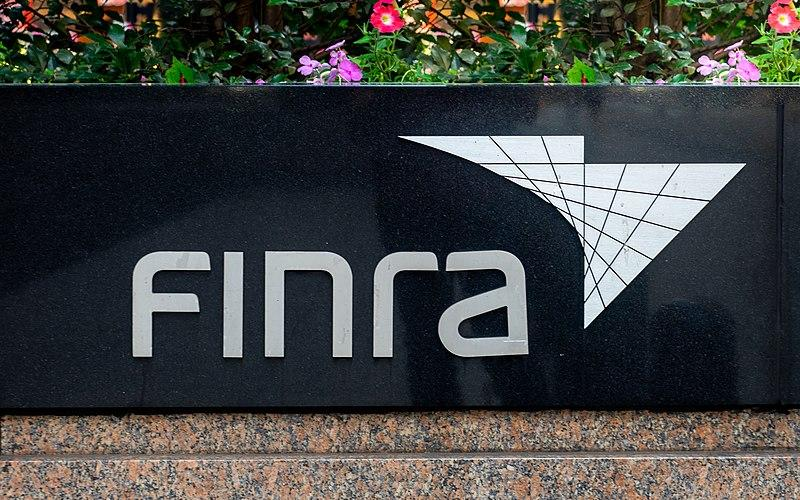

## Table of Contents

## What is the Securities Industry Regulatory Authority (SIRA)?

The Securities Industry Regulatory Authority (SIRA) is an organization that helps to keep the stock market fair and safe. It makes rules that companies and people who work in the stock market must follow. SIRA checks to make sure everyone is following these rules and can punish those who do not. This helps to protect people who invest their money in the stock market.

SIRA also helps to educate people about the stock market. It provides information and resources so that people can learn how to invest wisely. By doing this, SIRA helps to make the stock market a better place for everyone.

## What are the primary functions of SIRA?

The main job of the Securities Industry Regulatory Authority (SIRA) is to make sure the stock market is fair and safe. They do this by making rules that everyone in the stock market has to follow. These rules are for companies and people who work in the stock market. SIRA checks to see if everyone is following these rules. If someone breaks a rule, SIRA can punish them. This helps to protect people who put their money into the stock market.

Another important job of SIRA is to help people learn about the stock market. They give out information and tools that can help people understand how to invest their money wisely. By doing this, SIRA makes the stock market a better place for everyone. It helps people feel more confident about investing their money.

## How does SIRA differ from other financial regulatory bodies?

SIRA is special because it focuses only on the stock market. Other financial regulatory bodies might look at banks, insurance companies, or other parts of the money world. SIRA makes rules just for the stock market and checks to make sure everyone follows them. This helps keep the stock market fair and safe for people who invest their money there.

Another way SIRA is different is that it works hard to teach people about the stock market. While other financial regulators might also do some education, SIRA puts a big focus on it. They give out information and tools to help people learn how to invest wisely. This makes SIRA not just a rule-maker, but also a helper for people who want to understand the stock market better.

## What types of securities does SIRA regulate?

SIRA regulates different types of securities that people can buy and sell in the stock market. This includes stocks, which are shares in a company. When you buy a stock, you own a small part of that company. SIRA also regulates bonds, which are like loans that people give to companies or governments. In return, the company or government pays back the money with interest over time.

Another type of security that SIRA oversees is mutual funds. These are collections of stocks and bonds managed by professionals. People can invest in mutual funds to spread their money across many different investments, which can be less risky than putting all their money in one stock or bond. SIRA makes sure that all these securities are traded fairly and that the people selling them follow the rules.

## How does SIRA ensure compliance among its regulated entities?

SIRA makes sure that everyone follows the rules by checking on them regularly. They look at what companies and people in the stock market are doing to see if they are following the rules. If SIRA finds that someone is not following the rules, they can take action. This might mean giving a warning, making the person or company pay a fine, or even stopping them from working in the stock market.

SIRA also helps people understand the rules better. They provide training and information to help companies and individuals know what they are supposed to do. By making the rules clear and helping people learn about them, SIRA makes it easier for everyone to follow the rules. This helps keep the stock market fair and safe for everyone who invests their money there.

## What is the process for becoming a member of SIRA?

To become a member of SIRA, you need to start by filling out an application form. You can find this form on SIRA's website or by contacting them directly. Along with the application, you'll need to provide some documents. These might include proof of your identity, your education, and any licenses you already have. You'll also need to pay an application fee. Once you've sent everything in, SIRA will review your application to make sure you meet their requirements.

If your application is approved, you'll need to complete some training. SIRA offers courses that teach you about their rules and how to follow them. After you finish the training, you might have to pass an exam to show that you understand everything. Once you pass the exam, you'll become a member of SIRA. As a member, you'll need to keep following their rules and might need to take more training in the future to stay up to date.

## What are the key regulations enforced by SIRA?

SIRA has rules to make sure the stock market is fair and safe for everyone. One important rule is that companies have to tell the truth about their business. They can't lie or hide important information from people who might want to invest in them. This rule helps people make smart choices about where to put their money. Another rule is that people who work in the stock market, like brokers, have to act in the best interest of their clients. They can't do things that might hurt their clients just to make more money for themselves.

SIRA also has rules about how stocks and other securities are bought and sold. They make sure that the prices of stocks are fair and that no one is cheating. This means that people can trust that the stock market is working the way it should. If someone breaks these rules, SIRA can punish them. They might have to pay a fine or they might not be allowed to work in the stock market anymore. These rules help keep the stock market honest and safe for everyone who invests their money there.

## How does SIRA handle disputes and enforcement actions?

When there's a problem or disagreement in the stock market, SIRA steps in to help solve it. If someone thinks a company or a person broke the rules, they can tell SIRA about it. SIRA will look into the problem carefully. They might talk to the people involved and look at any evidence. If SIRA finds out that someone did break the rules, they can take action to fix the problem. This could mean making the person or company pay a fine, or even stopping them from working in the stock market.

SIRA also makes sure that their enforcement actions are fair. They have a process where people can argue their side of the story. If someone doesn't agree with SIRA's decision, they can ask for a review. This helps make sure that SIRA's actions are just and that everyone gets a chance to explain themselves. By handling disputes and enforcing rules this way, SIRA helps keep the stock market a safe and fair place for everyone.

## What role does SIRA play in investor protection?

SIRA plays a big role in keeping investors safe. They make rules that companies and people in the stock market have to follow. These rules stop people from lying or cheating. When companies tell the truth about their business, investors can make smart choices about where to put their money. SIRA also checks to make sure everyone is following the rules. If someone breaks a rule, SIRA can punish them. This helps keep the stock market fair and safe for everyone who invests their money there.

Another way SIRA protects investors is by helping them learn about the stock market. They give out information and tools that can help people understand how to invest wisely. When people know more about the stock market, they can make better decisions about their money. SIRA also makes sure that people who work in the stock market, like brokers, act in the best interest of their clients. This means that investors can trust that their money is being handled well. By doing all these things, SIRA helps make the stock market a safer place for everyone.

## How does SIRA collaborate with international regulatory bodies?

SIRA works with other countries' regulatory bodies to make sure the stock market is safe and fair everywhere. They share information and ideas with each other. This helps them learn about new rules and ways to stop cheating in the stock market. By working together, SIRA and other regulators can catch people who try to break the rules in different countries. This makes it harder for anyone to cheat and keeps the stock market safer for everyone.

SIRA also joins meetings and groups with other international regulators. They talk about problems in the stock market and how to solve them. This helps them make better rules that work not just in one country, but all over the world. By working together, SIRA and other regulators can protect investors no matter where they live. This makes the stock market a more trustworthy place for people to put their money.

## What recent initiatives has SIRA undertaken to adapt to financial technology innovations?

SIRA has been working hard to keep up with new technology in the stock market. They know that things like online trading and digital currencies are changing how people invest. To stay on top of these changes, SIRA has started using new tools to watch over the stock market. They use computer programs to spot any strange activity that might be cheating. This helps them catch problems faster and keep the stock market safe for everyone.

Another thing SIRA is doing is making new rules for financial technology. They want to make sure that new ways of investing, like using apps on your phone, are fair and safe. SIRA is also working with other groups that make these technologies. They talk about how to use new tools in a way that follows the rules. By doing this, SIRA helps make sure that new technology in the stock market is good for investors and keeps the market honest.

## How can one access and utilize SIRA's resources for research and compliance?

To access SIRA's resources for research and compliance, you can start by visiting their official website. On the website, you'll find a section dedicated to resources where you can download guides, reports, and other useful documents. These materials can help you understand the rules of the stock market and how to follow them. If you need more specific information, you can also use the search function on the site to find what you're looking for. SIRA also offers webinars and training sessions that you can sign up for to learn more about their rules and how to stay compliant.

Once you have the resources, you can use them to make sure you're following SIRA's rules. For example, if you're a company, you can read the guides to know what information you need to share with investors. If you're an investor, you can use the reports to learn about different companies and make smart choices about where to put your money. If you have questions or need help, you can contact SIRA directly. They have a team that can answer your questions and help you use their resources the right way. By using SIRA's resources, you can stay informed and keep the stock market safe and fair for everyone.

## References & Further Reading

[1]: MacIntosh, J. G., & O'Brien, J. B. (2012). ["Financial Industry Regulatory Authority and the Next Recession: Protecting Retail Investors."](https://en.wikipedia.org/wiki/Passignano_sul_Trasimeno) William & Mary Law Review, 53(4).

[2]: Meyer, J. (2016). ["Algorithmic Trading: Opportunities and Challenges."](https://www.researchgate.net/publication/378548435_Algorithmic_Trading_and_AI_A_Review_of_Strategies_and_Market_Impact) CFA Institute Research Foundation.

[3]: [U.S. Securities and Exchange Commission. "Algorithmic Trading: A Primer."](https://www.sec.gov/files/litigation/admin/2024/33-11349.pdf) 

[4]: Lopez de Prado, M. (2018). ["Advances in Financial Machine Learning."](https://www.amazon.com/Advances-Financial-Machine-Learning-Marcos/dp/1119482089) Wiley.

[5]: ["The Role of FINRA in the Securities Industry."](https://www.finra.org/about/how-finra-serves-investors-and-members) Financial Industry Regulatory Authority (FINRA).

[6]: DuPont, D. C., & Furman, S. N. (2013). ["Algorithmic Trading and High-Frequency Trading: An Overview."](https://assets.cambridge.org/97811070/91146/frontmatter/9781107091146_frontmatter.pdf) European Financial Management, 19(5).