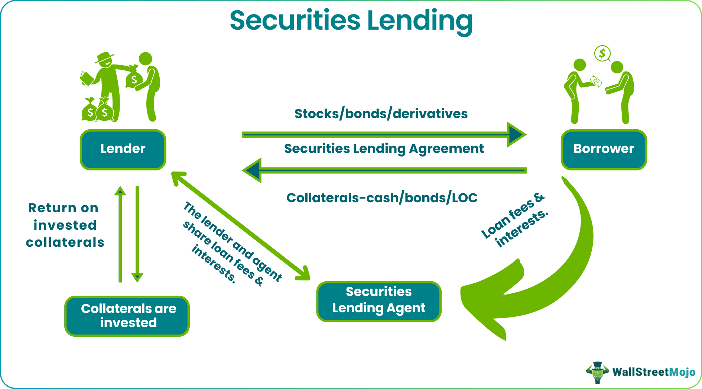

## Table of Contents

## What is securities lending?

Securities lending is when one investor loans their stocks, bonds, or other securities to another investor. This usually happens through a brokerage firm or a bank. The borrower needs these securities to make other investments, like short selling. In return, the borrower gives the lender some money as collateral, which is like a security deposit. This way, if the borrower can't return the securities, the lender is protected.

The lender also earns a fee for lending out their securities. This fee can be a good source of extra income for the lender. Meanwhile, the borrower uses the securities to do things like short selling, where they bet that the price of the security will go down. If it does, they can buy it back cheaper and return it to the lender, making a profit. Securities lending helps make the financial markets work better by letting investors use their assets in different ways.

## Why do investors engage in securities lending?

Investors engage in securities lending mainly to earn extra money. When they lend out their stocks or bonds, they get a fee from the borrower. This fee can add up over time and provide a nice boost to their investment returns. It's like renting out something you own but don't need right away, and getting paid for it. This extra income can be especially helpful for big investors like pension funds or insurance companies, who need to make as much money as they can for their clients.

On the other side, borrowers use the loaned securities to make other investments, like short selling. Short selling is when an investor bets that the price of a stock will go down. They borrow the stock, sell it, and then buy it back later at a lower price to return it to the lender. If the price does go down, they make a profit. Securities lending makes this possible and helps the financial markets work more smoothly by letting investors use their assets in different ways.

## Who are the typical participants in securities lending?

The typical participants in securities lending are investors who own securities and want to make some extra money, and other investors who need those securities to make different kinds of investments. The investors who own the securities are often big organizations like pension funds, insurance companies, or mutual funds. They lend out their stocks or bonds to earn fees, which can help boost their overall returns.

On the other side, the borrowers are usually hedge funds, market makers, or other investors who want to do things like short selling. Short selling is when someone borrows a stock, sells it, and hopes to buy it back later at a lower price to return it to the lender. This can be a way for them to make money if they think a stock's price will go down. Both sides benefit: the lenders get fees, and the borrowers get the securities they need to [carry](/wiki/carry-trading) out their investment strategies.

## What are the basic steps involved in the securities lending process?

In the securities lending process, the first step is when an investor who owns securities, like stocks or bonds, decides to lend them out. This investor is usually a big organization like a pension fund or a mutual fund. They work with a broker or a bank to find someone who wants to borrow those securities. The borrower, often a [hedge fund](/wiki/hedge-fund-trading-strategies) or a market maker, needs these securities to do things like short selling. They agree on the terms of the loan, including how long the loan will last and what fee the lender will get.

Once the terms are set, the borrower gives the lender some money as collateral. This is like a security deposit to make sure the lender is protected if the borrower can't return the securities. The lender then sends the securities to the borrower, who can use them for their investment strategies. During the loan period, the lender earns the agreed-upon fee. When the loan period ends, the borrower returns the securities to the lender, and the lender gives back the collateral. This process helps both sides: the lender makes extra money, and the borrower gets to use the securities they need.

## How is the value of lent securities determined?

The value of lent securities is determined by the current market price of the securities at the time of the loan. This means that if someone wants to borrow a stock, the value of that stock on the day the loan is made is what matters. The lender and borrower will agree on this value, and the borrower will provide collateral worth more than the value of the securities to protect the lender. The extra value of the collateral, often called a margin, is usually a percentage above the securities' value, like 102% or 105%, to account for any changes in the market price while the securities are on loan.

While the securities are lent out, their value can change because the market is always moving. If the price of the securities goes up, the borrower might need to provide more collateral to keep the loan safe. If the price goes down, the borrower might get some of their collateral back. At the end of the loan period, the value of the securities when they are returned is compared to the value at the start of the loan. This helps make sure that the lender gets back securities worth at least what they lent out, and the borrower's collateral covers any changes in value during the loan.

## What are the risks associated with securities lending for lenders?

When lenders lend out their securities, they take on some risks. One big risk is that the borrower might not be able to return the securities. This could happen if the borrower goes bankrupt or if the securities' value drops a lot. To protect against this, lenders get collateral from the borrower. But if the securities' value drops more than the collateral covers, the lender could lose money. Another risk is that the lender might miss out on dividends or other benefits that come with owning the securities while they are lent out.

There's also the risk that the value of the securities might go up while they are on loan. If that happens, the lender doesn't get to enjoy the increase in value right away because they don't have the securities. They do get the securities back eventually, but they might have missed a good opportunity to sell them at a higher price. Lenders need to think about these risks and make sure they are comfortable with them before they decide to lend out their securities.

## What are the benefits for borrowers in securities lending?

Borrowers in securities lending get a big benefit because they can use the securities to make other investments. One common thing they do is short selling. This is when they borrow a stock, sell it, and hope to buy it back later at a lower price. If the price does go down, they can make a profit. Without borrowing the stock, they wouldn't be able to do this. So, securities lending gives them a way to bet on the market going down, which can be a good strategy if they think a stock's price will drop.

Another benefit for borrowers is that they can use the securities for other trading strategies, like hedging or [arbitrage](/wiki/arbitrage). Hedging is when they use the securities to protect other investments from losing value. Arbitrage is when they buy and sell the same security in different markets to make a profit from the price difference. These strategies can help them make money or reduce risk. Overall, securities lending helps borrowers do more with their money and take advantage of opportunities in the market.

## How are collateral and margin managed in securities lending?

In securities lending, collateral is like a safety net that the borrower gives to the lender. It's usually cash or other securities that are worth more than the securities being lent. This extra value, called a margin, is often set at a certain percentage above the value of the lent securities, like 102% or 105%. The margin makes sure that if the value of the lent securities goes up or down, the lender is still protected. The collateral stays with the lender until the borrower returns the securities.

If the value of the lent securities changes while they are on loan, the collateral and margin need to be adjusted. If the value of the securities goes up, the borrower might have to give more collateral to keep the loan safe. This is called a margin call. If the value goes down, the borrower might get some of their collateral back. At the end of the loan, the borrower returns the securities, and the lender gives back the collateral. This way, both the lender and the borrower are protected from big changes in the market.

## What role do intermediaries play in securities lending?

Intermediaries in securities lending are like middlemen who help make the whole process easier. They are usually big banks or brokerage firms that connect lenders who own securities with borrowers who need them. These intermediaries take care of finding the right people to lend to and borrow from, and they also handle all the paperwork and agreements. They make sure that the terms of the loan are clear and that both sides understand what they are getting into. This includes setting up the collateral and making sure the right amount of margin is in place to protect the lender.

Besides connecting lenders and borrowers, intermediaries also manage the collateral. They keep track of the value of the lent securities and make sure the collateral stays at the right level. If the value of the securities changes, the intermediaries will handle any margin calls, asking the borrower for more collateral if needed or returning some if the value goes down. By doing all this work, intermediaries help make securities lending smoother and safer for everyone involved.

## How does securities lending impact the market?

Securities lending helps the market work better by letting investors use their assets in different ways. When investors lend out their stocks or bonds, they earn extra money from fees. This extra income can make their overall returns better, which can be good for big investors like pension funds or insurance companies. On the other side, borrowers can use the securities they borrow to do things like short selling. This means they can bet that a stock's price will go down and make money if they are right. By letting both lenders and borrowers do more with their money, securities lending makes the market more active and flexible.

But securities lending can also make the market more risky. If a lot of people are borrowing securities to short sell, it can push stock prices down. This can lead to more ups and downs in the market, which can be scary for some investors. Also, if a borrower can't return the securities they borrowed, it can cause problems for the lender. To keep things safe, lenders get collateral from borrowers. But if the market moves a lot, the collateral might not be enough to cover the losses. So, while securities lending helps the market work better, it also adds some risk that everyone needs to be careful about.

## What are the regulatory considerations in securities lending?

Securities lending is watched closely by rules to make sure it's done fairly and safely. Different countries have their own rules, but they all want to stop bad things from happening, like fraud or too much risk. In the United States, the Securities and Exchange Commission (SEC) and the Financial Industry Regulatory Authority (FINRA) set rules for securities lending. They make sure that lenders get enough collateral to protect them and that everyone follows the rules. These rules also say that brokers and banks need to tell their clients about the risks of lending securities and get their okay before doing it.

These rules help keep the market stable and protect investors. They make sure that the collateral is always worth more than the securities being lent, which helps if the market goes down a lot. The rules also say that lenders and borrowers need to keep good records of their loans and report them to the right people. This helps everyone see what's going on in the market and makes it easier to spot problems early. By having these rules, regulators can make sure that securities lending helps the market work better without causing too much trouble.

## How can advanced technology enhance the efficiency of securities lending operations?

Advanced technology can make securities lending a lot easier and faster. It can help match lenders with borrowers quickly by using smart computer programs. These programs look at what securities are available and what borrowers need, and then they find the best matches. This saves a lot of time and work for the people who used to do this by hand. Also, technology can keep track of all the loans and make sure the collateral is always right. It can watch the market and automatically ask for more collateral if the value of the securities goes up, or give some back if it goes down. This makes the whole process smoother and less risky.

Another way technology helps is by keeping everything safe and clear. With secure computer systems, all the information about the loans is kept safe from hackers or mistakes. It also makes it easier to report everything to the people who watch over the market, like regulators. This helps everyone see what's going on and makes sure the rules are followed. Plus, technology can give lenders and borrowers better tools to see how their loans are doing and make smarter choices. This can lead to more people wanting to lend and borrow, which can make the market more active and helpful for everyone.

## References & Further Reading

[1]: Bank for International Settlements. (2019). ["Securities lending in central bank’s securities markets."](https://data.bis.org/)

[2]: Fabozzi, F. J., Mann, S. V., & Choudhry, M. (2008). ["The Handbook of European Structured Financial Products."](https://www.mhebooklibrary.com/doi/book/10.1036/9781260473902?contentTab=true) Wiley Finance.

[3]: Kothari, S. P., & Warner, J. B. (2001). ["Measuring Long-Horizon Security Price Performance."](https://www.sciencedirect.com/science/article/pii/S0304405X96008999) Financial Analysts Journal.

[4]: Aldridge, I. (2013). ["High-Frequency Trading: A Practical Guide to Algorithmic Strategies and Trading Systems."](https://books.google.com/books/about/High_Frequency_Trading.html?id=8QpIsVUMhmEC) 2nd Edition, Wiley.

[5]: BlackRock Insight. (2018). ["Securities Lending: The Facts."](https://www.blackrock.com/institutions/en-us/literature/whitepaper/viewpoint-securities-lending-the-facts-may-2015.pdf)

[6]: Narang, R. K. (2013). ["Inside the Black Box: The Simple Truth About Quantitative Trading."](https://www.amazon.com/Inside-Black-Box-Quantitative-Trading/dp/0470432063) 2nd Edition, Wiley.

[7]: Madhavan, A. (2012). ["Exchange-Traded Funds, Market Structure, and the Flash Crash."](https://www.tandfonline.com/doi/abs/10.2469/faj.v68.n4.6) The Review of Financial Studies, 25(11), 3305-3338.