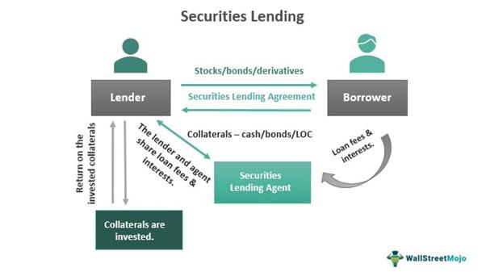

The landscape of financial markets is constantly evolving, with securities lending, investment processes, and algorithmic trading playing pivotal roles. Securities lending acts as a cornerstone for enhancing market liquidity by allowing investors or firms to lend securities temporarily. This mechanism provides the necessary assets for various trading activities, including short selling, which can create a seamless and dynamic trading environment. By aiding these activities, securities lending contributes significantly to the fluidity and efficiency of financial markets.

Investment workflows involve intricate processes that range from asset selection to portfolio management. When securities lending is incorporated into these workflows, it can open opportunities for generating additional income streams and mitigating certain investment risks. Understanding how these elements fit into the broader investment strategies empowers investors to enhance their decision-making and maximize returns.



Algorithmic trading, on the other hand, represents a transformative shift in how trades are executed. Utilizing advanced algorithms, this approach increases the speed and precision of trading by executing orders based on pre-established criteria. By minimizing emotional biases and improving accuracy, algorithmic trading is reshaping the trading ecosystem. This strategic tool equips traders to react swiftly to market movements, optimizing trading outcomes.

A comprehensive understanding of securities lending, investment processes, and algorithmic trading can furnish investors with deeper insights into maximizing returns while managing risks effectively. We will examine each component to shed light on their intricate interactions and their implications within today's financial markets.

## Table of Contents

## Understanding Financial Markets and Securities Lending

Securities lending is a pivotal component in the financial markets, where security holders, or lenders, temporarily transfer securities to borrowers. This process enhances market liquidity by introducing more available securities into the trading environment. It is particularly critical for strategies such as short selling, hedging, and arbitrage, which rely on the flexibility and availability of securities that lending provides.

In a typical securities lending transaction, the lender transfers ownership of the securities to the borrower in exchange for collateral. The collateral, which can be cash or other securities, serves as a risk mitigation tool, protecting the lender against potential default by the borrower. The transaction is usually governed by an agreement detailing the terms, including the lending fee or "rebate rate," the collateral amount, and the duration of the loan.

The mechanics of securities lending are advantageous for market participants. Lenders earn additional income through fees, which enhances overall portfolio returns without selling the underlying assets. Borrowers, on the other hand, gain access to securities needed for various strategies. Short sellers, for instance, use borrowed securities to sell them in anticipation of a price decline, aiming to repurchase them at a lower price for profit. Meanwhile, arbitrageurs exploit price discrepancies across different markets by borrowing and trading the same or similar securities.

Despite its benefits, securities lending also presents challenges. The primary risk involved is the potential default by the borrower, where the lender may be left with insufficient collateral to cover the lost securities. Additionally, market conditions can impact the demand and supply of lendable securities, influencing lending rates and market [liquidity](/wiki/liquidity-risk-premium). To mitigate these risks, robust risk management practices and rigorous collateral requirements are essential.

Securities lending plays a vital role in broader financial markets by facilitating smooth operations and contributing to price discovery and market efficiency. It enables investors to operate with greater flexibility and precision, supporting a more dynamic and interconnected trading ecosystem. As financial markets continue to evolve, the significance of securities lending in enhancing liquidity and enabling complex trading strategies remains undeniable.

## Investment Process in Financial Markets

Investment processes in financial markets consist of several interconnected steps that collectively guide investment decisions and strategies. These processes typically begin with asset selection, a critical stage where investors evaluate various financial instruments to identify those that align with their investment objectives and risk tolerance. Portfolio management follows asset selection and involves constructing and continuously managing a diversified portfolio to optimize returns and control risks.

A crucial component within this ecosystem is securities lending, which plays a strategic role throughout the investment lifecycle. Securities lending involves temporarily transferring securities to a borrower, usually in exchange for collateral. This practice serves multiple purposes, primarily providing liquidity to the market and facilitating short selling, hedging, and [arbitrage](/wiki/arbitrage) strategies.

In the context of the investment process, securities lending offers investors additional income streams through lending fees. These fees can enhance overall portfolio returns, providing a supplementary revenue source that does not require liquidating asset positions. Moreover, securities lending can mitigate investment risks by allowing portfolio managers to participate in short selling and hedging activities. For instance, if an investor anticipates a decrease in the value of a particular security, they may lend it out to short sellers, thereby potentially profiting from its expected decline in value.

The integration of securities lending into the investment lifecycle can also enhance portfolio liquidity. By participating in securities lending transactions, investors increase the circulation of securities, which can lead to more efficient price discovery and tighter bid-ask spreads in the market. This increased liquidity is beneficial for executing trades with minimal market impact, particularly for large institutional investors managing substantial portfolios.

Strategically, incorporating securities lending into the investment process requires a thorough understanding of market dynamics and risk management techniques. Investors must evaluate the creditworthiness of counterparties, monitor collateral quality, and manage reinvestment risks to ensure the safety and profitability of lending operations. The implementation of sophisticated analytics and technology platforms can aid in optimizing securities lending strategies, enabling real-time monitoring and decision-making.

Overall, securities lending represents a versatile tool within the investment process, offering income generation, risk mitigation, and liquidity enhancement. For investors who effectively integrate this practice into their portfolio management strategies, securities lending can provide significant competitive advantages in achieving their financial objectives.

## Algorithmic Trading: The New Frontier

Algorithmic trading, often referred to as algo-trading, involves using sophisticated computer programs to execute trades based on pre-defined criteria. This technology revolutionizes the trading process by increasing the speed and accuracy of trade execution, which has significant implications for market participants. One of the primary benefits of [algorithmic trading](/wiki/algorithmic-trading) is its ability to mitigate emotional biases that can influence human traders. By relying on algorithms, trades are executed strictly based on data-driven insights, without the interference of human emotions such as fear or greed.

Moreover, algorithmic trading enhances the efficiency of trading operations due to its capability to process large volumes of data rapidly and execute trades within microseconds. This speed is critical in today's fast-paced markets, where even milliseconds can determine the profitability of a trade. Improved trading accuracy is another advantage, as algorithms can be designed to follow specific strategies and criteria precisely, reducing the likelihood of human error.

Algorithmic trading strategies vary widely, depending on the goals and risk tolerance of the investor. Common strategies include:

1. **Market Making:** This strategy involves placing buy and sell orders simultaneously to profit from the bid-ask spread. Algorithms in this strategy continuously place limit orders, adjusting prices according to market conditions to maintain liquidity.

2. **Statistical Arbitrage:** This method uses complex mathematical models to identify and exploit inefficiencies between related financial instruments. For example, if two stocks historically move together but diverge temporarily, an algorithm might sell the outperforming stock while buying the underperforming one, betting on their convergence.

3. **Trend Following Strategies:** These algorithms seek to capitalize on upward or downward market trends, using technical indicators like moving averages to trigger buy or sell orders.

4. **Mean Reversion:** This strategy is based on the assumption that prices will eventually move back to their historical averages. Algorithms identify securities that have deviated significantly from their typical price range and bet on their return to the mean.

The implementation of these strategies requires robust technological infrastructure. High-frequency trading ([HFT](/wiki/high-frequency-trading-strategies)) platforms, for instance, are designed to handle massive volumes of transactions at exceptionally low latency. Key technologies that facilitate algorithmic trading include:

- **Advanced Programming Languages:** Languages like Python and C++ are often used to write trading algorithms due to their powerful data processing capabilities and extensive libraries for mathematical analysis.

- **Low-Latency Networks:** Speed is critical in algorithmic trading, hence investing in high-speed internet connections and data feeds is essential to reduce the time it takes to execute trades.

- **Real-Time Data Analysis Tools:** These tools allow traders to monitor market conditions continuously and adjust their strategies swiftly in response to changing dynamics.

- **Risk Management Systems:** To mitigate the risks associated with automatic trading, sophisticated risk management algorithms are deployed to monitor positions and exposure, ensuring trades comply with predefined risk parameters.

Algorithmic trading represents a new frontier in financial markets, enabling traders to operate with unprecedented precision and speed. As technology continues to evolve, the potential for more sophisticated and profitable algo-trading strategies is vast, highlighting its critical role in shaping the future of trading.

## Integrating Securities Lending and Algorithmic Trading

The integration of securities lending and algorithmic trading has opened up new avenues for enhancing investment strategies through increased efficiency and profitability. By employing sophisticated algorithms, financial institutions can optimize securities lending activities, ensuring more efficient allocation of resources and better management of collateral. Algorithmic trading facilitates real-time data analysis and execution, enabling traders to deploy arbitrage strategies rapidly in response to market fluctuations.

**Algorithmic Strategies in Securities Lending**

One way algorithms improve securities lending is by optimizing the pricing and allocation of loaned securities. For instance, dynamic pricing algorithms can adjust lending fees based on supply and demand conditions, maximizing revenue. Additionally, [machine learning](/wiki/machine-learning) models can forecast borrowing needs and availability, thus optimizing the securities lending inventory.

Consider the following Python snippet that illustrates a basic algorithm for dynamic pricing based on supply-demand equilibrium:

```python
def dynamic_pricing(demand, supply, base_fee):
    multiplier = 1 + (demand - supply) / supply
    return base_fee * max(1, multiplier)

demand = 150
supply = 100
base_fee = 0.02

adjusted_fee = dynamic_pricing(demand, supply, base_fee)
print(f"Adjusted lending fee: {adjusted_fee:.4f}")
```

In this example, the algorithm adjusts the base lending fee depending on the ratio of demand to supply, ensuring competitive pricing under changing market conditions.

**Technological Advancements**

Recent technological advancements have significantly propelled the integration of securities lending with algorithmic trading. The proliferation of big data and improvements in [artificial intelligence](/wiki/ai-artificial-intelligence) have empowered market participants to analyze vast datasets efficiently and make informed lending and trading decisions. These technologies can identify arbitrage opportunities that arise due to inefficiencies or price discrepancies across markets. Employing data-driven algorithms can mitigate risks associated with manual decision-making.

Furthermore, blockchain technology holds promise for transforming the lending and trading processes by enhancing transparency and reducing counterparty risk. Blockchain can provide an immutable record of transactions, ensuring that securities lending operations are conducted with higher trust and reduced operational risk.

**Implications for Investors**

Investors can benefit from these integrations through improved returns and reduced risks. By leveraging algorithmic trading, investors can capitalize on arbitrage opportunities quickly and effectively. Enhanced securities lending operations also ensure that portfolios imbue additional liquidity, providing investors with more options to optimize their investment strategies.

In conclusion, the intersection of securities lending and algorithmic trading, powered by innovative technologies, is reshaping financial markets. Investors who harness these advancements can optimize their portfolios, enjoying both improved returns and operational efficiencies. The combination of data-driven algorithms with traditional financial practices holds the key to navigating modern markets successfully.

## Case Studies and Real-World Examples

Examining real-world examples reveals the practical applications and potential benefits of integrating securities lending and algorithmic trading within financial markets. These case studies highlight how such integrations enhance liquidity, improve market efficiency, and increase investor returns.

### Case Study 1: Securities Lending in Enhancing Market Liquidity

A notable example of securities lending contributing to market liquidity can be observed in the activities of major investment banks. These institutions often engage in securities lending to facilitate short selling, thereby augmenting market liquidity. For instance, by lending stocks to hedge funds for short selling, investment banks provide the necessary supply of securities, enabling smoother market operations. This process not only stabilizes the market by allowing for price corrections but also injects additional liquidity into the market, which can be particularly beneficial during periods of market stress.

### Case Study 2: Algorithmic Trading Improving Market Efficiency

Algorithmic trading has demonstrated its capacity to improve market efficiency by executing trades based on sophisticated algorithms that capitalize on small price discrepancies. For example, high-frequency trading firms utilize algorithms to place thousands of trades per second, reacting to market conditions faster than any human trader could. An instance of this is seen in the use of [statistical arbitrage](/wiki/statistical-arbitrage), where algorithms are designed to identify and exploit differences in pricing across various securities or markets. This not only enhances market efficiency through price correction but also contributes to reduced transaction costs and narrower bid-ask spreads, ultimately benefiting all market participants.

### Case Study 3: Combined Integration in Proprietary Trading Firms

Proprietary trading firms often integrate securities lending and algorithmic trading to maximize returns. A real-world example includes large proprietary trading firms employing artificial intelligence-driven algorithms to assess securities lending data. These algorithms identify opportunities for profitable trades based on borrowing costs and potential short-selling profits. By leveraging [deep learning](/wiki/deep-learning) models, these firms can predict market movements and execute trades swiftly, optimizing both the lending and trading processes. This integration offers increased returns, as firms can efficiently manage capital by deploying it where it can generate the highest yield.

### Impact Analysis

**Liquidity Enhancement**: The availability of securities for borrowing stimulates trading activities and sustains liquidity. This is especially crucial in maintaining continuous market operations and preventing abrupt price fluctuations.

**Market Efficiency**: Algorithmic trading promotes competitive pricing and efficient allocation of resources. By eliminating inefficiencies, it ensures that prices reflect all available information, resulting in fairer and more transparent markets.

**Investor Returns**: The strategic use of securities lending combined with algorithmic trading capabilities enables investors to achieve better risk-adjusted returns. The efficiencies gained allow investors to capitalize on market trends and mitigate downside risks effectively.

Overall, these case studies illustrate the tangible benefits of integrating securities lending and algorithmic trading, highlighting their critical roles in fortifying market infrastructure, enhancing liquidity, improving market efficiency, and optimizing returns for investors.

## Potential Risks and Challenges

Securities lending and algorithmic trading are integral components of modern financial markets, providing enhanced liquidity and market efficiencies. Yet, these activities are accompanied by a range of risks and challenges that market participants must address to ensure sustainable operations.

One significant challenge is market [volatility](/wiki/volatility-trading-strategies). Securities lending facilitates short selling, which can exacerbate market fluctuations, particularly when large volumes are borrowed to bet against a security. This can lead to heightened volatility, affecting market stability and investor confidence. Moreover, in periods of extreme market movements, the recall of loaned securities can further disturb price stability.

Default risk is another concern in securities lending. Counterparties may default on their obligations, risking the return of loaned securities or collateral. To mitigate these risks, robust risk management frameworks must be in place. These typically include requiring over-collateralization, marking to market daily, and maintaining a diversified pool of borrowers to reduce exposure to any single entity.

Algorithmic trading introduces technical risks, such as software bugs, system failures, and latency issues, which can result in unintended trading outcomes. Algorithms might also inadvertently trigger market impacts if they operate on flawed data or are not programmed to adapt to rapidly evolving market conditions. 

To mitigate these technical risks, several strategies can be employed: 
1. **Thorough Testing and Validation**: Implement comprehensive back-testing and stress-testing of algorithms under various market scenarios to ensure robust performance.
2. **Real-time Monitoring**: Continuous monitoring of algorithmic activities to promptly detect and rectify anomalies.
3. **Failsafe Mechanisms**: Employing circuit breakers and kill-switches to halt trading in the event of detected issues.
4. **Compliance and Regulation**: Adhering to evolving regulatory standards designed to safeguard market integrity. Regulators globally are increasingly focusing on developing oversight mechanisms for both securities lending and algorithmic trading practices to mitigate systemic risks.

By implementing these strategies and maintaining awareness of regulatory changes, financial institutions can better navigate the potential risks associated with securities lending and algorithmic trading, safeguarding against adverse impacts while taking advantage of the opportunities they present.

## The Future of Financial Markets

The integration of securities lending, investment processes, and algorithmic trading is rapidly transforming financial markets, ushering in a new era characterized by enhanced efficiency, transparency, and accessibility. As we look to the future, several key trends and technologies are set to further influence and shape the financial landscape.

### Emerging Trends and Technologies

1. **Blockchain and Distributed Ledger Technologies (DLTs):** One of the most promising technological advancements is the use of blockchain and DLTs in securities lending and trading operations. These technologies offer the potential for faster, more secure, and transparent transactions by providing an immutable record of trades and ownership. The ability to tokenize assets and automate clearing and settlement processes through smart contracts can reduce counterparty risks and operational costs.

2. **Artificial Intelligence (AI) and Machine Learning:** AI and machine learning algorithms are becoming increasingly prevalent in the financial sector. These technologies are capable of analyzing vast datasets to identify patterns, optimize trading strategies, and predict market trends with high accuracy. Investment processes can be further refined through AI's ability to automate decision-making and portfolio management, reducing human error and emotional biases.

3. **Quantum Computing:** Although still in its nascent stages, quantum computing has the potential to revolutionize algorithmic trading and risk management. Quantum computers can process complex calculations at unprecedented speeds, enabling more effective simulation of market scenarios and optimization of trading algorithms.

4. **Environmental, Social, and Governance (ESG) Investing:** ESG factors are increasingly influencing investment decisions. The integration of sustainability metrics into investment processes and algorithmic trading strategies is expected to grow as investors seek to align financial returns with ethical and sustainability goals. Technologies that facilitate ESG data collection and integration will play a critical role in this evolution.

### Regulatory Shifts and Challenges

As technology advances, regulatory frameworks must also evolve to ensure market stability and investor protection. Key regulatory considerations include:

1. **Data Privacy and Security:** With the increasing reliance on data-driven technologies, protecting the privacy and security of financial data is paramount. Regulations such as the General Data Protection Regulation (GDPR) in Europe set standards for data handling, and similar legislation is emerging globally. Firms must ensure compliance to avoid sanctions and maintain investor trust.

2. **Market Surveillance and Stability:** The speed and complexity of algorithmic trading pose challenges for market surveillance and stability. Regulators are developing tools to monitor trading activities in real time and detect potential market manipulation or system failures. Rules ensuring transparency and accountability in trading algorithms are likely to be strengthened.

3. **Cross-Border Regulations:** As financial markets become more interconnected, harmonizing regulations across jurisdictions becomes crucial. Initiatives to standardize securities lending practices and trading norms can facilitate cross-border investments while minimizing regulatory arbitrage.

The integration of securities lending, investment processes, and algorithmic trading is poised to continue reshaping financial markets, driven by technological innovations and evolving regulatory landscapes. Staying abreast of these developments is essential for investors and market participants aiming to navigate the future market environment successfully.

## Conclusion

Understanding the interplay between securities lending, investment processes, and algorithmic trading is critical for modern investors. These components collectively enhance market efficiency, liquidity, and potential returns. Securities lending facilitates short selling and hedging, providing essential liquidity that enables dynamic trading activities. This liquidity contributes to market stability by allowing easy entry and [exit](/wiki/exit-strategy) from positions.

Investment processes are integral to deploying capital effectively. By incorporating securities lending, investors can access additional income and mitigate risks through diversified strategies such as short positions or collateral management. This approach complements the traditional investment lifecycle, offering an additional layer of strategic investment options.

Algorithmic trading revolutionizes market operations, expediting trades through pre-defined strategies and leveraging advanced analytics. This high-speed trading reduces human error and emotional biases, enhancing trading accuracy. The integration of algorithmic trading with securities lending allows investors to optimize lending operations, automate trade executions, and identify profitable arbitrage opportunities with precision and efficiency.

Staying informed about these dynamics empowers investors to navigate financial markets more strategically. Recognizing how these elements interact enables the development of innovative investment strategies that capitalize on market movements and manage risks effectively. As technological advancements continue, the synergistic relationship between securities lending, investment processes, and algorithmic trading will likely grow, offering new opportunities and challenges. Understanding these aspects is essential for modern investors aiming to maximize returns and achieve success in evolving financial landscapes.

## References & Further Reading

[1]: Bank for International Settlements. (2019). ["Securities lending in central bank’s securities markets."](https://data.bis.org/)

[2]: Fabozzi, F. J., Mann, S. V., & Choudhry, M. (2008). ["The Handbook of European Structured Financial Products."](https://www.mhebooklibrary.com/doi/book/10.1036/9781260473902?contentTab=true) Wiley Finance.

[3]: Kothari, S. P., & Warner, J. B. (2001). ["Measuring Long-Horizon Security Price Performance."](https://www.sciencedirect.com/science/article/pii/S0304405X96008999) Financial Analysts Journal.

[4]: Aldridge, I. (2013). ["High-Frequency Trading: A Practical Guide to Algorithmic Strategies and Trading Systems."](https://books.google.com/books/about/High_Frequency_Trading.html?id=8QpIsVUMhmEC) 2nd Edition, Wiley.

[5]: BlackRock Insight. (2018). ["Securities Lending: The Facts."](https://www.blackrock.com/institutions/en-us/literature/whitepaper/viewpoint-securities-lending-the-facts-may-2015.pdf)

[6]: Narang, R. K. (2013). ["Inside the Black Box: The Simple Truth About Quantitative Trading."](https://www.amazon.com/Inside-Black-Box-Quantitative-Trading/dp/0470432063) 2nd Edition, Wiley.

[7]: Madhavan, A. (2012). ["Exchange-Traded Funds, Market Structure, and the Flash Crash."](https://www.tandfonline.com/doi/abs/10.2469/faj.v68.n4.6) The Review of Financial Studies, 25(11), 3305-3338.