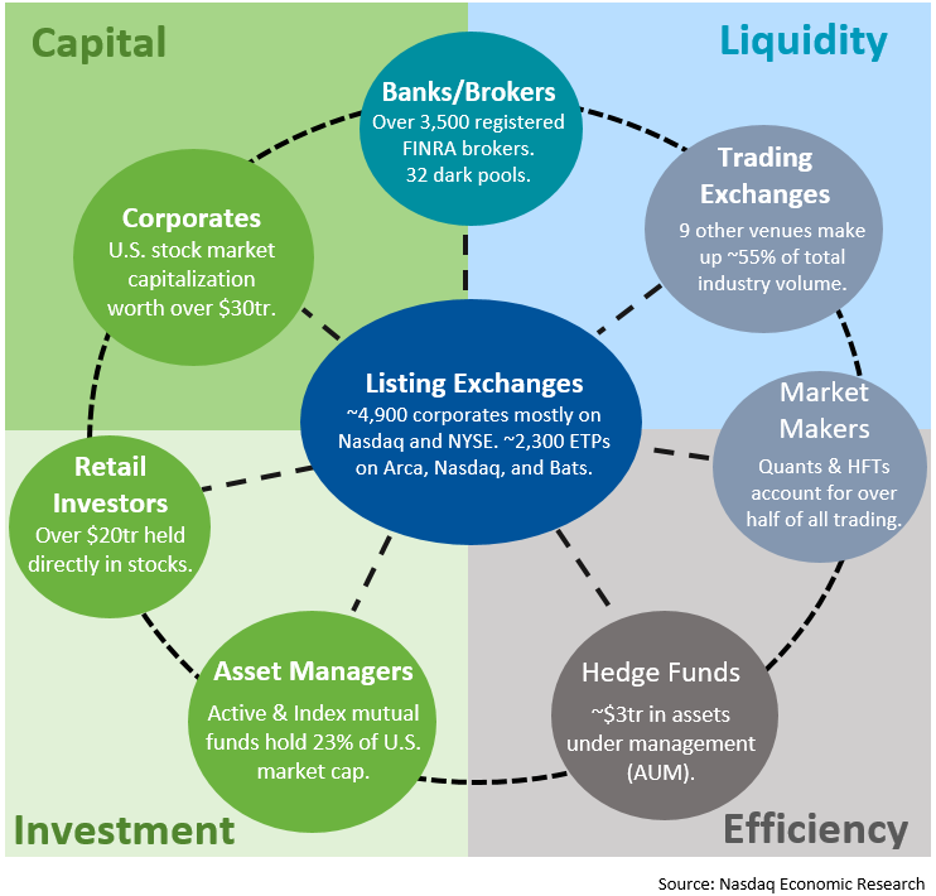

## Table of Contents

## What is a securities market?

A securities market is a place where people buy and sell financial products like stocks, bonds, and mutual funds. These markets help companies raise money by selling parts of their business, called stocks, to investors. When you buy a stock, you own a small piece of that company. The price of stocks can go up or down based on how well the company is doing and what people think about its future.

Securities markets also include bonds, which are loans that investors give to companies or governments. In return, the borrower promises to pay back the money with interest over time. These markets are important because they help businesses grow and give people a way to invest their money. They can be physical places, like the New York Stock Exchange, or they can be online, where trading happens electronically.

## What are the main types of securities markets?

There are two main types of securities markets: primary markets and secondary markets. A primary market is where new securities are first sold to the public. This is when a company or government first offers stocks or bonds to investors. It's like the first time a product is sold in a store. The money raised from these sales goes directly to the company or government to help them grow or pay for projects.

A secondary market is where investors buy and sell securities that have already been issued in the primary market. This is like a second-hand store where people trade items that were originally bought new. The most well-known secondary market is the stock exchange, like the New York Stock Exchange or NASDAQ. Here, the price of securities can change based on supply and demand. The money from these trades goes to the investors, not the original company or government.

These two types of markets work together to keep the financial system running smoothly. The primary market helps companies and governments get the money they need, while the secondary market gives investors a way to buy and sell their investments easily. Together, they help the economy grow by making it easier for money to move around.

## How do primary and secondary markets differ?

Primary markets are where new securities are sold for the first time. Imagine a company wants to grow and needs money. They can sell pieces of their company, called stocks, or they can sell bonds, which are like loans. When these stocks or bonds are sold for the first time, it happens in the primary market. The money from these sales goes directly to the company or government that issued the securities. This helps them to start new projects or expand their business.

Secondary markets are where investors trade securities that have already been sold in the primary market. Think of it like a used car lot where people buy and sell cars that were once new. In the secondary market, people buy and sell stocks and bonds that were originally issued in the primary market. The money from these trades goes to the investors, not the company or government that issued the securities. This market helps investors make money by selling their investments to other people.

## What is the role of stock exchanges in the securities market?

Stock exchanges play a big role in the securities market. They are like big marketplaces where people buy and sell stocks and other securities. When you hear about the New York Stock Exchange or NASDAQ, those are examples of stock exchanges. They help make sure that buying and selling happens in a fair way. They set rules that everyone has to follow, which helps keep the market safe and trustworthy.

Another important job of stock exchanges is to help set the prices of stocks. The price of a stock can change based on how many people want to buy it and how many people want to sell it. Stock exchanges make sure these prices are clear and easy to see for everyone. This helps investors make smart choices about when to buy or sell their stocks. In short, stock exchanges are key to making the securities market work smoothly and fairly for everyone.

## How do over-the-counter (OTC) markets function?

Over-the-counter (OTC) markets are places where people can buy and sell stocks and other securities that are not listed on big stock exchanges like the New York Stock Exchange. Instead of trading in a big, organized marketplace, OTC trading happens directly between two people or through a dealer network. This makes it easier for smaller companies to sell their stocks because they don't have to meet the strict rules of the big exchanges.

In OTC markets, dealers help make the trades happen. They keep track of the prices people are willing to buy and sell at, and they help match buyers with sellers. Because OTC markets are less regulated than big stock exchanges, they can be riskier. But they also give more chances for people to invest in smaller or newer companies that might not be on the big exchanges yet.

## What are dark pools and how do they operate within the securities market?

Dark pools are private places where people can buy and sell big amounts of stocks without other people knowing about it right away. They are called "dark" because the trades happen away from the public eye, unlike the big stock exchanges where everyone can see what's happening. Big investors, like banks and big funds, use dark pools to trade large amounts of stocks without causing the price to change too much. If they tried to buy or sell a lot of stocks on a public exchange, other people might see it and start buying or selling too, which could make the price go up or down quickly.

In a dark pool, the buyers and sellers don't know who the other person is until the trade is done. This helps keep the trade secret and can help big investors get a better price. Dark pools are regulated, but they are less open than public exchanges. Some people worry that dark pools might make the market less fair because not everyone can use them. But they are still an important part of the securities market, helping big investors trade without causing big price changes.

## What is the impact of electronic trading on market structure?

Electronic trading has changed the way the securities market works a lot. Before, people had to go to a physical place like a stock exchange to buy and sell stocks. Now, with electronic trading, anyone with a computer or smartphone can trade from anywhere. This has made it easier and faster to buy and sell stocks. It also means more people can take part in the market because they don't need to be in a certain place to trade. Electronic trading has also made it possible for computers to do the trading for us, using special programs that can make trades very quickly.

But electronic trading has also brought some challenges. Because trades can happen so fast, the market can sometimes become very unstable. Prices can change a lot in a short time, which can be risky for investors. Also, electronic trading has led to more high-frequency trading, where computers make lots of trades in a second to try and make small profits. This can make the market feel less fair to some people because not everyone can use these fast trading systems. Overall, electronic trading has made the market more open and efficient, but it has also made it more complex and sometimes harder to control.

## How do market makers contribute to liquidity in the securities market?

Market makers are important people in the securities market because they help make it easier for people to buy and sell stocks. They do this by always being ready to buy or sell stocks at certain prices. This means if you want to sell a stock, a market maker will buy it from you, and if you want to buy a stock, they will sell it to you. By doing this, market makers make sure there are always people to trade with, which is called providing [liquidity](/wiki/liquidity-risk-premium). Without market makers, it might be hard to find someone to buy or sell your stocks quickly.

Market makers also help keep the market stable. They do this by setting a small difference between the price they buy at and the price they sell at, called the bid-ask spread. This spread helps them make money but also keeps the market from changing prices too wildly. By always being ready to trade, market makers make sure that even when there are not many buyers or sellers, the market can still work smoothly. This helps everyone who wants to trade feel more confident that they can do so whenever they need to.

## What are the regulatory frameworks governing securities markets?

Securities markets are controlled by rules to make sure they are fair and safe for everyone. In the United States, the main rule maker is the Securities and Exchange Commission (SEC). The SEC makes rules that companies and people who sell stocks and bonds have to follow. These rules say things like companies must tell the truth about their business and money when they sell stocks to the public. They also have to keep sharing important information with investors so everyone knows what's going on. This helps people make smart choices about buying and selling stocks.

Other countries have their own rule makers too. For example, in the United Kingdom, it's the Financial Conduct Authority (FCA). These groups work to stop people from cheating in the market, like by lying about stock prices or using secret information to make money. They also check to make sure that stock exchanges and other places where people trade are following the rules. By having these rules and people watching over the market, it helps keep things fair and makes people feel more safe about investing their money.

## How do high-frequency trading and algorithmic trading affect market dynamics?

High-frequency trading ([HFT](/wiki/high-frequency-trading-strategies)) and [algorithmic trading](/wiki/algorithmic-trading) have changed how the securities market works. These kinds of trading use computers to buy and sell stocks very quickly, often in just a few seconds or even less. This speed can make the market more efficient because it helps prices change faster to match what people want to buy and sell. But it can also make the market more unstable. When lots of computers are trading very fast, small events can cause big changes in stock prices, which can be scary for regular investors.

These trading methods also affect how fair the market feels to everyone. High-frequency traders use special computer programs that can see and react to market changes faster than regular people can. This can make it seem like the market is not fair because not everyone can use these fast systems. But on the other hand, these fast trades can help make sure there are always people ready to buy and sell, which is good for the overall health of the market. So while high-frequency and algorithmic trading bring some challenges, they also help keep the market moving smoothly.

## What are the global trends in securities market structures?

Around the world, securities markets are changing in big ways. One big trend is that more and more trading is happening electronically. This means people can buy and sell stocks from anywhere using computers and smartphones. This has made it easier for more people to invest in stocks. Another trend is that markets are becoming more connected. This means what happens in one country's market can quickly affect markets in other countries. This global connection can make markets more exciting but also more risky because big changes can spread fast.

Another trend is the rise of new types of trading systems, like dark pools and high-frequency trading. Dark pools let big investors trade without other people knowing right away, which can help keep prices stable. High-frequency trading uses computers to make trades very quickly, which can make the market more efficient but also more unstable. These new systems show how technology is changing the way markets work. Overall, these trends are making securities markets more complex but also more accessible to people around the world.

## How do different market structures influence price discovery and market efficiency?

Different market structures can change how prices are found and how well the market works. In a big, open market like a stock exchange, everyone can see what's happening, so prices change quickly based on what people want to buy and sell. This helps make prices fair and accurate because lots of people are involved. But in smaller or less open markets, like over-the-counter markets, it can be harder to find the right price because fewer people are trading. This can make prices less accurate and the market less efficient.

Another way market structures affect price discovery and efficiency is through things like dark pools and high-frequency trading. Dark pools let big investors trade without other people knowing right away, which can help keep prices from changing too much. But it can also make the market less open and fair because not everyone can use them. High-frequency trading uses computers to make trades very quickly, which can help prices adjust faster and make the market more efficient. But it can also make the market more unstable because prices can change a lot in a short time. So, different market structures can make the market work better or worse, depending on how they balance openness, speed, and fairness.

## References & Further Reading

[1]: Bergstra, J., Bardenet, R., Bengio, Y., & Kégl, B. (2011). ["Algorithms for Hyper-Parameter Optimization."](https://dl.acm.org/doi/10.5555/2986459.2986743) Advances in Neural Information Processing Systems 24.

[2]: ["Advances in Financial Machine Learning"](https://www.amazon.com/Advances-Financial-Machine-Learning-Marcos/dp/1119482089) by Marcos Lopez de Prado.

[3]: ["Evidence-Based Technical Analysis: Applying the Scientific Method and Statistical Inference to Trading Signals"](https://www.amazon.com/Evidence-Based-Technical-Analysis-Scientific-Statistical/dp/0470008741) by David Aronson.

[4]: ["Machine Learning for Algorithmic Trading"](https://github.com/stefan-jansen/machine-learning-for-trading) by Stefan Jansen.

[5]: ["Quantitative Trading: How to Build Your Own Algorithmic Trading Business"](https://www.amazon.com/Quantitative-Trading-Build-Algorithmic-Business/dp/1119800064) by Ernest P. Chan.